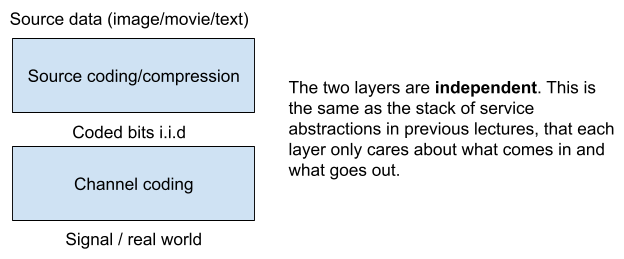

# Physical Layer Abstraction

Last time: Physical layer - clock synchronization and Shannon’s capacity

Today: The abstraction of the Physical Layer

## Abstraction

TCP: “unreliable” datagrams -&gt; “reliable” Byte Streams

Physical Layer: “unreliable” signals ----(**coding/modulation**)------&gt; “reliable” bits

- One argument: different coding/modulation for different data (email vs images)
- Shannon (again): in fact, coding/modulation can be picked independent of the meaning of the bits

Another “nice” abstraction: the sender of an Ethernet packet can send without caring about the receiver’s clock

- This is **similar to ByteStream**: writer and reader of the ByteStream can operate at a different speed, and no synchronization is needed between the writer side and the reader side.
- A buffer between the receiver and the processor that is reading from the receiver (similar to the data structure for storing bits you have in your ByteStream) makes this nice abstraction possible - (**Elasticity Buffer**)

It’s hard to buy a clock that operates at the frequency it claims it operates at (electronics are cheap because expensive ones does not go to consumer markets)

- Therefore it is hard to synchronize the rate of the sender and the receiver, since they would have clocks of different frequencies (but only differ by a little bit)
- How can we control the size of the elasticity buffer given this? (and without feedback)
- **Feedback is too slow at the signal level**

**Inter-packet gap**: the sender has to pause between two packets

**Maximum transmission unit (MTU)**: the maximum size of a single packet

## Elasticity Buffer Size

What is the size of an elasticity buffer given the gap and MTU?

- Given the gap and MTU, we need to avoid both
  - the buffer being filled up (overflow) and
  - the buffer being drained (underflow).

Hold the buffer at [公式]

- For a new packet, allow the buffer to fill up to [公式] **or**
- Drains the buffer to [公式] before a new packet.
- (I think this is equivalent to saying the receiver drains the buffer when buffer size is greater than or equal to [公式] , therefore the inter-packet gap is **not** part of the calculation for buffer size, but is there to allow the two side can synchronize around the [公式] buffer size.)
- (And therefore, inter-packet gap needs to be long enough for draining half of the buffer).

To prevent overflow (when sender is faster than the receiver):

[公式]

To prevent underflow (when receiver is faster than the sender):

[公式]

[公式]([公式] is the maximum clock rate and [公式] is the minimum clock rate, and [公式] and [公式] is roughly the same to the claimed clock rate [公式]).

Therefore: [公式]guarantees that there is no overflow or underflow

And [公式]

## Multiplex

How to multiplex the physical link?

- **Time Division Multiplexing** (TDM) (or Time Division Multiple Access (TDMA)): divide the link by time usage, so each connection uses the link for a given time
- **Frequency Division Multiple Access**: each connection uses a limited range of frequencies
- **Carrier Sense Multiple Access** (CDMA): first listen, if no one is using the link, send the packet

## Elasticity buffer

Elasticity buffer: mediate between packets `@ bitrate r1 (r_sender)` and packets `@ bitrate r2 (r_receiver)`

Why would [公式] be different from [公式]?

- R1 may be different from r2 because clocks in the internet is different
- Say the sender is sending at 10 Mbit/s (with a clock of 10 Mhz and 1 bit per cycle)
- The receiver also has a **clock** of 10 Mhz and reads 1 bit per cycle, this is also 10Mbit/s
- However, the two **clocks** have a different 10Mhz
=&gt; r1 is 10 Mbit/s from the sender’s perspective and r2 is Mbit/s from the receiver’s perspective
=&gt; r1 is not equal to r2.

Although r1 may be different from r2, they can’t be too different from each other because of they are both a clock of 10Mhz and the there is a limited clock tolerance

- [公式]and [公式]

Since r1 is different from r2, some bad things may happen.

- Case 1: [公式]
=&gt; buffer underflows (the receiver would try to drain things from the buffer when it’s empty)
- Case 2: [公式]
=&gt; buffer overflows

Communications interface parameters:

- [公式]
- `MTU = 10 kbit`
- Inter-packet gap must be &gt; (intuitively the receiver should be able to drain enough during this gap)
  - Proposal one: [公式]
  - Proposal two: [公式]=&gt; The receiver can always get back to zero state after the Inter-packet gap
  - The real number: look at the end of this notes

### Case 1: Underflow

[公式] is 9.99 Mhz and [公式] is 10.01 Mhz

Every one second, the elasticity buffer is drained by [公式]

If the receiver only tells the system to **start draining** when there is at least 1 Mbytes in the buffer, it takes 400s to drain the buffer.

If the sender has a packet that is 4000 exabytes, it takes way more than 400s to drain the buffer, and therefore we need something to limit that — **MTU**

Case 1: Underflow with MTU and a large buffer

- Sender has packet that is 10 kbits
- Receiver is manufactured with buffer that is 10 kbits
- Receiver strategy:
  - receive entire packet
  - then tell its client to start reading
- This works, but expensive

Case 1: Underflow with MTU and a **small buffer**

- Sender has packet that is 10 kbits
- Receiver is manufactured with buffer that is 1 kbits
- Receive strategy:
  - receive first 1 kbit
  - then tell its client to start reading
- Starting at t=0, the buffer gets the first 1 kbit after ( 1 kbit / 9.99 Mbit/s is roughly 0.1 milliseconds )
- Starting at t = 0.1 ms, it takes ( 1 kbit / 20 Kbits/s = 50 milliseconds ) to drain
- But, at t = 1 ms for the sender to send the whole packet
- Thus, there is no underflow.

Given this, what is the smallest elasticity buffer size?

- Sender has packet that is 10 kbits
- Receiver is manufactured with buffer that is 20 bits
- Receive strategy:
  - receive first 20 bits
  - then tell its client to start reading
- The buffer gets the first 20 bit after roughly 2 microsecond
- The sender needs another ( `1 ms - 2 microsecond = 998 microsecond` ) to send the whole packet
- So there is ( 20 bit - 998 microsecond * 20 Kbits /s ~ 0.02 bits)
- It works!

So the smallest elasticity buffer X is such that [公式]

### Case 2: Overflow

Sender has packet that is 10 kbits

Receiver is manufactured with buffer that is 10 kbits

Strategy:

- Receiver tells its client to start reading asap
- Sender needs to wait between packets - **Inter-packet gap**

Case 2: Overflow with Inter-packet gap

- Sender has packet that is 10 kbits
- Receiver is manufactured with buffer that is 10 kbits
- Strategy:
  - Receiver tells its client to start reading asap. This need [公式]
- When the packet is done, there is ( ~ 1 millisecond * 20 Kbits/s = 20 bits) in the buffer size.

So 20 bit buffer works for both cases with a different strategy. So this policy would work for both the cases:

- Sender has packet that is 10 kbit
- Receiver with buffer that is 40 bits
- Receiver Strategy:
  - If there are greater than or equal to 20 bits in the buffer
  - Then tell client to start reading
- And the buffer size is ( 2 * the number of smallest buffer size we calculated at the end of Case 1) = [公式]

Last piece: let’s go back to the minimum number of **inter packet gap**: the inter packet gap needs to be enough for the **go back** to a buffer size of [公式] from either buffer size 0 or buffer size [公式]. Therefore, we need at least  [公式]

(The specification of a crystal oscillator normally goes like [公式]. In the following discussion, clock rate [公式] is equal to [公式], and clock tolerance [公式] is equal to [公式]. [公式]

### Summary

given a clock rate  [公式] and a clock tolerance  [公式] , a max transmission unit [公式] , then we have [公式]. Then, we have elasticity buffer size [公式] and the **proposed strategy** works if the **inter-packet gap** is at least [公式].

(We could also motivate these results with a little intuition: the more accurate clocks are, the smaller [公式] will be, in other words, we require a smaller **inter-packet gap** and elasticity buffer size for more accurate clocks. If the clock is ideal (no error at all), inter-packet gaps and elasticity buffers are not needed, and the senders and the receivers can just operate at their own clocks. )
