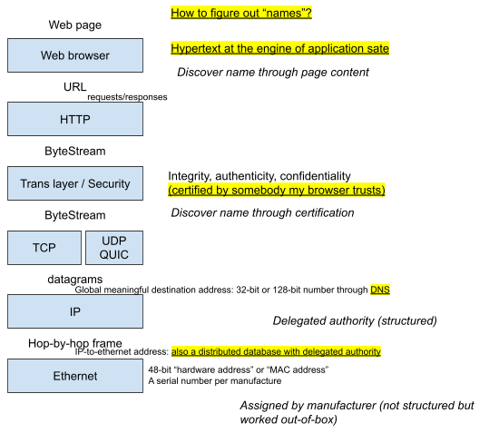

# Naming at different layers of the network stack

## Naming for web pages: URL (scheme, hostname, path, query)

Hypertext - people would care that the link always goes to somewhere

World wide web: what if we don’t care about whether hypertext link works or not (This is totally unrelated to the lecture, but here is another interesting piece of essay from the early days: [https://www.jwz.org/doc/worse-is-better.html](https://www.google.com/url?q=https://www.jwz.org/doc/worse-is-better.html&sa=D&source=editors&ust=1688958275899362&usg=AOvVaw0lfVSFmDJrFtbmcTkoMK7N) )

Hypertext as the engine of application state (REST)

## HTTP: requests/responses

- [https://news.ycombinator.com/item?id=35744130](https://news.ycombinator.com/item?id=35744130):
- [https://ma.ttias.be/theres-more-than-one-way-to-write-an-ip-address/](https://www.google.com/url?q=https://ma.ttias.be/theres-more-than-one-way-to-write-an-ip-address/&sa=D&source=editors&ust=1688958275900253&usg=AOvVaw3zrEGppQNHB53Eu-ISykBE)

`host` takes in a url and returns the 32-bit or 128-bit number as a user-space process

`host` gets the address of DNS server through **DHCP service**

DNS - distributed database with delegated authority

Top-level **root name servers (198.41.0.4)** delegate subdomains (e.g. com. Or edu.) to other name servers, and looking for the IP address given a URL would recursively follow this delegation relationship (e.g. edu. =&gt; mit.edu. =&gt; lamp.mid.edu.)

## `wireshark`

## IP-to-Ethernet

ISPs ask local authorities for ranges of IP addresses, and can assign IP address in these assigned ranges to its customers

It needs to in “ranges” to make routing feasible
