# Packet Switching 2

Logistics

- Come to the lab
- Help each other out both in the lab and on Ed
- Extra credits will be given in upcoming checkpoints for new test cases

Before Today: Datagrams, User Datagrams, Reliable byte streams on top of unreliable service abstraction

Today: Packet Switching

How does end point drop a “postcard” to its destination?

## Circuit-switched networks (e.g. telephones)

Each telephone is connected to a center office

And a staff worked in the office would connect the wires upon customers’ request

If the person you want to call does not belong to the same office as you, there are circuits between main offices

Any phone call has a real direct electrical circuit

BUT: setting up and tearing down circuit is expensive, it works for telephone calls, but would not make sense if you only want to send a short piece of data

## Packet Switching

The time it takes for the first bit to be received – **Propagation Delay**: [公式]

[公式] = distance, [公式] = light speed in that medium (seconds) [公式] in cable

The time it takes for the whole packet to be received after the first bit is received — **Serialization (packetization) delay:**

[公式]

> link rate: 链路传输速率
>

**Total time to send a packet across a link: **[公式]

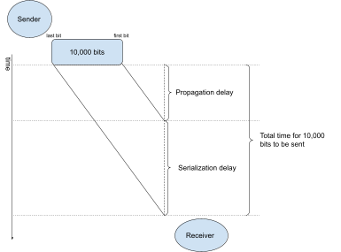

## **Queueing delay**

The path between sender and receiver consists of multiple links

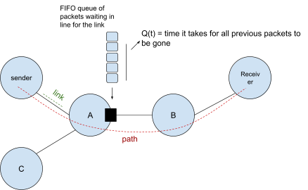

Each hop on the link receives the whole packet before sending it out, and therefore each hop would have propagation delay + serialization delay

And there is **Queueing delay** if the link is busy (a packet needs to wait in line at the FIFO queue).

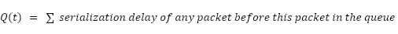

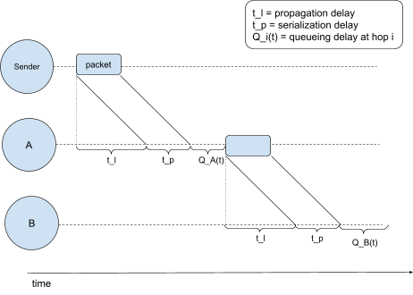

Last time: Packet Switching

`S — r1 — X — r2 — R`

Propagation Delay: [公式]

- Serialization Delay: [公式]

How long does it take for a packet to arrive from sender S to router X

- Queueing Delay (waiting at the out-going queue):

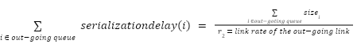

After it arrives at X, how long does it take for it to leave X:

[公式]

After it leaves X, how long does it take to arrive R

## Q & A

Q: Multiplexing?

A: The underlying links are multiplexed across different flows. Each packet is an atomic unit.

Q: How does a router know a flow ends?

A: The router knows nothing about the flow. It only cares about each individual packet.

## Gradescope Problem

S —----------L1 —---------- A —------------ L2 —------------ R

L1:

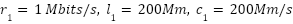

L2:

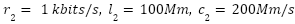

At time 0, the sender S send two packages of the same length [公式].

Question: When will the LAST bit of the second packet arrive at R?

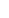

### For the first packet

The whole packet arrives at A:

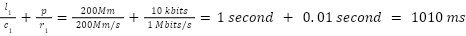

The first packet is sent without any queueing delay, and therefore it is fully sent **from A** at:

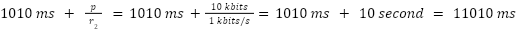

### For the second packet

The second packet leaves S after the first packet leaves S, and then it arrives at A:

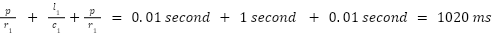

> 即到达时刻只要在first package 到达时刻之后 [公式]的 serialization delay.
>

Note that you should not need to calculate this when you do the problem, since the second packet arrives at A way before the first packet leaves A, and you should be able to guess that looking at the rate difference between L1 and L2.

The second packet leaves A after the first packet **is fully sent** from A, and therefore it arrives at R:

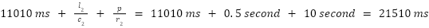

## Next: Congestion Control

As you see in the Gradescope problem, the performance is bottlenecked at leaving A, because L2 is much slower than L1.

What happens if more and more packets are waiting for the same out-going queue?

That could potentially cause a buffer overflow at A.

The throughput of sending from S to R is bottlenecked by the slowest link on the path. Is there anything smart we could do to prevent more and more packets waiting at A?
