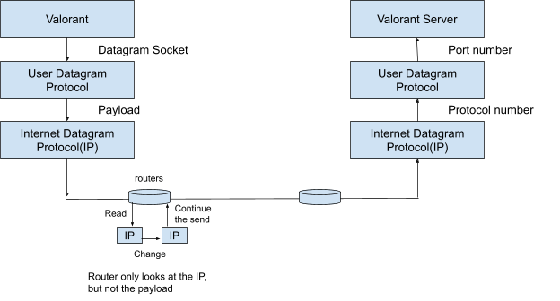

# How the Internet works

## **Datagram**

Datagram, is a packet: a short piece of data (different from phone call as a continuous connection, short pieces of data are powerful)

- It is **independent**
- Contains enough information to be routed or delivered to its final destination

- (like a postcard: `To ____ (an entity)`, the mailing system would deliver it to then entity with enough postage)
- It does not say who is the next hop, but having the destination as part of a datagram is enough to get the datagram to its destination.
- The address is the same along the path, and datagram does not needed to be changed (**except for TTL field**)

Q: What does independent mean?
A: It can be handled independently, and does not need knowledge of previous and later datagrams to handle the current datagram.

Q: How did the telephone network work? (deferred to Monday)

## Encapsulation

Encapsulation: object carries another object oblivious to its contents

Payload is a vector of bytes, of arbitrary content up to a certain size. Payload is encapsulated in the datagram (Systems looking at the datagram are oblivious to the payload)

`\x8\x8\x8…` added: Stanford’s network is not a perfect encapsulation, looking at the first several bytes to make sure it’s not nonsense datagram.

Encapsulation enables abstraction, or separation of concerns, i,e, freedom of building functionality (e.g. sending a photo over internet) on top of another abstraction (e.g. internet datagrams that promise to deliver anything up to certain bytes). **The upper level only worries about what to put in the datagram, and the lower level worries about how to deliver the datagram to the destination**.

Many layers of abstraction/encapsulation

- **Valorant**: `struct &#123;uint : who, uint: how hard&#125;`  -&gt; serialized as a string and became the payload of a User Datagram
- **User Datagram**: `struct &#123;uint: dest_port, uint: src_port, string: payload&#125;` -&gt; serialized as a string and became the payload of a Internet Datagram
- **Internet Datagram**: `struct &#123;Address: dest, Address: src, int:TTL, string: payload&#125;`

Each layer only focus on their own representation

## Multiplexing

Multiplexing: sharing of a resource by runtime dispatch on an identifier

The same restaurant can be a meat restaurant or a vegetarian restaurant (runtime dispatching on “meat” or “vegetarian” on to the same restaurant)

Communication link does runtime dispatching on destination address (IP address) (using the same undersea cable to service multiple usage of the Internet)

**The OS does runtime dispatching on port numbers across multiple user processes**

Different levels of the postcard address is multiplexing

```
struct InternetDatagram {
  Address source;
  Address destination;
  int TTL;
  int checksum;
  int protocol;
  string payload;
}
```

Internet Datagrams do runtime dispatching on **protocol identifiers**. **`int protocol`**** decides who is interpreting the payload.** (The host looks at the protocol, (`protocol == 1` then by ping, `protocol == 17` then by UDP), and then parses the payload to the right format).

- If the host sees an incoming Internet Datagram with `protocol 17`, it parses the payload to a User Datagram, so this is both an encapsulation and multiplexing.
- If the User Datagram sees the `dest_port` is `Valorant`, it parses `payload` as struct `Valorant`, so this is also both an encapsulation and multiplexing.

Websites do runtime dispatching on URL addresses. Gmail does runtime dispatching on cookie.

## How the internet works

The Internet itself depends heavily on principles of multiplexing and encapsulation.

Protocol Stack:


