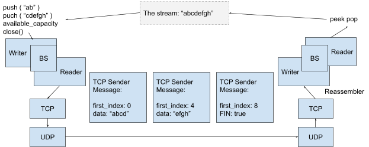
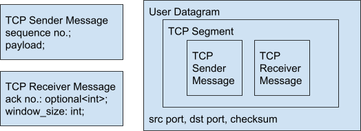
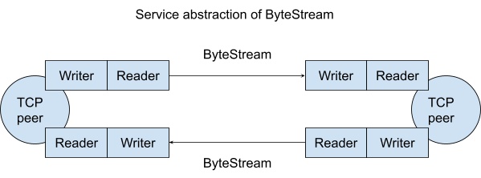
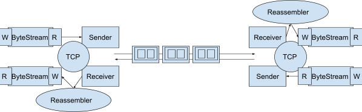

# TCP part 2

## Stacks of service abstraction

Short gets (DNS, DHCP) -&gt; Use datagrams -&gt; Internet Datagrams

Byte Stream –(TCP)--&gt; User datagrams -&gt; Internet Datagrams

- Web requests/responses (HTTP) -&gt; Byte Stream
  Youtube/Wikipedia -&gt; Web requests/responses
- Email sending (SMTP) -&gt; Byte Stream
- Email receiving (IMAP) -&gt; Byte Stream

## Multiplexing ByteStream

“`u8 u8`” (Which byte stream; what is the byte)

- **Any reading and writing of one byte would be actually two bytes**, the first byte for which byte stream and the second for the actual byte

“`u8 u8 &#123;u8 u8 … u8&#125;`” (which byte stream; size of payload; sequence of characters of the string chunk)

- Any reading and writing of n bytes would be actually n + 2 bytes
- Tagged byte stream: **HTTP/2** | [SPDY](https://blog.csdn.net/hursing/article/details/22785475)

## How to make ByteStream push idempotent?

### TCP Sender Message

- `first_index`
- data
- `FIN`

This works for out-of-order or **multiple deliveries**. Since UDP has a checksum field, altered TCP Message would be ignored on the UDP layer.

What if datagrams are missing?

- How does the sender know that a datagram needs to be sent multiple times?
- **DNS/DHCP**: if we don’t receive an answer, then we retransmit. But such response/answer does not exist in `pushing` (`void push()`)

### Acknowledgement

TCP Receiver Message

- “`A B C D E F G`” each byte sent as a separate TCP sender message, and “D” is not received.
- “I got the sender message with `first-index = 2`, `length = 1`.”
  - Valid but more work. There will be one receiver message for each sender message.
- “Got anything? Y/N. Next needed: `#3.”`
  - Acknowledgements are accumulative, and that make life simpler.
- Give FIN flag a number: “A B C D E F G FIN”.

TCP Sender Message: &#123;`sequence number`, `data`&#125;

TCP Receiver Message: &#123;`Next needed: optional&lt;int&gt;`&#125; and TCP Receiver Message &#123;`Next needed: optional(8)`&#125; would mean `FIN` is received.

TCP Receiver Message: &#123;`Next needed: optional&lt;int&gt;`; `available capacity:int`&#125;

- &#123;`Next needed: optional(3)`; `available capacity: 2`&#125; === Receiver wants to here about “`DE`”.
- “DE” is the **window**. (Red area in that picture of lab 1)

**TCP Receiver Message: &#123;****`Ack no: optional&lt;int&gt;`****; ****`window size: int`****&#125;**

## TCP Segment

This is the service abstraction that TCP is providing:

And this is what happens under the hood (and also what you will be implementing in the labs)

## Rules of TCP

Reply to any nonempty TCP Server Message
