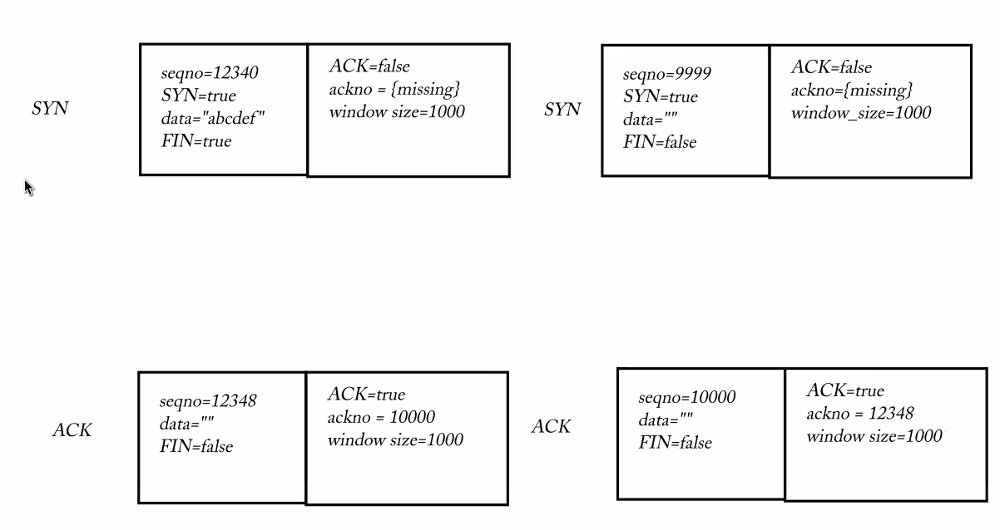
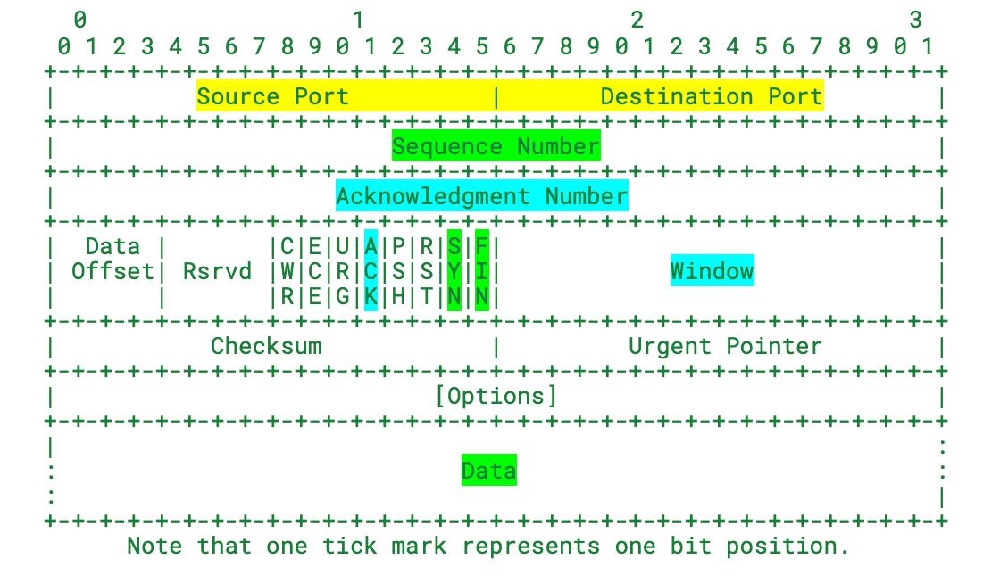

# TCP part 3

Last week:

the Internet’s **service abstraction** as a host-to-host datagram

Build on top of that: User Datagram

Reliable services on top of User Datagram: host, DNS, DHCP, … (idempotent short get)

## TCP: convert datagrams to reliable byte streams

Sender Message: `first_index`, data, `FIN`

Receiver Message: next needed index, window size

“User Datagram” info (for multiplexing, and part of the TCP datagram port): **source port (16 bits)**, **destination port (16 bits)**, **checksum**

Internet datagram (v4): source address(32 bits), destination address (32 bits), checksum

**source IP + source port + destination IP + destination port define a connection**

There can be [公式] simultaneous connections from one computer.

e.g. ByteStream: “abcdef”

- Sender message: &#123;`first_index=0`, data: “abcdef”, `FIN=true`&#125;
- Or &#123;`first_index=0`, data=”abcdef”, `FIN=false`&#125; and &#123;f`irst_index=6`, data:””, `FIN=true`&#125;
- Receiver message: &#123;`next_needed=6`, `window_size=0`&#125;, &#123;`next_needed=6`, `window_size=3`&#125; (**`FIN`**** flag also** **consumes a sequence number**&#125;, &#123;`next_needed=7`, `window_size=2`&#125;
- Ordering of messages:
  - sender: &#123;`first_index=0, data=”abcdef”, FIN=false`&#125;
  - receiver: &#123;`next_needed=6, window_size=0`&#125;
  - After the reader pops 3 bytes: &#123;`next_needed=6, window_size=3`&#125;
  - sender: &#123;`first_index=6, data:””, FIN=true`&#125;
  - receiver: &#123;`first_index=6, data:””, FIN=true`&#125;

## What happens when a stream ends?

My sender has ended its outgoing bytestream, but the **incoming bytestream** from the peer **may not be** **ended**.

When a stream ends, can the same pair of ports be used? Reusing the same pair of ports makes it not clear to tell whether a datagram belongs to the old stream or the new stream.

We want a new **INCARNATION** of the connection (new connection on the same pair of ports)

**Sequence number**: start from `a random big number + **SYN`**: this sequence number should be viewed as the beginning of a stream

- If the sequence number doesn’t make sense on the old stream, and the SYN flag is true, the receiver knows this is a new incarnation of the connection.
- e.g. &#123;`sequnce_no=12345, data=”abcdef”, SYN=true, FIN=true`&#125;, and &#123;`sequence_no=99999, data=”xyz”,` `SYN=true, FIN=true`&#125;

First `seqno` belongs to `SYN` flag, next seqnos belong to each byte of stream, final seqno belongs to `FIN` flag.

- **It is very important to have ****`SYN`**** flag and ****`FIN`**** flag delivered reliably**, so therefore receiver need to acknowledge SYN seqno and FIN seqno

## Three-way Handshake

What happens to TCP receiver message’s `next_needed_idx` field before receiving the `SYN` flag from the peer?

Without seqno:

- I: &#123;&#123;`first_index=0, data=”abcdef”, FIN=true&#125;`, &#123;`next_needed=0, window_size=1000`&#125;&#125;
- Peer: &#123;&#123;`first_index=0, data=””, FIN=true`&#125;, &#123;`next_needed=7, window_size=1000`&#125;&#125;
- I: &#123;&#123;`first_index=7, data=””, FIN=false`&#125;, &#123;`next_needed=1, window_size=1000`&#125;&#125;

With seqno and SYN:

- I: &#123;&#123;`seqno=12340, SYN=true, data=”abcdef”, FIN=true`&#125;, &#123;**What should this be? (before seeing 9999 from the Peer**)&#125;&#125;
- Peer: &#123;&#123;`seqno=9999, SYN=true, data=””, FIN=true`&#125;, &#123;`next_needed=12348, window_size=1000`&#125;&#125;
- I: &#123;&#123;`next_needed=10001, window size =1000`&#125;&#125;

`ackno = optional&lt;int&gt;` (a pair of ACK flag and ackno `int`)

- I: &#123;&#123;`seqno=12340, SYN=true, data=”abcdef”, FIN=true`&#125;, &#123;`ACK=false, ackno=&#123;missing&#125;, window_size=1000`&#125;&#125; (SYN)
- Peer: &#123;&#123;`seqno=9999, SYN=true, data=””, FIN=true`&#125;, &#123;`ACK=true, ackno=12348, window_size=1000&#125;`&#125; (SYN+ACK)
- I: &#123;&#123;`ACK=true, ackno=10001, window size =1000&#125;`&#125; (ACK)

(SYN) + (SYN+ACK) + (ACK) = “t**he three-way handshake**”

What if the two SYN messages are sent at the same time?



- **Not a classic** “three-way handshake” but still a valid way of starting a TCP connection.

## Standardized TCP Message:

- Sender: &#123;sequence number, SYN, data, FIN&#125;
- Receiver: &#123;ackno: optional&lt;int&gt;, window_size&#125;
- “User Datagram” info



[https://www.rfc-editor.org/rfc/rfc9293.html#name-header-format](https://www.google.com/url?q=https://www.rfc-editor.org/rfc/rfc9293.html%23name-header-format&sa=D&source=editors&ust=1687838190615961&usg=AOvVaw2FpXMkW7Mtkt0n8nXqBgfZ)

```
    0                   1                   2                   3
    0 1 2 3 4 5 6 7 8 9 0 1 2 3 4 5 6 7 8 9 0 1 2 3 4 5 6 7 8 9 0 1
   +-+-+-+-+-+-+-+-+-+-+-+-+-+-+-+-+-+-+-+-+-+-+-+-+-+-+-+-+-+-+-+-+
   |          Source Port          |       Destination Port        |
   +-+-+-+-+-+-+-+-+-+-+-+-+-+-+-+-+-+-+-+-+-+-+-+-+-+-+-+-+-+-+-+-+
   |                        Sequence Number                        |
   +-+-+-+-+-+-+-+-+-+-+-+-+-+-+-+-+-+-+-+-+-+-+-+-+-+-+-+-+-+-+-+-+
   |                    Acknowledgment Number                      |
   +-+-+-+-+-+-+-+-+-+-+-+-+-+-+-+-+-+-+-+-+-+-+-+-+-+-+-+-+-+-+-+-+
   |  Data |       |C|E|U|A|P|R|S|F|                               |
   | Offset| Rsrvd |W|C|R|C|S|S|Y|I|            Window             |
   |       |       |R|E|G|K|H|T|N|N|                               |
   +-+-+-+-+-+-+-+-+-+-+-+-+-+-+-+-+-+-+-+-+-+-+-+-+-+-+-+-+-+-+-+-+
   |           Checksum            |         Urgent Pointer        |
   +-+-+-+-+-+-+-+-+-+-+-+-+-+-+-+-+-+-+-+-+-+-+-+-+-+-+-+-+-+-+-+-+
   |                           [Options]                           |
   +-+-+-+-+-+-+-+-+-+-+-+-+-+-+-+-+-+-+-+-+-+-+-+-+-+-+-+-+-+-+-+-+
   |                                                               :
   :                             Data                              :
   :                                                               |
   +-+-+-+-+-+-+-+-+-+-+-+-+-+-+-+-+-+-+-+-+-+-+-+-+-+-+-+-+-+-+-+-+
```

Note that one tick mark represents one bit position.

## Wireshark tool
