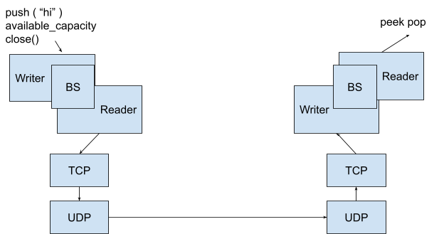
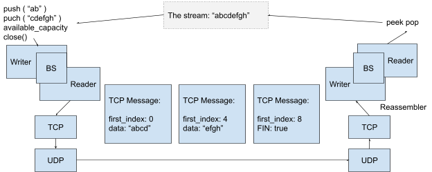

# Idempotence and TCP

Last time: “best effort” delivery as the service abstraction

- Not delivered -&gt; timeout + retransmit
- Delivered n&gt; 1 times -&gt; transform operations to be idempotent
- Delivered altered -&gt; **checksum** or **crypto**
- Delivered out of order -&gt; sequence number

On top of this service abstraction, we can build:

- VoIP
- User Datagrams
- VPN (IP-in-UDP/IP-in-IP/IPsec)
  Q: How does Netflix determine where an IP address is actually from?
  A: Netflix would look at the IP addresses provided by VPN services and ban those IP addresses.

## Short get

Short get: get(key) -&gt; value

- E.g. `host`: what is the IP address that corresponds to a host?
- With package loss, it takes a longer time to reply, but would still give an answer
- This service is “reliable” despite the fact that it is built on a unreliable “best effort” service abstraction

```
// Server 
void recv ( const string& service ) {
  UDPSocket sock; 
  sock.bind ( Address (“0”, service) ); 
  Address source (“0”); 
  string payload; 
  while (true) {
    sock.recv( source, payload);
    cout << “Message from” << source.to_string() << “: “ << payload << endl;
    if (payload == "best_class_ever" ) { 
      sock.sendto( source, "EE180");
    } 
  }
}
```

```
// Sender 
void run( const string& host, const string& service, const string& query) {
  UDPSocket sock; 
  sock.set_blocking( false ); 
  Address source ("0"); 
  string answer;
  
  // retransmit the query (with a small timeout), until there is a reply
  do { 
    sock.sendto(Address(host, service), query); 
    this_thread::sleep_for(seconds(1)); 
    sock.recv(source, answer); 
    if (answer.empty()) { 
      cerr << "No reply, retransmitting" << endl; 
    }
  } while (answer.empty())
    cout << "Got reply to " << query << ": " << answer << endl;
}
```

**By doing this, we implement a “reliable” service on top of an “unreliable” service abstraction**, and this is also how many real-word reliable services are built (e.g. `host`).

- And also: **Domain Name System (DNS)**: what is the IP address of an internet domain name?
- **DHCP (Dynamic Host Configuration Protocol):** what is the IP address I am supposed to use?

## Set

Set: (e.g. set the back door open)

Both short get and set (the back door open), you could say how ever many times you want and it does not change the ending state

But for `pop(7)`, `push(“hi”)`, it matters how many times you say it.

**Idempotent**: doing one time or more than one time does not change the ending state (`GET` `PUT`). The strategy we used above works for something idempotent, but not for non-idempotent action

## POST

Do a non-idempotent operation (POST):

By having a set of launched missiles, we make `launch_missle` idempotent

```
// Server 

void launch_missle() { 
  cout << "Launching one missle" << endl; 
}

void recv ( const string& service ) {
  unordered_set<uint64_t> launched_missle; 
  UDPSocket sock; 
  sock.bind ( Address (“0”, service) ); 
  Address source (“0”); 
  string payload; 
  while (true) {
    sock.recv( source, payload);
    cout << “Message from” << source.to_string() << “: “<< payload << endl;
    if (payload == "best_class_ever" ) { 
      sock.sendto(source, "EE180");
    } else if (payload == "launch_one_missle" + missle_id) { 
      if (missle_id not in launched_missle ) { 
        launch_missle(); 
        launched_missle.insert(missle_id); 
      } 
      sock.sendto(source, "ack");
    }
  }
}
```

**ByteStream**: `push`, `pop`, `peek` needs to be transformed into idempotent operations, and this is achieved by **TCP**



What should be in the TCP Sender message to make these operations idempotent?

- `push (“abcd”)` works iff each message is delivered exactly once
- `push(“abcd”) + message unique id`, but the sender needs to keep a set of any message sent
- Create a reassembler, `first_index: 0, data: “abcd”` `first_index: 4, data: “efgh”, first_index = 8, FIN=true`


