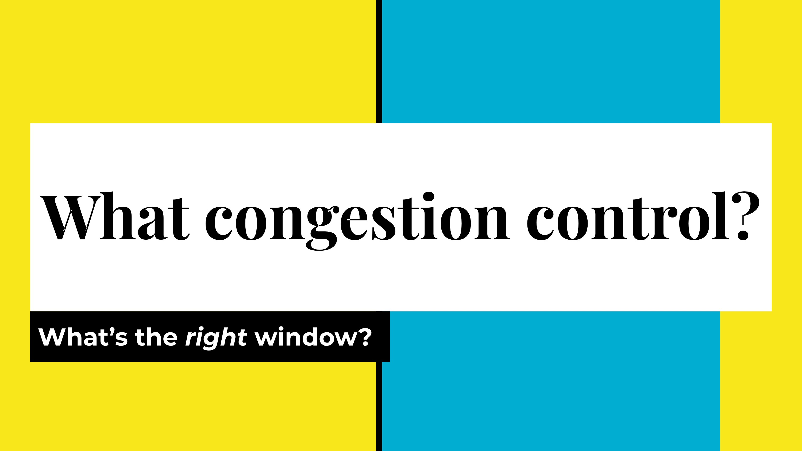
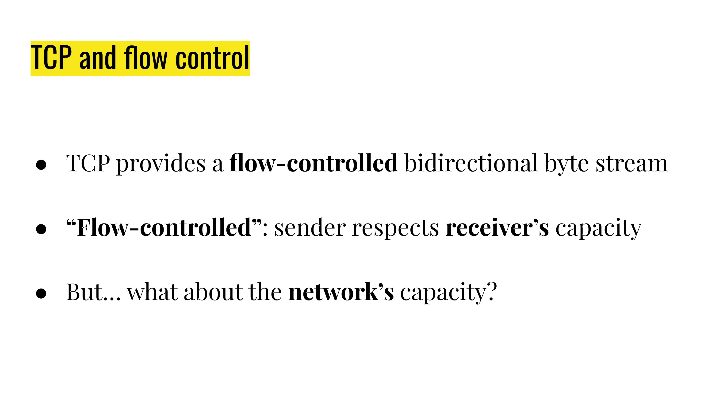
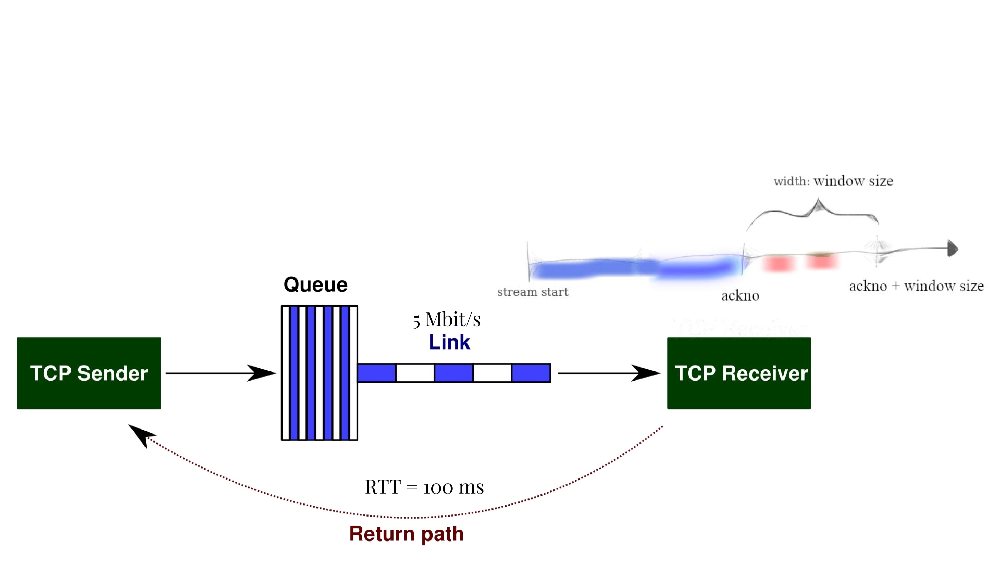
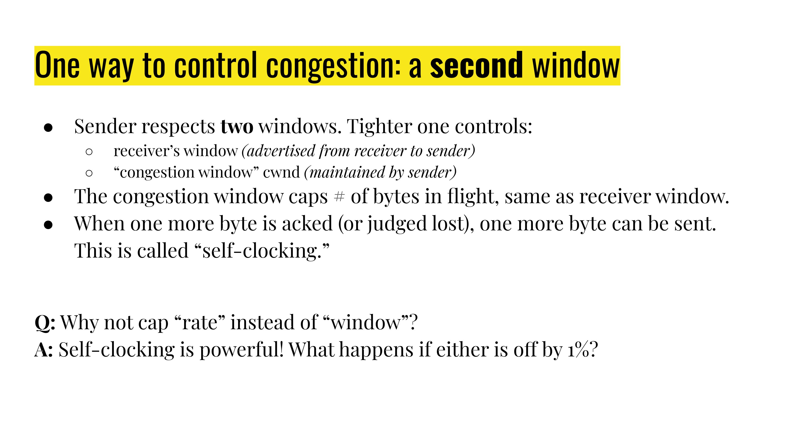
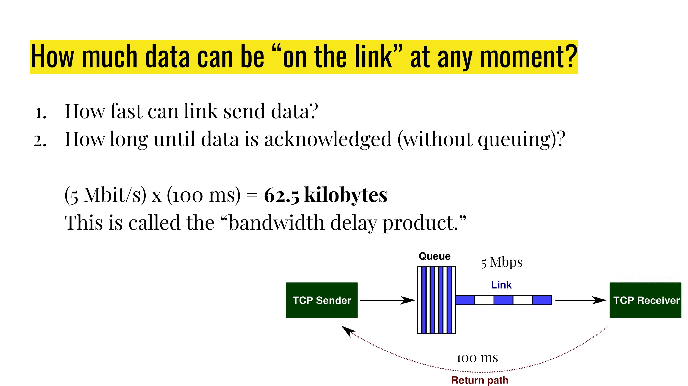
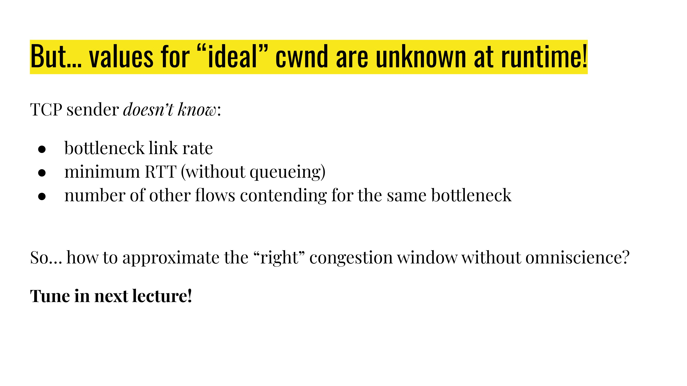

# What congestion control

For multiple flows sharing the same link, who allocate the link resource to those flows? (Not a single router, or chromecast) Say two flows share 10 Mbits/s. Then,it could possibly be:

- 5 Mbit/s + 5 Mbit/s
- 2.5 Mbit/s + 7.5 Mbit/s
- 0 Mbit/s + 10 Mbit/s
- 0 Mbit/s + 5 Mbit/s (this is a collapse)
- 0 Mbit/s + 10 Mbit/s but every packet is sent twice (throughput 10 Mbit/s but “goodput” 5 Mbit/s, this is also a collapse)

## Maximize total utility

[公式] s.t. [公式]

if [公式] ，this gives [公式], because [公式] has diminish return ([公式] decreases as [公式] increases)

What happens if a host does not follow the congestion control? (Eventually ISP(Internet Service Provider) may regulate the host, but) congestion control is a voluntary restraint.

Real-life congestion control: we don’t know the bottleneck link rate, or how many people are sharing the link. Then, how do we decide what is the “right” speed to send data?

## Single-flow, single-hop model

From last week: Single-flow, single-hop model

S(ender) —--------- X(router) —---------- R(receiver) with r = 1 Gbit/s and propagation delay = 1 second

The sender sends a datagram, still waiting for the corresponding ackno, where could the datagram be (in the sender’s mind):

- Propagating on the link
- Waiting at the router queue (bottleneck queue)
- Could have been received by the receiver, but ackno still on the way back
- Or the datagram or the ackno is lost/dropped

## A second window

Easiest approach of flow-control: `window_size`.

We could have both:

- receiver’s window and
- “congestion window”.

The minimum of the two cap the actual window.

“**Self-clocking**”: a new byte is sent only after a byte is acked (or judged lost)

Wrong window size is okay (see below), but wrong rate would lead to more dangerous situations (e.g. queue overflow).

How much data can be “on the link”?

The BDP (Bottleneck link rate Delay Product): [公式]

## The ideal value for window size for one flow

If the window size is greater than BDP, packets queue up at routers. (At the steady state, `window size - BDP` bytes is queued at the bottleneck, not so bad).

If the window size is smaller than BDP, the bottleneck link may be idle. (Some part of the link would be wasted, bust still not so bad)

With one flow, **BDP is the ideal window**. Any window less than BDP + max queue size is “no loss” window.

Say two flows share 10 Mbits/s and [公式].

- One flow, good window ~ 10 Mbit/s * 100ms = 1 Mbit = 100 kByte
- Two flow, good window: 50 kByte for each flow

## cwnd at runtime

BUT, the “ideal” window is unknown at runtime. How to approximate the right congestion window without knowing: `RTT`, `bottleneck link rate`, and `number of flows`

Ideas for congestion signals:

- [公式]
- (experienced) RTT starts increasing
- Packet loss
