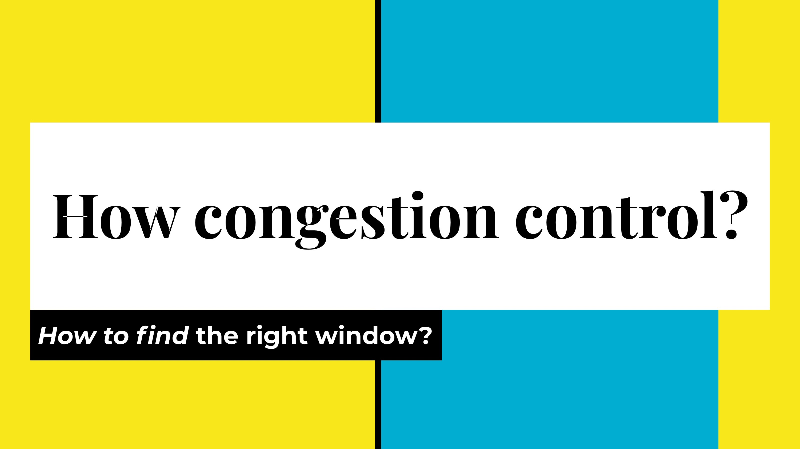
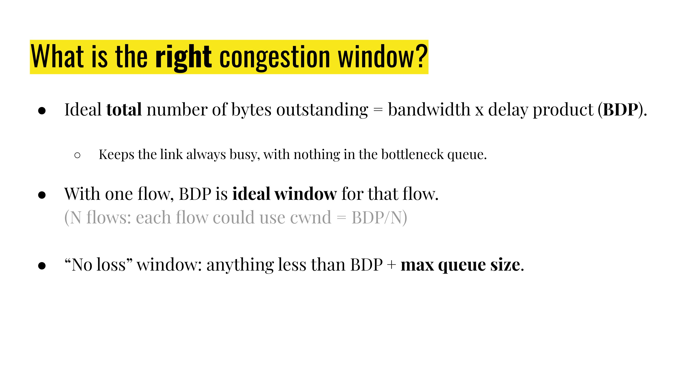
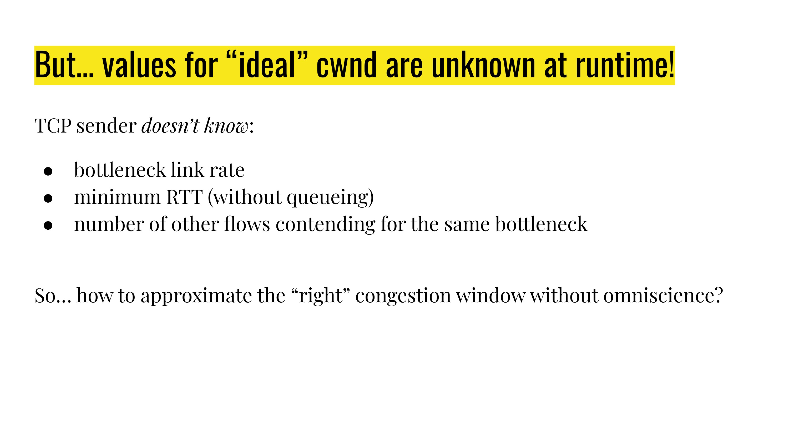
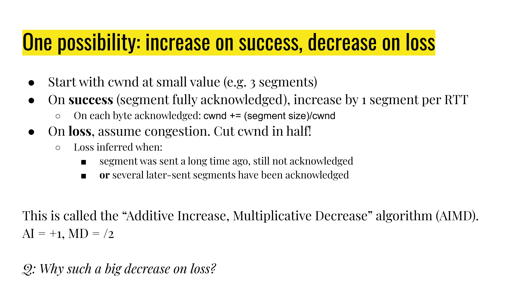
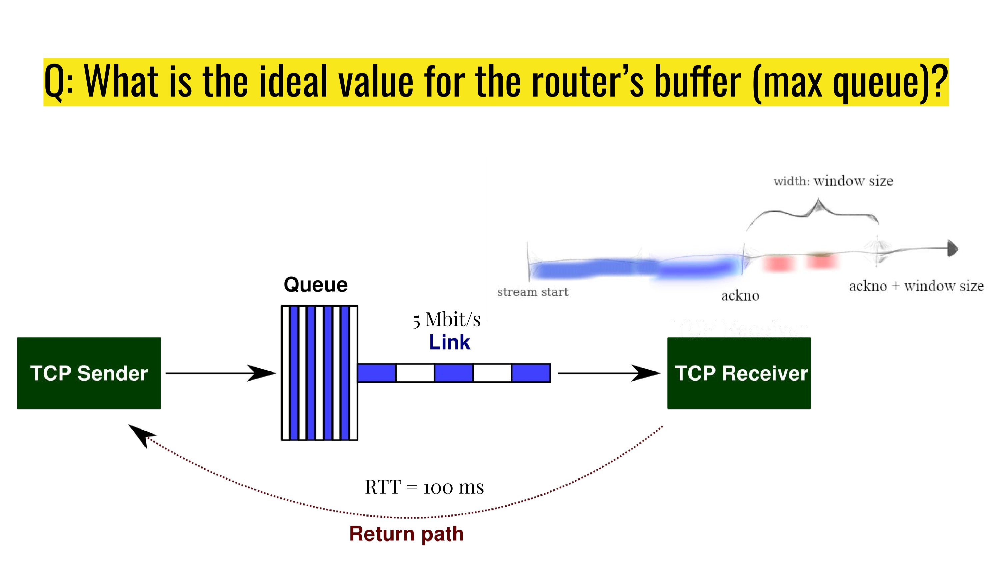
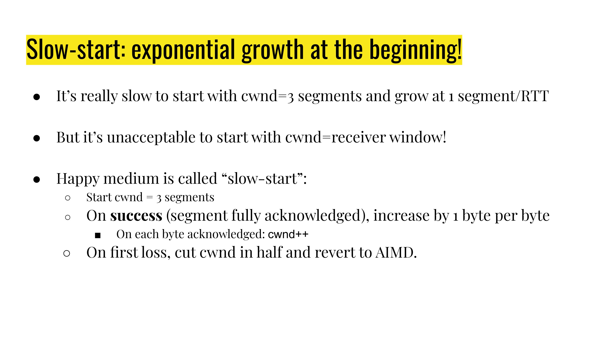

# How congestion control

## Quiz

“Empirical RTT” vs “RTT”: the former would include queueing delay along the path

Bottleneck: [公式]

- `cwnd1 = 9 M`, `cwnd2 = 1 M` -&gt; throughput1 = 9 MB/s, throughput2 = 1 MB/s
- `cwnd1 = 18M`, `cwnd2 = 2M` -&gt; throughput1 = 9 MB/s, throughput2 = 1 MB/s
If no packet is dropped from the bottlenecked queue, the expected ratio of bytes from flow 1 and flow 2 on the shared link (outgoing queue + the bottlenecked link) will be `cwnd1:cwnd2 = 18:2 = 9:1`

## Why congestion control?

Avoid collapse and get fairness.

## What congestion control?

Controlling the rate is more dangerous than controlling the window.

## How congestion control (in the ideal world)?

The ideal window size is BDP.

## How congestion control in practice?

The dumbest way: increase the congestion window if everything goes well, and decrease the congestion window on packet loss. (There are other signals that can be used in congestion control, but in this class, we are only going to look at the dumbest one: **packet loss**)

Packet loss does not necessarily mean there is a congestion (e.g. wireless network could drop packets if someone is using microwave in the same space), but when there is a packet loss, we assume that congestion is the reason.

Loss can be inferred from: `retransmission_timer` expiration or duplicate ackno in multiple TCP receiver messages.

**AIMD: increase by 1 for success, and cut by half for loss**

More aggressive decrease of the congestion window because

- more friendly for new flows,
- if loss is due to buffer overflow at a router, a more aggressive decrease would be more helpful to recovering from buffer overflow.

Congestion window “Sawtooth” ([https://en.wikipedia.org/wiki/Sawtooth_wave](https://www.google.com/url?q=https://en.wikipedia.org/wiki/Sawtooth_wave&sa=D&source=editors&ust=1688441547197115&usg=AOvVaw3zvUZba9MC_aMDXqBddTfa) )

Multiple (e.g. 2) flows sharing the link would eventually converge to “steady state”: one flow keeps increasing, another flow decreases when seeing a loss

The convergence would be slower if the queue limit is too big.

However if the queue limit is too small, it quickly becomes empty when cwnd is cut by half.

What is the **minimum queue size** needed such that the link remains utilized when `cwnd` is cut by half?

