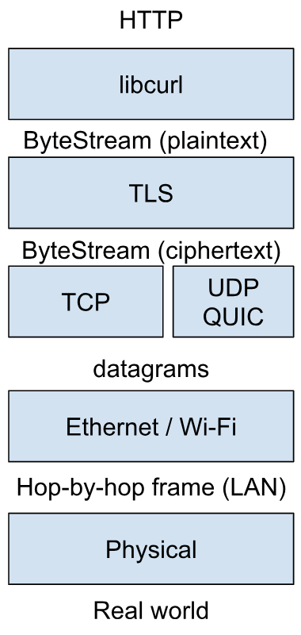

# TLS

## Last Time

Security Properties: Integrity, Confidentiality, Authenticity ,and authenticity is necessary for confidentiality

Certificate provides authenticity

- (**Opportunistic encryption**: even if you are not sure who you are talking to, still do encryption. This kind of confidentiality makes it harder for third parties (e.g. governments) to learn the content of the traffic, though it does not require authenticity.)

## Does this layer of TLS solve everything?

**Issue 1:** Certificate authorities may be corrupted / intentionally issued not correct certificates. The transparency log helps to mitigate this, but it is not a 100% solution.

- Big companies would monitor the transparency log
- Browsers may require the certificate to also contain a proof that the certificate is from the transparency log

**Issue 2:** Even if the payload of Internet datagrams is encrypted, you could still tell who is talking with who by the src/dst in the IP header. **“Metadata privacy”**.

- VPN or through one relay server: governments can’t tell who is talking with whom, but they can still get the info by threatening the relay server
- How about more than one relay server? Essentially, any single relay server cannot see the full picture of the connection.
  - Onion routing: layers of encryption and each relay server can only take out one layer of the encryption. **The Onion Router (TOR).**
  - Each relay server only knows the hop before itself and the hop after itself
- But: the timing still reveals something

## Tor：洋葱路由介绍

上一篇介绍了比特币并非完全匿名的，说到解决方案可以使用Tor网络来提升匿名性。读者朋友们可能很疑惑Tor是什么？以及它的匿名原理是什么样的？

接下来，打算用三篇文章来介绍一下Tor：本文只做Tor的基础概念介绍（对技术不感兴趣的读完这一篇就应该能明白简单原理），接下来一篇将详细讲解Tor的匿名原理，最后谈一谈针对Tor的一些追踪攻击技术。

### **历史背景**

1995年，美国军方希望军事情报机构可以让情报人员的网上活动不被敌对国进行监控，从而可以秘密的进行开源情报收集。于是，美国海军研究实验室的科学家开始开发一种匿名技术，可以避免人们的行迹在Internet上被追踪到。他们把这个技术叫做“洋葱路由”。“洋葱路由”利用P2P网络，把网络流量随机的通过P2P的节点进行转发，这样可以掩盖源地址与目标地址的路径。使得在Internet上难以确定使用者的身份和地址。

可以看出Tor最初始并非为保护大众的隐私而开发，Tor的大众化应用是由于Tor网络如果单纯的只提供给情报部门使用的话反而使得流量不能安全（Tor网络上的所有流量都是情报部分的机密数据， 人们一看到来自这个系统的流量就知道，啊，这是一个CIA的间谍）。所以，为了将情报部门的流量进行混淆就将Tor开放给大众，这样情报流量就很好的隐藏了。

### **匿名原理**

首先，了解一下日常生活中我们的上网流量是怎么样进行路由处理的，简化版上网流量传输模型如下（PC/客户端 ==&gt; 家庭路由器 ==&gt; 骨干路由器 ==&gt; 数据源/网站服务器）：

上网流量路由示意图

有网络基础的朋友应该知道流量报文中包含了的请求来源和目的地，它才能将网站服务器的响应准确的返回你的上网PC。这样的话，从网络截取的流量就可以轻松的追踪到你的IP地址，进一步通过电信局的IP分配记录就可以找到真实的你“查水表”了。

而洋葱路由器要解决正是为了解决上述的问题：中间人即使在Internet上截获通信的流量也无法判定通信的源头与目的地。

Tor网络示意图

洋葱路由的原理就好像你送一封匿名信，不是自己送或者通过邮差送，而是大街上随便找一个不认识的人让他帮你送。这样收信方就很难往回找到你。

实现原理描述：Tor网络由大量的志愿者贡献自己的PC/服务器运行洋葱路由协议的节点（node）而组成，Tor客户端（如嵌入Tor的浏览器）随机的从Tor网络中选取3台路由器形成一个私有网络路径传输**加密**的流量，每台节点路由器只知道数据送往的一下跳，而不知道发送流量的来源。这样就保证了这3个节点没有谁知道完整的流量传输路径。也就是说，Tor网络将流量的源地址与目的地址进行了隔断，从而无法根据截取的流量进行源地址追踪。

## **Threats:** eavesdropper timing attack correlation

Something is being sent from TOR to Netflix at 1:33 a.m.

And if there is a short list of people that were using TOR at that time

It may not be that difficult to tell who is actually sending to Netflix

Q: How do third parties (say governments) tell people that are using TOR?

A: TOR relay servers are public and TOR traffic may look different. Governments could figure out TOR relay servers IP addresses and block them. (To fight against this, TOR relay servers IP addresses are released slowly, and they are trying to make TOR traffic look as innocent as normal traffic).

## **Threats**: Sybil attack

TOR works only if the relay servers are not colluding. If a certain entity has a huge number of TOR relay servers, then there is a high probability that a whole sequence of relay servers belong to this entity, then the entity can learn about the connection.

## TOR hidden service

Allow publishers and users of services to hide their identity.

Normally contains 6 hops of relay, 3 picked by the publisher, 3 picked by the client.

By exploiting security holes, governments can still reveal who was visiting/posting on TOR web servers. (Put the **security hole exploit** on the web servers of these hidden services, then whoever downloads the content would also download the security hole exploit).
