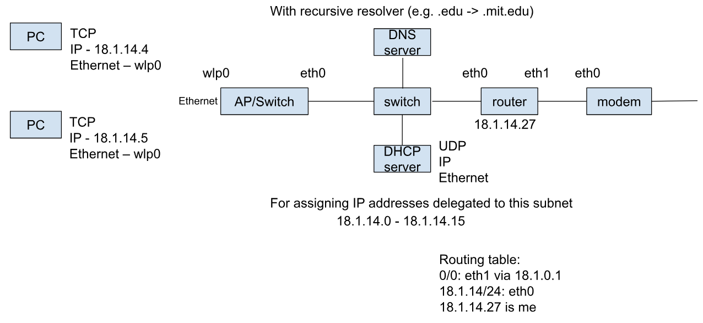
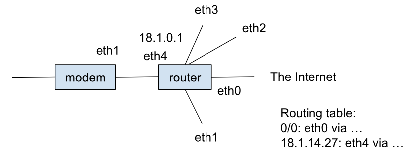
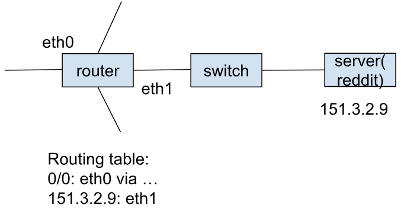
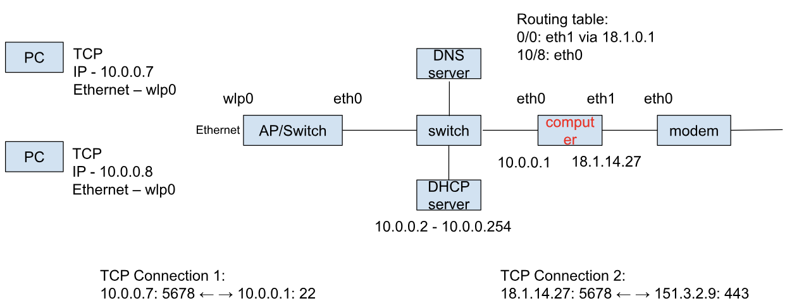
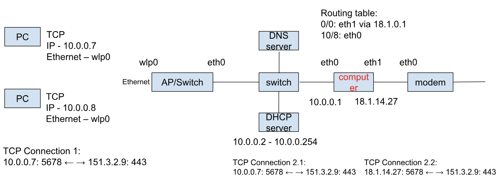
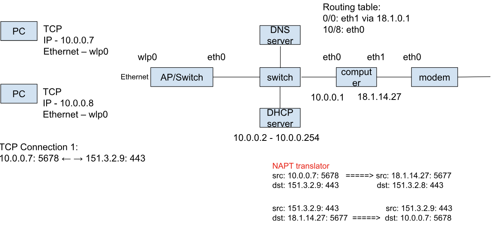

# History of home networking 2

Last time: level 5 home subnetwork

Home subnet:

ISP:

The reddit:

If we live in the world of IPv6 (each hosts get assigned a unique IPv6 address):

- As long as PC1 (18.1.14.4) and the reddit (151.2.3.9) stores the source and dst IP addresses of the TCP Connection in their socket, the TCP connection can be done
  - PC1: 18.1.14.4: 5678 ← —&gt; 151.3.2.4:443: reddit
- **DNS + DHCP + switch + router + modem** used to be independent parts, but now they goes in to a “home router” you can buy from a shop

## Level 6: Proxy server/ jump host / bastion / socks5

Each subnets have a local range of IPv4 addresses

The computer relays the bytes between TCP connection 1 and TCP connection 2.

But this is annoying for asking every new PC to also set up the proxy

## Level 7: Transparent Proxy

The PC does not know the existence of the proxy

And the **proxy computer** acts as if it is the reddit server in the home subnet, and relay the connection out with its own public IP address

## Level 8: network address/port translation ( NAT )

For the proxy, it **no longer** reconstruct the byte stream, but only do translation **on the IP address and port** to appear in the public network

