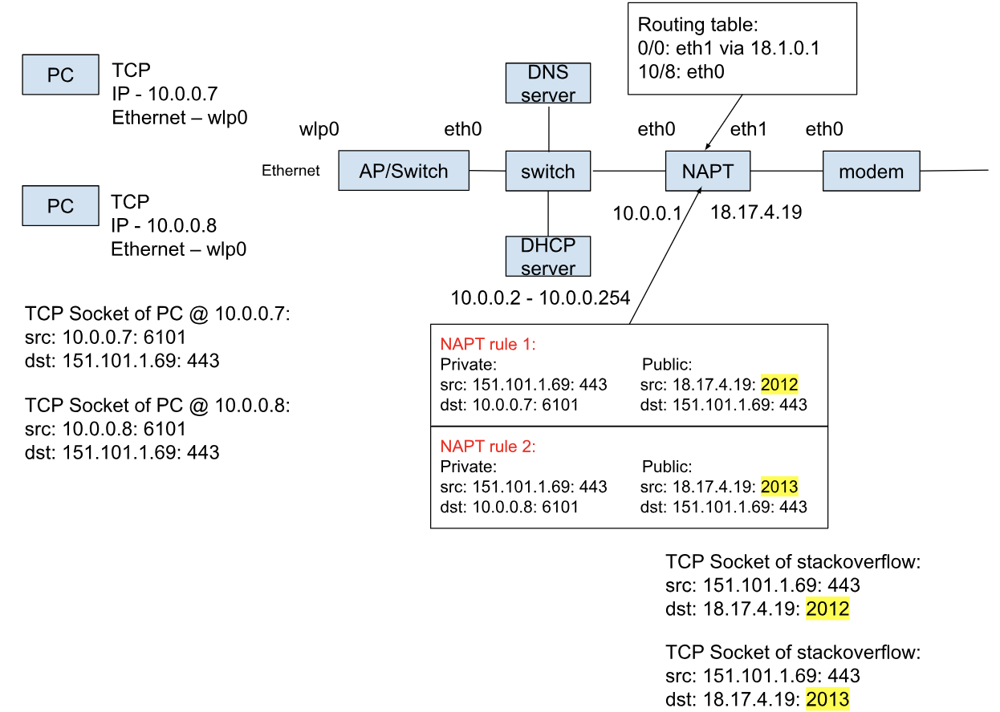
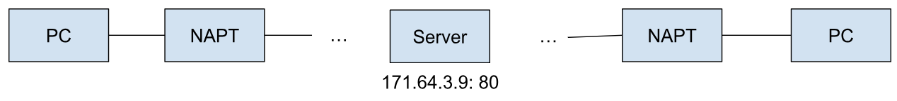
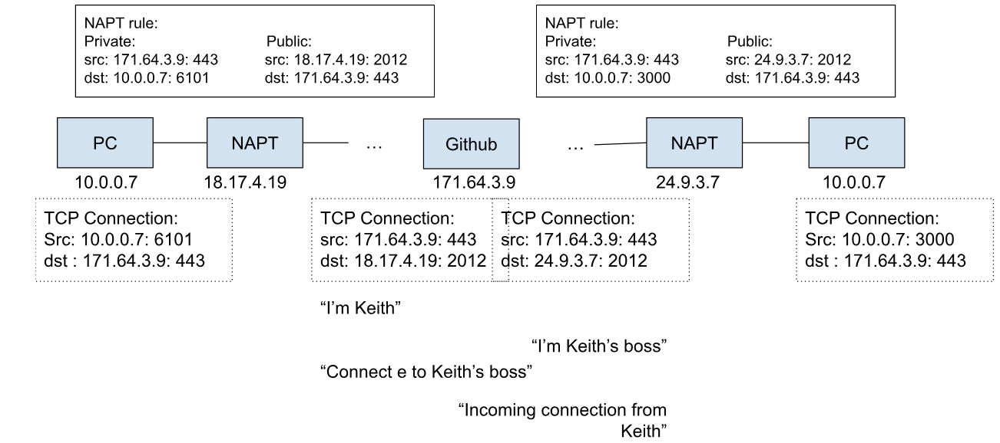
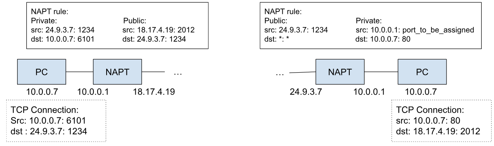

# History of Home Networking 3

由于NAT实现是私有IP和NAT的公共IP之间的转换，那么，私有网中同时与公共网进行通信的主机数量就受到NAT的公共IP地址数量的限制。为了克服这种限制，NAT被进一步扩展到在进行IP地址转换的同时进行Port的转换，这就是网络地址端口转换NAPT（Network Address Port Translation）技术。

NAPT与NAT的区别在于，NAPT不仅转换IP包中的IP地址，还对IP包中TCP和UDP的Port进行转换。这使得多台私有网主机利用1个NAT公共IP就可以同时和公共网进行通信。

## Level 8: NAPT

If the PC @ 10.0.0.7 wants to start a connection with stackoverflow @ 151.101.1.69 either through a proxy or a transparent proxy or a NAPT translator.

- The number of TCP connections between any PC on the subnet to stackoverflow **is equal to the number of possible port numbers (65536)**
- Each new TCP connection between a PC on the subnet to a public IP address adds a new NAPT rule
- A NAPT rule is garbage-collected either when a TCP connection is closed or the rule has not been used for a while

However, what happens if stackoverflow @ 151.101.1.69 wants to start a connection with the PC @ 10.0.0.7? Or how to allow PC @ 10.0.0.7 to host a file server?

- The dumbest way: have file servers on the public internet that are not behind NAPT, and upload any files to those public servers for sharing

## Level 9a: P2P networking via public server

Use one public server to hold the files between PCs behind NAPTs

How to achieve this without having the server to hold on to some files?

## Level 9b: P2P networking via public proxy/relay/ TURN (Traversal Using Relays around NAPT)

What could we do if we don’t want to connect through any kind of relay server in between?

## Level 9c: P2P networking via explicit NAPT rules (port forwarding)

Why can’t two PCs talk to each other when they are both behind NAPT?

- **Their IP addresses are not meaningful on the public Internet**

Why can’t one PC connect to the NAPT on the other side?

If we **add the NAPT rule to the NAPT @ 24.9.3.7 before the TCP Connection is started**, then a direct TCP Connection can be established between the two PC behind NAPTs.

## The following content was not part of the lecture

There was some confusions around **how the private src and public dst are set in a NAPT rule**, and this is decided by the NAT implementations defined here: [https://www.rfc-editor.org/rfc/rfc3489#section-5](https://www.rfc-editor.org/rfc/rfc3489#section-5).

It is assumed that the reader is familiar with NATs.  It has been observed that NAT treatment of UDP varies among implementations.  The four treatments observed in implementations are:

Full Cone: A full cone NAT is one where all requests from the same internal IP address and port are mapped to the same external IP address and port.  Furthermore, any external host can send a packet to the internal host, by sending a packet to the mapped external address.

Restricted Cone: A restricted cone NAT is one where all requests from the same internal IP address and port are mapped to the same external IP address and port.  Unlike a full cone NAT, an external host (with IP address X) can send a packet to the internal host **only if the internal host had previously sent a packet to IP address X**.

Port Restricted Cone: A port restricted cone NAT is like a restricted cone NAT, but **the restriction includes port numbers**. Specifically, an external host can send a packet, with source IP address X and source port P, to the internal host **only if the internal host had previously sent a packet to IP address X and port P**.

Symmetric: A symmetric NAT is one where all requests from the same internal IP address and port, to a specific destination IP address and port, are mapped to the same external IP address and port.  If the same host sends a packet with the same source address and port, but to a different destination, a different mapping is used.  Furthermore, only the external host that receives a packet can send a UDP packet back to the internal host.

Say PC @ 10.0.0.7: 6101 starts a TCP connection to PC @ 24.9.3.7:1234 by sending a packet, the rule established would be:

- Full Cone

| private: | public : |
| --- | --- |
| src: * : * | src: 18.17.4.19: 2012 |
| dst: 10.0.0.7 : 6101 | dst: * : * |

- Restricted Cone

| private: | public : |
| --- | --- |
| src: * : * | src: 18.17.4.19: 2012 |
| dst: 10.0.0.7 : 6101 | dst: 24.9.3.7: * |

- Port Restricted Cone

| private: | public : |
| --- | --- |
| src: * : * | src: 18.17.4.19: 2012 |
| dst: 10.0.0.7 : 6101 | dst: 24.9.3.7: 1234 |

- Symmetric

| private: | public : |
| --- | --- |
| src: 24.9.3.7: 1234 | src: 18.17.4.19: 2012 |
| dst: 10.0.0.7: 6101 | dst: 24.9.3.7: 1234 |
