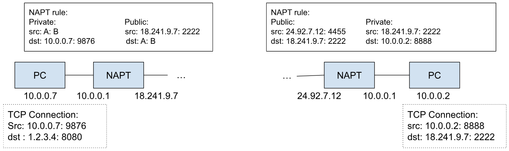
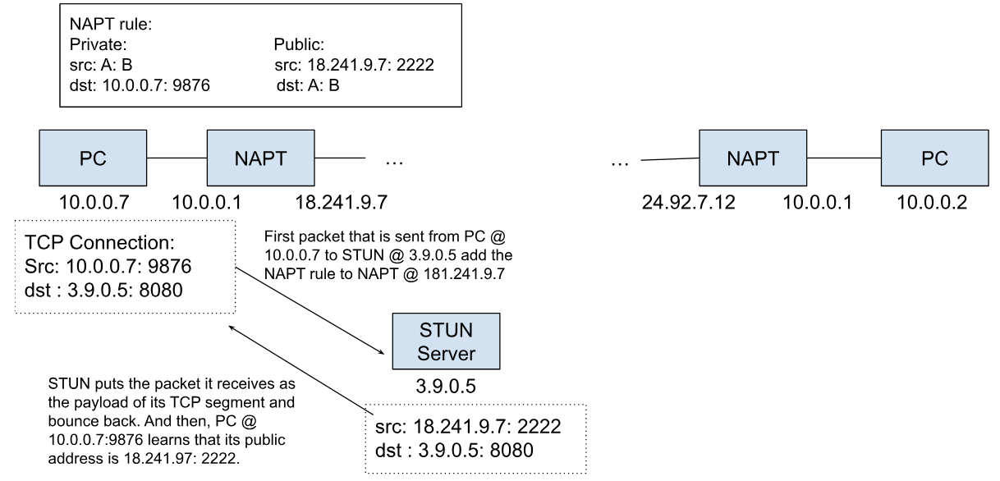
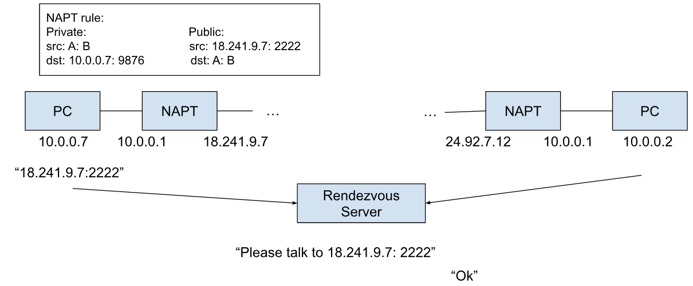

# History of Home Networking 4

## Level 9d: P2P networking via NAT traversal

“cone” NAPT rule

- Any connection that goes to 18.241.9.7: 2222 would **be reroute to** 10.0.0.7:9876

What would be needed to make this TCPConnection happen?

- Step 1: PC @ 10.0.0.7 needs to know its public IP address
  - STUN Server @ 3.9.0.5 (**STUN Servers are stateless**)

- Step 2: PC @ 10.0.0.7 wants to tell its peer about its public address: **Rendezvous server**
  - A rendezvous server is similar to a chat room, and the rendezvous server itself doesn’t have to have any persistent mapping between user names and public addresses
  - When one user is trying to talk to another users, the rendezvous server checks whether the other party is logged in on the server, and if true send the message
  - Rendezvous servers are often run by applications (e.g. Minecraft, or Bittorrent) since rendezvous servers are cheaper than TURN servers, and TURN servers would be needed if P2P connections cannot be established

