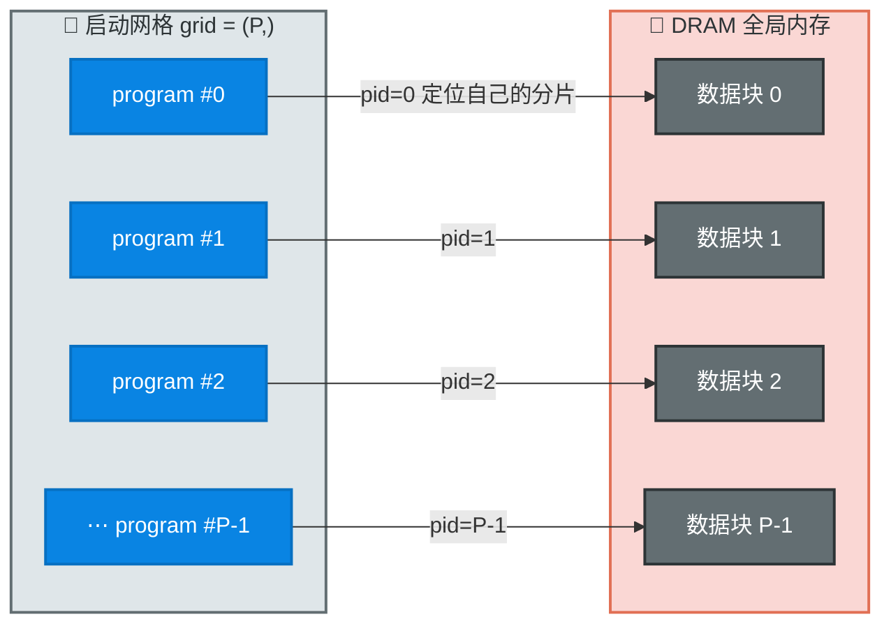
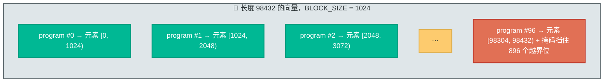
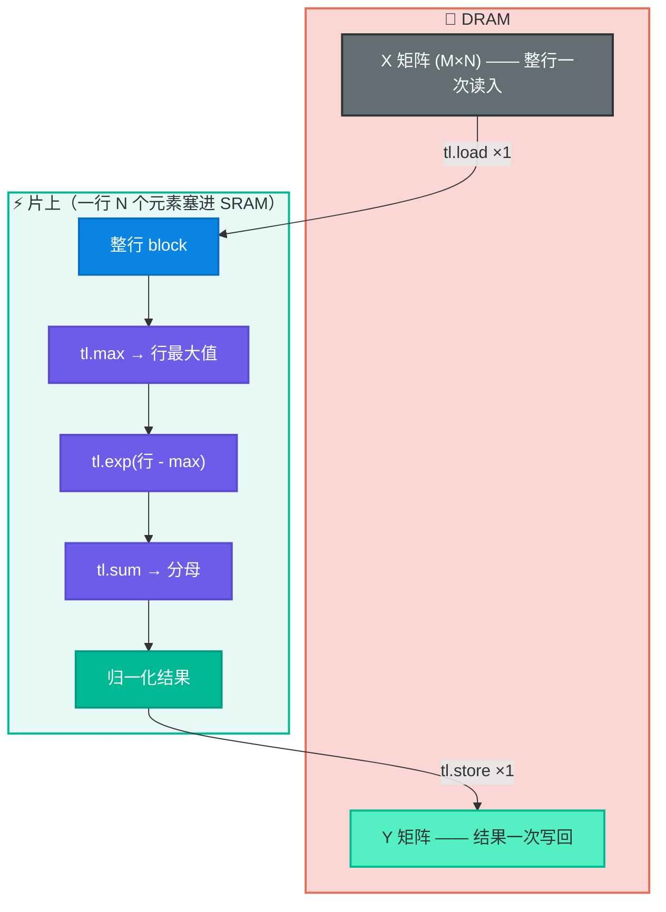
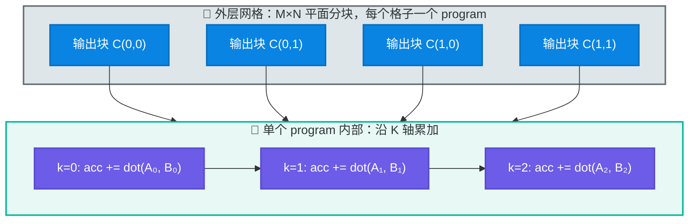
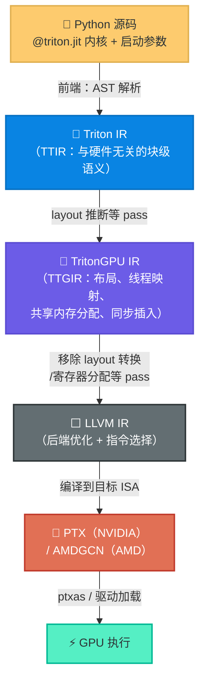

# Triton 入门指南：用 Python 编写高性能 GPU 内核

Triton 是一个**专为深度学习与高性能计算设计、用 Python 编写的高性能 GPU 内核编程语言与编译器**。它的口号很朴素：让你**用 Python 的写法，写出接近手工 CUDA 的性能**——不用管线程、warp、共享内存这些细节，编译器替你搞定。

本文是一份面向零基础的入门指南。你将学会：

- Triton 在 GPU 编程宇宙中的定位（和 CUDA、TVM 有什么区别）；
- 它的核心编程模型：**Program + Block**；
- 三个层层递进的实战示例：向量加法 → 融合 Softmax → 矩阵乘法；
- 自动调优（autotune）与性能测量工具；
- 官方仓库源码导航与编译管线，以及后续进阶路线。

> ⏭️ 急读版：先看 [§3 安装](#3-安装与环境) 把环境装好，然后照抄 [§4 向量加法](#4-第一个内核向量加法) 跑通第一个内核，其余章节按需阅读。

---

## 1. Triton 是什么

### 1.1 一句话定位

官方仓库首页（README）的自述是：

> Triton, a language and compiler for writing highly efficient custom Deep-Learning primitives. The aim of Triton is to provide an open-source environment to write fast code at higher productivity than CUDA, but also with higher flexibility than other existing DSLs.

翻译过来：

- **比 CUDA 生产力更高**：CUDA 需要手工管理线程块、共享内存、同步等大量细节；Triton 把这些全部交给编译器。
- **比其他 DSL 更灵活**：TVM、Halide 这类"调度语言"通过分离"算法定义"和"调度策略"来换取可移植性，但写惯简单算子后会觉得别扭；Triton 保持"**写一个 Python 函数就是写一个内核**"的直觉，同时保留足够的底层控制（内存布局、块大小、指令选择）。

### 1.2 出身与现状

Triton 由 **Philippe Tillet** 等人提出，奠基论文发表于 MAPL 2019：

- *Triton: An Intermediate Language and Compiler for Tiled Neural Network Computations*（[论文链接](https://dl.acm.org/doi/10.1145/3315508.3329973)）

Triton 最初由 OpenAI 的研究团队孵化并开源，如今由社区组织 **triton-lang** 维护（MIT 协议）。截至 2026 年，GitHub 上已有约 **2 万 stars、630+ 贡献者，被 8.7 万+ 仓库使用**，是当下 GPU 内核编程事实上的社区标准之一。

### 1.3 它用在了哪里

- **PyTorch 2.x 的 `torch.compile`**：CUDA 后端的 Inductor 默认把计算图编译成 Triton 内核；
- **FlashAttention**：官方与社区的多份高性能注意力实现（含反向传播）都用 Triton 编写；
- **vLLM 等推理框架**：paged attention 等关键算子直接以 Triton 实现；
- **量化库**：bitsandbytes 等库的量化内核有 Triton 版本。

> 💡 **关键点**：Triton 解决的是"**自定义算子**"场景——cuBLAS 这类厂商库又快又全，但没法融合你的自定义激活函数；手写 CUDA 太费时。Triton 恰好卡在中间：足够快、足够自由、写起来足够快。

### 1.4 与 CUDA、TVM 的对比

| 维度 | CUDA / CUDA C++ | TVM / Halide（调度语言） | **Triton** |
|---|---|---|---|
| 编程范式 | 线程级：你管理 thread/block | 算法与调度分离，调度表达式驱动 | **块级**：你描述"数据块上的计算"，编译器映射到线程 |
| 学习成本 | 高（内存模型、同步、occupancy） | 中（要学调度语言和自动调度机制） | **低**（Python 子集 + 少量 TL 固有概念） |
| 性能上限 | 最高（完全控制） | 高（自动调度 + 手工调度可插拔） | 高（接近 CUDA；官方 MatMul 教程可与 cuBLAS 持平） |
| 灵活性 | 最强 | 中 | 高（可融合任意激活、自定义访存模式） |
| 可移植性 | 差（NVIDIA 专有/ROCm 各自为政） | 好（多后端） | 中（[NVIDIA + AMD](#32-硬件支持)，CPU 后端开发中） |
| 适合谁 | 资深系统程序员 | 编译器/框架开发者 | **绝大多数 AI 应用开发者** |

> 🤔 一个常被问的问题：**NVIDIA Triton Inference Server 和这里的 Triton 是什么关系？** 两者完全无关。Triton Inference Server 是 NVIDIA 的模型推理服务框架，只是恰好同名，别混淆。

---

## 2. 核心编程模型：Program 与 Block

Triton 的整个编程模型只有两个核心概念，请务必先吃透。

### 2.1 Program（程序实例）与 Grid（启动网格）

- 你写的 `@triton.jit` 函数是一个 **kernel（内核）**；
- 启动内核时指定一个 **grid（启动网格）**，如 `grid = (1024,)`，表示创建 **1024 个并行的 program 实例**在 GPU 上并发运行；
- 每个 program 通过 `tl.program_id(axis=0)` 拿到自己的编号 `pid`，然后**各自处理数据的不同分片**——这就是经典的 SPMD（单程序多数据）模型。

类比 CUDA：program ≈ CUDA 中的 *block*（线程块），grid ≈ launch grid。**不同的是，CUDA 里你还要管 block 内部的 thread（线程）**；而在 Triton 中，一个 program 内部如何组织线程、分多少 warp，由编译器决定（你最多通过 `num_warps` 给一个"提示"，见 [§7](#7-自动调优与性能测量)）。



### 2.2 Block（块）：TL 语言操作的最小单位

这是 Triton 与 CUDA 最根本的区别：

- 在 CUDA 里你操作的是**单个元素/单个线程**；
- 在 Triton 里，你在内核里写的每个"张量"其实是一个 **block**（一块数据），比如 `x`、`y`、`offsets` 都是一整块；
- 块内元素上的运算（加减乘除、`tl.exp` …）是**逐元素并行**的，编译器自动把块映射到多个线程去执行。

块是**一等公民**，因此内核里最常见的操作是：

- `tl.arange(0, BLOCK_SIZE)`：生成 `[0, 1, ..., BLOCK_SIZE-1]` 的**连续整数块**（类似 numpy 的 `arange`）；
- `tl.load / tl.store`：按**指针块**从全局内存加载/写回一整块数据，可带 `mask`（掩码）和 `other`（越界填充值）；
- `tl.max / tl.sum / tl.dot` 等：对整块做归约或块级矩阵乘。

> 💡 一个绕不开的规则：**block 的元素个数必须是 2 的幂**（power-of-two）。比如 `tl.arange(0, 1024)` 合法，`tl.arange(0, 1000)` 不合法。所以当数据长度不是 2 的幂时，要"向上取整到 2 的幂"再配合 mask 越界保护——后面所有例子都会用到这个套路。

### 2.3 内存模型：没有显式共享内存

CUDA 编程最费精力的是内存层级的管理（global → shared → register，同步、bank conflict 等）。Triton 把这一层**藏起来了**：

- 数据在 GPU 上只有两种归宿：**DRAM（全局内存，容量大、慢）** 和 **SRAM（片上缓存，容量小、快）**；
- `tl.load` 从 DRAM 读进**寄存器/SRAM**，`tl.store` 写回 DRAM；
- **共享内存的分配、同步甚至异步拷贝（TMA）都由编译器自动插入**，程序员完全无感。

编译器会自动应用一大串优化，官方 README/论文列的清单包括（能记住"这些不用你操心"即可）：

- 自动 kernel 融合（merge）、线程重组（thread re-ordering）；
- 预取与自动向量化；
- **张量核心（Tensor Core）感知的指令选择**（你的 `tl.dot` 会自动落到 MMA 指令上）；
- 共享内存分配与同步、异步复制调度。

### 2.4 常用的 `tl.*` API 速查

| API | 作用 | 首次出现 |
|---|---|---|
| `tl.program_id(axis)` | 当前 program 在 axis 维度的编号 | §4 |
| `tl.num_programs(axis)` | 网格在 axis 维度的大小（program 总数） | §5 |
| `tl.arange(0, N)` | 生成 `[0, N)` 的整数块（N 必须为 2 的幂） | §4 |
| `tl.constexpr` | 编译期常量类型，可作块形状 | §4 |
| `tl.load(ptr, mask=, other=)` | 按块加载，掩码保护越界 | §4 |
| `tl.store(ptr, val, mask=)` | 按块写回 | §4 |
| `tl.max / tl.sum(x, axis=)` | 沿轴归约 | §5 |
| `tl.exp / tl.log` 等 | 逐元素数学函数（`exp` 是快速近似，类似 CUDA `__expf`） | §5 |
| `tl.dot(a, b, acc)` | 块级矩阵乘（走 Tensor Core） | §6 |
| `tl.zeros / tl.where` | 初始化/条件选择块 | §6 |
| `tl.cdiv(a, b)` | ceil 除法，用于算网格大小 | §4 |
| `triton.next_power_of_2(n)` | 找 >= n 的最小 2 的幂（Python 侧） | §5 |

---

## 3. 安装与环境

### 3.1 安装

```bash
pip install triton
```

官方在 PyPI 上为 CPython 3.10–3.14 提供预编译 wheel。装好后验证：

```bash
python -c "import triton; print(triton.__version__)"
```

> ⚠️ 注意：官方只提供 **Linux** 平台的支持（NVIDIA/AMD GPU）。Windows 上的 Triton 通常通过 WSL 或社区编译的 wheel 使用，Mac 上无法真正跑 GPU 内核（CPU 后端仍在开发中）。

### 3.2 硬件支持

| 硬件 | 要求 |
|---|---|
| NVIDIA GPU | Compute Capability **8.0+**（Ampere 及之后，如 A100/A30、RTX 30/40/50 系、H100、B100 …） |
| AMD GPU | ROCm **6.2+** |
| CPU | 官方后端开发中（`triton.language` 的 CPU 支持正在演进） |

> ⚠️ 与老博客的区别：许多 2023 年左右的博客还写着"支持 Volta（CC 7.0）"，但在 Triton 3.x 时代 NVIDIA 侧已要求 **CC 8.0+**，V100（7.0）等更老架构不再受支持。

### 3.3 没有 GPU 怎么学？

两条路：

1. **Triton 解释器**：设置环境变量 `TRITON_INTERPRET=1`，内核不经过编译直接由 Python 解释执行（可以打 Python 断点调试内核逻辑！），不需要 GPU；速度慢，但非常适合学习与调试。
2. **社区练习题**：gpu-mode 的 [Triton-Puzzles](https://github.com/gpu-mode/Triton-Puzzles)（官方 README 也推荐）是一套由易到难的题目，全部可用解释器运行，无需 GPU。

```bash
TRITON_INTERPRET=1 python your_kernel.py   # 无 GPU 跑通内核逻辑
```

> ⏭️ 下面三节全部是动手示例，建议配好环境跟着敲。

---

## 4. 第一个内核：向量加法

本节改编自官方教程 [01-vector-add.py](https://github.com/triton-lang/triton/blob/main/python/tutorials/01-vector-add.py)（官方仓库 `python/tutorials/01-vector-add.py:add_kernel`）。做完这一步，你就掌握了 Triton 90% 的"语法面"。

### 4.1 完整代码

```python
import torch

import triton
import triton.language as tl

# 自动探测当前 torch 所在的 GPU 设备（cuda / rocm）
DEVICE = triton.runtime.driver.active.get_active_torch_device()


@triton.jit
def add_kernel(
        x_ptr,          # 输入向量 x 的指针（隐式传入：torch.Tensor -> 首元素指针）
        y_ptr,          # 输入向量 y 的指针
        output_ptr,     # 输出向量指针
        n_elements,     # 向量长度
        BLOCK_SIZE: tl.constexpr,  # 每个 program 处理的元素个数，编译期常量
):
    # 1. 我的编号是几号 program？
    pid = tl.program_id(axis=0)

    # 2. 我负责的数据是 [pid*BLOCK_SIZE, (pid+1)*BLOCK_SIZE) 这一段
    block_start = pid * BLOCK_SIZE
    offsets = block_start + tl.arange(0, BLOCK_SIZE)

    # 3. 掩码：防止最后一段越界（n_elements 不一定是 BLOCK_SIZE 的整数倍）
    mask = offsets < n_elements

    # 4. 按块加载、计算、写回（全是块级操作，编译器自动并行化）
    x = tl.load(x_ptr + offsets, mask=mask)
    y = tl.load(y_ptr + offsets, mask=mask)
    output = x + y
    tl.store(output_ptr + offsets, output, mask=mask)


def add(x: torch.Tensor, y: torch.Tensor):
    # 分配输出
    output = torch.empty_like(x)
    n_elements = output.numel()

    # 启动网格：总共需要 ceil(n_elements / BLOCK_SIZE) 个 program
    grid = lambda meta: (triton.cdiv(n_elements, meta['BLOCK_SIZE']),)

    # 以 grid 索引 kernel 得到可调用的 GPU 内核，启动它
    add_kernel[grid](x, y, output, n_elements, BLOCK_SIZE=1024)
    return output


# ---------- 正确性验证 ----------
torch.manual_seed(0)
size = 98432          # 特意选一个不是 1024 整数倍的大小，考验 mask
x = torch.rand(size, device=DEVICE)
y = torch.rand(size, device=DEVICE)

output_torch = x + y
output_triton = add(x, y)
print(f"最大误差 = {torch.max(torch.abs(output_torch - output_triton))}")
# 期望输出：最大误差 = 0.0
```

### 4.2 逐行拆解

**① `@triton.jit` 装饰器**

把下面的 Python 函数标记为一个 Triton 内核：Triton 编译器会**解析这份"Python 子集"，编译成 GPU 二进制**。它和普通 Python 有差别：支持 `tl.*` 块级运算、变量要能静态推断形状、分支/循环会被展开或流水线化。语法上"像 Python"，语义上是编译期专用语言。

**② `pid = tl.program_id(axis=0)`**

拿到当前 program 的编号。网格是 1 维的（`grid = (P,)`），所以 `axis=0`。

**③ `offsets` 与 `tl.arange`**

```python
block_start = pid * BLOCK_SIZE
offsets = block_start + tl.arange(0, BLOCK_SIZE)
```

`tl.arange(0, BLOCK_SIZE)` 生成整数块 `[0, 1, …, BLOCK_SIZE-1]`，加上 `block_start` 就是这个 program 要处理的**绝对下标块**。注意：`BLOCK_SIZE` 必须声明为 `tl.constexpr`，因为它要作为编译期形状值使用。

**④ `mask` 掩码**

```python
mask = offsets < n_elements
```

最后一个 program 可能越界（`98432 = 96×1024 + 128`），用掩码把所有 `offsets >= n_elements` 的位置"挡住"。

**⑤ `tl.load` / `tl.store`**

```python
x = tl.load(x_ptr + offsets, mask=mask)
```

`x_ptr + offsets` 是**指针块**（每个元素是一个地址），`mask` 保证越界位置不真的访问内存。**没有显式的设备端内存拷贝、没有 `if` 判断线程走哪条路**——块级语义让边界处理变成数据操作。

**⑥ 启动内核**

```python
grid = lambda meta: (triton.cdiv(n_elements, meta['BLOCK_SIZE']),)
add_kernel[grid](x, y, output, n_elements, BLOCK_SIZE=1024)
```

- `grid` 是"网格计算函数"：传入 meta（元参数字典，含 `BLOCK_SIZE`），返回各维 program 数量（这里是 1 维）；
- `kernel[grid](...)` 语法＝"以这个网格启动内核"；运行时参数按位置传；
- `BLOCK_SIZE=1024` 这样的 **meta-parameter（元参数）按关键字传**，参与编译，不参与运行时参数传递；
- `torch.Tensor` 直接作为指针参数传入（隐式取首元素地址），这是 Triton 与 PyTorch 无缝衔接的关键设计。



### 4.3 性能测量

官方教程用 `triton.testing.do_bench` 与 `perf_report` 画对比图，这里保留最核心的用法：

```python
@triton.testing.perf_report(
    triton.testing.Benchmark(
        x_names=['size'],                 # x 轴：向量大小
        x_vals=[2**i for i in range(12, 28, 1)],
        x_log=True,
        line_arg='provider',              # 每条线对应一个 provider
        line_vals=['triton', 'torch'],
        line_names=['Triton', 'Torch'],
        styles=[('blue', '-'), ('green', '-')],
        ylabel='GB/s',
        plot_name='vector-add-performance',
        args={},
    ))
def benchmark(size, provider):
    x = torch.rand(size, device=DEVICE, dtype=torch.float32)
    y = torch.rand(size, device=DEVICE, dtype=torch.float32)
    quantiles = [0.5, 0.2, 0.8]
    if provider == 'torch':
        ms, min_ms, max_ms = triton.testing.do_bench(lambda: x + y, quantiles=quantiles)
    if provider == 'triton':
        ms, min_ms, max_ms = triton.testing.do_bench(lambda: add(x, y), quantiles=quantiles)
    gbps = lambda ms: 3 * x.numel() * x.element_size() * 1e-9 / (ms * 1e-3)
    return gbps(ms), gbps(max_ms), gbps(min_ms)

benchmark.run(print_data=True, show_plots=True)
```

`do_bench` 是 Triton 内置的"精确测时"工具（会做 warmup、多次采样、取分位数），比手动 `time.perf_counter` 靠谱得多。向量加法是**带宽受限**操作，Triton 与 PyTorch 通常不相上下——它的价值不在"更快"，而在**把融合自定义逻辑的成本降到接近零**（这正是下一节的主题）。

---

## 5. Kernel 融合：Softmax

> 本节改编自官方教程 [02-fused-softmax.py](https://github.com/triton-lang/triton/blob/main/python/tutorials/02-fused-softmax.py)（官方仓库 `python/tutorials/02-fused-softmax.py:softmax_kernel`）。

上一节的逐元素内核用 Triton 写与用 PyTorch 写差不多，看不出优势。本节用一个**带宽受限**、且中间结果庞大的算子——Softmax——展示 Triton 的招牌能力：**kernel fusion（内核融合）**。

### 5.1 为什么 naive Softmax 慢？

PyTorch 里"一行"的 `torch.softmax(x, dim=1)`，底层其实要**多次存取 DRAM**。设 `x ∈ R^{M×N}`（M 行、N 列），naive 实现（官方源码注释原文）：

| 步骤 | 内存操作 |
|---|---|
| `x_max = x.max(dim=1)` | 读 `MN`，写 `M` |
| `z = x - x_max` | 读 `MN + M`，写 `MN` |
| `numerator = torch.exp(z)` | 读 `MN`，写 `MN` |
| `denominator = numerator.sum(dim=1)` | 读 `MN`，写 `M` |
| `ret = numerator / denominator` | 读 `MN + M`，写 `MN` |
| **合计** | **读 `5MN + 2M`，写 `3MN + 2M`** |

而**融合内核**只做"读一次 X → 片上算完 → 写一次 Y"：读 `MN`、写 `MN`。理论加速比：

$$
\frac{(8MN + 4M)}{2MN} \approx 4\times
$$

官方教程实测结论正是：**Triton 融合 Softmax 比 `torch.jit.script` 的 naive 版本快约 4 倍**，也比 `torch.softmax` 明显更快——前提是**一行能塞进 SRAM**（这正是"行宽有限的矩阵"这一类问题的特征）。

> 💡 融合的本质：**把多次 DRAM 往返压缩成一次**，中间结果（如 `exp` 后的分子）不再落回显存。

### 5.2 Triton 实现

```python
@triton.jit
def softmax_kernel(
        output_ptr, input_ptr,
        input_row_stride, output_row_stride,
        n_rows, n_cols,
        BLOCK_SIZE: tl.constexpr,          # >= n_cols 的最小 2 的幂
        num_stages: tl.constexpr,
):
    # 每个 program 处理若干行（persistent 风格：行循环在 program 内）
    row_start = tl.program_id(0)
    row_step = tl.num_programs(0)

    for row_idx in tl.range(row_start, n_rows, row_step, num_stages=num_stages):
        # 本行首元素的绝对地址 = 基址 + 行号 × 行跨度
        row_start_ptr = input_ptr + row_idx * input_row_stride
        col_offsets = tl.arange(0, BLOCK_SIZE)
        input_ptrs = row_start_ptr + col_offsets

        # 加载整行（BLOCK_SIZE 可能比 n_cols 大，越界位置填 -inf
        # 以保证它们不干扰 max 归约）
        mask = col_offsets < n_cols
        row = tl.load(input_ptrs, mask=mask, other=-float('inf'))

        # 数值稳定 softmax：减行最大值，再 exp、sum、归一
        row_minus_max = row - tl.max(row, axis=0)
        numerator = tl.exp(row_minus_max)          # tl.exp 是快速近似，类似 CUDA __expf
        denominator = tl.sum(numerator, axis=0)
        softmax_output = numerator / denominator

        # 写回，同样带掩码
        output_row_start_ptr = output_ptr + row_idx * output_row_stride
        output_ptrs = output_row_start_ptr + col_offsets
        tl.store(output_ptrs, softmax_output, mask=mask)
```

启动侧（简化版）：

```python
def softmax(x):
    n_rows, n_cols = x.shape
    # block 必须是 2 的幂：取 >= n_cols 的最小 2 的幂，并向上取整 padding
    BLOCK_SIZE = triton.next_power_of_2(n_cols)
    y = torch.empty_like(x)
    # 每行一个 program 是最直觉的做法：
    softmax_kernel[(n_rows,)](y, x, x.stride(0), y.stride(0), n_rows, n_cols,
                              BLOCK_SIZE=BLOCK_SIZE, num_stages=4)
    return y
```

### 5.3 三个新知识点

**① 归约：`tl.max` / `tl.sum` 的 `axis` 参数**

```python
row_minus_max = row - tl.max(row, axis=0)
denominator = tl.sum(numerator, axis=0)
```

对 `[BLOCK_SIZE]` 形状的块沿 `axis=0` 归约出标量。若操作二维块，`axis=0` 归约行、`axis=1` 归约列。

**② `other=-float('inf')` 的妙用**

`BLOCK_SIZE` 是 2 的幂 padding，越界位置若填 0，`max` 还是对的；但更稳健的写法是填 `-inf`——因为反正 `exp(-inf) → 0`。同理 `tl.store` 的 mask 保证 padding 不写回。

**③ `tl.range(..., num_stages=num_stages)`**

`tl.range` 是内核内的循环构造（比 Python `range` 多了 `num_stages` 等流水线提示）。`tl.program_id(0)` + `tl.num_programs(0)` 让**固定数量的 program 循环处理所有行**（persistent kernel 思路：program 数量 = 机器容量决定的，而不是问题规模决定的），避免"每行一个 program"在行数巨大时产生过大的启动开销。官方教程还根据设备寄存器/共享内存算 occupancy，进一步把 program 数压到 `NUM_SM × occupancy`。



> 💡 融合例子给我们的通用心智模型：**凡是"读一次数据能算完所有事"的算子（归一化、逐元素链、行/列归约、以及后面所有 attention 类算子），都是 Triton 的主场**。

---

## 6. 矩阵乘法：从分块到 Tensor Core

> 本节改编自官方教程 [03-matrix-multiplication.py](https://github.com/triton-lang/triton/blob/main/python/tutorials/03-matrix-multiplication.py)（官方仓库 `python/tutorials/03-matrix-multiplication.py:matmul_kernel`）。官方教程的开场白：**手写 FP16 MatMul 可与 cuBLAS / rocBLAS 性能持平**——这就是 Triton 实力的最好注脚。

矩阵乘法是**计算受限**算子的代表，优化点完全不同：拼的是 Tensor Core 利用率、L2 缓存命中率、寄存器/共享内存吞吐。官方教程的思路一脉相承：**分块（tiling）**。

### 6.1 分块算法

要算 `C = A × B`，其中 `A ∈ R^{M×K}, B ∈ R^{K×N}, C ∈ R^{M×N}`：

```python
# 官方教程中的伪代码（每个 program 负责一个 (BLOCK_SIZE_M, BLOCK_SIZE_N) 的输出块）
for m in range(0, M, BLOCK_SIZE_M):      # 外层：沿 M 轴分块 —— 并行
    for n in range(0, N, BLOCK_SIZE_N):  # 外层：沿 N 轴分块 —— 并行
        acc = zeros((BLOCK_SIZE_M, BLOCK_SIZE_N), dtype=float32)
        for k in range(0, K, BLOCK_SIZE_K):  # 内层：沿 K 轴累加
            a = A[m:m+BLOCK_SIZE_M, k:k+BLOCK_SIZE_K]
            b = B[k:k+BLOCK_SIZE_K, n:n+BLOCK_SIZE_N]
            acc += dot(a, b)
        C[m:m+BLOCK_SIZE_M, n:n+BLOCK_SIZE_N] = acc
```

外层两个循环**每个迭代一个 program**（网格大小为 `(M/BLOCK_SIZE_M) × (N/BLOCK_SIZE_N)`），内层 K 循环在单个 program 内串行累加。K 块（如 64）小到能常驻 SRAM，从而实现块的循环重用。



### 6.2 多维指针算术

二维矩阵是行优先存储的，`X[i, j]` 的地址是 `X + i*stride_xi + j*stride_xj`（官方教程原文）。所以 A、B 的数据块指针可以"向量化"地构造出来：

```python
offs_am = (pid_m * BLOCK_SIZE_M + tl.arange(0, BLOCK_SIZE_M)) % M   # 行下标块
offs_bn = (pid_n * BLOCK_SIZE_N + tl.arange(0, BLOCK_SIZE_N)) % N   # 列下标块
offs_k = tl.arange(0, BLOCK_SIZE_K)                                 # K 方向下标块

# 二维指针块：offs[:, None] 与 offs[None, :] 做广播，形成 (BM, BK)/(BK, BN) 的地址网格
a_ptrs = a_ptr + (offs_am[:, None] * stride_am + offs_k[None, :] * stride_ak)
b_ptrs = b_ptr + (offs_k[:, None] * stride_bk + offs_bn[None, :] * stride_bn)
```

然后在 K 循环里**只平移指针，不重算**：

```python
a_ptrs += BLOCK_SIZE_K * stride_ak
b_ptrs += BLOCK_SIZE_K * stride_bk
```

`% M`/`% N` 取模是"越界回卷"技巧：用无意义数据 padding，反正 mask 会拦住 C 的越界位置（官方教程原文说明）。

### 6.3 L2 缓存优化：Grouped Ordering

如果程序按行优先顺序访问输出块，A 矩阵的块会被反复重读。官方教程给出一个漂亮的例子：9×9 的输出分块网格下，**行优先要加载 90 个块进 SRAM，而"分组排序"只需 54 个块**（A100 上实测约 **220 → 245 TFLOPS，提升 >10%**）。

实现思想（官方 `matmul_kernel` 中的 `pid_m/pid_n` 映射）：

```python
num_pid_m = tl.cdiv(M, BLOCK_SIZE_M)
num_pid_n = tl.cdiv(N, BLOCK_SIZE_N)
num_pid_in_group = GROUP_SIZE_M * num_pid_n
group_id = pid // num_pid_in_group
first_pid_m = group_id * GROUP_SIZE_M
group_size_m = min(num_pid_m - first_pid_m, GROUP_SIZE_M)
pid_m = first_pid_m + ((pid % num_pid_in_group) % group_size_m)
pid_n = (pid % num_pid_in_group) // group_size_m
```

大意：把网格按"连续 `GROUP_SIZE_M` 行"分组，**组内按列优先**处理——同一组的 program 共享同几行 A 的缓存，L2 命中率显著提高。

### 6.4 核心循环与 `tl.dot`

```python
accumulator = tl.zeros((BLOCK_SIZE_M, BLOCK_SIZE_N), dtype=tl.float32)
for k in range(0, tl.cdiv(K, BLOCK_SIZE_K)):
    a = tl.load(a_ptrs, mask=offs_k[None, :] < K - k * BLOCK_SIZE_K, other=0.0)
    b = tl.load(b_ptrs, mask=offs_k[:, None] < K - k * BLOCK_SIZE_K, other=0.0)
    accumulator = tl.dot(a, b, accumulator)   # 块级矩阵乘，编译器自动落 Tensor Core
    a_ptrs += BLOCK_SIZE_K * stride_ak
    b_ptrs += BLOCK_SIZE_K * stride_bk

# K 循环结束后，累加器还在 FP32 —— 理想的融合点
if ACTIVATION == "leaky_relu":
    accumulator = leaky_relu(accumulator)

c = accumulator.to(tl.float16)
tl.store(c_ptrs, c, mask=c_mask)
```

知识点：

- `tl.dot(a, b, acc)`：三操作数矩阵乘，把 K 维上的累加**留在 FP32** 上做，精度更高（官方称之为"for higher accuracy"）；
- **融合激活**：`acc` 在写回前还在寄存器里，插入任意 `@triton.jit` 的小函数（如 `leaky_relu`）零成本；
- K 方向用 `tl.cdiv(K, BLOCK_SIZE_K)` 循环，配合 mask 处理 K 不能被块大小整除的情况。

---

## 7. 自动调优与性能测量

MatMul 教程的完整版用了一长串配置做 **autotune（自动调优）**：编译器会在启动时对候选配置逐一实测，选出当前形状+硬件上最快的一个。这正是 Triton "性能可移植"的关键机制——**同一份内核代码，在不同 GPU 上自动适配**。

### 7.1 `triton.autotune`

```python
@triton.autotune(
    configs=[
        triton.Config({'BLOCK_SIZE_M': 128, 'BLOCK_SIZE_N': 256, 'BLOCK_SIZE_K': 64, 'GROUP_SIZE_M': 8},
                      num_stages=3, num_warps=8),
        triton.Config({'BLOCK_SIZE_M': 64, 'BLOCK_SIZE_N': 256, 'BLOCK_SIZE_K': 32, 'GROUP_SIZE_M': 8},
                      num_stages=4, num_warps=4),
        # ... 更多候选（官方源码里 CUDA 16 组 + HIP 8 组）
    ],
    key=['M', 'N', 'K'],       # 这些运行时参数变化时触发重新调优
)
@triton.jit
def matmul_kernel(...):
    ...
```

| 调优维度 | 含义 | 典型取值 |
|---|---|---|
| `BLOCK_SIZE_*` | 各维块大小（元参数） | M/N: 32–256，K: 32–128 |
| `GROUP_SIZE_M` | L2 分组排序的组大小 | 4–8 |
| `num_warps` | 每个 program 用多少个 warp（提示编译器） | 2–8 |
| `num_stages` | 软件流水线级数（越深隐藏延迟越好，越占寄存器） | 2–5 |

autotune 结果会被**缓存**（磁盘缓存目录默认 `~/.triton`），同形状同硬件只调一次。

### 7.2 性能测量工具小结

| 工具 | 用途 |
|---|---|
| `triton.testing.do_bench(fn)` | 精确测时：warmup + 多次采样 + 分位数，返回 ms |
| `triton.testing.perf_report(Benchmark(...))` | 声明式基准：x 轴扫参数、多 provider 对比、出图出 CSV |
| `triton.Config` | autotune 候选配置（块大小 + 编译选项） |
| `kernel.warmup(...)` | 不真正运行，只预编译拿寄存器/共享内存占用（用于算 occupancy） |

> ⚠️ 常见错误：**直接拿 `time.time()` 测 GPU 内核**。内核是异步提交的，而且第一次调用包含编译开销。请一律用 `do_bench`。

---

## 8. 编译管线与官方源码导航

### 8.1 从 Python 到 GPU 二进制：四层 IR

Triton 2.0 起后端用 **MLIR** 重写（官方 Changelog 明言：backend rewritten to use MLIR），编译管线大致如下：



编译缓存：同形状内核编译一次后按哈希缓存（默认 `~/.triton/cache`），后续直接复用。

### 8.2 官方仓库目录地图

| 目录/文件 | 内容 |
|---|---|
| `python/triton/` | Python 前端：`language/`（`tl.*` 语义）、`runtime/`（driver、JIT、autotune 缓存）、`compiler/`（IR 构造） |
| `python/triton/kernels/` | 官方用 Triton 写的"标准库"内核（如 flash attention 相关） |
| `python/tutorials/` | **11 个官方教程**（见下表），入门必读 |
| `include/` | C++ 头文件（编译器实现接口） |
| `lib/` | C++/MLIR 编译器核心：`Dialect/Triton`（TTIR）、`Dialect/TritonGPU`（TTGIR）、`Conversion/`（到 LLVM 的转换） |
| `test/`、`unittest/` | 测试（`make test` 需要 GPU，`make test-nogpu` 不需要） |
| `docs/` | 官方文档源（在线版见 triton-lang.org） |
| `examples/` | 插件示例（给想要扩展 Triton 的人） |

### 8.3 官方 11 个教程一览

| 编号 | 主题 | 学到的东西 |
|---|---|---|
| 01 | 向量加法 | 编程模型、JIT、验证与基准（本文 §4） |
| 02 | 融合 Softmax | 内核融合、归约（本文 §5） |
| 03 | 矩阵乘法 | 分块、指针算术、L2 优化、autotune（本文 §6–7） |
| 04 | 低内存 Dropout | 随机数、mask 的更多用法 |
| 05 | LayerNorm | 归约与 normalization 融合的通用模式 |
| 06 | 融合 Attention | **FlashAttention 的 Triton 实现**（反向也覆盖） |
| 07 | 外部函数 | 调用自定义 C 函数（`tl.extern_elementwise`） |
| 08 | Grouped GEMM | 批量变长 MatMul（LLM 推理常用） |
| 09 | Persistent MatMul | 持久化内核 + 分组调度 |
| 10 | Block-scaled MatMul | 块级缩放量化 MatMul |
| 11 | Programmatic Dependent Launch | 图级别联启动（PDL） |

> ⏭️ 读完本文后强烈建议按 01 → 06 的顺序把官方教程自己敲一遍（[tutorials 源码](https://github.com/triton-lang/triton/tree/main/python/tutorials)）。

### 8.4 常用调试环境变量

| 环境变量 | 作用 |
|---|---|
| `TRITON_INTERPRET=1` | 解释器模式，无 GPU 运行、可打断点 |
| `TRITON_ALWAYS_COMPILE=1` | 忽略编译缓存，强制重编译 |
| `TRITON_KERNEL_DUMP=1` + `TRITON_DUMP_DIR=...` | 把每阶段 IR 与最终 PTX/AMDGCN 落盘到目录 |
| `MLIR_ENABLE_DUMP=1` | 打印每一步 MLIR pass 前后的 IR |
| `TRITON_PRINT_AUTOTUNING=1` | 打印 autotune 选出的最优配置与耗时 |

---

## 9. 进阶路线图

按这个顺序走下去，就可以从"会写"到"写得快"：

1. **官方教程 01–06**：把六篇在手把手敲完（重点是 03 MatMul 与 06 Attention）；
2. **写一个自己的融合内核**：选一个你项目里常见的算子（如 RMSNorm、GEGLU、KV cache 拼接），用 Triton 重写并与 `torch.compile` 对比；
3. **读真实验证**：看 [PyTorch Inductor 的 Triton 内核目录](https://github.com/pytorch/pytorch/tree/main/torch/_inductor/kernel) 或社区开源内核，体会生产级代码的组织；
4. **玩 Gluon**：官方正在孵化的下一代特性（`python/tutorials/gluon/`，张量描述符/tensor descriptor 的声明式编程），追寻 Triton 的演进方向；
5. **做题**：gpu-mode 的 [Triton-Puzzles](https://github.com/gpu-mode/Triton-Puzzles)（无需 GPU，解释器可跑）；
6. **深入编译器**：读 `lib/Dialect/TritonGPU/` 里的 layout 与 pass，配 `TRITON_KERNEL_DUMP=1` 看你的内核每一层 IR 长什么样。

---

## 参考

- Triton 仓库（本文基线：main @ `5a495ee`，3.7.1）：<https://github.com/triton-lang/triton>
- 官方文档：<https://triton-lang.org>
- 奠基论文：Tillet P, Kung H T, Cox D. *Triton: An Intermediate Language and Compiler for Tiled Neural Network Computations*. MAPL 2019. <https://dl.acm.org/doi/10.1145/3315508.3329973>
- 官方教程源码：`python/tutorials/01-vector-add.py`、`02-fused-softmax.py`、`03-matrix-multiplication.py`
- Triton-Puzzles（无需 GPU 的练习题）：<https://github.com/gpu-mode/Triton-Puzzles>

- Triton 中文文档镜像（hyperai）：<https://triton-lang.cn>
- 知乎《OpenAI Triton 入门教程》：<https://zhuanlan.zhihu.com/p/684473453>
- 掘金《2023 年的深度学习入门指南（11）——Triton》（旭伦）：<https://juejin.cn/post/7226004363994447927>

> 本文数据与结论均以官方仓库 2026-08 快照为准（性能数字引自官方教程注释）；若与更新版本冲突，以官方文档为准。