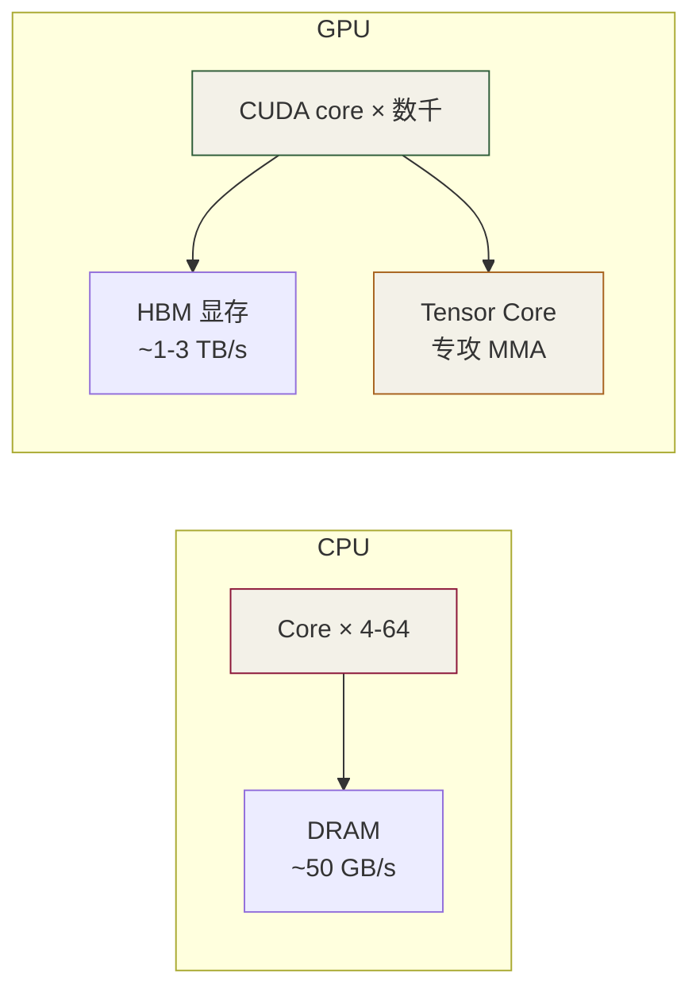

# 第 1 章 · 导论与环境
---

> 本文源页面：<https://jwzheng96.github.io/learn-cuda-from-scratch/ch01-intro/index.html>


⏱️ 预计 30 分钟 🎯 跑通 deviceQuery 📂 code/ch01_intro/

## 学习目标

  * 明白 GPU 与 CPU 的根本差异（"很多笨工人" vs "几个聪明工人"）
  * 装好 CUDA Toolkit / 或者会用 Google Colab 替代
  * 第一次跑出自己 GPU 的 deviceQuery 输出，能解读每一行
  * 测出本机的内存拷贝带宽（H2D / D2H / D2D），知道为什么以后要用 pinned memory

## 前置知识

会用 gcc/clang 编译 C++17 程序；能在终端里运行 `make`；理解什么是堆栈和指针。**不需要** 任何 GPU / 并行编程经验。

## 1.1 为什么是 CUDA？

大模型推理本质上是一连串**巨大的矩阵乘 + 元素级运算** 。 CPU 一次处理几路（4~64 线程），GPU 一次能并行处理几万路。 以 NVIDIA A100 为例：6912 个 CUDA core + 432 个 Tensor Core， 理论 fp16 算力 312 TFLOPS，是顶级桌面 CPU 的 100 倍以上。



关键差距不只在"核数"，更在**内存带宽** ：A100 的 HBM2e 带宽 ~1.5 TB/s，是 DDR5 内存的 30 倍。 LLM 推理是访存瓶颈主导的工作负载（小 batch 下尤其明显），这是为什么 GPU 是必需品。

## 1.2 环境准备（三选一）

### 方式 A · Google Colab（推荐初学者，免费）

  1. 打开 [colab.research.google.com](<https://colab.research.google.com>)
  2. 菜单：Runtime → Change runtime type → Hardware accelerator: **T4 GPU** → Save
  3. 新建 cell，运行 `!nvidia-smi`，看到 T4 16GB 即成功
  4. 克隆[本仓库](https://github.com/jwzheng96/learn-cuda-from-scratch.git)（替换为你的 fork）：

```
!git clone https://github.com/YOUR/ops.git
%cd /content/ops
!make -C code/ch01_intro ARCH=sm_75 run
```

### 方式 B · 本地 Linux + NVIDIA GPU

```
# Ubuntu 22.04 为例
sudo apt update
sudo apt install -y nvidia-driver-535     # 重启后生效
sudo apt install -y cuda-toolkit-12-4     # 包含 nvcc
echo 'export PATH=/usr/local/cuda/bin:$PATH' >> ~/.bashrc
source ~/.bashrc

# 验证
nvcc --version
nvidia-smi
```

### 方式 C · Docker（GPU 已可见）

```
docker run --gpus all -it -v $PWD:/work \
  nvcr.io/nvidia/cuda:12.4.1-devel-ubuntu22.04 bash
# 容器内：cd /work && make -C code/ch01_intro run
```

**⚠️ macOS / Apple Silicon：** Apple 在 2018 年后已停止支持 NVIDIA 显卡，本机无法跑 CUDA。 请用方式 A（Colab）或方式 C（远程 Linux + Docker）。 不过本仓库的 HTML 教程在任何系统上都能读，`code/common/cpu_ref.h` 里的 CPU 实现也能本机运行验证算子正确性。

## 1.3 第一个程序：deviceQuery

每个学 CUDA 的人写的第一个程序，是**问 GPU 自我介绍** 。源码： [code/ch01_intro/device_query.cu](<https://github.com/jwzheng96/learn-cuda-from-scratch/blob/main/code/ch01_intro/device_query.cu>)。 关键 API 是 `cudaGetDeviceProperties()`，它把 GPU 的 100+ 项硬件参数填到一个 `cudaDeviceProp` 结构体里。

### 核心代码

```
cudaDeviceProp p{};
CUDA_CHECK(cudaGetDeviceProperties(&p, /*device=*/0));

std::printf("GPU 0: %s\n", p.name);
std::printf("  SM count           : %d\n", p.multiProcessorCount);
std::printf("  Max threads / SM   : %d\n", p.maxThreadsPerMultiProcessor);
std::printf("  Shared mem / block : %zu B\n", p.sharedMemPerBlock);
std::printf("  Global memory      : %.2f GiB\n",
            p.totalGlobalMem / double(1ull << 30));

// 实测带宽（DDR -> ×2）
double bw = 2.0 * p.memoryClockRate * 1e3 * (p.memoryBusWidth / 8.0) / 1e9;
std::printf("  Peak bandwidth     : %.1f GB/s\n", bw);
```

### 编译与运行

```
cd code/ch01_intro
make ARCH=sm_75    # T4
./device_query
```

### 典型输出（T4）

```
CUDA driver:  12.2
CUDA runtime: 12.4
Devices:      1

============================================================
GPU 0: Tesla T4
  Compute capability : 7.5  (sm_75, Turing)
  SM count           : 40
  Max threads / block: 1024
  Max threads / SM   : 1024  (= 32 warps)
  Warp size          : 32
  Registers / SM     : 65536 (32-bit)
  Shared mem / block : 49152 B
  Shared mem / SM    : 65536 B
  Global memory      : 14.56 GiB
  L2 cache           : 4096 KiB
  Peak bandwidth     : 320.0 GB/s

```

逐行解读这些数字：

  * **SM count = 40** ：T4 上有 40 个独立的"小处理器"。你写的 kernel 会被切成块，分发到这 40 个 SM 上并行执行。
  * **Max threads / SM = 1024 = 32 warps** ：每个 SM 同时驻留最多 32 个 warp（每 warp 32 thread）。GPU 通过快速切换 warp 来"隐藏内存延迟"——这是性能的关键。
  * **Shared mem / block = 48 KB** ：每个 block 可用 48 KB 的片上 SRAM，速度比 global memory 快 ~100×。第 5-6 章会专门讲怎么用好它。
  * **Peak bandwidth = 320 GB/s** ：再快的 kernel 也跑不过这个带宽。后面用 Nsight 看 roofline 时这是横轴的"屋顶"。

## 1.4 第二个程序：内存带宽实测

源码：[bandwidth_estimate.cu](<https://github.com/jwzheng96/learn-cuda-from-scratch/blob/main/code/ch01_intro/bandwidth_estimate.cu>)。 它做三组对照： **pageable H2D** （普通 malloc 出来的主机内存 → 显存）、 **pinned H2D** （cudaMallocHost 的页锁定内存 → 显存）、 **D2D** （显存内拷贝）。

```
// pinned (page-locked) host buffer：DMA 不需先复制到内核缓冲
char* h_pinned = nullptr;
CUDA_CHECK(cudaMallocHost(&h_pinned, bytes));

t.start();
CUDA_CHECK(cudaMemcpy(d_buf, h_pinned, bytes, cudaMemcpyHostToDevice));
t.stop();
```

预期结果（T4，64MB payload）：

transfer| 带宽| 说明
---|---|---
H2D pageable| ~6 GB/s| 受 PCIe 3.0 + 内核中转拖累
H2D pinned| ~12 GB/s| 接近 PCIe 3.0 x16 物理上限 16 GB/s
D2D| ~250 GB/s| 走 HBM，比 H2D 快 20–40 倍

**💡 启示：** 数据一旦上了显存就别再下来。 LLM 推理时，权重一次性 H2D 之后常驻显存；只有 prompt token id 和 logits 走 H2D/D2H，因为它们小到可以忽略带宽。

## 1.5 自检清单

Q1: 为什么不能用 CPU 跑 GPT-2？

能跑，但慢得无法接受。GPT-2 small 一次前向需要 ~250M FLOPs × 模型层数，在 CPU 上单 token 生成需要几百毫秒；GPU 上 < 10 毫秒。差距随模型规模扩大而加剧（GPT-4 在 CPU 上不可用）。

Q2: T4 有 2560 个 CUDA core，是不是同时跑 2560 个线程？

更微妙。T4 有 40 SM × 64 CUDA core = 2560 个 ALU 单元。但**同时驻留** 的线程可以达到 40 × 1024 = 40960 个；硬件用快速 warp 切换来填满 ALU。这就是 GPU 隐藏延迟的核心机制。

Q3: 为什么 pinned memory 比 pageable 快一倍？

pageable 内存可能被 OS 换出。CUDA 需要先把它复制到一块内核拥有的 "staging buffer" 才能 DMA 给 GPU。pinned 内存被锁在物理内存中，DMA 直接读取，少一次拷贝。代价：pinned 占用宝贵的物理内存。

Q4: `cudaGetDeviceProperties` 报告的 `memoryClockRate` 单位是什么？

千赫兹 (kHz)。所以 5001000 表示 5.001 GHz。带宽公式 `2 × clock × bus_width / 8` 里要把 kHz × 1e3 转成 Hz。

Q5: 我看到 `sharedMemPerBlock = 48 KB`，但 `sharedMemPerMultiprocessor = 64 KB`，差在哪？

SM 上的 SRAM 总量是 64 KB（甚至 100 KB+ 在 A100 上），默认每个 block 最多用 48 KB；如果你显式开 dynamic shared memory 并调用 `cudaFuncSetAttribute(..., cudaFuncAttributeMaxDynamicSharedMemorySize, N)`，可以用到更多——但会限制 SM 上同时驻留的 block 数。

## 1.6 练习

  1. **cores per SM 表** ：参考 `code/ch01_intro/exercises/01_cores_per_sm_starter.cu`，补全函数 `cores_per_sm()`，让程序能打印 "总 CUDA core 数 = SM 数 × cores/SM"。
答案见 `_solution.cu`。
  2. **带宽测量** ：用不同 payload (`--MB=1, 4, 16, 64, 256`) 跑 `bandwidth_estimate`，画出 "payload vs 带宽" 曲线。你会发现小 payload 下带宽急剧下降——原因？（提示：固定延迟摊销到的字节数变少。）
  3. **查阅** ：在 [CUDA 维基](<https://en.wikipedia.org/wiki/CUDA>) 找出你 GPU 对应的 SM 架构发布年份和 Tensor Core 代际，记在自己的笔记里。

## 1.7 工业实战：选 GPU、上多卡、看监控

学到这里你能用一张 GPU 跑 hello world。生产环境还要回答四个问题：**选哪张卡、怎么上多卡、跑起来怎么监控、用云还是自建** 。

### 1.7.1 GPU 选型矩阵（2025 行情）

NVIDIA 把 GPU 分两条产品线：**数据中心卡** （Tesla 系，被动散热、ECC、NVLink）和**消费卡** （GeForce 系，主动散热、无 NVLink、不允许商用数据中心部署）。

卡| SM 架构| 显存| HBM 带宽| fp16+TC 算力| 定价（小时）| 典型场景
---|---|---|---|---|---|---
T4| sm_75 Turing| 16 GB| 320 GB/s| 65 TFLOPS| $0.35| Colab 免费 / 轻量推理
L4| sm_89 Ada| 24 GB| 300 GB/s| 121 TFLOPS| $0.8| 边缘推理 / 视频
L40S| sm_89 Ada| 48 GB| 864 GB/s| 362 TFLOPS| $1.5| 中等模型推理
A10| sm_86 Ampere| 24 GB| 600 GB/s| 125 TFLOPS| $1.0| 13B 推理
A100 40G / 80G| sm_80 Ampere| 40/80 GB| 1.5/2.0 TB/s| 312 TFLOPS| $2-4| 训练 / 70B 推理
H100 80G| sm_90 Hopper| 80 GB| 3.4 TB/s| 989 TFLOPS (+ TMA)| $4-8| 大模型训练 / 175B+ 推理
H200 141G| sm_90 Hopper| 141 GB| 4.8 TB/s| 989 TFLOPS| $8-10| 超大模型，显存敏感
B100 / B200| sm_100 Blackwell| 192 GB| 8 TB/s| ~2200 TFLOPS| —| 2025+ 最新
RTX 4090| sm_89 Ada| 24 GB| 1 TB/s| 330 TFLOPS| $0.5（自建）| 个人研究 / 不能商用 DC

### 决策口诀

  * **显存优先级 ≥ 算力** ：LLM 推理大多 memory-bound，显存装不下模型一切归零。70B fp16 ≈ 140 GB，最少 2×A100-80G 或 1×H200。
  * **带宽优先级 ≥ 算力** ：decode 阶段瓶颈是 HBM 带宽。H100 算力是 A100 的 3×，但 7B 模型 decode 也就快 2×（带宽差距 2.3×）。
  * **训练就上 H100/A100** ，消费卡禁不起多日满负载、NVLink 缺失导致多卡互联慢 5-10×。
  * **边缘推理用 L4/T4** ，功耗低、形态紧凑、TC 算力足够。

### 1.7.2 多 GPU 互联：NVLink vs PCIe vs IB

训练大模型时多 GPU 间数据交换量巨大（每步几 GB），互联带宽直接决定吞吐。

互联| 带宽（双向）| 延迟| 典型场景
---|---|---|---
PCIe Gen4 x16| ~64 GB/s| ~1 μs| 消费机、L4 服务器
PCIe Gen5 x16| ~128 GB/s| ~1 μs| H100 PCIe 版
NVLink 4 (H100 SXM)| 900 GB/s| ~200 ns| H100 8-GPU 服务器
NVLink 5 (B100/B200)| 1.8 TB/s| ~200 ns| 2025+
InfiniBand HDR/NDR| 200/400 Gb/s| ~2 μs| 多节点训练

**判断你的卡有没有 NVLink** ：

```
nvidia-smi topo -m       # 看 GPU 之间的连接拓扑
# 输出 NV4 / NV8 = NVLink (好); SYS / PHB = 走 PCIe (慢)
```

多卡通信库永远走 **NCCL** （all-reduce / all-gather / reduce-scatter / broadcast 等集合通信）。`torch.distributed` 和 vLLM 的 tensor/pipeline parallel 都基于它。第 8 章的 stream 与第 14 章的扩展任务会用到。

### 1.7.3 生产监控：nvidia-smi + DCGM

跑生产任务必须监控 GPU 状态。常用命令：

```
# 实时刷新基本状态 (温度、功耗、显存、利用率)
nvidia-smi -l 1

# 进程级显存占用 + GPU 利用率
nvidia-smi --query-compute-apps=pid,process_name,used_memory --format=csv

# 持续监控的工程化方案 (NVIDIA DCGM)
dcgmi dmon -e 1001,1002,1003,203,150
#  1001 = GR engine active   1002 = SM active   1003 = SM occupancy
#   203 = mem util           150  = mem copy util

# 拉到 Prometheus / Grafana
docker run -d --gpus all -p 9400:9400 nvcr.io/nvidia/k8s/dcgm-exporter
curl localhost:9400/metrics  # OpenMetrics 格式
```

### 看 nvidia-smi 时关注这 4 个指标

  * **GPU-Util** ：SM 在跑 kernel 的时间百分比。**陷阱** ：100% 不代表算力跑满，它只表示"有 kernel 在跑"。一个 GEMV kernel 也能让 GPU-Util = 100% 但实际 5 TFLOPS。要看 Tensor Active% (Nsight)。
  * **Memory-Usage** ：显存占用。LLM 推理常见 90%+ 占用，正常；如果跟踪显示线性增长就是泄漏。
  * **Power** ：vs 卡上限 (TDP)。长期低于 60% TDP 说明在等数据（mem-bound）或在等 launch（小 kernel）。
  * **Temp** ：超过 85°C 会自动降频，性能掉 10-20%。机房空调或风扇问题。

### 1.7.4 云 vs 自建：成本现实

方案| $/H100-hour| 启动时间| 适合
---|---|---|---
AWS / GCP / Azure 大厂| $8-12| 分钟| burst 训练、客户合规要求
Lambda / RunPod / CoreWeave| $2-5| 分钟| 个人研究、长跑训练
vast.ai / 二手算力市场| $1-3| 分钟| 实验、个人 LLM 调优
自建 (DIY 8×H100 服务器)| ~$1（折旧 3 年）| 无| 持续 > 50% 占用率才划算

**简单算账** ：H100 服务器整机 ~$30 万，3 年折旧 + 电费 = ~$1.4/小时。如果 GPU 利用率 < 30% 就比租云更贵。中小团队建议租云直到摸清需求量。

### 1.7.5 环境陷阱 5 连发

  1. **驱动版本 vs CUDA Toolkit 版本不匹配** ：每个 CUDA Toolkit 要求最低驱动版本。`nvcc --version` 是 Toolkit，`nvidia-smi` 顶部 "Driver Version: 535.xx / CUDA Version: 12.2" 是**驱动支持的最高 CUDA** ，不是实际 Toolkit。混淆是新手第一大坑。
  2. **CUDA_VISIBLE_DEVICES 改变物理 ID 顺序** ：默认按 PCI bus ID 排序，跟 `nvidia-smi` 顺序不一定相同。多卡训练时容易把同一张卡当作两张。设 `CUDA_DEVICE_ORDER=PCI_BUS_ID` 强制对齐。
  3. **MIG (Multi-Instance GPU)** ：A100/H100 可以切成 7 个独立小 GPU 跑多租户，每片有独立 SM 和显存。但同一时刻只能选"全卡"或"分片"模式。误开 MIG 后程序看到的算力是 1/7，很多人调试半天没头绪。`nvidia-smi -mig 0` 关闭。
  4. **容器里看到的 GPU 数 ≠ 物理数** ：docker 用 `--gpus '"device=0,1"'` 限制可见。K8s 用 `nvidia.com/gpu: 2` resource。两者都通过 NVIDIA Container Toolkit 实现 isolation。
  5. **ECC 开启时显存少 ~6%** ：A100-80G 实际可用 ~76 GB（ECC 校验位占空间）。生产推理通常关 ECC 换更多显存：`nvidia-smi -e 0` 然后重启。代价：极小概率单 bit 翻转不被检测——不重要的推理可以接受，训练绝对不行。

## 1.8 研究前沿（2025-2026）

### 1.8.1 Blackwell 时代：B100 / B200 / GB200 NVL72

2025 年开始 NVIDIA Blackwell 大规模出货，把"训练 / 推理大模型"的硬件单位从单卡升到**整柜** 。

形态| GPU 数| fp4 算力| HBM 总量| 互联| 典型场景
---|---|---|---|---|---
B100 (PCIe)| 1| ~7 PF| 192 GB HBM3e| PCIe Gen5| tower 推理
B200 (SXM)| 1| ~10 PF| 192 GB HBM3e| NVLink 5| 训练 + 推理
GB200 Grace+Blackwell| 1 GPU + 1 Grace CPU| 10 PF| 192 GB GPU + 480 GB LPDDR5X| NVLink-C2C| 超大模型推理
GB200 NVL72| 72 (= 36 GB200)| 1.4 EF (fp4)| 13.8 TB HBM| NVLink switch 全互联| 千亿模型一柜推理
B300 (2025 末)| 1| ~15 PF| 288 GB HBM3e| NVLink 5| 推理优化版

**关键概念变化** ：NVL72 把 72 张 GPU 通过 NVSwitch 全连成"一台逻辑 GPU"，**跨卡带宽达 1.8 TB/s** （接近单卡 HBM 带宽）。这让 TP=72 成为可能，1.8T 参数模型可以塞进一柜推理。

### 1.8.2 FP4 / NVFP4 / MXFP4 — 推理新单位

Blackwell 推理硬件原生支持 4-bit 浮点。NVIDIA 力推三种格式：

  * **NVFP4 (E2M1)** ：1 sign + 2 exp + 1 mantissa，配 per-block fp8 scale (block=16)。NVIDIA 优选格式，推理精度损失 < 1%
  * **MXFP4 (E2M1)** ：开放标准 (OCP MX)，配 E8M0 scale (block=32)。精度略差但跨厂商通用
  * **MXFP6 (E3M2 / E2M3)** ：6-bit 中间档，激活用

性能跳跃：fp16 → fp8 → fp4 每步算力翻倍。B200 上 LLM 推理吞吐相比 H100 fp8 再增 2-3 倍。

### 1.8.3 模型规模与新范式（2024-2026）

模型| 规模| 关键创新| 发布
---|---|---|---
Llama 3.1 405B| 405B dense| 开源 SOTA dense，长 context 128K| 2024.07
DeepSeek-V3| 671B MoE (37B 激活)| 原生 FP8 训练 + MLA + DeepSeekMoE + MTP| 2024.12
DeepSeek-R1| 671B (同 V3)| 纯 RL reasoning, o1-级性能开源| 2025.01
Llama 4 Behemoth / Maverick| 2T / 400B MoE| 多模态原生, 10M context| 2025
Qwen 3 系列| ~32B / 235B MoE| 中文 SOTA, 思考链开源| 2025
OpenAI o1 / o3 / GPT-5| 未知| test-time compute, 大量 token 推理| 2024-2025
Anthropic Claude 3.5/4| 未知| computer use, agentic| 2024-2025
Gemini 2.0/2.5 Pro| 未知| 原生 multimodal + 2M context| 2024-2025

**三个大趋势对硬件需求的影响** ：

  1. **MoE 主导** （DeepSeek-V3、Llama 4、Qwen 3）：参数量 10×，激活 1/3-1/10 → 需要**显存大 + Expert Parallelism** 。NVL72 完美匹配
  2. **长 context (1M-10M)** ：KV cache 显存爆炸 → 必须 PagedAttention + KV 量化 + 长 context attention 优化 (Ring/Stripe)
  3. **Reasoning models（o1 / R1 风格）** ：单个回答可能生成 10-100K 个 thinking token → 推理服务的 **decode 吞吐** 变得比 prefill 还关键

### 1.8.4 推理硬件性价比新格局（2026）

硬件| 定价 / 小时| fp8 / fp4 算力| 适合
---|---|---|---
RTX 5090 (Blackwell 消费级)| ~$0.7 (DIY)| ~3 PF fp4| 本地 70B 推理
L40S (旧 Ada)| ~$1.5| 362 TF fp16| 13B 边缘服务
H200 (Hopper)| ~$3-5| 989 TF fp16| 2024 主流
B200 (Blackwell)| ~$6-10| 10 PF fp4| 2025-26 主流
GB200 NVL72 (整柜)| ~$300+/小时| 1.4 EF| 训练大模型 / 千亿推理
AMD MI300X / MI325X| ~$3-5| 1.3 PF fp16| 显存 192-256 GB，长 context 友好
Google TPU v5p / v6 Trillium| 云独占| ~459 TF bf16| Google 内部 + GCP

2026 现实：**AMD 和 TPU 真正成为 NVIDIA 的竞争对手** （之前只是替代）。Meta、Microsoft、Google 都在大规模部署非 NVIDIA 推理硬件，主要因为 NVIDIA 供货紧 + 单价高。但 CUDA 生态仍是不可替代的研发起点。

### 1.8.5 学习建议（2026 视角）

  * **仍然先学 CUDA** ，因为 ROCm/MLIR/TPU 接口都是它的"方言"
  * 用 H100 或 H200 入门生产级实战；条件允许直接上 B200
  * FlashAttention v3 / FlashMLA / ThunderKittens 是 2025 后的必读源码
  * DeepSeek-V3 技术报告对理解"原生 FP8 训练 + MoE + MLA + 长 context"四合一极有价值
  * 关注 Triton / CUTLASS 3.x CuTe DSL — 未来 5 年的 kernel 开发语言

## 1.9 常见坑

  * `nvcc: command not found` → CUDA Toolkit 没装或没加 PATH。`export PATH=/usr/local/cuda/bin:$PATH`。
  * `CUDA driver version is insufficient for CUDA runtime version` → 驱动太旧，升级 NVIDIA 驱动到 R535+。
  * Colab 跑出来发现没 GPU → 大概率是没切到 GPU runtime，重新 Runtime → Change runtime type。
  * 编译报错 `unsupported gpu architecture 'compute_xx'` → ARCH 参数写错了，按你的 GPU 改 (T4 → sm_75, A100 → sm_80, 4090 → sm_89)。

## 下一步

环境就绪后，第 2 章我们写真正的第一个 kernel，理解 `<<<grid, block>>>` 这个看起来很怪的语法到底在干什么。
