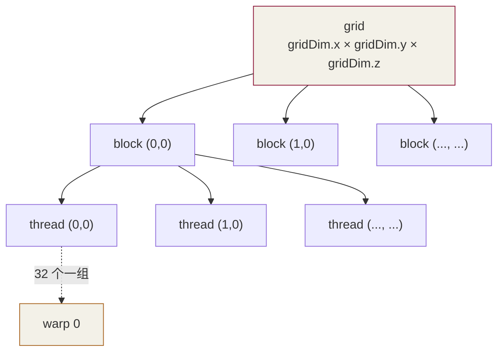

# 第 3 章 · 线程模型与索引

⏱️ 45 分钟  🎯 写出 vec_add 与 mat_add  📂 code/ch03_threads/

## 学习目标

  * 背熟 1D 索引公式：`i = blockIdx.x * blockDim.x + threadIdx.x`
  * 把 2D 任务映射到 2D grid + 2D block
  * 处理"总元素数不是 block 维度整数倍"的边界情况
  * 掌握 网格步长循环：用固定 grid 处理任意大数组

## 3.1 线程层级回顾



层级| 大小| 共享的资源| 同步原语
---|---|---|---
thread| 1| 寄存器（私有）| —
warp| 32| 硬件 lock-step 执行| 隐式
block| ≤ 1024| shared memory、L1| `__syncthreads()`
grid| 可达数十亿| global memory| kernel 启动之间

## 3.2 索引映射公式

这一节会把所有缩写讲清楚。每个 thread 在 kernel 里都需要知道"我是谁、负责处理哪一段数据"，靠的就是 CUDA 提供的 5 个只读内置变量。

### 3.2.1 五个内置变量是什么？

kernel 启动时你写两个东西：**grid 大小** （一共多少个 block）+ **block 大小** （每个 block 里多少个 thread）。CUDA 在每个 thread 里塞进 5 个变量，让它能反推自己的位置：

```
// 假设启动：
my_kernel<<<4, 8>>>();   // grid 有 4 个 block, 每 block 8 个 thread, 总共 32 thread
```

变量| 类型| 含义| 本例的值
---|---|---|---
`gridDim.x`| unsigned int| grid 在 x 方向有多少个 block| 4（每个 thread 都一样）
`blockDim.x`| unsigned int| block 在 x 方向有多少个 thread| 8（每个 thread 都一样）
`blockIdx.x`| unsigned int| "我"所在 block 在 grid 里的编号| 0、1、2 或 3
`threadIdx.x`| unsigned int| "我"在自己 block 里的编号| 0..7
`warpSize`| const int| warp 大小，恒为 32| 32

**记忆方法** ：

  * `...Dim` 是**规模** （多大）→ 每个 thread 看到的都一样
  * `...Idx` 是**编号** （我是第几个）→ 每个 thread 不同
  * `grid...` 关于 block 数量；`block...` 关于 thread 数量
  * `.x .y .z` 是**三个独立的维度** （dim3 结构体的三个字段），如果只用 1D，`.y` 和 `.z` 都自动等于 1 或 0

### 3.2.2 1D 索引：最常用

"1D"指的是 grid 和 block 都只用 x 维度，把 thread 拍扁成一条直线。下图是 `<<<4, 8>>>` 启动后 32 个 thread 的排布：

```
block 0:  [T0  T1  T2  T3  T4  T5  T6  T7]   ← blockIdx.x=0
block 1:  [T0  T1  T2  T3  T4  T5  T6  T7]   ← blockIdx.x=1
block 2:  [T0  T1  T2  T3  T4  T5  T6  T7]   ← blockIdx.x=2
block 3:  [T0  T1  T2  T3  T4  T5  T6  T7]   ← blockIdx.x=3
           ↑                           ↑
           threadIdx.x=0               threadIdx.x=7

希望的 gid (global id) :
block 0:   0   1   2   3   4   5   6   7
block 1:   8   9  10  11  12  13  14  15
block 2:  16  17  18  19  20  21  22  23
block 3:  24  25  26  27  28  29  30  31
```

规律：block `k` 的 thread `t` 对应 gid = `k × 8 + t`。把 "8" 换成 `blockDim.x`（block 多大）：

```
int gid = blockIdx.x * blockDim.x + threadIdx.x;
//        ─────────────────────────   ───────────
//        前面有几个 block × 每个多大   再加上 block 内的位置
//        (= 前面已经"用掉"几个 gid)    (我在 block 内排第几)
```

**具体例子** ：

blockIdx.x| blockDim.x| threadIdx.x| gid 计算| gid
---|---|---|---|---
0| 8| 5| 0×8 + 5| 5
2| 8| 3| 2×8 + 3| 19
3| 8| 7| 3×8 + 7| 31

把 `gid` 当成"我要处理数组的第几号元素"，就能写 vec_add：`c[gid] = a[gid] + b[gid]`。

### 3.2.3 为什么还要 2D / 3D？

纯粹是**写代码方便** 。1D 也能处理矩阵（手动 row×cols+col 算），但 2D 让坐标自动浮现。维度只影响内置变量怎么编号，**硬件并不在乎** ——总线程数 = `gridDim.x × gridDim.y × gridDim.z × blockDim.x × blockDim.y × blockDim.z`。

维度| 常见用途| 例子
---|---|---
1D| 数组、向量、token 序列| vec_add、softmax 每行
2D| 矩阵、图像、attention scores| matmul、卷积、transpose
3D| 体数据、多 head 多 token| 3D 卷积、医学影像、batched attention

### 3.2.4 2D 索引推导

2D 启动语法：

```
dim3 block(16, 16);                       // 每 block 16×16 = 256 thread
dim3 grid((N + 15) / 16, (M + 15) / 16);  // 多少 block 才能盖住 M×N 矩阵
my_kernel<<<grid, block>>>(...);

// 在 kernel 内:
// gridDim.x = (N+15)/16,  gridDim.y = (M+15)/16
// blockDim.x = 16,        blockDim.y = 16
// blockIdx.x ∈ [0, gridDim.x),  blockIdx.y ∈ [0, gridDim.y)
// threadIdx.x ∈ [0, 16),        threadIdx.y ∈ [0, 16)
```

下图是一个 grid（2×2 个 block，每 block 是 2×2 thread，共 16 thread）的排布。每个小方格是一个 thread：

```
           blockIdx.x=0           blockIdx.x=1
         ┌─────┬─────┐         ┌─────┬─────┐
blockIdx │tx=0 │tx=1 │         │tx=0 │tx=1 │   ← threadIdx 是 block 内坐标
 .y=0    │ty=0 │ty=0 │         │ty=0 │ty=0 │
         ├─────┼─────┤         ├─────┼─────┤
         │tx=0 │tx=1 │         │tx=0 │tx=1 │
         │ty=1 │ty=1 │         │ty=1 │ty=1 │
         └─────┴─────┘         └─────┴─────┘
         ┌─────┬─────┐         ┌─────┬─────┐
blockIdx │ ...                                │   ← y=1 的两个 block
 .y=1    │
         └─────┴─────┘         └─────┴─────┘

全局坐标 (col, row) 想要的是:
(0,0) (1,0) | (2,0) (3,0)
(0,1) (1,1) | (2,1) (3,1)
─────────────────────────
(0,2) (1,2) | (2,2) (3,2)
(0,3) (1,3) | (2,3) (3,3)
```

把 1D 的公式套到两个维度上：

```
int col = blockIdx.x * blockDim.x + threadIdx.x;   // 全局 x 坐标 ∈ [0, N)
int row = blockIdx.y * blockDim.y + threadIdx.y;   // 全局 y 坐标 ∈ [0, M)
```

**⚠️ x ↔ col、y ↔ row 是 CUDA 的约定。** 看似随意，实则关乎性能：warp 是按 `threadIdx.x` 变化最快的方式打包 32 个 lane 的。让 `.x` 走 col → 同一 warp 内 32 个 lane 访问**同一行的相邻 32 列** → 内存连续 → coalesced。反过来让 `.x` 走 row 会让 warp 跳着访问，性能掉 10× 以上（第 5 章细讲）。

### 3.2.5 (row, col) → 一维内存索引

关键认知：**C/C++ 里的二维数组在内存中是一维存储的** ，按 行优先顺序排：先把第 0 行全部存完，再存第 1 行……

```
矩阵 A (M=3 行, N=4 列):
     列: 0   1   2   3
行 0:    A00 A01 A02 A03
行 1:    A10 A11 A12 A13
行 2:    A20 A21 A22 A23

在内存里实际是一个长度 12 的数组:
idx:    0   1   2   3   4   5   6   7   8   9   10  11
flat:  A00 A01 A02 A03 A10 A11 A12 A13 A20 A21 A22 A23
       └─── 行 0 ───┘ └─── 行 1 ───┘ └─── 行 2 ───┘
```

所以 (row, col) → idx 的公式：

```
int idx = row * cols + col;
//        ─────────   ───
//        跳过前 row    再加本行内
//        整行 (每行     的列位置
//        cols 个元素)
```

**具体例子** （M=3 行 N=4 列）：

(row, col)| idx = row × 4 + col| 对应元素
---|---|---
(0, 0)| 0| A00
(0, 3)| 3| A03
(1, 0)| 4| A10
(2, 3)| 11| A23

### 3.2.6 3D 索引推导

3D 用于**体数据** ——比如视频 (帧, 高, 宽)、医学 CT (深度, 高, 宽)、3D 卷积。约定：

  * `x` ↔ W (width，宽度，最快变化的维度)
  * `y` ↔ H (height，高度)
  * `z` ↔ D (depth，深度，最慢变化的维度)

```
// kernel 内三个全局坐标
int x = blockIdx.x * blockDim.x + threadIdx.x;   // 0 .. W-1
int y = blockIdx.y * blockDim.y + threadIdx.y;   // 0 .. H-1
int z = blockIdx.z * blockDim.z + threadIdx.z;   // 0 .. D-1
```

三维 row-major 内存布局——按 z 最慢、y 居中、x 最快变化的顺序排：

```
体数据 shape = (D=2, H=3, W=4) 共 24 个元素

z=0 层 (3×4):              z=1 层 (3×4):
  V[0,0,0] V[0,0,1] ...     V[1,0,0] V[1,0,1] ...
  V[0,1,0] V[0,1,1] ...     V[1,1,0] ...
  V[0,2,0] ...              V[1,2,0] ...

内存里:
idx:     0..3      4..7      8..11   |  12..15    16..19    20..23
flat:  z=0,y=0 |  z=0,y=1 |  z=0,y=2 | z=1,y=0 | z=1,y=1 | z=1,y=2
       └────── z=0 整层 (H*W=12) ────┘ └────── z=1 整层 ──────┘
```

```
int idx = (z * H + y) * W + x;
//      = z * (H * W) + y * W + x;
//        ──────────   ─────   ─
//        跳过 z 整层    跳过    本行内
//        (每层 H*W      本层    x 列
//         个元素)       内 y 行
//                       (每行 W
//                        个元素)
```

**具体例子** (D=2, H=3, W=4)：

(z, y, x)| idx 计算| idx
---|---|---
(0, 0, 0)| (0×3+0)×4 + 0| 0
(0, 2, 3)| (0×3+2)×4 + 3| 11
(1, 0, 0)| (1×3+0)×4 + 0| 12
(1, 2, 3)| (1×3+2)×4 + 3| 23

### 3.2.7 通用记忆口诀

不论几维，多维数组在 row-major 内存里的索引公式都是**"从最慢变的维度向最快变的维度逐层乘进去"** ：

```
shape = (d_0, d_1, d_2, ..., d_n)  // d_0 最慢, d_n 最快
idx   = (((i_0 * d_1 + i_1) * d_2 + i_2) * d_3 + ... ) * d_n + i_n
```

1D / 2D / 3D 都是这个公式的特例：

```
1D: idx = i
2D: idx = i * cols + j               = (i) * cols + j
3D: idx = (z * H + y) * W + x        = ((z) * H + y) * W + x
4D: idx = ((b * D + z) * H + y) * W + x   // 多了 batch 维度
```

记住这一条，以后看 PyTorch / cuBLAS / FlashAttention 的张量布局都不会迷路。

### 3.2.8 跑代码看实际映射

跑 [thread_id_map.cu](<https://github.com/jwzheng96/learn-cuda-from-scratch/blob/main/code/ch03_threads/thread_id_map.cu>) 打印每个 thread 的 (blockIdx, threadIdx, warp_id, lane_id, gid)：

```
blk=0  tid= 0  warp=0  lane= 0  gid= 0
blk=0  tid= 1  warp=0  lane= 1  gid= 1
...
blk=0  tid=31  warp=0  lane=31  gid=31
blk=0  tid=32  warp=1  lane= 0  gid=32   ← 新 warp 开始 (每 32 thread 一个 warp)
blk=0  tid=33  warp=1  lane= 1  gid=33
...
blk=1  tid= 0  warp=0  lane= 0  gid=40   ← 新 block 重置 warp/lane，但 gid 接着涨
```

注意：**warp 和 lane 是 block 内的概念，每进入新 block 都重置** ；但 gid 是全局连续的。

## 3.3 向量加：边界与 grid-stride loop

源码：[vec_add.cu](<https://github.com/jwzheng96/learn-cuda-from-scratch/blob/main/code/ch03_threads/vec_add.cu>)。

### 版本 1：一线程一元素

```
__global__ void vec_add_v1(const float* a, const float* b, float* c, int n) {
    int i = blockIdx.x * blockDim.x + threadIdx.x;
    if (i < n) c[i] = a[i] + b[i];      // <-- 边界检查必须有
}

// host:
int block = 256;
int grid  = (N + block - 1) / block;     // 向上取整
vec_add_v1<<<grid, block>>>(a, b, c, N);
```

问题：N 巨大时 grid 也会巨大；某些老 GPU 上 grid 维度有上限（虽然现在 2³¹ 通常够用）。更好的写法是**固定 grid 大小，每线程处理多个元素** ：

### 版本 2：grid-stride loop

```
__global__ void vec_add_grid_stride(const float* a, const float* b, float* c, int n) {
    int tid    = blockIdx.x * blockDim.x + threadIdx.x;
    int stride = blockDim.x * gridDim.x;          // 总线程数
    for (int i = tid; i < n; i += stride)
        c[i] = a[i] + b[i];
}

// host:
vec_add_grid_stride<<<1024, 256>>>(a, b, c, N);   // 任意大 N 都能跑
```

**为什么 grid-stride loop 更受欢迎？** ① 解耦 grid 维度与数据大小，方便调 occupancy； ② kernel 启动开销摊薄（一次 launch 处理 4× 数据）； ③ 编译器更容易做循环展开、预取优化。

## 3.4 矩阵加：2D 索引

把上面公式套到 2D。源码：[matrix_add.cu](<https://github.com/jwzheng96/learn-cuda-from-scratch/blob/main/code/ch03_threads/matrix_add.cu>)。

```
__global__ void mat_add_2d(const float* A, const float* B, float* C, int M, int N) {
    int col = blockIdx.x * blockDim.x + threadIdx.x;
    int row = blockIdx.y * blockDim.y + threadIdx.y;
    if (row < M && col < N) {
        int idx = row * N + col;
        C[idx] = A[idx] + B[idx];
    }
}

// host:
dim3 block(16, 16);                                       // 256 threads/block
dim3 grid((N + block.x - 1) / block.x,
          (M + block.y - 1) / block.y);
mat_add_2d<<<grid, block>>>(A, B, C, M, N);
```

注意：x 维度对应 col、y 维度对应 row。原因是 warp 是按 `threadIdx.x` 变化最快的方式打包的—— 让 `x` 走 col 才能让同一 warp 内 32 个线程访问**相邻列** ，从而满足 coalescing（下章会细讲）。

## 3.5 block 大小怎么选？

经验法则（之后第 5、8 章会用 Nsight 验证）：

  * **1D：256 / 512** 通常是最佳起点
  * **2D：16×16 或 32×8** （都 = 256），方阵任务用 16×16
  * 必须是 32 的倍数（一个 warp 是 32）
  * 太小（< 64）→ warp 不满，浪费硬件
  * 太大（> 1024）→ 直接编译失败

## 3.6 自检清单

Q1: 为什么不直接用 N 个 block，每 block 1 个 thread？

warp 必须 32 个 thread 才能填满一次发射。1 thread / block 浪费 31/32 = 97% 的算力，性能崩塌。

Q2: 2D block 用 8×32 还是 32×8？

取决于你想让 warp 内的 32 个线程在哪个维度上连续。row-major 数据用 32×8（x = 32 → 列连续）才能 coalesce。

Q3: `(N + block - 1) / block` 这个公式干嘛？

整数除法的"向上取整"——比 `ceil(N / block)` 更准确（避开 float 误差），是 CUDA 代码里最常见的样板。

Q4: grid-stride loop 里 `stride = blockDim.x * gridDim.x`，为什么不算 z/y 维？

这个例子里只有 1D grid。如果是多维，stride 要乘上所有维度的乘积。多维 grid-stride 比较少用——一般直接展开成 1D。

Q5: kernel 内能用 STL（如 `std::sort`）吗？

不能。device 代码只支持 C++ 的**子集** （无异常、无虚函数指针逃逸、有限的 STL）。用 Thrust 或者 cub 提供的 device-side 容器。

## 3.7 练习

  1. [01_image_invert_starter.cu](<https://github.com/jwzheng96/learn-cuda-from-scratch/blob/main/code/ch03_threads/exercises/01_image_invert_starter.cu>)：写出灰度图反相 `y = 255 - x`。
  2. 改 `vec_add.cu` 的 block 大小为 32、64、128、256、512、1024，记录带宽。哪个最快？
  3. 实现 **3D 张量加** ：`D = A + B + C`，`A.shape = (D, H, W) = (16, 64, 128)`。

## 3.8 工业实战：block 选择、launch_bounds、批量 indexing

### 3.8.1 block 大小：production 选择速查

3.5 给了"256/512 是起点"的经验，工业上还需细分。下表是 production kernel 实测的常用配置：

kernel 类型| 典型 block| 原因
---|---|---
vec_add / element-wise| 256, 1D| 足够多 warp 隐藏访存
reduce / norm| 256 或 512, 1D| 多于 256 warp 间通信开销大
matmul (fp32)| 16×16 = 256, 2D| 方阵 tile 自然映射
matmul (fp16 + WMMA)| 128 (= 4 warp), 1D| 每 warp 算一个 16×16 fragment
FlashAttention| 128 (= 4 warp), 1D| 同上 + warp-level QK 计算
conv2d| 32×8 或 16×16| x 维 32 让 warp 沿宽度 coalesce
sampling / argmax (V=50K)| 256, 1D| 单 block reduce 够用

**四条铁律** ：

  1. **必是 32 的倍数** ——否则 warp 不满，浪费
  2. **2D 时 x 维至少 16 或 32** ——保证 warp 内访存连续
  3. **总 thread <= 1024**——硬上限
  4. **用 occupancy API 验证** ，不要靠猜

```
// 让 runtime 帮你选最优 block size (occupancy 最高)
int min_grid, best_block;
cudaOccupancyMaxPotentialBlockSize(
    &min_grid, &best_block, my_kernel, /*dynShm=*/0, /*blockLimit=*/0);
// best_block 是当前 kernel 在此 GPU 上的 occupancy-optimal 选择
```

### 3.8.2 `__launch_bounds__` — 让编译器替你优化

编译器默认假设 kernel 可能用最大 1024 thread/block，会保守限制寄存器使用。如果你已经知道实际不会超过 256，告诉它能让单 thread 用更多寄存器（提升 ILP）：

```
// 第 1 参数: 最大 thread/block (=blockDim 上限)
// 第 2 参数: 期望每 SM 至少驻留几个 block
__global__
__launch_bounds__(256, 4)              // 256 thread/block, 想驻留 4 block/SM
void my_kernel(...) { ... }
```

编译器据此分配寄存器（256×4 = 1024 thread/SM → 每 thread 最多 64 reg @A100）。 如果你的 kernel 用得太多触发 spill 到 local mem，**不加这个 hint 性能可能掉 30%** 。生产 kernel 几乎都加。

### 3.8.3 batched indexing（4D+）：LLM 张量布局基本功

LLM 推理张量通常是 4D 或 5D：

```
Q, K, V        : (Batch, n_Head, T, Dh)        // 4D
KV cache       : (n_Layer, Batch, n_Head, T_max, Dh)  // 5D
attention mask : (Batch, T_q, T_kv)            // 3D
```

套用 3.2.7 的通用公式（最慢 → 最快）：

```
// Q shape (B, H, T, Dh), 找元素 Q[b, h, t, d]
int idx = ((b * H + h) * T + t) * Dh + d;

// KV cache shape (L, B, H, T_max, Dh)
int idx = (((l * B + b) * H + h) * T_max + t) * Dh + d;
```

工业实践：把这些索引算法**封装成 inline device helper** ，kernel 里只调函数，减少出错：

```
struct QKVLayout {
    int B, H, T, Dh;
    __device__ int idx(int b, int h, int t, int d) const {
        return ((b * H + h) * T + t) * Dh + d;
    }
};

__global__ void rotate_q(float* Q, QKVLayout L) {
    int b = blockIdx.z, h = blockIdx.y, t = blockIdx.x;
    int d = threadIdx.x;
    int i = L.idx(b, h, t, d);
    /* ... */
}
```

### 3.8.4 一个真实 bug：T=2049 时多算一行

真实部署：某 LLM kernel 在 T=2048 时完美正常，T=2049 时输出末尾 NaN。原因：

```
// 错: T=2049, block=256 → grid=ceil(2049/256)=9, 总 thread=2304
// 最后 block 的部分 thread 不在 [0, T), 但 if 漏写
int t = blockIdx.x * blockDim.x + threadIdx.x;
out[t] = compute(...);     // <-- t 可以到 2303, 越界写

// 对:
if (t < T) out[t] = compute(...);

```

边界检查永远不要漏。**测试 size 不是 block 整数倍** 是 CI 必跑的 case（T=1, T=33, T=257, T=2049）。

### 3.8.5 grid 维度的硬上限

维度| 上限 (Compute Capability 3.5+)
---|---
gridDim.x| 2³¹ − 1 ≈ 2.1B
gridDim.y| 65535
gridDim.z| 65535
blockDim.{x,y,z}| 各 1024, 总积 ≤ 1024

实际碰得到的只有 `gridDim.y / z`。Batched matmul 时 B = batch_size，如果 B > 65535 会启动失败。**规避** ：把 batch 维放到 `gridDim.x`（容量大），或者用 grid-stride loop。

## 3.9 研究前沿（2025-2026）：CTA Cluster 与新线程层级

Hopper（sm_90）在 grid → block → thread → warp 之间又塞了一层 **CTA cluster** （也叫 thread block cluster），Blackwell（sm_100）保留并扩展。这是**2024 之后的 LLM kernel** 大量在用的新特性。

### 3.9.1 什么是 CTA Cluster

新的层级关系：

```
旧 (sm_80 及更早):     grid > block (= CTA) > warp > thread
新 (sm_90+):           grid > cluster > block > warp > thread

```

cluster 是**2-16 个 block 的组合** ，强制调度到同一 GPC（Graphics Processing Cluster，A100 有 7 个 GPC，H100 有 8 个）。cluster 内的 block 之间可以：

  * **共享 shared memory** （distributed shared memory, DSMEM）
  * **用 mbarrier 同步** （fine-grained barrier）
  * **互相用 cluster atomic**

本质：**把"shared memory 共享"的边界从 1 个 block 扩到 8-16 个 block** 。可用 shared 总量从 228 KB 单 SM 升到 ~2 MB（H100）。

### 3.9.2 启动 cluster 的代码

```
// 1) kernel 声明 cluster 大小（编译期）
__global__ void __cluster_dims__(2, 2, 1)
my_kernel(...) {
    namespace cg = cooperative_groups;
    cg::cluster_group cluster = cg::this_cluster();
    int cluster_rank = cluster.block_rank();        // 0..3 (这个 block 在 cluster 里第几)
    int cluster_size = cluster.num_blocks();        // 4

    // 用 cluster 内其他 block 的 shared memory
    extern __shared__ float smem[];
    float* peer_smem = cluster.map_shared_rank(smem, /*peer=*/1);
    peer_smem[0] = 42.0f;                            // 写到 block 1 的 shared!
    cluster.sync();                                  // cluster 级同步
}

// 2) host 侧也可以动态指定 cluster
cudaLaunchConfig_t config = {};
config.gridDim = grid;
config.blockDim = block;
cudaLaunchAttribute attr;
attr.id = cudaLaunchAttributeClusterDimension;
attr.val.clusterDim = {2, 2, 1};
config.attrs = &attr;  config.numAttrs = 1;
cudaLaunchKernelEx(&config, my_kernel, args...);
```

### 3.9.3 为什么 cluster 对 LLM 重要

FlashAttention v3 / FlashMLA / FlashInfer 等新一代 attention kernel 都用 cluster：

  * **Producer-Consumer warp specialization** ：cluster 内 1 个 block 做 load（producer），另几个 block 做 compute（consumer），通过 DSMEM 传递
  * **大 tile 突破 shared 上限** ：单 block shared 限 228 KB；cluster 4 block 可用 ~900 KB → 装得下 128×128 fp16 tile 三阶段流水
  * **同步开销低** ：cluster.sync() 比 grid sync 快几个数量级

### 3.9.4 Blackwell 的进一步演进

sm_100（Blackwell）改进：

  * **2-CTA cluster MMA** ：两个 block 协作完成一个 fp4 / fp8 大 MMA，跨 SM 流水
  * **Tensor Memory (TMEM)** ：每 SM 单独的 256 KB tensor 存储（独立于 shared），专为 MMA accumulator 设计
  * **UMMA / TCGEN05** ：新一代 MMA 指令族，吞吐再翻一倍

### 3.9.5 什么时候用 cluster

场景| 用 cluster?
---|---
普通 element-wise / GEMV| 不需要
普通 GEMM（M, N 都大）| 可选，收益 5-15%
FlashAttention v3+（H100）| **必须** ，warp specialization 需要
长 context（T > 32K）| 推荐，DSMEM 让 tile 更大
FA v4 / FlashMLA| **必须**
fp4 GEMM (Blackwell)| **必须** ，2-CTA MMA 强制 cluster

### 3.9.6 线程层级速查（2026 版）

```
┌─ grid (整个 kernel launch)
│  ├─ cluster (sm_90+, 2-16 blocks)            ← 新层级
│  │  ├─ block / CTA (≤ 1024 threads)
│  │  │  ├─ warp (32 threads, lockstep)
│  │  │  │  └─ thread
│  │  │  └─ ...
│  │  └─ ...
│  └─ ...
└─

每层级的**同步原语** :
  thread:   寄存器, 无需同步
  warp:     __shfl_sync / __syncwarp() / lockstep
  block:    __syncthreads() / cg::this_thread_block().sync()
  cluster:  cluster.sync() / mbarrier (Hopper+)
  grid:     kernel 启动边界 / cooperative launch + cg::this_grid().sync()
```

建议路径：本教程 Ch3-Ch12 重点学传统四层（grid/block/warp/thread），实战阶段（Ch12 FA + 实际项目）再补 cluster 层。

## 3.10 常见坑

  * 忘记边界 if → 越界写，cudaDeviceSynchronize 报 `illegal memory access`
  * block 维度写成 1024×1024 → 总线程数超 1024 上限，启动失败
  * 2D 索引 row/col 写反 → 性能正确但 cache miss 飙升（下章细讲）
