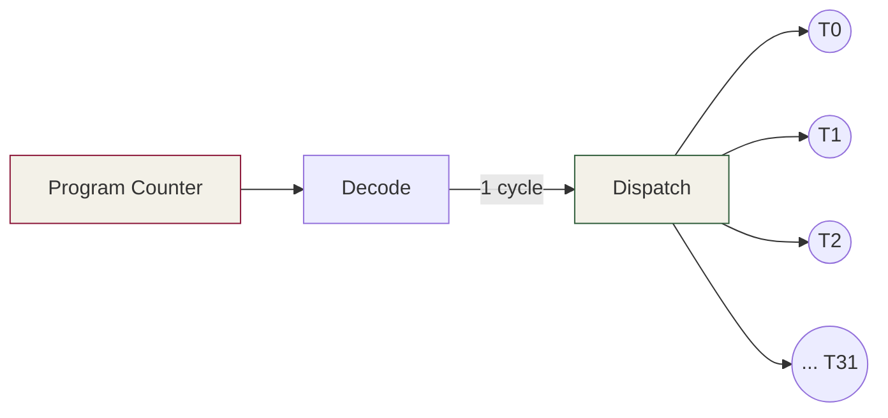

# 第 4 章 · GPU 硬件架构

⏱️ 50 分钟 🎯 看懂 SM 内部 📂 code/ch04_arch/

## 学习目标

  * 理解 SM 内部结构：CUDA core / Tensor Core / 寄存器堆 / shared mem
  * 掌握 SIMT 执行模型与 warp divergence
  * 明白什么是 占用率、什么因素决定占用率
  * 看完知道 Volta → Ampere → Hopper 在 Tensor Core 上的演进

## 4.1 SM 解剖图

A100 (Ampere) 上有 108 个 SM，每个 SM 内部长这样：


关键数字（A100 / sm_80）：

资源| 每 SM| 说明
---|---|---
FP32 CUDA core| 64| 每周期吐 64 个 FP32 FMA
FP64 CUDA core| 32| 科学计算用
Tensor Core| 4 (3rd gen)| 主战场：fp16/bf16/tf32/int8 矩阵乘
寄存器 (32-bit)| 65536| 所有驻留 thread 平分
Shared mem + L1| 192 KB| 可配置分割比例
Max threads| 2048 (64 warps)| 同时驻留的上限

## 4.2 SIMT 执行模型

SM 调度的最小单位不是 thread 而是 **warp = 32 个 thread** 。warp 内 32 个 thread**同步执行同一条指令** 但操作不同的数据（寄存器/内存地址）。这就是 SIMT (Single Instruction Multiple Threads)。



SM 同时持有多个 warp（最多 64 个）。每周期硬件挑一个 ready 的 warp 发射指令。 **当某个 warp 在等 global memory（几百周期），SM 切到别的 warp 干活** ——这就是"GPU 用并行隐藏延迟"。

## 4.3 Warp Divergence — 同 warp 走两条路

如果 warp 内 32 个 thread 走了 if/else 两支：

```
if (threadIdx.x & 1) {        // 偶数 lane 走 else，奇数 lane 走 if
    x = x * 2;
} else {
    x = x + 1;
}
```

硬件没办法同时执行两条不同的指令，所以它**串行** 跑两遍：先让走 if 的 lane 干活（else 的 lane 掩码屏蔽），再切到 else 的 lane。代价 = 两支的耗时之和。

实测：跑 [warp_divergence.cu](<https://github.com/jwzheng96/learn-cuda-from-scratch/blob/main/code/ch04_arch/warp_divergence.cu>)（T4 典型输出）：

```
uniform   (warp-aligned branch) : 5.412 ms
divergent (lane-aligned branch) : 10.873 ms
slowdown                        : 2.01x
```

差不多刚好 2 倍——因为两支几乎等长。如果 if 的工作量远大于 else，divergent 损失会更隐蔽（执行时间被 if 主导，不再是简单的 2×）。

**💡 规避策略：** 让分支条件与 `threadIdx.x / 32`（warp id）对齐，或者干脆用 `?:` 让两边都算然后选一个（前提是两边都很便宜）。在 attention mask 这种场景里，常见做法是**填 -∞** 而不是 if-skip。

## 4.4 Occupancy

定义：**实际驻留 warp 数 / SM 最大支持 warp 数** 。高 occupancy 让 SM 有更多 warp 可以切换以隐藏延迟。

占用率受三个资源约束（取最严格的那个）：

  1. **线程数** ：block 大小 × block/SM 数 ≤ 2048（A100）
  2. **寄存器** ：每 thread 用 N 个寄存器 → SM 上 64K/N 个 thread 上限
  3. **Shared memory** ：每 block 用 M KB → SM 上 192/M 个 block 上限

运行 [occupancy_probe.cu](<https://github.com/jwzheng96/learn-cuda-from-scratch/blob/main/code/ch04_arch/occupancy_probe.cu>)，CUDA Runtime 会替你算：

```
--- block = 256 ---
  light_kernel    block= 256  active blocks/SM= 8  warps/SM=64/64  occ=100.0%
  heavy_kernel    block= 256  active blocks/SM= 4  warps/SM=32/64  occ= 50.0%
```

heavy_kernel 因为本地数组占了很多寄存器（编译器把 `float acc[64]` 放到了寄存器），SM 上的驻留 block 数被腰斩。

**⚠️ 高 occupancy ≠ 高性能。** Volta 之后的架构有 ILP（指令级并行）和大寄存器优化，很多高性能 kernel 只跑 25-50% occupancy。 FlashAttention v2 就是典型——故意用大量寄存器换更少的内存访问。

## 4.5 架构演进 (5 分钟扫盲)

架构| SM| 关键创新| Tensor Core| 典型卡
---|---|---|---|---
Volta| sm_70| 引入 Tensor Core (fp16 MMA)| 1st gen, 64 FMA/cycle| V100
Turing| sm_75| 消费级 TC，加 int8/int4| 2nd gen| T4 / RTX 20
Ampere| sm_80/86| tf32, bf16, async copy (`cp.async`), 稀疏| 3rd gen, 256 FMA/cycle| A100, RTX 30
Ada| sm_89| FP8 (E4M3/E5M2), SER| 4th gen| L40, RTX 40
Hopper| sm_90| TMA (硬件张量加载), DPX, async warpgroup MMA, 分布式共享内存| 4th gen| H100
Blackwell| sm_100| FP4, 第二代 Transformer Engine| 5th gen| B100/B200

对 LLM 推理重要程度（粗略）：

  * **Tensor Core** （Volta 起）→ GEMM 加速 8×+
  * **bf16** （Ampere）→ 训练 / 推理动态范围大
  * **`cp.async`** （Ampere）→ 让 shared memory 加载与计算重叠，FlashAttention 的基础
  * **FP8** （Hopper/Ada）→ 推理吞吐再翻倍
  * **TMA** （Hopper）→ kernel 不再手写 load 循环，硬件批量搬运 tile

## 4.6 工业实战：MIG、ECC、功耗管理

把 GPU 上线到生产，光会写 kernel 不够，还要会调"GPU 设置"。这一节是数据中心运维必备。

### 4.6.1 MIG (Multi-Instance GPU) — 一卡当七卡用

A100 / H100 / H200 支持把一张 GPU 切成最多 7 个独立的"小 GPU"（叫 MIG instance），每个有独立 SM、独立显存、独立 cache。**用途** ：多租户推理服务，让小模型共享大卡。

```
# 1) 启用 MIG 模式 (需要 root + 没人在用 GPU)
sudo nvidia-smi -mig 1

# 2) 创建 MIG instances (A100-40G 可切 1g.5gb × 7)
sudo nvidia-smi mig -cgi 19,19,19,19,19,19,19 -C
#                      ^^^ profile id, 19 = 1g.5gb

# 3) 看现在的切片
nvidia-smi -L
# GPU 0: NVIDIA A100-SXM4-40GB
#   MIG 1g.5gb     Device 0: (UUID: MIG-...)
#   MIG 1g.5gb     Device 1: (UUID: MIG-...)
#   ...

# 4) 关 MIG 模式
sudo nvidia-smi -mig 0
```

profile| SM 比例| 显存| 典型用途
---|---|---|---
1g.5gb| 1/7 ≈ 14%| 5 GB| BERT-base, 小推理
2g.10gb| 2/7 ≈ 28%| 10 GB| 7B fp16 推理
3g.20gb| 3/7 ≈ 42%| 20 GB| 13B fp16
7g.40gb| 1 (全卡)| 40 GB| 整卡训练

**陷阱** ：MIG 开启后，`cudaGetDeviceCount` 返回的是 MIG instance 数而不是物理 GPU 数；代码看到的算力是切片大小，跟物理 GPU 不一样。新手调试半天找不到原因，记得 `nvidia-smi -L` 看现在到底切了没。

### 4.6.2 ECC — 单 bit 翻转保护

数据中心 GPU 默认开 ECC（错误检测与纠正）。它给每 64 bit 数据加 8 bit 校验，能纠 1 bit 错误、检测 2 bit 错误。代价：

  * 显存少 ~6%（A100-80G 实际可用 ~76 GB）
  * HBM 带宽降 ~5%（要传校验位）
  * 极小幅算力影响（< 2%）

```
nvidia-smi -e 0           # 关 ECC (需重启 GPU)
nvidia-smi -e 1           # 开
nvidia-smi -q -d ECC      # 查累计错误数
# 关注:
#   Volatile Single Bit ECC Errors  (本次启动后)
#   Aggregate Single Bit ECC Errors (从出厂)
```

**是否关 ECC** ：

  * 训练：**必开** 。一次 bit 翻转可能让 loss NaN 浪费几小时。
  * 推理：可关。bit 翻转影响一个 token 不致命。生产推理服务 80% 都关，多 ~5GB 显存。
  * 看到 Volatile Single Bit Errors > 0：观察增长率，> 100/天 该送修。

### 4.6.3 功耗与时钟管理

GPU 默认**动态调频** ：温度高就降频、负载低就降频。生产服务希望延迟稳定，常用做法是**锁定时钟** ：

```
# 查支持的时钟
nvidia-smi -q -d SUPPORTED_CLOCKS | head -40

# 锁定 GPU 时钟到 1410 MHz, mem 1215 MHz (A100 典型最大)
sudo nvidia-smi -ac 1215,1410

# 锁定功耗墙到 300W (默认 400W, 省电用)
sudo nvidia-smi -pl 300

# 解锁
sudo nvidia-smi -rac
sudo nvidia-smi -rgc
```

锁频后 benchmark 数字更稳定（消除 thermal throttling 的抖动），适合 CI 性能回归测试。

### 4.6.4 nvidia-smi 读图：理解每列

```
+---------------------------------------------------------------------------------------+
| NVIDIA-SMI 535.86.05    Driver Version: 535.86.05    CUDA Version: 12.2     |   ← 驱动 + 驱动支持的最高 CUDA
|-----------------------------------------+----------------------+----------------------+
| GPU  Name        Persistence-M | Bus-Id        Disp.A | Volatile Uncorr. ECC |
| Fan  Temp  Perf  Pwr:Usage/Cap |         Memory-Usage | GPU-Util  Compute M. |
|                                |                      |               MIG M. |
|=========================================+======================+======================|
|   0  NVIDIA A100-SXM...  On    | 00000000:00:04.0 Off |                    0 |
| N/A   42C    P0    72W / 400W  |   1234MiB / 81920MiB |     45%      Default |
|                                |                      |             Disabled |
+-----------------------------------------+----------------------+----------------------+

要关注的字段:
- Persistence-M = On    省每次 cuInit 的 ~3 秒延迟 (生产服务必开: sudo nvidia-smi -pm 1)
- Pwr 72W/400W         功耗远低于 cap → mem-bound 或 launch 等
- 1234MiB/81920MiB     显存占用 (有时是其他进程, nvidia-smi 看不到 driver 占用)
- GPU-Util 45%         **注意陷阱: 100% 不代表算力跑满**
- MIG M. Disabled      MIG 未开
```

看进程占了多少：

```
nvidia-smi pmon -i 0 -d 1     # 每秒打印每进程的 sm/mem/enc/dec util
nvidia-smi --query-compute-apps=pid,used_memory --format=csv
```

### 4.6.5 各代 GPU 在 LLM 工业部署中的定位

架构| 代表卡| 对 LLM 关键能力| 2025 现状
---|---|---|---
Volta sm_70| V100| 第一代 TC, 只有 fp16| 已淘汰, 偶见 EC2 老机型
Turing sm_75| T4 / RTX 20| TC + int8, 16 GB| Colab 免费 / 边缘推理
Ampere sm_80| A100| **cp.async / bf16 / tf32** , 40-80 GB| 训练 / 推理主力, 性价比之王
Ampere sm_86| A10 / RTX 30| fp16 TC 大幅强化| 推理中端
Ada sm_89| L40S / RTX 4090| **FP8** \+ 更多 fp16 算力| 消费推理 / 边缘
Hopper sm_90| H100 / H200| **TMA / wgmma / DPX / Transformer Engine**|  训练顶配, 长 context 推理
Blackwell sm_100| B100 / B200 / GB200| **FP4** / TC 第 5 代| 2025 起最新

**对 LLM 推理来说最大的几次跳跃** ：

  1. Volta → Turing：消费端有了 TC，inference 落地变现实
  2. Turing → Ampere：cp.async 让 FlashAttention 成为可能
  3. Ampere → Hopper：TMA + Transformer Engine + fp8 让 100B+ 模型可服务
  4. Hopper → Blackwell：fp4 让超大模型推理成本再降 2-3×

选 GPU 的时候，对应到你的模型规模和 latency 要求查上表。

## 4.7 研究前沿（2025-2026）：Blackwell 解剖

### 4.7.1 Blackwell B200 关键特性

Blackwell（sm_100）是 Hopper 之后的下一代，2024 末发布，2025 大规模量产。结构变化比 Ampere→Hopper 更激进：

特性| Hopper (H100)| Blackwell (B200)| 变化
---|---|---|---
制程| TSMC 4N| TSMC 4NP, **dual-die**|  双 die 通过 NV-HBI 10 TB/s 互联
晶体管| 80B| 208B（2 die 各 104B）| 2.6×
SM 数| 132| 148 (× 2 die = 296)| 2.2× 总数
HBM| 80 GB HBM3| 192 GB HBM3e| 容量 2.4×, 带宽 1.7×
HBM 带宽| 3.4 TB/s| 8 TB/s| 对 LLM decode 是巨大利好
fp16 TC 算力| 989 TF| 2250 TF| 2.3×
fp8 TC 算力| 1979 TF| 4500 TF| 2.3×
fp4 TC 算力| 无| 9000 TF (=10 PF)| 新增
Tensor Memory (TMEM)| 无| 每 SM 256 KB| 新增（关键创新）
2nd-gen Transformer Engine| —| 有| FP6 / FP4 / 动态精度
NVLink| NVLink 4, 900 GB/s| NVLink 5, 1800 GB/s| 2× 跨卡带宽

### 4.7.2 Tensor Memory (TMEM) — Blackwell 最大改动

Hopper 及之前所有 GPU 用一个统一的 register file 存 fragment / accumulator。Blackwell 把**matrix accumulator 抽出来到一块独立的 SRAM** （叫 TMEM）：

```
SM 内部 (Blackwell):
  ┌─ Register file       ~64 K × 32-bit  (跟 Hopper 一样)
  ├─ Shared / L1         ~228 KB         (跟 Hopper 一样)
  ├─ **Tensor Memory (TMEM)   256 KB          ← 新增, 专给 MMA accumulator**
  └─ Tensor Cores (5th gen) + Transformer Engine 2

```

**动机** ：fp4 / fp8 MMA 的 accumulator 是 fp32，每个 MMA 要消耗几十个寄存器持有 acc。把 acc 放 TMEM 释放了寄存器给其他用途，让 ILP 大幅提升。

### 用 TMEM 的新指令: TCGEN05

```
// PTX-level (CUTLASS 3.5+ 自动用)
tcgen05.mma.async        // 异步 MMA, accumulator 写 TMEM
tcgen05.ld               // 从 TMEM 读出 accumulator
tcgen05.cp               // shared memory ↔ TMEM
```

典型代码量： CUTLASS 已经全部封装，普通 kernel 开发者不用碰 PTX。但**FlashAttention v4 / DeepSeek FlashMLA** 等都直接用 TCGEN05 拿到 95%+ peak。

### 4.7.3 2nd-gen Transformer Engine：动态精度

Hopper 的 1st-gen TE 只能在 fp16 / fp8 之间切。Blackwell 的 2nd-gen 可以：

  * **每个张量自动选 fp4 / fp6 / fp8** 基于范围分析
  * 支持 **microscaling (block size 16/32)** — 每 16/32 元素一个 scale，比 per-tensor scale 精度高
  * 训练 / 推理都能用，**DeepSeek-V3 部分用 fp8 训练** 就是同思路（虽然 V3 用的还是 Hopper）

### 4.7.4 GB200 与 NVL72：rack 即 GPU

单 B200 已经很强，但 NVIDIA 的真正杀手锏是 **NVL72** ：

```
1 个 GB200 = 1 Grace CPU + 2 Blackwell die (= 1 B200)
1 NVL72 rack = 36 GB200 = 72 Blackwell die (称为"72 GPU"，但实际 36 物理 GPU 包)
NVL72 内部: NVSwitch 5 全互联，每 GPU 1800 GB/s
对外: 1.4 EF fp4 算力, 13.8 TB HBM, 30 TB CPU LPDDR5X
```

能干什么：

  * 1.8T 参数 fp4 模型一柜推理（之前需要跨节点）
  * Llama 4 Behemoth 2T 训练，跨 rack 通信压力小
  * DeepSeek-V3 671B MoE TP=16 + EP=72，单柜服务

### 4.7.5 Rubin（2026 中后期）— 下一代

NVIDIA 已公布 Rubin 路线图：

  * **Rubin (R100, 2026)** ：3nm，HBM4，再一轮 ~2× 算力
  * **Rubin Ultra (R200, 2027)** ：4 die / GPU, ~8 PF fp4
  * **NVL576 整柜** ：训练顶级模型

核心趋势：**单卡再难有 2× 跳跃，整柜带宽与 cluster 调度是新战场** 。

### 4.7.6 AMD / Google TPU 现状（2026）

方案| 对应 NVIDIA| 差距| 优势
---|---|---|---
AMD MI325X (CDNA 3.5)| ~H200| fp8 算力略低| 256 GB HBM3e — 显存王
AMD MI350 (CDNA 4, 2025)| ~B200| fp4 支持| 开源 ROCm 生态长期投资
Google TPU v6 Trillium| ~H200 (BF16)| fp4 弱| 整 pod 训练效率高
Google TPU v7 (2025-26)| ~B200| 仅 GCP| Gemini 系列自用
Cerebras WSE-3| 晶圆级单卡| 不同范式| 900K core, 训练大模型快
Groq LPU| 专攻推理| 训练弱| 700+ tokens/s/user — 最快推理
SambaNova SN40L| 专攻 MoE 推理| —| 大 SRAM, 适合 1T+ MoE

**2026 工业现实** ：训练市场 NVIDIA 仍 90%+ 占有，推理市场被 Groq / Cerebras / TPU / AMD 切走 20-30%。但 CUDA 仍是**研发 + 算法创新的起点** ——任何新算法都先在 NVIDIA 上验证。

## 4.8 自检

Q1: 一个 SM 同时能跑多少 thread？多少 warp？

A100 上 2048 thread = 64 warp（同时驻留）；同时**执行** 的只有 4 个 warp（因为有 4 个 processing block，每周期挑 4 个 warp 发射）。

Q2: 我的 block 用了 32 thread，能跑满 GPU 吗？

不能。32 thread = 1 warp，但 SM 想要 8-16 个 warp 才能隐藏延迟。block 太小 → 单 SM 上 warp 太少 → occupancy 上不去。

Q3: FP32 算力高还是 FP16 算力高？差多少？

A100：FP32 19.5 TFLOPS（用 CUDA core），FP16+TC 312 TFLOPS（用 Tensor Core）。差 16 倍。所以 LLM 推理用 fp16/bf16/fp8。

Q4: cooperative_groups 是什么？

CUDA 9+ 引入的"任意粒度同步"API。可以细到 warp 内 8 thread 同步、粗到 grid 内所有 block 同步（grid sync 需要 sm_60+ 且专用 launch API）。第 7 章会用到 warp-level reduce。

Q5: 寄存器溢出 (register spill) 是什么？

当编译器发现一个 thread 用的寄存器超过硬件上限（A100 上 thread 最多 255 寄存器），多出的 "本地变量" 会被放到 **local memory** ——其实是 global memory 的私有分区，奇慢。Nsight 报告里看 "Stack Spills" 行。

## 4.9 练习

  1. 跑 `warp_divergence.cu`，改 `iters` 看耗时如何线性变化。
  2. 给 `occupancy_probe.cu` 加一个 `shared_kernel`，用 `__shared__ float buf[16384]`（= 64 KB），看 SM 上能驻留几个 block。
  3. 查阅你 GPU 的 [Compute Capability 表](<https://docs.nvidia.com/cuda/cuda-c-programming-guide/index.html#compute-capabilities>)，记下：每 SM 最大寄存器、shared mem、warp 数。

## 下一步

第 5 章是性能优化的真正起点：**内存层级与合并访问** 。理解了内存才能理解为什么写 kernel 95% 的力气花在"减少访存"上。
