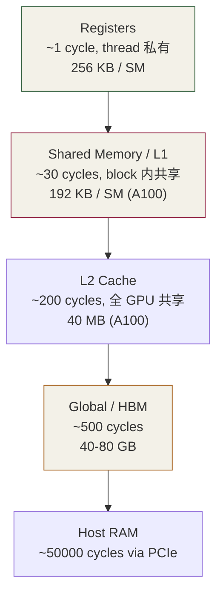
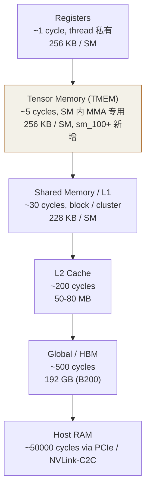

# 第 5 章 · 内存层级

⏱️ 60 分钟🎯 跑出 coalescing 差距📂 code/ch05_memory/🔥 关键瓶颈章

## 学习目标

  * 背下 GPU 的内存层级金字塔（register / shared / L1 / L2 / global / host）
  * 掌握**合并访问** 规则：什么样的访问模式能让 warp 一次取够 128B
  * 会用 `__shared__`、`__constant__`
  * 知道 `cudaMallocManaged`（unified memory）什么时候能用、什么时候坑

## 5.1 内存金字塔



一句话总结："越靠上越快越小"。**性能优化 = 让数据尽量待在上层** 。

层级| 延迟| 容量/SM| 关键字| 谁能写
---|---|---|---|---
Register| 1 周期| 256 KB| 普通局部变量| 编译器分配
Shared / L1| ~30 周期| 192 KB| `__shared__`| block 内
Constant| ~30 周期 (cache hit)| 64 KB 全局| `__constant__`| host
L2| ~200 周期| 40 MB (whole GPU)| —| 自动
Global| ~500 周期| 40-80 GB| `cudaMalloc`| 所有 thread
Local| 同 global| —| 寄存器溢出去的| thread 私有

## 5.2 合并访问 (Memory Coalescing)

GPU 一次最少读 128B（= 32 个 float = 一个 warp 的份）。如果 warp 内 32 个 lane 恰好访问相邻 32 个 float，硬件合并为**一次内存事务** 。如果它们访问跳跃的位置，就需要 32 次独立事务。

### 合并 vs 跳访

```
// ✅ COALESCED — warp 内 lane k 访问 in[base + k]
out[i] = in[i];

// ❌ STRIDED  — warp 内 lane k 访问 in[base + k*STRIDE]
out[i*STRIDE] = in[i*STRIDE];

// ❌ TRANSPOSED — 经典 row-major 数据按列访问就是 strided
out[col*M + row] = in[row*N + col];
```

跑 [coalesce_vs_strided.cu](<https://github.com/jwzheng96/learn-cuda-from-scratch/blob/main/code/ch05_memory/coalesce_vs_strided.cu>)（T4 典型）：

Pattern| 时间| 有效带宽| vs peak (~300 GB/s)
---|---|---|---
coalesced (stride=1)| 0.85 ms| ~158 GB/s| ~50%
strided 2| 1.42 ms| ~94 GB/s| ~30%
strided 8| 3.91 ms| ~34 GB/s| ~11%
strided 32| 14.0 ms| ~9 GB/s| ~3%

**影响有多大？** stride=32 时实际带宽掉到 1/16。这就是为什么 row-major 矩阵**按列访问** 会让 kernel 慢一个数量级。LLM 里 KV cache 布局选择直接影响这个。

## 5.3 Shared Memory: 片上 SRAM

`__shared__` 关键字让你在 SM 的片上 SRAM 上开一块给整个 block 共享的数组。读写延迟接近寄存器，是**把 global memory 数据驻留在芯片上重复使用** 的关键。

```
__global__ void block_sum_shared(const float* x, float* partial, int n) {
    __shared__ float sdata[256];          // 静态 shared，编译期定大小

    int tid = threadIdx.x;
    int gid = blockIdx.x * blockDim.x + threadIdx.x;

    sdata[tid] = (gid < n) ? x[gid] : 0;   // 1) 拉数据
    __syncthreads();                       // 2) 等齐

    for (int s = blockDim.x / 2; s > 0; s >>= 1) {  // 3) tree-reduce
        if (tid < s) sdata[tid] += sdata[tid + s];
        __syncthreads();
    }
    if (tid == 0) partial[blockIdx.x] = sdata[0];
}
```

  * **静态** 大小：`__shared__ float sdata[256];`（编译期常量）
  * **动态** 大小：`extern __shared__ float sdata[];`，然后 launch 时 `kernel<<<g, b, N*sizeof(float)>>>`
  * **必须`__syncthreads()`**：保证全 block 都把数据填进 sdata 后才开始读，否则 race

## 5.4 Constant Memory

`__constant__` 是 64 KB 大小的全局只读区，配有专门的 constant cache。最适合的访问模式：**warp 内 32 lane 同时访问 _同一_ 地址**——硬件一次广播给 32 lane，0 额外开销。

```
__constant__ float c_coeff[16];   // 文件作用域声明

// host:
cudaMemcpyToSymbol(c_coeff, h_coeff, sizeof h_coeff);

// kernel: 所有 lane 读 c_coeff[k] → 广播
for (int k = 0; k < 16; ++k) acc += c_coeff[k] * x;
```

但如果 warp 内不同 lane 读不同的 constant 地址 → 序列化，反而比 global 慢。所以适用场景窄：小型 LUT、模型超参数、kernel 内不变的因子。

## 5.5 三种分配方式对比

分配 API| 位置| 典型用法| 陷阱
---|---|---|---
`cudaMalloc`| 设备显存| 常驻数据：权重、KV cache| 必须显式 memcpy
`cudaMallocHost`| 主机 pinned| 异步 DMA 源/目的| 占用宝贵的物理内存
`cudaMallocManaged`| 统一虚拟地址| 原型、教学| page fault 慢；不好控制位置
`cudaHostAlloc(...Mapped)`| 主机 zero-copy| 不存在| kernel 每次访问走 PCIe，奇慢

跑 [mem_modes.cu](<https://github.com/jwzheng96/learn-cuda-from-scratch/blob/main/code/ch05_memory/mem_modes.cu>) 实测三种差距。结论：

  * 生产代码**用 cudaMalloc** 。
  * 需要 H2D/D2H 异步重叠时用 **pinned** （cudaMallocHost）。
  * unified / zero-copy 仅用于原型，不要在性能敏感路径用。

## 5.6 自检

Q1: 我看到 Nsight 报告 "Memory Throughput 90%"，但只跑出理论带宽的 30%，怎么回事？

Nsight 报的 % 是相对你**当前 kernel** 内存子系统的利用率，不是相对硬件 peak。Roofline 视图才能看出离 peak 多远。常见原因：访问 strided（事务多）、L2 命中差（重复访问相隔太远）。

Q2: `__shared__ float arr[256]` 和 `__shared__ float arr[]` 区别？

第一个是静态 (编译期定大小，48 KB 上限)。第二个是动态 (运行期 launch 时定，可到 192 KB 上限但要 `cudaFuncSetAttribute` 解锁)。

Q3: 为什么 stride=2 还能跑 ~94 GB/s，没掉一半？

L2 / texture cache 命中——你只用了一半数据但事务仍带回 128B，下次正好用到。stride 大到访问超出 cache line 才会断崖式下降。

Q4: 寄存器太多会怎样？

编译器先 spill 到 local memory（其实是 global memory 私有分区，奇慢）。Nsight 看 "Stack Frame Spill" 行。控制方法：用 `-maxrregcount=N` 强制上限，或者重构 kernel 减少活跃变量。

Q5: HBM 和 GDDR 啥区别？

都是显存。HBM 用 3D 堆叠 + 宽位 (1024-8192 bit)，带宽超高 (1-3 TB/s)，数据中心卡 (A100/H100/MI300) 用。GDDR (GDDR6/6X/7) 位宽 256-384 bit，带宽 500-1000 GB/s，消费级 (RTX 30/40/50) 用。架构差距决定了为什么 H100 推理吞吐远高于 RTX 4090。

## 5.7 练习

  1. 修 [01_coalesce_starter.cu](<https://github.com/jwzheng96/learn-cuda-from-scratch/blob/main/code/ch05_memory/exercises/01_coalesce_starter.cu>)：调换 row/col indexing 让 copy 变 coalesced。
  2. 用 `shared_demo.cu` 改成把 256 个 float 求**最大值** 而不是和。
  3. 把 `constant_demo.cu` 里 c_coeff 改成 1024（超 4 KB），看是否还有加速？为啥？（提示：constant cache 只有 8 KB / SM。）
  4. 给自己 GPU 测**实际 vs 理论带宽** 比，记下结果——后面所有 kernel 的 "好不好" 都拿这个比。

## 5.8 工业实战：内存池、cp.async、显存碎片、NCCL

### 5.8.1 cudaMallocAsync — 解决 LLM 服务的显存碎片

问题：LLM 推理服务里，每个请求要分配几十 MB 的 KV cache，请求完后释放。频繁 `cudaMalloc/cudaFree` 在 hot path 上消耗几百微秒，且显存逐渐碎片化——明明 free 显存还有 20 GB 却分不出一块连续 5 GB。

CUDA 11.2+ 提供**异步内存池** （基于 stream-ordered memory allocator）：

```
// 创建 / 配置 memory pool
cudaMemPool_t pool;
cudaDeviceGetDefaultMemPool(&pool, 0);

// 设置 release threshold: 池中保留多少字节不归还 OS
size_t threshold = size_t(20) << 30;   // 20 GB
cudaMemPoolSetAttribute(pool, cudaMemPoolAttrReleaseThreshold, &threshold);

// 异步 malloc / free, 跟 stream 绑定
void* ptr;
cudaMallocAsync(&ptr, bytes, stream);     // 几乎 0 开销 (复用池)
// ... use ptr on stream ...
cudaFreeAsync(ptr, stream);                // 也几乎 0 开销
```

vLLM / TensorRT-LLM 都用这个。配合 PyTorch 用 `torch.cuda.set_per_process_memory_fraction` 和 `PYTORCH_CUDA_ALLOC_CONF`：

```
# PyTorch 推荐配置（避免 OOM + 碎片）:
export PYTORCH_CUDA_ALLOC_CONF=expandable_segments:True,max_split_size_mb:512
```

### 5.8.2 `cp.async` — Ampere+ 的异步 shared 加载

Ch6 已经提过，这里看 PTX 级细节。普通 shared 加载：

```
// global -> register -> shared (两次访存事务)
LDG.E.SYS R0, [R2]      ; 从 global 读到 register
STS [R5], R0            ; 从 register 写到 shared
```

Ampere 的 `cp.async`：

```
// global -> shared 一步到位, 不经过 register, 异步
LDGSTS.E.BYPASS.LTC256B [R5], [R2]
// 之后 kernel 可继续做别的, 真要用 shared 时:
LDGSTS.WAIT
```

C++ 侧两种 API：

```
// 1) High-level: cuda::pipeline
#include <cuda/pipeline>
auto pipeline = cuda::make_pipeline();
pipeline.producer_acquire();
cuda::memcpy_async(&smem[0], &gmem[0], cuda::aligned_size_t<16>(64), pipeline);
pipeline.producer_commit();
pipeline.consumer_wait();
// ... use smem ...
pipeline.consumer_release();

// 2) Low-level: __pipeline_memcpy_async
__pipeline_memcpy_async(&smem[i], &gmem[i], sizeof(float4));
__pipeline_commit();
__pipeline_wait_prior(0);
```

典型加速：在 GEMM mainloop 里配 double-buffer，能让 HBM 加载和 compute 完全 overlap，整体 +20-40%。

### 5.8.3 cudaMemPrefetchAsync — Unified Memory 的正确姿势

5.5 提到 unified memory（`cudaMallocManaged`）在生产中很少用，因为 page fault 慢。但如果非用不可（例如显存不够，要 host-managed swap），`cudaMemPrefetchAsync` 是关键：

```
float* m; cudaMallocManaged(&m, bytes);
// 提前把数据从 host 拉到 device, 避免 kernel 内 page fault
cudaMemPrefetchAsync(m, bytes, /*device=*/0, stream);
my_kernel<<<..., stream>>>(m);
// 用完拉回 host (eg. checkpoint)
cudaMemPrefetchAsync(m, bytes, cudaCpuDeviceId, stream);
```

NVIDIA Grace Hopper Superchip (GH200) 的 NVLink-C2C 让 unified memory 性能逼近显存，CPU+GPU 共享 480 GB——是为超大模型设计的，开始改变 unified 在生产中的地位。

### 5.8.4 跨 GPU：NCCL 集合通信

多 GPU 训练 / 张量并行推理必用 **NCCL** (NVIDIA Collective Communications Library)：

```
#include <nccl.h>
ncclComm_t comm;
ncclCommInitAll(&comm, n_gpus, devs);

// All-Reduce: 每张卡有 local result, 跨卡求和后所有卡都有 sum
ncclAllReduce(send_buf, recv_buf, count, ncclFloat, ncclSum, comm, stream);

// All-Gather: 每张卡有 1/N 数据, gather 完每张卡都有完整数据
ncclAllGather(send_buf, recv_buf, count, ncclFloat, comm, stream);
```

关键 pattern: **把 NCCL 调用放在独立 stream** 上，跟计算 stream 并行：

```
cudaStream_t compute_s, comm_s;
cudaStreamCreate(&compute_s); cudaStreamCreate(&comm_s);

// 前向第 N 层算完, 异步把梯度 reduce, 同时算第 N+1 层
backward_layer_N<<<..., compute_s>>>(grad);
ncclAllReduce(grad, grad, ..., comm_s);    // overlap!
backward_layer_N1<<<..., compute_s>>>(...);
```

NCCL 拓扑感知（自动用 NVLink、忽略 PCIe 慢路径）。但你必须在**同一个 process** 初始化所有 GPU 或用 `NCCL_P2P_LEVEL` 调优。详细见 [NCCL 文档](<https://docs.nvidia.com/deeplearning/nccl/>)。

### 5.8.5 显存占用 debug 工具

```
# 看哪些进程占用 GPU 显存
nvidia-smi --query-compute-apps=pid,process_name,used_memory --format=csv

# 进入 Python 看 PyTorch 的分配
python -c "import torch; torch.cuda.memory._dump_snapshot('mem.pickle')"
# 然后用 https://pytorch.org/memory_viz 在线可视化

# 在 PyTorch 训练里加打印
print(torch.cuda.memory_summary())
print(f"allocated: {torch.cuda.memory_allocated()/1e9:.2f} GB")
print(f"reserved : {torch.cuda.memory_reserved()/1e9:.2f} GB")
```

**典型显存泄漏症状** ：训练 N 步后 OOM，重启就好。9 成原因是 hold 住了 computation graph（debug 时 forget `.detach()`），或者把 tensor 加进 list 不释放。

### 5.8.6 LLM 推理的显存分布

7B 模型 fp16 推理，典型显存占用：

组件| 占用| 说明
---|---|---
权重| 14 GB| 7B × 2 字节
KV cache (batch=1, T=2K)| ~1 GB| n_layer × 2 × n_head × T × head_dim × 2
KV cache (batch=32, T=2K)| ~32 GB| 线性放大
activation| ~1 GB| 每层中间 tensor
CUDA runtime + cuBLAS| ~1.5 GB| 固定开销
NCCL buffer (TP)| ~1 GB| 多卡推理才有

结论：A100-80G 跑 7B 服务约能容 32-64 并发；70B fp16 + KV 直接超过 80G，必须 TP 切到多卡或者 W4A16 量化。

## 5.9 研究前沿（2025-2026）：Blackwell TMEM 与 KV cache 革命

### 5.9.1 Tensor Memory (TMEM) — 内存层级新成员

Blackwell 把**所有 SM 加了第六层内存** 。新的金字塔：



TMEM 的特殊性：

  * **只能由 MMA 指令写入** （普通 store 不行）
  * **不参与一般运算** ，必须先 `tcgen05.ld` 读回 register 才能 ALU 运算
  * **专为 fp8 / fp4 MMA accumulator 设计** ：fp4 GEMM 的 fp32 acc 占空间多，从 register 挪到 TMEM 释放了寄存器

普通 CUDA 开发者：通过 CUTLASS 3.5+ 自动使用，不需要直接写。

### 5.9.2 KV cache 压缩前沿（2024-2026）

LLM 推理的最大显存怪兽是 KV cache。2024-2026 出现了五种主流压缩思路：

算法| 思路| 显存节省| 精度损失
---|---|---|---
**KV cache 量化** (KIVI, KV-quant)| fp16 → int4 / int2| 4-8×| < 0.5 PPL
**Token 选择性丢弃** (H2O, SnapKV, StreamingLLM)| 只留"重要"或"最近" token 的 KV| 2-10×| 0.5-2 PPL
**层间共享** (CLA, You Only Cache Once)| 多层共享同一个 KV| 2-4×| 需重训
**Multi-head Latent Attn (MLA)** (DeepSeek-V2/V3)| Q/K/V 投影到低维潜空间| ~7× (DeepSeek 实测)| 无损 / 改进
**分页 + 前缀共享** (PagedAttention + RadixAttention)| 多请求共享公共 prompt 的 KV| 2-5×（依赖请求）| 无损

**实战组合** ：vLLM 默认用 PagedAttention + 可选 fp8/int4 KV 量化；SGLang 加上 RadixAttention；DeepSeek-V3 / V2 用 MLA + paged + fp8。三者叠加把 Llama-7B 长 context 推理的 KV 显存从 GB 级降到 100 MB 级。

### 5.9.3 PagedAttention 与显存碎片化的"解药"

vLLM 论文（SOSP 2023）后两年的演进：

  * **vAttention** (Microsoft, 2024)：直接用 CUDA virtual memory API (`cuMemAddressReserve` \+ `cuMemMap`) 让 KV cache **逻辑连续但物理分页** ，不再需要 block table indirection，kernel 写得跟原生 attention 一样
  * **Pinned memory KV cache** （Mooncake）：长 prompt 历史 KV 卸载到 CPU，需要时 NVLink-C2C / PCIe 重传
  * **KV cache 共享** （LMCache, 2024）：跨进程 / 跨节点 KV 共享池，用 RDMA 传递

### 5.9.4 NVLink-C2C 与 unified memory 复活

过去 unified memory 在生产中很少用（page fault 慢）。Grace Hopper (GH200) 和 Grace Blackwell (GB200) 用 **NVLink-C2C 900 GB/s** 把 CPU 和 GPU 内存接成一体，让 unified memory 性能逼近本地显存：

```
// 在 GH200 上, managed memory 不再是性能反模式
float* w; cudaMallocManaged(&w, 600 * (1u << 30));   // 600 GB 模型权重
// w 落在 Grace LPDDR5X (480 GB), 由 NVLink-C2C 让 GPU 访问
// 比起 fp4 量化, 这种"显存外溢"对精度敏感模型更友好
```

典型用例：DeepSeek-V3 671B 在 GH200 上推理，权重一部分驻留 GPU HBM，一部分常驻 Grace LPDDR5X，按需走 C2C。

### 5.9.5 显存优化的 2026 工业组合

一个完整 LLM 推理服务的显存优化技术栈：

```
1. fp8 / fp4 量化权重     → 权重显存减半到 1/4
2. fp8 KV cache           → KV 显存减半
3. PagedAttention         → 显存利用率 40% → 90%+
4. RadixAttention 前缀共享  → 多请求公共部分一份 KV
5. MLA 或 GQA             → KV head 维度压缩 (模型架构层面)
6. Stream-K + Stream-P    → batch 间显存峰值降低
7. cudaMallocAsync 内存池  → 减少碎片
8. NVLink-C2C 外溢 (GH200) → 大模型放得下

效果: 单卡 (80GB HBM) 服务 70B fp4 模型, 同时 batch=64 并发

```

### 5.9.6 CUDA 12.6+ 内存子系统改进

  * **cudaMallocAsync 默认** ：从 12.6 起 PyTorch 默认走 stream-ordered allocator，碎片化大幅缓解
  * **cuMemMap-based KV cache** ：vAttention 风格的虚拟内存 KV 进 vLLM/TRT-LLM
  * **HMM (Heterogeneous Memory Management)** ：Linux 5.x+ 内核支持，让 host-device 内存接近统一
  * **Tensor Memory Accelerator (TMA)** 在 Blackwell 上更强：单指令 multicast 到 cluster 内多个 block 的 shared

## 5.10 常见坑

  * shared mem 数组开太大 → kernel launch 失败 `too many resources requested`
  * 少写 `__syncthreads` → kernel 输出"几乎对"但偶尔错，race condition
  * `__constant__` 数组太大 → 编译报错 `maximum constant size exceeded`
  * kernel 内 `printf` \+ 大量数据 → 缓冲区溢出, 输出截断
