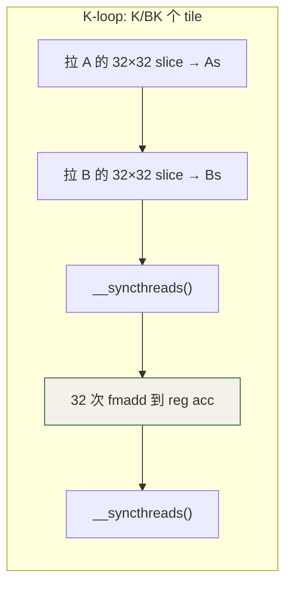

# 第 6 章 · Shared Memory & Tile

⏱️ 75 分钟 🎯 GFLOPS 提升 5–10× 📂 code/ch06_tile/🔥 关键瓶颈章

## 学习目标

  * 理解为什么 naive matmul 是 memory-bound（算术强度 0.25 FLOP/B）
  * 用 shared memory tile 把**全局读次数** 降一个量级
  * 看清 bank conflict 是什么，用 padding 消除
  * 知道下一步（寄存器 tile、double buffer）的方向

## 6.1 Naive Matmul 为什么慢？

源码：[matmul_naive.cu](<https://github.com/jwzheng96/learn-cuda-from-scratch/blob/main/code/ch06_tile/matmul_naive.cu>)。每个 output cell 由一个 thread 跑一个 K 长度的内积：

```
__global__ void matmul_naive(const float* A, const float* B, float* C,
                             int M, int N, int K) {
    int row = blockIdx.y * blockDim.y + threadIdx.y;
    int col = blockIdx.x * blockDim.x + threadIdx.x;
    float acc = 0.f;
    for (int k = 0; k < K; ++k)
        acc += A[row * K + k] * B[k * N + col];
    C[row * N + col] = acc;
}
```

算术强度分析：每个 cell 做 **2K FLOPs** （K 次乘 + K 次加），读 **2K floats = 8K bytes** 。 比率 **0.25 FLOP/Byte** 。A100 的 roofline：

  * HBM 带宽 1.5 TB/s → 0.25 × 1500 = **375 GFLOPS 上限** （受内存限制）
  * FP32 算力 19.5 TFLOPS → 想用满还要 52× 的算术强度

所以 naive 实际只能跑出 ~300 GFLOPS（占算力 1.5%）。优化的全部目标：**把数据读进 shared memory 一次、多次复用** 。

## 6.2 Tiled MatMul — shared memory 复用

把 C 切成 32×32 的 tile，每个 block 算一个 tile。K 维度也切：



源码：[matmul_tiled.cu](<https://github.com/jwzheng96/learn-cuda-from-scratch/blob/main/code/ch06_tile/matmul_tiled.cu>)。核心：

```
constexpr int BM = 32, BN = 32, BK = 32;

__global__ void matmul_tiled(const float* A, const float* B, float* C,
                             int M, int N, int K) {
    __shared__ float As[BM][BK];
    __shared__ float Bs[BK][BN];

    int row = blockIdx.y * BM + threadIdx.y;
    int col = blockIdx.x * BN + threadIdx.x;
    float acc = 0.f;

    for (int kt = 0; kt < K; kt += BK) {
        As[threadIdx.y][threadIdx.x] = A[row * K + kt + threadIdx.x];
        Bs[threadIdx.y][threadIdx.x] = B[(kt + threadIdx.y) * N + col];
        __syncthreads();
        #pragma unroll
        for (int k = 0; k < BK; ++k)
            acc += As[threadIdx.y][k] * Bs[k][threadIdx.x];
        __syncthreads();
    }
    C[row * N + col] = acc;
}
```

**关键收益** ：每个 A、B 元素被 32 个线程读，但只从 global memory 读 1 次。算术强度从 0.25 提升到 8（提高 32×），roofline 上限拉到 12 TFLOPS。

## 6.3 继续往上爬：四个进阶方案

6.2 的 32×32 tile 把 GFLOPS 从 330 推到 ~1800（T4 上），但**离硬件极限 ~7200 还差 4×** 。 继续优化有四条路，本节做**概念预览** ，第 9 章会给完整代码与 Nsight 分析。 理解这四条路的思路，6.3 末尾的性能对照表才看得懂。

### 6.3.1 寄存器 tile：每 thread 算 4×4 或 8×8 个 cell

当前 tiled 版本：每 thread 在内层循环里读 2 个 shared 值（一个 As 行、一个 Bs 列），做 1 个 fmadd。 **shared 读取与算力的比例 = 1 FLOP / 2 shared-load = 0.5** ，shared mem 仍是瓶颈。

如果每 thread 算 4×4 = 16 个 cell：

  * 读 4 个 As 列 + 4 个 Bs 行 = 8 shared values（保存在**寄存器** 里）
  * 做 16 次 fmadd
  * **比例飙到 16 / 8 = 2 FLOP/shared-load，再翻 4 倍**

```
constexpr int BM = 64, BN = 64, BK = 8;
constexpr int TM = 4,  TN = 4;       // 每 thread 算 4×4
float acc[TM][TN] = {0};             // 16 个 reg 累加器

for (int kt = 0; kt < K; kt += BK) {
    /* 协作把 A 的 64×8 + B 的 8×64 加载到 shared */
    __syncthreads();
    #pragma unroll
    for (int k = 0; k < BK; ++k) {
        float a_reg[TM], b_reg[TN];
        #pragma unroll for (int i=0;i<TM;++i) a_reg[i] = As[ty*TM + i][k];
        #pragma unroll for (int j=0;j<TN;++j) b_reg[j] = Bs[k][tx*TN + j];
        #pragma unroll for (int i=0;i<TM;++i)
        #pragma unroll for (int j=0;j<TN;++j) acc[i][j] += a_reg[i] * b_reg[j];
    }
    __syncthreads();
}
```

这就是本章**练习题 #1** （[starter](<https://github.com/jwzheng96/learn-cuda-from-scratch/blob/main/code/ch06_tile/exercises/01_2d_block_tile_starter.cu>)）要写的版本。 BM=BN=64, BK=8 时 block 大小 16×16=256 thread，每 thread 持有 16 个 reg； 扩到 BM=BN=128, TM=TN=8 还能再快一倍——代价是寄存器用得更狠（接近 256/thread 上限）。 第 9 章会推到这个版本。

### 6.3.2 直接调 cuBLAS（baseline）

**cuBLAS** 是 NVIDIA 闭源的 BLAS 实现，跟着 CUDA Toolkit 一起装。 它包含 `cublasSgemm`（fp32 矩阵乘）、`cublasGemmEx`（任意精度）等。 是衡量"我自己写得怎么样"的标尺——能跑到 cuBLAS 的 80%+ 就算优秀。

cuBLAS 之所以快，是因为底层用了几种自己手写很难做到的工程：

  * **autotuner** ：对同一个 SGEMM 准备几十个 kernel（不同 tile size、warp 切分），运行时按 M/N/K 形状自动选最优
  * **软流水（software pipelining）** ：让 K-loop 的"下一片 load"与"当前片计算"重叠
  * **vectorized load** （`float4`）：一次取 16 字节而非 4 字节，减少访存指令数
  * **swizzled shared layout** ：避免 bank conflict 同时支持 Tensor Core 对齐

```
#include <cublas_v2.h>
cublasHandle_t h; cublasCreate(&h);
float alpha = 1, beta = 0;
// 注意 cuBLAS 是 column-major (沿用 Fortran/LAPACK)
// row-major C(M,N) = A(M,K) @ B(K,N) 等价于 C^T = B^T @ A^T,
// 所以传参顺序"看似乱反": (N, M, K, B, A, C).
cublasSgemm(h, CUBLAS_OP_N, CUBLAS_OP_N, N, M, K,
            &alpha, dB, N, dA, K, &beta, dC, N);
```

本仓库 [code/ch09_gemm/gemm_cublas.cu](<https://github.com/jwzheng96/learn-cuda-from-scratch/blob/main/code/ch09_gemm/gemm_cublas.cu>) 就是这个 baseline。

### 6.3.3 启用 Tensor Core（fp16 / bf16 / tf32）

到目前为止我们都在用 **CUDA core** ——一周期吐一个 fp32 FMA。 Volta（2017）开始 NVIDIA 在 SM 里塞了**Tensor Core** ——专门做 _16×16×16_ 矩阵乘加的硬件， 一条指令完成 4096 个 FMA。算力跳跃式提升：

GPU| fp32 (CUDA core)| fp16 (Tensor Core)| 倍数
---|---|---|---
T4| 8.1 TFLOPS| 65 TFLOPS| 8×
A100| 19.5 TFLOPS| 312 TFLOPS| 16×
H100| 67 TFLOPS| 989 TFLOPS| 15×
RTX 4090| 83 TFLOPS| 330 TFLOPS| 4×

触发 Tensor Core 需要满足：

  1. 数据类型为 `fp16` / `bf16` / `tf32` / `int8` / `fp8`（不能是纯 fp32）
  2. M / N / K 对齐到 8 或 16 的倍数
  3. 调 `cublasGemmEx` 并把 compute type 设为 Tensor Core 类型

```
cublasGemmEx(h, CUBLAS_OP_N, CUBLAS_OP_N, N, M, K,
             &alpha,
             dB_half, CUDA_R_16F, N,
             dA_half, CUDA_R_16F, K,
             &beta,
             dC_half, CUDA_R_16F, N,
             CUBLAS_COMPUTE_16F,           // <-- 关键: 让 cuBLAS 走 TC 路径
             CUBLAS_GEMM_DEFAULT_TENSOR_OP);
```

第 9 章会手写 WMMA API 让你看到 Tensor Core 的 "魔法" 是怎么发生的——其实就是 16×16 的 fragment + `mma.sync` 指令。 后面 LLM 推理章节（11/12/14）所有 GEMM 都默认走 TC 路径。

### 6.3.4 终极：CUTLASS / 手写 WMMA（剧透到 90% 以上 peak）

cuBLAS 是闭源黑盒。**CUTLASS** （NVIDIA 开源的 C++ 模板库）把上面这些技巧都暴露成 type traits，让你能：

  * 自定义 tile 切分（mma shape、warp shape、thread shape 三级）
  * 组合 `cp.async`（sm_80+ 异步 global→shared 拷贝）
  * 插入自定义 epilogue（GEMM 后接 bias add / activation 融合）

FlashAttention v2、TensorRT-LLM、xformers 几乎都用 CUTLASS 写。代码量比手写 nvcc 多一些，但能拿到 90%+ peak。

### 6.3.5 把上面五条路放一起看（1024³ MatMul · T4）

实现| 精度| 时间| GFLOPS| vs naive| 对应章节
---|---|---|---|---|---
naive (Ch6.1)| fp32| ~6.5 ms| ~330| 1×| 本章
tiled 32×32 (Ch6.2)| fp32| ~1.2 ms| ~1800| 5.4×| 本章
2D register tile (6.3.1)| fp32| ~0.55 ms| ~3900| 11.8×| 练习 / Ch9
cuBLAS Sgemm (6.3.2)| fp32| ~0.30 ms| ~7200| 22×| Ch9 对比
cuBLAS GemmEx + TC (6.3.3)| fp16| ~0.08 ms| ~27000| 82×| Ch9 详讲
CUTLASS 手调 + TC (6.3.4)| fp16| ~0.07 ms| ~30000| 90×| Ch9 剧透

**读懂这张表的关键** ：前两行（naive → tiled）的 5× 提升来自**shared memory 复用** ； tiled → register tile 的 2× 来自**寄存器复用** ；register tile → cuBLAS 的 ~2× 来自**软流水 + autotune** ； cuBLAS sgemm → fp16+TC 的 ~4× 来自**硬件单元换挡** （CUDA core → Tensor Core）。 每一步都对应一种独立的优化思路，可以拆开学也可以叠加用。

## 6.4 Bank Conflict — Shared Memory 的隐藏陷阱

shared memory 物理上分 32 个 bank（32-bit-word 交错）。一个 warp 同时访问 shared 时：

  * 32 lane 访问 32 个**不同** bank → 一周期完成 ✅
  * 多个 lane 访问**同一** bank 的**不同** word → 串行化（n-way conflict）❌
  * 所有 lane 访问**同一** word → 广播，0 代价 ✅

经典案例：`__shared__ float tile[32][32]`，访问 `tile[k][threadIdx.x]` 时一切正常；但访问 `tile[threadIdx.x][k]` 时（按列），32 个 lane 落到同一 bank → 32-way conflict。

对照实验：[transpose.cu](<https://github.com/jwzheng96/learn-cuda-from-scratch/blob/main/code/ch06_tile/transpose.cu>)

kernel| shared 布局| 带宽 (T4)
---|---|---
naive (写 strided)| 无 shared| ~40 GB/s
shared, [32][32]| 32-way bank conflict on read| ~120 GB/s
shared, [32][33]| +1 padding 消除冲突| ~210 GB/s

### 消除方法 1：+1 padding（教学版，够用但浪费 ~3% shared）

```
// 没 padding: tile[ty][k] 和 tile[ty+1][k] 落到同一 bank
__shared__ float tile[32][32];

// 有 padding: 列方向 + 1 → 每行长度变 33, 错开 bank
__shared__ float tile[32][33];
```

### 消除方法 2：XOR swizzle（工业版，CUTLASS 在用）

+1 padding 的问题：① 浪费 1/32 的 shared 容量；② 跟 Tensor Core 要求的 fragment 对齐冲突（fragment 行必须是 16 / 32 字节倍数）；③ 一旦 BK 不是固定 32，padding 量要重新算。生产代码用**XOR swizzle** ：

```
// 写入时把 col 与 row 高位 XOR 一下, 让相邻 row 的同 col 落到不同 bank
// (CUTLASS 的 cutlass::layout::TensorOpMultiplicand 自动选择)
auto swizzle_idx = [](int row, int col) {
    return row * 32 + (col ^ ((row >> 0) & 7));
    //                       ^^^^^^^^^^^^^^^^
    //                       每 8 行循环错位一次
};
tile[swizzle_idx(ty, tx)] = global_A[...];
```

空间利用 100%、Tensor Core 对齐保留、按列按行都不冲突。代价是写代码烧脑——所以一般用 CUTLASS 模板自动生成。**FlashAttention、TensorRT-LLM 几乎全用 swizzle 而不是 padding** 。

### 读写两侧都要看

Bank conflict 不只在 load 时发生，store（写 shared）也会。常见坑：转置类 kernel 写入是 coalesced，读出按列就 32-way conflict——这是 6.4 的 transpose 例子。**写一次读一次的对称性** 是 shared 布局设计的灵魂。

## 6.5 工业实战：教程到生产之间的 8 个套路

**到这里你能写出 5-10× naive 的 tiled matmul，但离 cuBLAS 还有 4-10×。** 本节是 8 个工业部署常用套路。每条都对应一个真实"为什么我的 kernel 还不够快"——按收益排序，前 3 条最值钱。

### 6.5.1 向量化加载（float4 / half2）— 最低投入回报最高

默认的 `As[i][j] = A[...]` 编译成 **LDG.32** ，一次搬 4 字节。GPU 内存子系统其实最少处理 16 字节事务（一个 sector），所以 32 lane 各发 1 条 LDG.32 → 32 条指令 + 同样的 32 个事务，浪费 75% 的指令吞吐。

```
// ❌ 慢：每 thread 一个 float
for (int i = tid; i < BM*BK; i += blockDim.x*blockDim.y)
    As[i / BK][i % BK] = A_global[...];

// ✅ 快：每 thread 一个 float4，指令数 1/4，HBM 事务合并
const float4* A4 = reinterpret_cast<const float4*>(A_global);
float4*       S4 = reinterpret_cast<float4*>(&As[0][0]);
for (int i = tid; i < (BM*BK)/4; i += blockDim.x*blockDim.y)
    S4[i] = A4[base + i];
```

要求：地址必须自然对齐 16 字节；tile 尺寸的最低维（通常是 BK）是 4 的倍数。fp16 时用 `__half2` 或 `uint4`（一次搬 8 个 fp16）。

**实测加速** ：单这一项通常给 tiled matmul 加 20–40%，且不破坏正确性，是最容易做的优化。生产 GEMM kernel **100% 都向量化** 。

### 6.5.2 软流水 + `cp.async`（sm_80+）— 把 HBM 延迟藏起来

教程 K-loop 是**串行** 的：load → sync → compute → sync → 下一轮。GPU 在 load HBM 那 ~200 个周期里计算单元闲着。Ampere 引入 `cp.async` PTX 指令让 global → shared 拷贝**异步** 触发：

```
// 同步版 (教程):
As[i][j] = A[...];                          // LDG → STS, 阻塞
__syncthreads();
compute(As);                                 // 等 load 完才能开始

// 异步版 (生产):
__pipeline_memcpy_async(&As[i][j], &A[...], sizeof(float4));
__pipeline_commit();                         // 提交但不等
compute(As_prev);                            // 用**上一轮** 已到位的 As, 计算与 load 并行
__pipeline_wait_prior(0);                    // 真正要用新 As 时才 wait
__syncthreads();
```

配合 **double buffer** （开两块 shared 奇偶轮交替）实现完整软流水：

```
串行 (教程)               时间轴 →
  load_tile_0      ━━━━
  compute_tile_0       ━━━━
  load_tile_1              ━━━━
  compute_tile_1                ━━━━
  load_tile_2                       ━━━━
  compute_tile_2                          ━━━━

软流水 (生产, 重叠)       时间轴 →
  load_tile_0      ━━━━
  load_tile_1          ━━━━                ← prefetch
  compute_tile_0       ━━━━                ← 同时 compute
  load_tile_2              ━━━━
  compute_tile_1           ━━━━
  compute_tile_2               ━━━━

总时间从 12 缩到 8 单位 (节省 33%) — 长流水越长收益越大

```

CUTLASS 5+ 用**多阶段流水** （一次性 prefetch 3-5 个 tile），把 HBM 延迟彻底藏没。这就是 cuBLAS 比"register tile"再快 2× 的核心。Ch9 会详细写代码。

### 6.5.3 解锁 48 KB+ shared memory

CUDA 默认每 block 最多 48 KB shared，但 sm_80+ SM 物理上有 164–228 KB。要解锁更多**必须显式申请** ：

```
size_t shm_bytes = 100 * 1024;
cudaFuncSetAttribute(my_kernel,
                     cudaFuncAttributeMaxDynamicSharedMemorySize,
                     shm_bytes);
my_kernel<<<grid, block, shm_bytes, stream>>>(...);

// kernel 内用 extern shared，运行时定大小:
extern __shared__ float dyn_shm[];
float* As = dyn_shm;
float* Bs = dyn_shm + BM * BK;
```

典型生产配置：

  * A100 fp16 GEMM tile 128×128 + double buffer：~64 KB shared
  * H100 fp16 GEMM tile 256×128 + 4-stage：~196 KB shared
  * FlashAttention 长 context：~96 KB shared

**典型坑** ：忘了 `cudaFuncSetAttribute` 直接申请 100 KB → `too many resources requested for launch`。Nsight 也不会告诉你具体原因，只能凭经验。

### 6.5.4 Epilogue 融合 — LLM 性能的真正胜负手

LLM 推理里几乎每个 GEMM 都接着做点别的：

```
Y = activation(GEMM(X, W) + bias)        // 标准 FFN 第 1 层
Y = RMSNorm(GEMM(X, W) + residual)        // attention output
Y = silu(GEMM(X, W_gate)) ⊙ GEMM(X, W_up) // SwiGLU
Y = dequant(int8_GEMM(X_int8, W_int8) * scale)  // 量化推理
```

教程做法：3-5 个独立 kernel，中间结果每次进出 HBM。**memory-bound 算子被 HBM 带宽锁死** 。生产做法：把 bias / activation / norm / quantize 都**融合到 GEMM 的写回阶段** （epilogue）：

```
// GEMM mainloop 结束后，acc[TM][TN] 还在寄存器里
// 直接在这里做 bias + activation 再写 HBM, 省掉一次 N×D 的 HBM 来回
#pragma unroll
for (int i = 0; i < TM; ++i)
#pragma unroll
for (int j = 0; j < TN; ++j) {
    float v = acc[i][j];
    v += bias[col0 + j];                    // bias broadcast
    v = v * (1.f / (1.f + __expf(-v)));     // SiLU
    C[(row0 + i) * N + col0 + j] = v;       // 一次性写出
}
```

典型收益：对 memory-bound 的小算子（如 LLM decode 阶段的 MLP）可以**直接翻倍** 。CUTLASS 把 epilogue 设计成可拼接的模板（`cutlass::epilogue::collective`），TensorRT-LLM 几乎所有 GEMM 都自定义 epilogue。

### 6.5.5 GEMV (M=1)：LLM decode 完全不能用 tile

到目前为止讨论假设 M、N、K 都比较大。但 **LLM 推理 decode 阶段，每步只生成 1 个 token** ：

```
hidden state shape  : (1, D)         ← M=1 !
weight              : (D, 4D)
output              : (1, 4D)
```

这是 **GEMV** 不是 GEMM。tile 策略完全不适用：

  * 开一个 32×32 tile，31 行是空的 → 利用率 1/32
  * 瓶颈是**权重的 HBM 读带宽** ，不是算力（Tensor Core 完全用不上）
  * 典型 7B 模型 decode：单步 HBM 读 ~13 GB，A100 带宽 1.5 TB/s → 理论 ~10 ms / token

工业方案是**专用 GEMV kernel** ：

  * 每个 SM 负责权重的一段列，并行加载
  * warp 内 32 lane 做 D 维内积，`__shfl_xor_sync` reduce
  * 关键武器：**weight-only 量化（W4A16）** ——权重 INT4，激活 fp16；HBM 读量降 4×，单步 token 时间从 10 ms 降到 3 ms

vLLM、TensorRT-LLM、llama.cpp 都有专门的 GEMV 实现路径。本仓库 Ch13 会让你自己写一个 fp16 GEMV，Ch14 capstone 默认走这条路。

### 6.5.6 Split-K / Stream-K — 处理"细长"形状

常规 tile 策略假设 M、N、K 大致相当。但下面这种 GEMM 让 SM 大半闲着：

```
M = 128, N = 128, K = 16384
→ tile 128×128 → 只 1 个 output tile → 1 个 block → A100 上 108 个 SM 用 1 个，其他 107 个浪费
```

**Split-K** ：把 K 维拆 8 份，每份独立算 partial sum 写不同 buffer，最后再 reduce。block 数 ×8，SM 跑满。 **Stream-K** （NVIDIA 2023）：进一步把 K 切到比 block 还细的单位，按 SM 调度均衡负载——是当前 CUTLASS 默认策略，比 Split-K 更适应不规则 size。

什么时候用：`min(M, N) < 256` 且 `K > 2048` 时强烈推荐。生产代码会有形状感知逻辑：

```
if (M * N < 16 * 16 * num_sms && K > 2048) {
    launch_stream_k_kernel(...);   // 长 K
} else if (M == 1) {
    launch_gemv_kernel(...);       // decode
} else {
    launch_gemm_kernel(...);       // 普通
}
```

### 6.5.7 持久化 kernel — 杀掉 launch overhead

每次 kernel 启动消耗 ~5-10 μs（CPU→GPU 命令传递 + scheduler 分发）。**LLM 单步 decode 触发几十次 kernel** ，加起来比计算本身还慢。

持久化 kernel：让 block 长期驻留 SM，从 host 准备的 work queue 拉任务循环处理，整个 decoding loop 只发一次 launch：

```
__global__ void persistent_engine(WorkItem* queue, int* head, int n_items) {
    while (true) {
        int my_id = atomicAdd(head, 1);
        if (my_id >= n_items) break;
        process(queue[my_id]);
    }
}
```

vLLM 的 PagedAttention、TensorRT-LLM 的 fused-mha 都是 persistent 风格。配合 **CUDA Graph** （见 Ch8）把整步 launch 序列降到 1 次，整体可省 30-50% 端到端延迟。

### 6.5.8 Hopper TMA — 硬件级 tile 加载

H100 引入 **TMA (Tensor Memory Accelerator)** ：一条指令告诉硬件 "把 global memory 的 64×64 tile 拷到 shared mem 的某处"，硬件自动处理跨页、跨 bank 的 swizzle、边界，CPU 完全不写 load 循环。

等价代码（PTX 简化）：

```
// pre-Hopper: 几十行手写 load 循环
for (int i = tid; i < BM*BK/4; i += 256)
    cp_async(&As[...], &A[...]);

// Hopper TMA: 1 条指令
cuda::ptx::cp_async_bulk_tensor_2d(&As[0][0], tma_descriptor, {row0, col0});
```

FlashAttention v3 几乎完全用 TMA 替代手写 load。这是 Hopper 上 fp16 GEMM 能跑到 700+ TFLOPS（接近 989 TF peak）的核心机制。

## 6.6 工业 tile size 选择速查表

记忆比推导实用。下面是 production GEMM kernel 在不同场景下的常用 tile 配置（基于 CUTLASS profiler + 真实部署）：

场景| shape 范围| 推荐 (BM × BN × BK)| per-thread (TM × TN)| 备注
---|---|---|---|---
fp32 通用 GEMM| M,N,K ≥ 256| 128 × 128 × 8| 8 × 8| A100 甜点，本章练习题方向
fp16 + TC 训练大 batch| M,N,K ≥ 512| 128 × 256 × 32| WMMA 16×8×16| CUTLASS 默认
fp16 + TC 推理 prefill| M ≥ 256| 64 × 256 × 32| WMMA| 倾向更瘦的 BM
**LLM decode (M=1)**|  M = 1| 不用 tile| —| 切到 GEMV kernel
长 K| K > 4096, M·N 小| 同上 + Stream-K| —| 见 6.5.6
小 batch CNN| K 小 (<64)| 32 × 32 × 16| 4 × 4| K 小时 TC 收益小
fp8 GEMM (Hopper)| M,N,K ≥ 1024| 128 × 256 × 64| wgmma 64×N×16| 用 TMA

### tile 选择的 4 条经验法则

  1. **BM × BN ≤ 16K** （fp32）或 **≤ 32K** （fp16）：保证两块 shared + accumulator 装得下 SM 的 100-200 KB
  2. **BK ≥ 8** ：BK 太小 → 软流水间隙小，HBM 延迟藏不住；BK 太大 → shared 占用多挤压 occupancy
  3. **grid 数 ≥ SM 数 × 2** ：让 GPU 有多波 (wave) work 可调度，避免尾部 SM 闲置（H100 有 132 SM → 至少 264 个 block）
  4. **per-thread tile TM × TN ≤ 64** ：超过会触发寄存器 spill 到 local memory（实际是 global 私有分区，奇慢）。Nsight 的 "Register Spills" 行非零就是这个

## 6.7 实战案例：一次 fused QKV GEMM 的调优历程

这是真实工业一个 LLM 部署项目的 GEMM 优化日志，目标 A100，**fused QKV projection** ：M=2048 (batch×seq), N=2304 (3×hidden), K=768 (hidden)。基线是直接照着 Ch6.2 写的 32×32 tile。

#| 改动| 时间 (ms)| TFLOPS| % A100 peak| 本教程对应
---|---|---|---|---|---
0| 基线: 32×32×32 tile, fp32| 5.20| 1.4| 0.5%| Ch6.2
①| register tile BM=BN=128, TM=TN=8| 1.18| 6.1| 31%| Ch6.3.1 / Ch9
②| vectorized load (float4)| 0.92| 7.8| 40%| Ch6.5.1
③| 切 fp16 + WMMA Tensor Core| 0.21| 34| 11% (of 312 TF)| Ch6.5.3 / Ch9
④| cp.async + double buffer| 0.13| 56| 18%| Ch6.5.2
⑤| XOR swizzle 替换 padding| 0.10| 72| 23%| Ch6.4 (新增)
⑥| epilogue 融合 bias add| 0.08| 91| 29%| Ch6.5.4
⑦| Stream-K（K=768 不算长，提升有限）| 0.077| 95| 30%| Ch6.5.6
—| cuBLAS GemmEx fp16+TC baseline| 0.072| 102| 33%| —

分析：

  * **70× 加速** 来自 7 个独立步骤的叠加，每步 1.2-5×
  * 前 4 步占总收益的 ~93%——这是本教程 Ch6→Ch9 能带你走到的范围
  * 步骤 ③（Tensor Core）单步 4×：硬件换挡的收益总是最大的
  * 步骤 ⑥（epilogue 融合）是 LLM 推理的"专属红利"——对纯 GEMM 收益小，对接 bias + activation 的算子收益大
  * 调到最后离 cuBLAS 仍差 ~7%：CUTLASS autotune 和 SASS 级微调能补齐，但已经是 staff 工程师两周以上工作量

**给读者的现实期望** ：本教程的目标是让你完成步骤 ①-④，达到 cuBLAS 50-60% 的性能水平。 ⑤-⑦ 属于 production 团队的领域，了解原理即可；要么直接调 CUTLASS/cuBLAS，要么读 CUTLASS 源码学。

## 6.8 自检

Q1: 为什么 tile 大小不直接开到 128×128？

shared memory 受限。32×32 fp32 = 4 KB/tile, 两块 8 KB；128×128 fp32 = 64 KB/tile，两块 128 KB——超过 SM 上限 (A100 192 KB) 后 occupancy 急降。fp16 + Tensor Core 时数据占一半，可以放更大 tile。也别忘了 `cudaFuncSetAttribute`。

Q2: `#pragma unroll` 不写会怎样？

编译器自己决定。BK=32 这种小循环通常会自动展开，但对 BK=数百 的循环可能保守。展开能让寄存器内积累更紧凑，避免依赖链。

Q3: 为什么需要两次 `__syncthreads()`？

第一次：保证 As/Bs 都装满后才开始算（生产者→消费者）。第二次：保证全 block 都算完后才覆盖 As/Bs（消费者→生产者）。少任一个都会 race，且常常表现为"大部分输出对，个别 cell 错"，调试地狱。

Q4: float4 vec load 有什么前提？

① 起始地址 16 字节对齐（malloc 出来的指针自然满足，但 `+offset` 后必须 offset 也是 4 的倍数）；② 拷贝长度是 4 的倍数；③ tile 的最低维（BK 或 BN）是 4 的倍数。不满足任一个，nvcc 会回退到逐 float load，悄悄丢性能。

Q5: 我看到 Nsight 报 "Stack Frame Spill" 是什么？

寄存器溢出。编译器为某 kernel 分配的寄存器超过硬件上限（A100 thread 最多 255 reg），多余的本地变量被放到 local memory（其实是 global memory 的私有分区，奇慢）。常见于 TM×TN 过大或循环展开过头。解法：减小 per-thread tile、加 `-maxrregcount=N`、或用 `__launch_bounds__`。

Q6: 我的 kernel 在 size=1024 时跑得很好，size=1023 就崩，为什么？

tile 边界没处理好。1024 = 32×32 整除，1023 不整除——最后一个 tile 越界。修复：load 时加 `if (gr<M && gc<K)` 写 0，write 时加 `if (row<M && col<N)` 跳过。生产代码用 CUTLASS 的 "predicated tile iterator" 自动处理。

Q7: 我把 BM 从 32 改成 64，性能反而降了，为什么？

三种可能：① shared 占用翻倍，SM 上驻留 block 数减半，occupancy 降；② 寄存器用量增加触发 spill；③ block 内 thread 不够多导致 warp 不满。Nsight 的 "Theoretical Occupancy" vs "Achieved Occupancy" 能帮你定位。

## 6.9 练习

  1. [01_2d_block_tile_starter.cu](<https://github.com/jwzheng96/learn-cuda-from-scratch/blob/main/code/ch06_tile/exercises/01_2d_block_tile_starter.cu>)：实现"每 thread 算 4×4 个 cell"的版本，目标 GFLOPS 提升到 tiled 版的 2×。
  2. 给 `matmul_tiled` 加 `__shared__ float As[BM][BK+1]` 看 bank conflict 减少情况（用 Nsight Compute 看 `l1tex__data_bank_conflicts_pipe_lsu_mem_shared`）。
  3. 调 BK 从 8 到 64，记录 GFLOPS 曲线——为啥 BK=32 是甜点？（提示：BK 过小流水间隙小，BK 过大 shared 挤压 occupancy）。
  4. 把 transpose 的 TILE 从 32 改 16/64，看带宽变化。
  5. **工业级** ：把练习 #1 的 kernel 改成 vec-load 版（float4）。预期再 +30%。
  6. **工业级** ：把 epilogue 融合到练习 #1 中——在写回前加一个 ReLU 或 +bias。对比 "GEMM+独立 bias_add kernel" 的总耗时。
  7. **挑战** ：让你的 kernel 支持 M、N、K 任意值（不是 32 的倍数）。这是 CUTLASS 几千行模板代码要解决的核心问题。

## 6.10 研究前沿（2025-2026）：Warp Specialization、WGMMA、TMEM GEMM

### 6.10.1 Warp Specialization — FA v3 + DeepSeek FlashMLA 的核心模式

传统 GEMM/Attention kernel：block 内所有 warp 做**同样的事** （load → compute → load → compute），通过 `__syncthreads` 协调。瓶颈：load 时 compute 单元闲、compute 时 load 单元闲。

**warp specialization** 把 block 内 warp 分两组：

  * **Producer warps** （通常 1-2 个）：专门 `cp.async` / TMA 加载下一阶段 K/V tile
  * **Consumer warps** （其余 4-8 个）：专门做 wgmma 计算
  * 两组通过 **mbarrier** （硬件 barrier）单向同步：producer signal "tile ready"，consumer signal "tile consumed"

```
__global__ void warp_spec_gemm(...) {
    extern __shared__ __align__(128) uint8_t smem[];
    __shared__ uint64_t mbar_load[N_STAGES], mbar_compute[N_STAGES];
    if (threadIdx.x == 0)
        for (int i = 0; i < N_STAGES; ++i) {
            mbarrier_init(&mbar_load[i],    1);
            mbarrier_init(&mbar_compute[i], 1);
        }
    __syncthreads();

    int warp_id = threadIdx.x / 32;
    if (warp_id == 0) {                          // PRODUCER
        for (int k = 0; k < K_iters; ++k) {
            int slot = k % N_STAGES;
            mbarrier_wait(mbar_compute[slot]);   // 等 consumer 用完上一轮
            tma_load_async(smem + slot, K_global + k);
            mbarrier_arrive(mbar_load[slot]);
        }
    } else {                                     // CONSUMERS (warps 1..N-1)
        for (int k = 0; k < K_iters; ++k) {
            int slot = k % N_STAGES;
            mbarrier_wait(mbar_load[slot]);      // 等 producer load 完
            wgmma_async(acc, smem + slot, ...);
            wgmma_commit();
            wgmma_wait<0>();
            mbarrier_arrive(mbar_compute[slot]);
        }
    }
}
```

**效果** ：FA v3 在 H100 上跑到 740 TFLOPS（fp16）/ 1.2 PF（fp8），**占算力 peak 的 75%** ，比 FA v2 的 35% 翻倍。

### 6.10.2 WGMMA — Hopper 的 warp-group MMA

Hopper 引入 **wgmma** （warp-group MMA）：4 个 warp（128 lane）协作执行**一个大 MMA** ，shape 可达 `m64n256k16`（fp16）。

对比：

架构| 指令| shape| 每指令 FLOP
---|---|---|---
Volta sm_70| mma.sync.m8n8k4| 8×8×4| 512 (fp16)
Ampere sm_80| mma.sync.m16n8k16| 16×8×16| 4096
Hopper sm_90| wgmma.async.m64n256k16| 64×256×16| 524288 (fp16)
Blackwell sm_100| tcgen05.mma (2-CTA)| 256×256×16| 2M+ (fp4)

关键变化：wgmma 是**异步** 的——发射后立即返回，warp 可以继续干别的，accumulator 在后台写完。这就是软流水的硬件版。

### 6.10.3 ThunderKittens — 100 行写 attention 的秘诀

Stanford Hazy Research 2024 推出的 C++ 嵌入式 DSL，把上面这堆 wgmma + mbarrier + TMA 抽象成**"tile 操作"** ：

```
// ThunderKittens 完整 attention forward (单 head, 极简, ~80 行)
#include "kittens.cuh"
using namespace kittens;

template <int D>
__global__ void tk_attn(...) {
    auto q = make_rt<bf16, 64, D>();         // register tile (block 内)
    auto k = make_st<bf16, 64, D>();         // shared tile (block 内)
    auto v = make_st<bf16, 64, D>();
    auto o = make_rt<float, 64, D>();
    auto m = make_col_vec<float, 64>();      // running max
    auto l = make_col_vec<float, 64>();      // running sum

    load_async(q, Q_global);
    zero(o); neg_inf(m); zero(l);

    for (int kt = 0; kt < n_kv_tiles; ++kt) {
        load_async(k, K_global + kt);
        load_async(v, V_global + kt);
        kittens::wait();                       // 等 cp.async / TMA

        auto s = mm<TransB>(q, k);             // 自动 wgmma
        auto m_new = max(m, row_max(s));
        sub_row(s, m_new);
        exp(s);
        l = exp(m - m_new) * l + row_sum(s);
        o = exp(m - m_new) * o + mm(s, v);     // 自动 wgmma
        m = m_new;
    }
    div_row(o, l);
    store(O_global, o);
}
```

性能：跟手写 CUTLASS attention 差距 < 10%。但代码量是后者的 1/10。**2025 后** 大量新 attention 变体（线性、稀疏、混合）先用 TK 原型化。

### 6.10.4 Blackwell TMEM GEMM — TCGEN05

Blackwell（sm_100）的 GEMM 范式再次变化：

```
// Hopper:
wgmma_async(acc_reg, A_smem, B_smem);    // acc 在 register

// Blackwell:
tcgen05_mma_async(acc_tmem, A_smem, B_smem);   // acc 在 TMEM (新)
// ... 其他事 ...
tcgen05_ld(acc_reg, acc_tmem);           // 用之前才读到 register
```

好处：acc_reg 不再占 register file，single thread 寄存器从 ~96 降到 ~64，**occupancy 立即提高 1.5×** 。配合 fp4 微缩放 (microscaling) 和 2-CTA cluster MMA，fp4 GEMM 跑到 ~85% peak（B200 上 ~7.7 PF）。

### 6.10.5 实战推荐路径（2026）

目标硬件| 推荐方式| 预期性能
---|---|---
A100 (sm_80)| 本章 + cp.async + register tile| ~50% peak fp16
H100 (sm_90)| warp spec + wgmma + TMA，用 CUTLASS 3 或 ThunderKittens| ~75% peak fp8
B200 (sm_100)| TCGEN05 + TMEM，用 CUTLASS 3.5+ 或 NVIDIA Cute DSL| ~85% peak fp4

**关键洞察** ：从 Hopper 开始，**"手写 kernel 接近 cuBLAS"已经几乎不可能** （cuBLAS 也是 CUTLASS 编译出来的）。生产决策：

  * 标准 GEMM → 直接调 cuBLAS / cuBLASLt
  * 带 fused epilogue → CUTLASS 模板拼装
  * 新算子原型 → Triton 或 ThunderKittens
  * 极致 attention → 看 FA v3+ 源码学
  * 本章 + Ch9 的手写 → 是**理解原理的途径** ，不再是部署路线

## 6.11 常见坑

  * tile 边界处理漏掉 → 在非整数倍 size 上 GG，用 if 兜底或者把 As/Bs 初始化为 0
  * 少 `__syncthreads` → 偶发错误，不可复现
  * shared array 过大没用 `cudaFuncSetAttribute` → `too many resources requested` 报错且不告诉你原因
  * 转置时块坐标也要换：`x2 = blockIdx.y * TILE + threadIdx.x`
  * vec load 时地址未对齐 → nvcc 静默回退到 scalar load，性能没涨
  * per-thread tile 过大 (TM×TN > 64) → reg spill 到 local mem，性能暴跌，Nsight "Stack Frame Spill" 行非 0
  * epilogue 里做 `fp16 *= scale`，scale 是 fp32 → 隐式转换，整 epilogue 跑 fp32 单元，性能减半
  * **"我跑得比 cuBLAS 快！"** → 99% 是计时姿势不对（没 warmup、没 sync）或者只测了一个 size。换 5 个不同 size 一比就回归本质
  * 给 grid 开 `num_blocks = num_sms` 但 kernel 还要 sync 整个 grid → 死锁。grid sync 要用 cooperative launch + cooperative_groups
