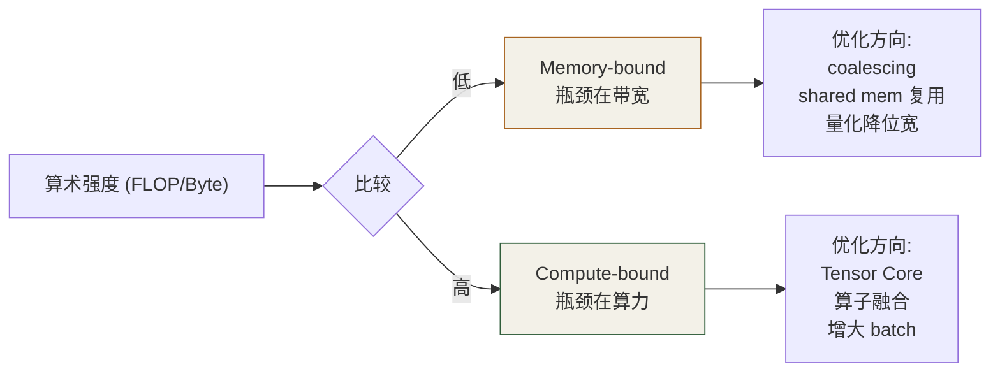
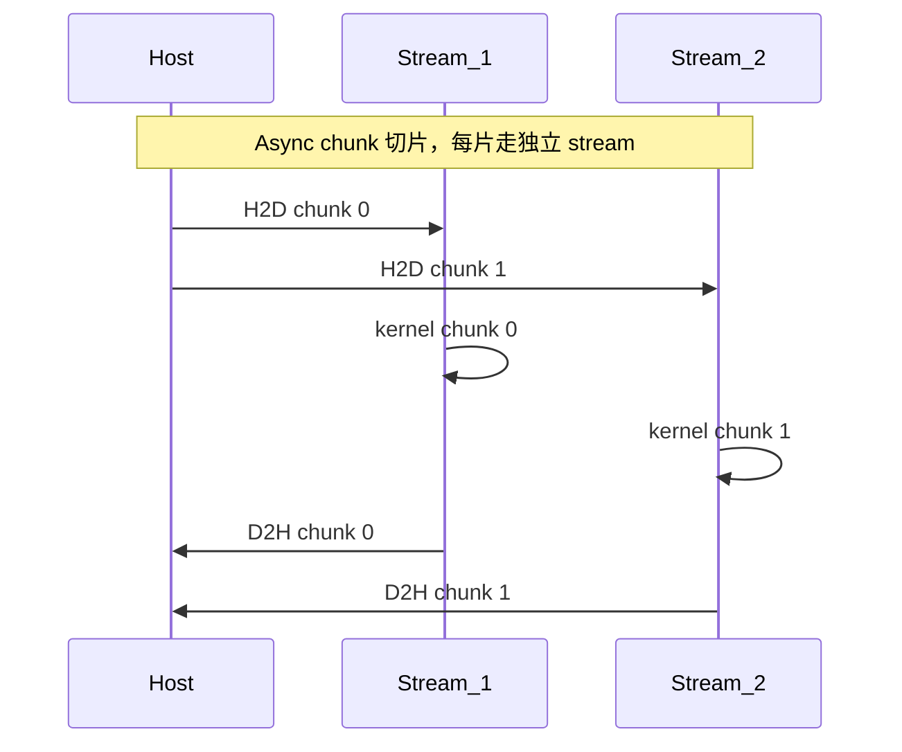
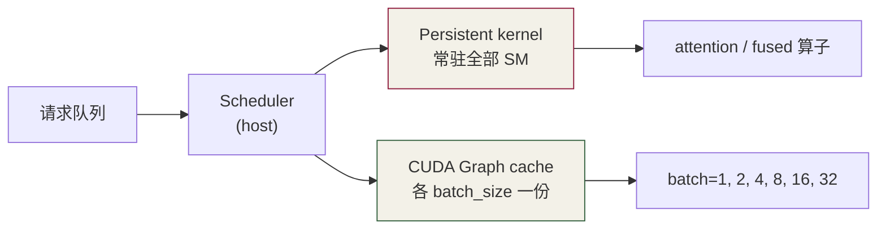

# 第 8 章 · 性能分析与异步执行

⏱️ 60 分钟🎯 用 Nsight 找瓶颈📂 code/ch08_async/

## 学习目标

  * 会用 Nsight Compute（kernel 内部）和 Nsight Systems（系统级 timeline）
  * 读懂 roofline、内存吞吐、stall reason 等关键指标
  * 用 CUDA streams 让 H2D / 计算 / D2H 三阶段并行
  * 用 CUDA Graphs 把"成千上万次 launch"压成一次

## 8.1 Roofline 模型：在哪个屋顶下？

性能分析的第一原则：先看你**受限于什么** 。



LLM 推理（小 batch）通常是 memory-bound——所有的工程套路（KV cache 优化、量化、PagedAttention）都为了减少访存。 LLM 训练 / 大 batch 推理偏 compute-bound——所以 Tensor Core / FP8 是关键。

## 8.2 Nsight 工具链

工具| 颗粒度| 看什么| 调用
---|---|---|---
Nsight Systems (nsys)| 系统级| CPU/GPU timeline, stream overlap, idle gap| `nsys profile ./app`
Nsight Compute (ncu)| 单 kernel 内| roofline, occupancy, stall reason, bank conflict 计数| `ncu --set full ./app`
nvprof (deprecated)| —| 同上但简化版| —

### 典型工作流

```
# 1. nsys 找 "kernel 占多少时间 / 哪里有 idle / H2D 重叠了吗"
nsys profile --stats=true --force-overwrite=true -o report.nsys-rep ./my_app
nsys stats report.nsys-rep     # 命令行表格

# 2. ncu 钻到具体某个 kernel 看为什么慢
ncu --set full --kernel-name matmul_tiled -o report.ncu-rep ./my_app
ncu-ui report.ncu-rep          # 图形界面看 roofline、source counter
```

**Nsight 在 Colab？** nsys / ncu 都自带在 Colab GPU runtime 里, 但 UI 看图需要下载 .nsys-rep / .ncu-rep 到本地用 Nsight Desktop 打开。

## 8.3 关键指标速读

指标| 名字| 意思| 触发动作
---|---|---|---
SM Throughput| `sm__throughput`| SM 利用率| 太低 → 增加 occupancy 或 ILP
Memory Throughput| `dram__throughput`| HBM 利用率| 太低 → 检查 coalescing
L1 Hit Rate| `l1tex__t_sectors_pipe_lsu_mem_global_op_ld_hit_rate`| L1 命中| 低 → tile 改大或换 stride
Stall: Long Scoreboard| —| 在等内存| kernel memory-bound
Stall: Math Pipe Throttle| —| 在等算力单元| kernel compute-bound
Achieved Occupancy| —| 实际驻留 warp%| 低 → 改 block size / 减寄存器
Bank Conflicts| `l1tex__data_bank_conflicts_pipe_lsu_mem_shared`| shared 冲突计数| 非 0 → padding 或换 layout

## 8.4 CUDA Streams — H2D 与计算重叠

默认 stream（NULL stream）上所有操作串行。开多个 stream，CUDA 才能并发执行：



实现要点：

  1. host buffer 必须是 **pinned** （cudaMallocHost），否则 cudaMemcpyAsync 退化成同步
  2. 用 cudaMemcpyAsync，传 stream 参数
  3. kernel 启动加第 4 个尖括号参数：`kernel<<<g, b, 0, streamX>>>(...)`

```
cudaStream_t streams[4];
for (int i = 0; i < 4; ++i) cudaStreamCreate(&streams[i]);

for (int s = 0; s < 4; ++s) {
    int off = s * chunk;
    cudaMemcpyAsync(d + off, h + off, chunk * 4, cudaMemcpyHostToDevice, streams[s]);
    my_kernel<<<g, b, 0, streams[s]>>>(d + off, chunk);
    cudaMemcpyAsync(h + off, d + off, chunk * 4, cudaMemcpyDeviceToHost, streams[s]);
}
for (int s = 0; s < 4; ++s) cudaStreamSynchronize(streams[s]);
```

实测见 [multi_stream.cu](<https://github.com/jwzheng96/learn-cuda-from-scratch/blob/main/code/ch08_async/multi_stream.cu>)。典型加速 1.5–2.5×（取决于 H2D 与 kernel 时间的比值）。

## 8.5 CUDA Graphs — 干掉 launch overhead

每次 kernel launch 大约消耗 5-10 μs。LLM 推理一个 token 要触发几十次 kernel → launch 开销可达毫秒级，对小 model 来说致命。

CUDA Graphs 思路：**把一连串 launch "录制"** 成一个图对象，重放时只付一次 launch 开销。

```
cudaGraph_t graph;
cudaGraphExec_t exec;

// 1) 进入 capture 模式
cudaStreamBeginCapture(s, cudaStreamCaptureModeGlobal);
for (int i = 0; i < 1000; ++i) tiny_kernel<<<g, b, 0, s>>>(d, N);
cudaStreamEndCapture(s, &graph);

// 2) 编译为可执行图
cudaGraphInstantiate(&exec, graph, nullptr, nullptr, 0);

// 3) 反复执行 (每次只 1 次 launch overhead)
cudaGraphLaunch(exec, s);
cudaStreamSynchronize(s);
```

典型加速（见 [cuda_graph_demo.cu](<https://github.com/jwzheng96/learn-cuda-from-scratch/blob/main/code/ch08_async/cuda_graph_demo.cu>)）：1000 次小 kernel 从 ~8 ms 降到 ~2 ms。

**📚 工业实践** ：vLLM 和 TensorRT-LLM 都用 CUDA Graphs 包裹"单步 decoding"——固定 batch、固定 seq len bucket、固定 layer，把每步内的几十次 kernel 录成一张图。

## 8.6 自检

Q1: 为什么 H2D 用 pageable 不能异步？

CUDA 必须先确保 host 内存不被 OS 换出。pageable 时 driver 要 stage 复制一次，过程同步。pinned 内存本身锁定，DMA 直接读取。

Q2: 多 stream 一定加速吗？

不一定。如果 kernel 长 → H2D 短，重叠收益小。如果 GPU 已经 100% busy，开更多 stream 反而轮流抢占。Nsight Systems 看 timeline 才能确认。

Q3: CUDA Graph 适合哪类工作负载？

① 重复执行 ② 形状/参数不变 ③ kernel 很小很多。LLM decoding 完美命中。训练时形状变化大，graph 收益小。

Q4: 同一 stream 上的 kernel 会并发吗？

不会。同 stream 严格 FIFO。要并发必须开多 stream + 显式无依赖。

Q5: `cudaEventRecord` 在 stream 上等什么？

等该 stream 上 event 之前的所有命令完成。配 cudaEventSynchronize 或 cudaStreamWaitEvent 可做 stream-to-stream 同步（不需要 host 参与）。

## 8.7 练习

  1. 用 `nsys profile` 跑 `multi_stream.cu`，截图 timeline，标出 H2D / kernel / D2H 的重叠区。
  2. 把 `cuda_graph_demo.cu` 改成 capture 一个"矩阵乘 → softmax → 矩阵乘"序列（用前面章节的 kernel）。
  3. 用 ncu 跑 Ch6 的 `matmul_tiled`，记录 Achieved Occupancy 和 L1 Hit Rate。
  4. 给 `vec_add`（Ch3）改成 4 stream 版本，比对加速比。

## 8.8 工业实战：Nsight 工作流、流优先级、生产 profile 套路

### 8.8.1 Nsight Systems：第一步永远是看 timeline

定位性能问题的**正确顺序** 是 "先大后小"：先用 nsys 看整体 timeline 是否有 GPU idle gap、CPU 阻塞、stream 是否 overlap，再用 ncu 钻具体 kernel。新手通常上来就用 ncu 调单 kernel，结果发现整体瓶颈不在那个 kernel。

```
# 1) 录制 timeline (限制时长避免文件过大)
nsys profile \
    --trace=cuda,nvtx,osrt,cudnn,cublas \
    --duration=10 \
    --force-overwrite=true \
    -o report.nsys-rep \
    ./my_llm_server

# 2) 命令行看 summary
nsys stats report.nsys-rep
# 关注 "CUDA Kernel Statistics" 表 — 哪个 kernel 占时间最多

# 3) GUI 看 timeline (本地 Mac/Win 用 Nsight Systems Desktop 打开)
# 关键视角:
#  - GPU 行: 看 kernel 之间有没有 gap (= idle)
#  - CUDA HW row: H2D/D2H 跟 kernel 是否 overlap
#  - CPU 行: 主线程是否被 cudaMemcpy 阻塞 (说明没用 pinned + async)
```

### 8.8.2 NVTX 注解 — 让 timeline 可读

不打 NVTX 标记，timeline 上一堆 mykernel_v2 / mykernel_v3 完全看不出哪是 attention、哪是 MLP。生产代码**必须** 在每个逻辑段加 NVTX range：

```
#include <nvtx3/nvToolsExt.h>

void forward(...) {
    nvtxRangePushA("layer_0");
    {
        nvtxRangePushA("attention");
        nvtxRangePushA("qkv_proj");   qkv_proj_kernel(...);   nvtxRangePop();
        nvtxRangePushA("flash_attn"); flash_attn_kernel(...); nvtxRangePop();
        nvtxRangePushA("out_proj");   out_proj_kernel(...);   nvtxRangePop();
        nvtxRangePop();  // attention
        nvtxRangePushA("mlp"); /* ... */ nvtxRangePop();
    }
    nvtxRangePop();  // layer_0
}
```

PyTorch 已经把 NVTX 集成进 `torch.profiler`，会自动给每个 op 加标记。

### 8.8.3 Nsight Compute：钻进单 kernel

找到瓶颈 kernel 后用 ncu 看为什么慢。**关键 set：**

```
# 完整指标 (最慢, 但信息最全, 一次抓清)
ncu --set full --target-processes all -o report.ncu-rep ./app

# 只抓特定 kernel (按名字匹配)
ncu --set full --kernel-name regex:".*flash_attn.*" -o fa.ncu-rep ./app

# 仅看 roofline + memory
ncu --section MemoryWorkloadAnalysis --section SpeedOfLight ./app

# 一次只跑 N 次 (避免长 trace)
ncu --launch-count 1 --launch-skip 100 ./app
```

用 Nsight Compute UI 打开 .ncu-rep 文件，**先看 "Speed Of Light" 节** ——两个百分比：

  * **SM %** = 算力利用率。低 → compute-bound 失败 / 寄存器spill / divergence
  * **Memory %** = HBM 带宽利用率。低 → 访存模式差 / cache miss / 算术强度低
  * 两者都低（< 30%）→ kernel 在等同步、stream serialization、launch 开销过大

### 8.8.4 必看的 10 个 ncu 指标

指标| 含义| 正常区间| 异常含义
---|---|---|---
sm__throughput.avg.pct_of_peak_sustained_elapsed| SM 利用率| >70% (compute-bound) 或 <30% (mem-bound)| 中间值最可疑
dram__throughput.avg.pct_of_peak_sustained_elapsed| HBM 利用率| >80% mem-bound kernel 期望| <30% + 期望 mem-bound = coalescing 差
smsp__sass_thread_inst_executed_op_fadd_pred_on...| fp32 指令吞吐| —| 跟期望 GFLOPS 对照
sm__pipe_tensor_cycles_active.avg.pct_of_peak_sustained_elapsed| Tensor Core 活跃%| >50% for fp16 GEMM| 0 → 没触发 TC
l1tex__data_bank_conflicts_pipe_lsu_mem_shared| shared bank conflict 计数| 0| 非 0 → 加 padding 或 swizzle
smsp__warps_active.avg.per_cycle_active| 平均活跃 warp / SM| vs max 比例 = achieved occupancy| 低 → block 太小或资源占用高
smsp__warp_issue_stalled_long_scoreboard_per_warp_active| 等内存 stall| —| 高 → 内存 bound
smsp__warp_issue_stalled_math_pipe_throttle...| 算力单元 throttle| —| 高 → compute bound
launch__registers_per_thread| 每 thread 寄存器| < 96 健康| > 128 可能 spill
memory_l2_hit_rate| L2 命中率| >50% 好| 低 → working set 超 L2

### 8.8.5 PyTorch / Python 侧的 profile

不是所有人都写裸 CUDA。LLM 工程师常用 PyTorch profiler：

```
import torch
from torch.profiler import profile, schedule, tensorboard_trace_handler

with profile(
    activities=[torch.profiler.ProfilerActivity.CPU,
                torch.profiler.ProfilerActivity.CUDA],
    schedule=schedule(wait=1, warmup=2, active=3),
    on_trace_ready=tensorboard_trace_handler('./log'),
    record_shapes=True,
    with_stack=True,
) as prof:
    for step in range(10):
        model(inputs)
        prof.step()

# 跑完用 tensorboard 看, 或者 chrome://tracing 打开 .json
```

### 8.8.6 流优先级 — 让推理请求插队

多请求并发推理时，**新来的低延迟请求** 应该比"大 batch background 任务"优先。CUDA stream 支持优先级：

```
int low, high;
cudaDeviceGetStreamPriorityRange(&low, &high);
// low = 0, high = -1 (典型, 越小越高优先级, 看你 GPU)

cudaStream_t s_high, s_low;
cudaStreamCreateWithPriority(&s_high, cudaStreamNonBlocking, high);
cudaStreamCreateWithPriority(&s_low,  cudaStreamNonBlocking, low);

// 新来的 prompt 走 s_high, 大 batch 走 s_low
// 硬件调度器在 SM 上抢占 (会 preempt 当前 block 边界)
```

典型应用：vLLM 实现"chat 优先于 batch"调度，TensorRT-LLM 把 prefill 与 decode 放不同优先级。

### 8.8.7 production profile 工作流

  1. **定位** ：nsys 录 timeline → 看 stats 找耗时 top kernel
  2. **分析** ：ncu --set full 抓 top kernel → 看 SoL 百分比定性是 compute / memory / latency bound
  3. **对症** ：
     * compute-bound → 换 Tensor Core / 提高 ILP / 减 divergence
     * memory-bound → coalesce / tile / 量化降位宽
     * latency-bound (两者都低) → 检查 occupancy, launch 频率, sync 次数
  4. **验证** ：再录 nsys 对比 timeline 是否变窄
  5. **回归** ：把改动放进 CI 性能门禁（防止后续 commit 反向优化）

**常见误区** ：

  * 只看一个 size 的 benchmark → 改完发现其他 size 性能反退（CUTLASS autotune 就在防这个）
  * 没 warmup 第一次 timing → 包含 CUDA context init、cuBLAS 加载、Tensor Core 预热
  * 用 `std::chrono` 测 GPU 时间 → 没 sync 时返回的是 launch 时间不是 kernel 时间

## 8.9 研究前沿（2025-2026）：CUDA Graph 进化与新 profile 工具

### 8.9.1 CUDA Graph 条件节点（Conditional Nodes，CUDA 12.4+）

原始 CUDA Graph 是**静态** 的：capture 时怎样，重放就怎样。LLM 推理里"循环到 EOS 才停"这种动态控制流没法 capture 到一张 graph 里——只能展开成 max_tokens 张 graph 或者分多次 launch。

CUDA 12.4 引入 **conditional graph nodes** ：

```
cudaGraphConditionalHandle handle;
cudaGraphConditionalHandleCreate(&handle, graph, /*default=*/0, 0);

// 添加一个 "while (handle != 0)" 节点
cudaGraphNode_t while_node;
cudaGraphNodeParams params = {};
params.type = cudaGraphNodeTypeConditional;
params.conditional.handle = handle;
params.conditional.type   = cudaGraphCondTypeWhile;
params.conditional.size   = 1;
cudaGraphAddNode(&while_node, graph, deps, n_deps, &params);

// 在循环 body kernel 里更新 handle:
__device__ void check_eos(int token, cudaGraphConditionalHandle h) {
    if (token == EOS_ID) cudaGraphSetConditional(h, 0);   // 退出循环
    else                 cudaGraphSetConditional(h, 1);
}
```

意义：**一次 launch 能跑完整个生成过程** ，包括动态停止判断。vLLM 0.6+ 和 TRT-LLM 已在用，端到端延迟 -20-40%。

### 8.9.2 Nsight Compute 2025 — fp4 / fp8 Roofline 支持

2025 版 Nsight Compute 关键更新：

  * fp8 / fp4 算力作为独立 roofline 轴（之前只有 fp16/fp32）
  * TMEM occupancy 指标（Blackwell）
  * wgmma / TCGEN05 流水利用率细分
  * **Auto-tuning advisor** ：分析后给出"改 tile / 改 launch_bounds / 加 cp.async" 等具体建议
  * SQLite report 格式（之前是 protobuf），方便用 Python 自动分析

### 8.9.3 PyTorch Profiler + Holistic Trace Analysis

Meta 开源 **HTA (Holistic Trace Analysis)** 把 PyTorch profiler trace 自动化分析：

```
from hta.trace_analysis import TraceAnalysis
ta = TraceAnalysis(trace_dir="./logs")
ta.get_temporal_breakdown()        # GPU compute / comm / idle 占比
ta.get_gpu_kernel_breakdown()      # 单 kernel top
ta.get_communication_comp_overlap()# NCCL 是否跟 compute overlap
ta.get_idle_time_breakdown()       # SM idle 是因为什么 stall
```

对大规模训练 / 推理服务来说，能省下手工看 timeline 几小时的工作。

### 8.9.4 持久化 kernel + CUDA Graph 混合模式

vLLM、TRT-LLM、SGLang 在 2024-2025 大量采用的模式：



  * **Persistent kernel** 永远在线，从 host 的 work queue 拉任务（用于动态调度的 attention / sampling）
  * **CUDA Graph** 预 capture 各 bucket 的"标准 decode 一步"
  * scheduler 每步选 batch_size bucket → launch 对应 graph
  * graph 内部参数（KV 位置、当前 token）用 `cudaGraphExecKernelNodeSetParams` 动态更新

实测端到端：纯 CUDA Graph 帮你省 ~30% latency；持久化 kernel 再省 ~10%；两者组合是 SOTA。

### 8.9.5 NVSHMEM / 多 GPU 异步通信

NCCL 之外的 2024-2026 新选择：**NVSHMEM** （NVIDIA 推的 PGAS 风格库），让 kernel 内直接 `put / get` 跨 GPU 内存，跟 NVLink 硬件深度绑定：

```
__global__ void cross_gpu_attn(...) {
    /* compute local */
    nvshmem_putmem_block(remote_addr, local_addr, bytes, peer_pe);
    nvshmem_barrier_all();
    /* compute global */
}
```

比 NCCL 集合通信粒度更细，对 **Ring Attention / Stripe Attention / Expert Parallel** 等"边算边通信"模式收益大。TensorRT-LLM 长 context 推理已在用。

### 8.9.6 端到端性能调优新范式

2025 的"性能调优"已经从"调单 kernel" 转向**"端到端 trace 驱动"** ：

  1. 跑 nsys + HTA 录 timeline 跨 GPU / CPU / 通信
  2. 找**关键路径** （critical path）—— 通常是某 GPU 的 kernel + NCCL 阻塞
  3. 优化关键路径上的 1-2 个 kernel（用 ncu 钻），其他保持现状
  4. 验证 timeline 是否被压缩

关键 KPI：单 GPU 不是 throughput 而是**"在关键路径上的占比"** 。这是大规模分布式训练 / 推理性能工程的工作模式。

## 8.10 常见坑

  * 用 pageable host 内存做 async memcpy → 实际是同步，看 nsys 才发现重叠"消失"
  * graph capture 时 kernel 参数指针不能改 → 改了需要 `cudaGraphExecUpdate`
  * 多 stream 共享同一 device buffer 又不加事件同步 → race

到此**阶段 B 结束** 。你已经具备了写高性能 kernel 的全部工具。下一章我们用这些工具一气呵成把 GEMM 推到接近硬件极限。
