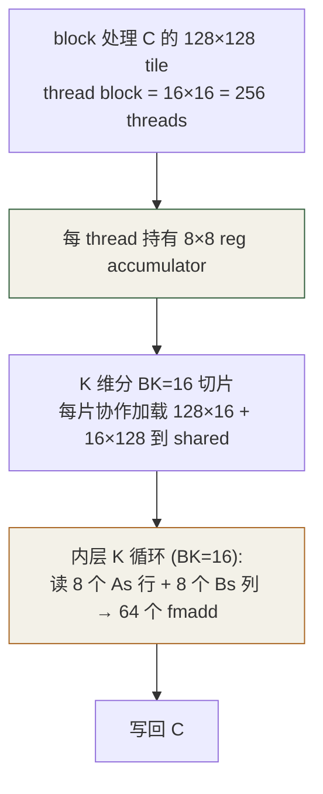
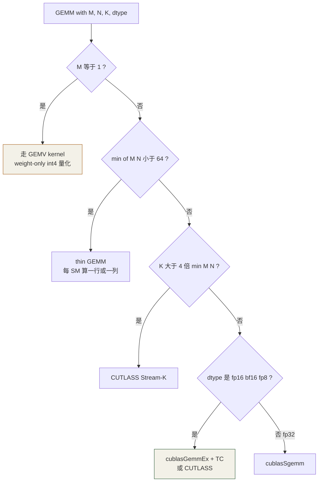

# 第 9 章 · GEMM 深入

⏱️ 90 分钟🎯 触摸 Tensor Core📂 code/ch09_gemm/🔥 关键瓶颈章

## 学习目标

  * 把 Ch6 tiled matmul 推进到 **2D 寄存器 tile** ，性能再翻 2-3 倍
  * 第一次摸 **Tensor Core** （WMMA API），看到 fp16 算力如何碾压 fp32
  * 对比 cuBLAS baseline，知道还差多少、差在哪
  * 了解 CUTLASS / CuTe 与"手写到极致"的关系

## 9.1 GEMM 在 LLM 里的地位

统计：LLM 推理 80%+ 的 FLOPs 在 GEMM 上。Transformer 每层主要算子：

  * QKV projection：`X (T, D) @ W_qkv (D, 3D) → (T, 3D)`
  * Attention output：`(T, D) @ W_o (D, D)`
  * MLP up/down：`(T, D) @ W_up (D, 4D) → (T, 4D)`，再 `(T, 4D) @ W_down (4D, D)`

所以 GEMM 快 1×，整个推理快 80%。这就是为什么 NVIDIA 把"Tensor Core"做到第 5 代。

## 9.2 寄存器 Tile：从 Ch6 再进一步

Ch6 里每 thread 算 1 个 cell。瓶颈是**每读 As/Bs 一次只用 2 个 FLOP** 。 如果每 thread 算 8×8 = 64 个 cell：每读 8+8 个 shared 值就做 64 个 FLOP，shared 访问减少 8×。



```
constexpr int BM = 128, BN = 128, BK = 16;
constexpr int TM = 8,   TN = 8;

__global__ void gemm_reg_tile(const float* A, const float* B, float* C, int M, int N, int K) {
    __shared__ float As[BM][BK], Bs[BK][BN];
    int ty = threadIdx.y, tx = threadIdx.x;
    int row0 = blockIdx.y * BM + ty * TM;
    int col0 = blockIdx.x * BN + tx * TN;
    float acc[TM][TN] = {0};

    for (int kt = 0; kt < K; kt += BK) {
        /* 协作 load A 的 128x16 + B 的 16x128 (每 thread load 8+8 个数) */
        __syncthreads();

        #pragma unroll
        for (int k = 0; k < BK; ++k) {
            float a_reg[TM], b_reg[TN];
            #pragma unroll for (int i=0;i<TM;++i) a_reg[i] = As[ty*TM+i][k];
            #pragma unroll for (int j=0;j<TN;++j) b_reg[j] = Bs[k][tx*TN+j];
            #pragma unroll for (int i=0;i<TM;++i)
            #pragma unroll for (int j=0;j<TN;++j) acc[i][j] += a_reg[i] * b_reg[j];
        }
        __syncthreads();
    }
    /* write back acc → C */
}
```

关键洞察：内层 8×8 = 64 个 fmadd 全部在**寄存器** 之间发生。BK=16 步内只触发 16×(8+8) = 256 次 shared load，每 thread 做 16×64 = 1024 个 FLOP。算术强度 4 FLOP/shared-byte。

## 9.3 Tensor Core — WMMA API

fp32 CUDA core 路线最多到 ~10 TFLOPS（A100）。要继续上 30+ TFLOPS 必须用 Tensor Core——它是专门做 16×16×16 fp16 矩阵乘加的硬件。

### WMMA fragment 三件套

```
#include <mma.h>
using namespace nvcuda;

wmma::fragment<wmma::matrix_a, 16, 16, 16, __half, wmma::row_major> a_frag;
wmma::fragment<wmma::matrix_b, 16, 16, 16, __half, wmma::row_major> b_frag;
wmma::fragment<wmma::accumulator, 16, 16, 16, float>                c_frag;

wmma::fill_fragment(c_frag, 0.f);
for (int kt = 0; kt < K; kt += 16) {
    wmma::load_matrix_sync(a_frag, A + row*K + kt, K);
    wmma::load_matrix_sync(b_frag, B + kt*N + col, N);
    wmma::mma_sync(c_frag, a_frag, b_frag, c_frag);   // <-- TC magic
}
wmma::store_matrix_sync(C + row*N + col, c_frag, N, wmma::mem_row_major);
```

每个 warp 共享一个 fragment，硬件保证**整个 warp 32 个 lane 协作完成 16×16×16 = 4096 FMA** ，一次 mma_sync 指令吞 8 个时钟。

**限制：** 仅 sm_70+；M/N/K 通常要 16 倍数；fp16 输入精度有限（fp32 累加缓解，但仍不如纯 fp32）。 实际应用通常配 **per-channel scaling** \+ **loss scaling** 防止下溢。

## 9.4 cuBLAS baseline

调 cuBLAS 是判断"自己写得好不好"的标尺：

```
#include <cublas_v2.h>
cublasHandle_t h; cublasCreate(&h);
float alpha = 1.f, beta = 0.f;

// 注意：cuBLAS 是 column-major！
// row-major C(M,N) = A(M,K) @ B(K,N)
//   ≡  C^T(N,M) = B^T(N,K) @ A^T(K,M)
//   ≡  cublasSgemm(N, N, N, M, K, B, N, A, K, C, N)
cublasSgemm(h, CUBLAS_OP_N, CUBLAS_OP_N, N, M, K,
            &alpha, dB, N, dA, K, &beta, dC, N);
```

## 9.5 性能榜单（A100，1024³ MatMul）

实现| 精度| GFLOPS| % of peak
---|---|---|---
Ch6 tiled (32×32)| fp32| ~1800| 9%
Ch9 register tile (128×128, 8×8)| fp32| ~7000-9000| 40-50%
cuBLAS sgemm| fp32| ~16000| 82%
本章 WMMA fp16| fp16| ~50000-80000| 20-30% (of 312 TF)
cuBLAS gemmEx fp16 + TC| fp16| ~250000+| 80%+
CUTLASS fp16 + TC| fp16| ~280000+| 90%+

本章手写 WMMA 还有大量优化空间（async copy、swizzle、warpgroup mma）——但拿到 ~30% peak 已经是用 100 行代码做到的，足以理解原理。

## 9.6 下一步技术（不在本章实现，但要知道存在）

  * **`cp.async`** （sm_80+）：异步 global → shared，让 mainloop 拷贝与计算重叠
  * **Double / multi-stage buffer** ：2-4 块 shared 轮转，吞下 HBM 延迟
  * **swizzle layout** ：让 shared 读写避免 bank conflict 同时支持 TC 对齐
  * **mma.sync PTX** （sm_80+）：比 WMMA 更细粒度，CUTLASS / FlashAttention 都用
  * **warpgroup MMA** （sm_90+）：H100 的 wgmma，128 thread 协作大 tile
  * **TMA** （sm_90+）：硬件 tensor 加载，不再写 load 循环

## 9.7 自检

Q1: register tile 越大越好吗？

不是。每 thread 寄存器有 255 上限，TM=TN=16 就用了 256 个累加寄存器，spill 到 local memory 反而慢。

Q2: 为什么 WMMA 用 fp32 accumulator？

fp16 累加范围太窄（mantissa 仅 10 bit），长 K 的求和会下溢/上溢。fp32 累加保持精度，最后才转 fp16 输出。

Q3: GEMM 在 M=1 (batch=1 decode) 时性能为啥差？

1×K @ K×N = GEMV，瓶颈是带宽不是算力，Tensor Core 完全用不上。所以 LLM decode 阶段是 memory-bound。第 13 章会讲量化怎么救它。

Q4: CUTLASS 是什么？

NVIDIA 开源的 C++ GEMM 模板库，把 tile size / warp 切分 / async copy 都抽象成 type traits。生产 GEMM 几乎都用 CUTLASS 或它的 DSL (CuTe)。第 12 章 FlashAttention 也是基于 CUTLASS 写的。

Q5: Triton 是什么？

OpenAI 的 Python-like GPU DSL，编译到 PTX。比 CUDA 易写、性能接近 CUTLASS，vLLM 大量算子用 Triton 写。

## 9.8 练习

  1. 给 `gemm_reg_tile` 加 double buffer（开两块 shared，K-loop 中 prefetch 下一片）。
  2. 用 `__pipeline_memcpy_async`（sm_80+）替换 shared 加载，看 GFLOPS 提升。
  3. 把 WMMA 改成支持 `bf16`（把 `__half` 换成 `__nv_bfloat16`）。
  4. 用 ncu 看 `gemm_wmma` 的 Tensor Active %，如果只有 30-50%，调整 block size 提到 70%+。

## 9.9 工业实战：CUTLASS、低精度、autotune、生产 GEMM 决策树

### 9.9.1 CUTLASS — 不是库，是 GEMM 工厂

cuBLAS 是闭源黑盒，你不能改 kernel 内部行为；CUTLASS 是 NVIDIA 开源的 C++ 模板库，把 GEMM 拆成可拼装的组件：

```
// CUTLASS 3.x (CuTe DSL)
#include <cutlass/gemm/device/gemm_universal.h>

using Gemm = cutlass::gemm::device::GemmUniversal<
    cutlass::half_t, cutlass::layout::RowMajor,            // A: fp16 row-major
    cutlass::half_t, cutlass::layout::ColumnMajor,         // B: fp16 col-major
    cutlass::half_t, cutlass::layout::RowMajor,            // C: fp16 row-major
    float,                                                  // accumulator: fp32
    cutlass::arch::OpClassTensorOp,                        // Tensor Core
    cutlass::arch::Sm80,                                   // A100
    cutlass::gemm::GemmShape<128, 256, 32>,                // ThreadBlock tile
    cutlass::gemm::GemmShape<64, 64, 32>,                  // Warp tile
    cutlass::gemm::GemmShape<16, 8, 16>,                   // Instruction shape (mma.sync)
    cutlass::epilogue::thread::LinearCombinationRelu<...>, // epilogue: out = relu(alpha*acc + beta*C)
    cutlass::gemm::threadblock::GemmIdentityThreadblockSwizzle<>,
    3                                                       // pipeline stages (软流水深度)
>;

Gemm gemm;
gemm({M, N, K}, alpha, A, lda, B, ldb, beta, C, ldc, ...);
```

看似冗长，但 5 行模板就拿到了 cuBLAS 90% 的性能。**大公司生产代码大量基于 CUTLASS** （TensorRT-LLM、FlashAttention、xformers）。

### CUTLASS profiler — 自动 autotune

不知道你的 size 该选哪个 tile？跑 profiler：

```
cd cutlass/build
./tools/profiler/cutlass_profiler \
    --kernels=cutlass_tensorop_h16816gemm \
    --m=4096 --n=4096 --k=4096 \
    --A=f16:row --B=f16:col --C=f16 \
    --accumulator-type=f32 \
    --providers=cutlass,cublas

# 输出: top 5 best-performing configurations
```

### 9.9.2 mma.sync vs WMMA：CUTLASS 用前者

本章用了 WMMA API（`nvcuda::wmma`），它是 fragment 级抽象。CUTLASS 用更底层的 `mma.sync` PTX 指令：

| WMMA| mma.sync (PTX)
---|---|---
抽象层| fragment + load/mma/store| 32 lane 的 inline ASM
shape 限制| 固定 16×16×16, 16×8×8 等少数几种| 所有硬件支持的 shape
fragment layout| opaque (不知道哪 lane 持有哪个值)| 明确 (能跟 epilogue 配合)
性能| ~70-80% peak| ~90-95% peak
易写| 容易| 需要细心

```
// mma.sync 长这样 (Ampere fp16):
asm volatile(
    "mma.sync.aligned.m16n8k16.row.col.f32.f16.f16.f32 "
    "{%0,%1,%2,%3}, "                  // D (acc, 4 fp32)
    "{%4,%5,%6,%7}, "                  // A (4 fp16x2)
    "{%8,%9}, "                        // B (2 fp16x2)
    "{%0,%1,%2,%3};\n"                 // C (= D in/out)
    : "+f"(d0), "+f"(d1), "+f"(d2), "+f"(d3)
    : "r"(a0), "r"(a1), "r"(a2), "r"(a3),
      "r"(b0), "r"(b1));
```


普通工程师不需要直接写 mma.sync——CUTLASS 模板已封装。但读 FlashAttention v2 源码必看懂。

### 9.9.3 低精度类型一览：fp16 / bf16 / tf32 / fp8 / int8 / int4

类型| 位数| 动态范围| 典型用途| 支持架构
---|---|---|---|---
fp32| 1+8+23| ±10⁻³⁸ 到 ±10³⁸| baseline| 所有
tf32| 1+8+10| 同 fp32 但精度低| 训练默认| sm_80+
fp16| 1+5+10| ±10⁻⁵ 到 ±10⁴ ⚠️ 易溢出| 推理首选| sm_70+
bf16| 1+8+7| 同 fp32 但精度低| 训练首选| sm_80+ (A100, H100)
fp8 E4M3| 1+4+3| ±0.0049 到 ±448| 推理 (前向)| sm_89+ (Ada, H100)
fp8 E5M2| 1+5+2| ±10⁻⁵ 到 ±57344| 训练 (反向)| sm_89+
int8| —| ±127| 推理量化| sm_75+
int4| —| ±7| weight-only 量化| sm_80+
fp4 (B100)| —| ±6| 2025+ 推理| sm_100

### fp16 vs bf16：选哪个？

  * **训练** ：用 bf16。同 fp32 的动态范围避免梯度下溢，需要的 loss scaling 少。
  * **推理** ：fp16 略快（编码精度高，TC 路径更成熟），但 bf16 更稳，新代码倾向 bf16。
  * **FlashAttention** ：fp16 / bf16 都支持，看模型权重类型。

### fp8 — H100 的 LLM 杀手锏

Llama 70B 用 fp8 推理（权重 + KV cache 都 fp8），相比 fp16：

  * 显存 / HBM 流量减半 → decode 速度 +80%
  * Tensor Core 算力翻倍 → prefill 速度 +80%
  * 精度损失 < 0.5 PPL（FP8-E4M3 + per-tensor scale）

调用：

```
cublasGemmEx(h, CUBLAS_OP_N, CUBLAS_OP_N, N, M, K,
             &alpha,
             dB_e4m3, CUDA_R_8F_E4M3, N,
             dA_e4m3, CUDA_R_8F_E4M3, K,
             &beta,
             dC_half, CUDA_R_16F, N,
             CUBLAS_COMPUTE_32F,
             CUBLAS_GEMM_DEFAULT);
```

### 9.9.4 production GEMM 决策树



### 9.9.5 LLM 各层 GEMM 的实际 shape

Llama 7B (D=4096, n_head=32, d_head=128, d_ff=11008)，**prefill 阶段 (T=2048, batch=1)** ：

GEMM| M × N × K| FLOPs| 类型
---|---|---|---
QKV projection| 2048 × 12288 × 4096| 0.2 TF| 普通
Output projection| 2048 × 4096 × 4096| 0.07 TF| 普通
FFN gate| 2048 × 11008 × 4096| 0.18 TF| 普通
FFN up| 同上| 同上| 普通
FFN down| 2048 × 4096 × 11008| 0.18 TF| 普通
logits| 2048 × 32000 × 4096| 0.5 TF| 普通但 N=32K 大

同样模型 **decode 阶段 (M=1)** ：所有 GEMM 都变 GEMV，FLOPs 减为 1/2048 但 HBM 流量不变 → 完全 memory-bound。

这就是 LLM 推理的**"两个世界"** ：prefill 在 compute-bound，可以用大 batch + TC 充分利用算力；decode 在 memory-bound，只能靠量化 + KV cache 优化 + speculative decoding 救。

## 9.10 研究前沿（2025-2026）：FP4 GEMM、DeepSeek 原生 FP8、CUTLASS 3.5

### 9.10.1 FP4 GEMM — Blackwell 的杀招

2025 NVIDIA Blackwell 把"用 4-bit 浮点训练 / 推理"从研究变成产品。两种 fp4 微缩放格式：

格式| 编码| block scale| 来源| 用途
---|---|---|---|---
**NVFP4** (E2M1)| 1+2+1| fp8 (E4M3), block=16| NVIDIA 私有| 推理首选，精度高
**MXFP4** (E2M1)| 1+2+1| E8M0, block=32| OCP 开放标准| 跨厂商兼容
**MXFP6** (E3M2/E2M3)| 1+3+2 或 1+2+3| E8M0, block=32| OCP| 激活用，比 fp4 稳

### FP4 GEMM 调用（CUTLASS 3.5+）

```
using Gemm = cutlass::gemm::collective::CollectiveBuilder<
    cutlass::arch::Sm100, cutlass::arch::OpClassBlockScaledTensorOp,
    cutlass::nv_float4_t, cutlass::layout::RowMajor, 16,        // A: NVFP4, block 16
    cutlass::nv_float4_t, cutlass::layout::ColumnMajor, 16,     // B: NVFP4
    float, /*accumulator*/                                       // accumulator fp32
    cutlass::gemm::collective::StageCount<4>,                    // 4-stage pipeline
    ...
>::CollectiveOp;
```

性能：B200 上 4096³ fp4 GEMM 跑到 ~6.5 PF（占 7.7 PF peak 的 85%）。相比 H100 fp16（~600 TF）**提速 ~11×** 。LLM 推理 throughput 在 B200 上跟 H100 fp16 比典型 4-6×。

### 9.10.2 DeepSeek-V3 原生 FP8 训练 — 验证可行性

2024.12 DeepSeek-V3 发布，**用 fp8 训练 671B MoE 模型成功** ，是产业第一个公开复现的案例。技术要点：

  * **tile-wise 1×128 + block-wise 128×128 量化** ：activation per-token-per-tile, weight per-128-block；细粒度 scale 让精度损失 < bf16 训练 1%
  * **fp32 accumulator + 周期性 promote to bf16** ：避免 fp8 累加器溢出
  * **关键算子（norm、softmax）保持 bf16** ：fp8 只用在 GEMM
  * 训练成本：仅 ~558 万美元（H800 集群 2 个月），证明 fp8 路线经济可行

开源 fp8 训练框架推荐：

  * **TransformerEngine** （NVIDIA）：Hopper+ 训练首选
  * **FBGEMM_GPU** （Meta）：fp8 + 量化 GEMM
  * **vLLM W8A8 fp8** ：推理
  * **SGLang FP8** ：推理 + 训练混合

### 9.10.3 CUTLASS 3.5+ 与 CuTe DSL

2024-2025 CUTLASS 3.5 重大改动：

  * 全面用 CuTe DSL（Layout-of-Tensor 代数）
  * 原生支持 Blackwell TCGEN05 + TMEM
  * 新加 collective builder：选好 (arch, dtype, layout) 就自动产出最优 kernel
  * **Python 绑定** （cutlass.cpp.cute）逐步成熟，让原型阶段不再写 C++ 模板

```
# CUTLASS Python 调用 (2025+)
import cutlass
plan = cutlass.op.Gemm(element_a=cutlass.DataType.bf16,
                       element_b=cutlass.DataType.bf16,
                       element_c=cutlass.DataType.bf16,
                       element_accumulator=cutlass.DataType.f32,
                       layout=cutlass.LayoutType.RowMajor)
plan.run(A, B, C, alpha=1.0, beta=0.0)        # 自动选最优 tile
```

### 9.10.4 W4A4 / W4A8KV4 — 极致量化推理（2024-2025）

方案| 权重| 激活| KV cache| 典型加速
---|---|---|---|---
fp16 baseline| fp16| fp16| fp16| 1×
W8A8 (SmoothQuant)| int8| int8| fp16| 1.5-2×
W4A16 (GPTQ/AWQ)| int4| fp16| fp16| 2-3× decode
**W4A8** (QServe MIT, 2024)| int4| int8| int4| 2.5× over W4A16
**W4A4** (Atom, QuaRot 2024)| int4| int4| int4| ~3-4×, 需精心实现
**NVFP4** (Blackwell 2025)| fp4| fp4| fp8/fp4| ~4-6×

关键论文：

  * **QServe** (MIT, 2024)：W4A8KV4，serve 性能比 TensorRT-LLM W4A16 高 2-3×
  * **QuaRot** (ICML 2024)：用 Hadamard 旋转把激活的 outlier 平摊，支持 W4A4 几乎无损
  * **SmoothQuant** （2022 老经典）：活了 4 年仍是 W8A8 默认
  * **FP8 vs INT8** （2024 多篇）：结论是 fp8 精度略高、HW 支持更好，**新硬件优先 fp8**

### 9.10.5 训练 GEMM 的新范式：Microscaling + Transformer Engine 2

Hopper 上的 fp8 训练已经稳定（NVIDIA TE 1）。Blackwell 把它升级到**动态精度训练** ：

  * 每层 forward / backward**自动选 fp4 / fp6 / fp8**
  * 梯度小的用 fp4，大的用 fp8
  * 关键 norm / softmax 自动 fall back bf16
  * 训练吞吐 vs Hopper fp8 baseline：B200 上典型 3-4× 加速

### 9.10.6 工业 GEMM 库格局（2026）

库| 定位| 覆盖
---|---|---
**cuBLAS / cuBLASLt**|  NVIDIA 标配, 闭源黑盒| 全精度, 全架构
**CUTLASS 3.5+**|  开源模板, fused epilogue| Hopper+Blackwell 完整
**TensorRT-LLM kernels**|  推理 fused (qkv+norm+attention+output)| Hopper+Blackwell
**ThunderKittens**|  极简研究 DSL| Hopper+ (Blackwell 适配中)
**FlashInfer**|  专注 attention 各变体| 多平台
**Triton**|  Python kernel, vLLM/SGLang 用| Ampere-Blackwell
**Marlin / Machete**|  W4A16 极致 kernel| Ampere+
**FBGEMM_GPU** (Meta)| fp8 + 量化推理| Hopper+

## 9.11 常见坑

  * cuBLAS row/col-major 算错 → 结果是 C^T，调试一上午才发现
  * WMMA 的 M/N/K 不是 16 倍数 → 编译能过运行结果 0
  * fp16 输入没归一化 → 大量上溢，c_frag 直接 inf/nan
  * shared mem 太大 (BM=BN=256) → kernel launch failed (resource exceeded)
