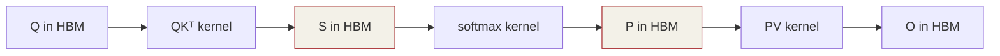

# 第 11 章 · Attention 入门

⏱️ 70 分钟🎯 写出 SDPA📂 code/ch11_attention/

## 学习目标

  * 把"**缩放点积注意力** "翻译成代码：QKᵀ → softmax → ·V
  * 实现 **fused QKV projection** （1 个 GEMM 代替 3 个）
  * 看清朴素实现的 **O(T²) HBM 物化问题** ——为下一章 FlashAttention 埋伏笔
  * 会处理 causal mask

## 11.1 数学复习

Scaled Dot-Product Attention (single head, single batch):

```
S = Q @ K^T / sqrt(D)     # (T, T)
P = softmax_row(S + mask) # (T, T)
O = P @ V                 # (T, D)
```

  * Q, K, V 形状 (T, D)，T = 序列长度，D = head_dim（GPT-2 small 是 64）
  * scale = 1/√D 防止 softmax 输入太大
  * causal mask：自回归生成时，token i 不能看到 j>i 的 token，所以 S[i,j>i] = -∞

## 11.2 Fused QKV Projection

输入 X: (T, D)。原本要做三次 GEMM：

```
Q = X @ W_q   (T, D) @ (D, D)
K = X @ W_k
V = X @ W_v
```

把 `W_qkv = [W_q; W_k; W_v]` 水平拼成 (D, 3D)，一次 GEMM 出 (T, 3D) 再 split：

```
// 1) 1 个 GEMM
gemm(X, W_qkv, QKV, T, 3*D, D);

// 2) split (T, 3*D) → 三个 (T, D)
__global__ void split_qkv(...) {
    int t = ..., d = ...;
    q[t*D+d] = qkv[t*3*D + 0*D + d];
    k[t*D+d] = qkv[t*3*D + 1*D + d];
    v[t*D+d] = qkv[t*3*D + 2*D + d];
}
```

好处：

  * 3 个 GEMM → 1 个 → kernel launch 开销少 2/3
  * GPU 利用率高（单个大 GEMM 比三个中等 GEMM 容易跑满）
  * 权重一次 H2D，cache 局部性更好

**工业实践：** TRT-LLM、vLLM、llama.cpp 都用 fused QKV。Llama 还做了进一步的 GQA（Grouped Query Attention）让 K/V 投影更少，下一章后会顺带提到。

## 11.3 朴素三阶段 Attention

源码：[attention_naive.cu](<https://github.com/jwzheng96/learn-cuda-from-scratch/blob/main/code/ch11_attention/attention_naive.cu>)

```
// Step 1: S = Q @ K^T * scale   (T, T)
__global__ void qkt_scale(const float* Q, const float* K, float* S,
                          int T, int D, float scale, bool causal) {
    int i = ...,  j = ...;
    if (causal && j > i) { S[i*T+j] = -1e30f; return; }
    float s = 0;
    for (int d = 0; d < D; ++d) s += Q[i*D+d] * K[j*D+d];
    S[i*T + j] = s * scale;
}

// Step 2: P = softmax_row(S)
softmax_rows<256><<<T, 256>>>(S, T, T);

// Step 3: O = P @ V             (T, D)
__global__ void pv_kernel(const float* P, const float* V, float* O, int T, int D) {
    int i = ..., d = ...;
    float acc = 0;
    for (int j = 0; j < T; ++j) acc += P[i*T+j] * V[j*D+d];
    O[i*D+d] = acc;
}
```

## 11.4 朴素实现的两个致命问题

### 问题 1：HBM 物化 T×T

S 和 P 都是 T × T，必须先全部写到 HBM 再读。T=2048 时 S 占 16 MiB，T=8192 时 S 占 256 MiB—— 不光**慢** （多 3 次全量 HBM 读写），**显存还放不下长上下文** 。

### 问题 2：softmax 是 memory-bound

softmax 算每个元素 O(1) FLOP 但要扫两遍 T。kernel 间没法融合，每次都得回 HBM。



两次完整的 T×T 显存读写——这就是 FlashAttention 要彻底干掉的地方。

## 11.5 性能与瓶颈

T| D| S 显存| 朴素 ms (T4)| FlashAttn ms (Ch12)
---|---|---|---|---
256| 64| 0.25 MiB| ~0.4| ~0.1
1024| 64| 4 MiB| ~5| ~0.6
4096| 64| 64 MiB| ~85| ~5
16384| 128| 1 GiB| OOM| ~80

长上下文场景下 FlashAttention 不是"快几倍"——是"能不能跑"的差别。

## 11.6 自检

Q1: 为什么 attention 要除 √D？

D 维度的 dot product 会随 D 增大变大（方差 = D）。除 √D 把 logits 方差归一到 1，避免 softmax 进饱和区梯度消失。

Q2: causal mask 为啥用 -1e30 不用 -inf？

fp32 里 -inf 也行，但 fp16 里 -inf - 大数 可能产生 NaN（uncovered subtraction）。-1e30 在 fp32 里 exp(-1e30) = 0 同效果，且更稳。

Q3: multi-head 怎么处理？

把 Q, K, V 改成 (B, H, T, D) 4D 张量。最简单的实现：每 head 一个 grid block，复用 single-head kernel。fused QKV 时 W_qkv = (D, 3*H*D)。

Q4: GQA 是什么？

Grouped Query Attention：多个 Q head 共享同一组 K/V head。Llama 2/3、Mistral 都用。好处：KV cache 显存减小（H_kv < H_q），decode 阶段更快。

Q5: attention 的 FLOPs 算多少？

QKᵀ: 2·T²·D，PV: 2·T²·D，加 softmax 的少量 FLOPs。总共 ≈ 4·T²·D。所以 T 翻倍 FLOPs 翻 4 倍，T=8K 时 attention 已经超过 GEMM 部分的成本。

## 11.7 练习

  1. 把 `attention_naive` 扩成 multi-head：B=1, H=4, T=128, D=64。
  2. 给 `fused_qkv` 用 Ch9 的 `gemm_reg_tile` 替换 tiled gemm，看是否更快。
  3. 测一下 T 从 64 到 4096 的耗时曲线，画出 O(T²) 增长曲线。
  4. 实现一个 attention 输出与 PyTorch 的 `F.scaled_dot_product_attention` 对比（Colab 上）。

## 11.8 工业实战：MHA/MQA/GQA、prefill vs decode、causal mask 优化

### 11.8.1 MHA / MQA / GQA — KV cache 的演进

变体| Q heads| KV heads| 代表模型| KV 显存| 质量
---|---|---|---|---|---
MHA (Multi-Head Attn)| n_q| n_q (= Q heads)| GPT-2/3/4, Llama 1| 最大 baseline| 最好
MQA (Multi-Query Attn)| n_q| 1 (共享)| PaLM, Falcon| 1/n_q| 小幅下降
GQA (Grouped-Query Attn)| n_q| n_kv (n_q/n_kv = group size)| Llama 2/3, Mistral, Qwen| n_kv/n_q| 接近 MHA

例：Llama 3 8B 用 n_q=32, n_kv=8 (GQA-4)，KV cache 立刻缩到 MHA 的 1/4。

### 实现差异

```
// MHA: 各 head 完全独立
attention(Q[b, h, :, :], K[b, h, :, :], V[b, h, :, :]) → O[b, h, :, :]

// MQA: 所有 Q head 共享同一对 K/V
attention(Q[b, h, :, :], K[b, 0, :, :], V[b, 0, :, :]) → O[b, h, :, :]

// GQA: head 分组共享
int g = h / group_size;
attention(Q[b, h, :, :], K[b, g, :, :], V[b, g, :, :]) → O[b, h, :, :]
```

kernel 层面只是 K/V 索引换一下，FlashAttention 默认支持三种。

### 11.8.2 Prefill vs Decode — 两个完全不同的世界

LLM 推理本质上是**两个独立 phase** ：

| Prefill| Decode
---|---|---
触发| 用户提交 prompt 后一次| 之后每生成 1 个 token
序列长度| T = prompt 长度 (100-32K)| T = 1 (单 token)
attention shape| (T, T)| (1, T_total)
瓶颈| compute-bound (大 GEMM + T² attn)| memory-bound (小 GEMV + 全 KV 读)
Tensor Core 利用率| 高 (大批量)| 低 (M=1)
典型优化| FlashAttention v2, fused QKV| FlashAttention v2-decode, paged KV, 量化, spec decoding
典型耗时 (Llama-7B, A100)| ~200 ms / 2K prompt| ~15-25 ms / token

### 为什么要分两个 kernel

同一个 attention kernel 在 T=2048 和 T=1 上的最优 tile 完全不同：

  * Prefill 用 64×64 Q tile，T 个 K/V tile 流过
  * Decode 用 1×N Q tile（实际是 vector），K/V 直接从 cache 拉

vLLM、TensorRT-LLM 都分别实现两个 kernel：`flash_attn_varlen_func`（prefill）和 `flash_attn_with_kvcache`（decode）。

### 11.8.3 Causal mask 的高效实现

Ch11 朴素实现把 -∞ 写到所有 j>i 的位置，但 FlashAttention 里这是浪费：

```
// ❌ 朴素：扫全 N×N, 一半位置算了又 mask 掉
if (j > i) S[i, j] = -inf;

// ✅ 优化 1: 跳过完全 mask 掉的 tile (block-level skip)
// FlashAttention 里, Q tile 在 [i_lo, i_hi), K/V tile 在 [j_lo, j_hi):
//   - 如果 j_lo > i_hi: 整个 K/V tile 都被 mask, 直接 skip 不计算
//   - 如果 j_hi <= i_lo: 完全 visible, 不用 mask
//   - 部分重叠: 逐元素 mask
if (j_lo > i_hi) continue;             // skip 这个 K/V tile
if (j_hi <= i_lo) compute_no_mask();   // 不用 mask
else compute_with_mask();              // 部分 mask
```

对长 context (T=32K)，causal mask 让一半 tile 可以 skip → attention 实际只算 N²/2。FlashAttention v2 的 causal 实现就是这样。

### 11.8.4 长 context 的工业方案

T 从 2K 增到 128K 的发展：

  * **FlashAttention** : O(T²) FLOPs 不变, 但显存从 O(T²) 降到 O(T)，让 32K 可行
  * **Sliding Window Attention** (Mistral 7B): 只 attend 最近 W=4K 个 token，把 attention 复杂度从 O(T²) 降到 O(T·W)
  * **Dilated / sparse attention** (Longformer): 间隔抽取若干位置
  * **Linear / Mamba** : 完全放弃 softmax attention，用 state-space 模型 O(T)
  * **YaRN / NTK-aware** : RoPE 频率重 scaling，把 4K 训练的模型外推到 128K 推理

### 11.8.5 attention dtype 实战

张量| 推荐 dtype| 原因
---|---|---
Q, K, V (in/out)| fp16 / bf16| 权重 dtype 决定
S (QK^T)| fp32 累加| 避免 fp16 范围溢出
softmax exp| fp32| 数值稳定
P (softmax 输出)| fp16| 压缩 shared mem
O (PV 累加)| fp32| 累加避免精度损失
最终 O (输出)| fp16 / bf16| 权重 dtype

FlashAttention 严格遵循此模式：fp16 I/O + fp32 累加。**不要** 偷懒全 fp16，长 T 时 P @ V 会丢精度，模型输出乱。

### 11.8.6 attention 在 LLM 推理总耗时中的占比

场景| attention 占比| 主导算子
---|---|---
短 prompt (T=128), batch=1| ~10%| FFN GEMM
长 prompt (T=8K) prefill| ~50-70%| attention
decode (任意 T)| ~20-40%| weight load
大 batch (B=64) decode| ~40-60%| attention (KV 累加)

所以：短 prompt 优化 FFN，长 prompt 优化 attention（FlashAttention），decode 优化权重加载（量化），大 batch 优化 PagedAttention。

## 11.9 研究前沿（2025-2026）：MLA、线性 attention、SSM 混合、Reasoning

### 11.9.1 Multi-head Latent Attention (MLA) — DeepSeek 杀器

DeepSeek-V2/V3 引入，**KV cache 显存比 MHA 减 ~7×** ，是 2024 最有影响的架构创新之一。

```
// 标准 MHA: cache K, V shape (T, n_head, d_head), 共 2 × n_head × d_head
// MLA: 把 K/V 投影到低维潜空间 c_kv (T, d_c)
c_kv = X @ W_DKV    # (T, d_c)        d_c=512 远小于 n_head*d_head
K_h  = c_kv @ W_UK[h] + position      # 各 head 上投影回 d_head
V_h  = c_kv @ W_UV[h]

// 关键: cache 的是 c_kv 而非 K/V → 7× 缩小
```

工程关键："吸收"**W_UK 进 W_Q** ，让 Q @ K^T 直接 = Q' @ c_kv^T，**不必构造完整 K** ：

```
Q @ K^T = (Q @ W_UK^T) @ c_kv^T
          ─────────────
          推理时只算一次, Q' 跟着 token 走
```

DeepSeek 2025 开源 **FlashMLA kernel** ，FA v2 的 MLA 变种。MLA 已成为 2025 中国大模型主流（Qwen 3 也用）。

### 11.9.2 Linear Attention 重生

O(N²) → O(N·D²)：用 kernel function φ + 结合律：

```
softmax(QK^T) V          O(N²·D)
       ↓ φ(Q) @ φ(K)^T 近似 + 结合律
φ(Q) @ (φ(K)^T @ V)      O(N·D²)
              ↑
        (D,D) 大小, 与 N 无关
```

2024-2026 主要变体：

  * **Lightning Attention-2** （MiniMax 2024）：右乘累加，128K 实用
  * **RWKV-7** （2025）：完全 RNN-like，零 KV cache
  * **RetNet** （Microsoft）：训练并行、推理 O(1) per step
  * **Gated Linear Attention (GLA)** ：加门控提升精度
  * **Lightning Indexer** ：稀疏路由 + softmax/线性混合

评价：精度仍略输 softmax attention，但 **1M+ context 唯一可行** 。

### 11.9.3 Mamba / SSM 混合架构

  * **Mamba** （2023 末）：selective SSM，跟 Transformer 同精度 + 线性复杂度
  * **Mamba-2** （2024）：state space ↔ attention 对偶, 跑 Tensor Core
  * **Jamba** （AI21）：Transformer + Mamba + MoE 混合, 256K context
  * **Zamba** / **Hymba** ：各种 Mamba+Attn 混合
  * **Samba** （Microsoft 2024）：Mamba + 滑动窗口 attention

共识：**纯 SSM 仍不及 Transformer** ，但 **SSM + 少量 Attention 块** 在长 context 推理 KV cache 大幅缩小，是产业新方向。Llama 4 据传用类似混合。

### 11.9.4 Sparse Attention 新进展

  * **Sliding Window** （Mistral/Mixtral）：固定 4K-8K 窗口
  * **Native Sparse Attention (NSA)** （DeepSeek 2025）：训练学习的稀疏 pattern
  * **MoBA** （Kimi 2024）：K/V 分块，attention 选 top-k 块
  * **InfLLM / Quest** ：路由式 KV cache 检索

### 11.9.5 Reasoning 模型对 attention 的新挑战

o1 / o3 / R1 / Claude reasoning：单次回答生成 10K-100K thinking token。

  * **极长 generation 的 KV cache** 持续膨胀, 每 token 写入是 mem-bound
  * **动态 batch** : reasoning 长度方差极大 (10K vs 100K), scheduling 难度激增
  * **Test-time compute scaling** : 推理算力成为训练同等阶, 推理优化 ROI ×10

这是 2025-2026 推理优化（FA v3/v4、FlashMLA、MoBA、Lookahead 解码）**远比训练优化更受关注** 的原因。

### 11.9.6 一图总结 2026 attention 全景

```
           ┌─ 标准 MHA    GPT-2/3/4 老路, 已过时
softmax    │
attention ─┼─ GQA         Llama 2/3, Mistral — 当前实用主流
 O(N²)     │
           └─ MLA         DeepSeek V2/V3 — KV cache 减 7×

           ┌─ Sliding W.  Mistral 7B, 长 context 推理
sparse    ─┼─ NSA / MoBA  DeepSeek / Kimi 2025
attention  │
           └─ InfLLM      检索式 KV 取舍

           ┌─ Lightning   MiniMax — 线性 + softmax 混合
linear /  ─┼─ RWKV-7      纯 RNN-like, 零 KV
SSM        │
           ├─ Mamba-2     selective SSM, Tensor Core 友好
           │
           └─ Jamba/Samba SSM+Attn 混合 (产业方向)

```

对工程师的影响：单一 attention kernel 不够。生产推理引擎需要 **FlashInfer / xFormers / FlexAttention** 这种"attention dispatch 层"，根据模型自动选 backend。

## 11.10 常见坑

  * causal mask 写错方向（j<i 还是 j>i）→ 模型胡言乱语
  * scale 写成 D 而不是 sqrt(D) → softmax 几乎是 one-hot，模型急于自我重复
  * fused QKV split 时下标写错 → Q/K/V 张冠李戴，输出 nan
  * 长 T 直接 OOM → 必须分块 / FlashAttention
  * MLA 没"吸收"W_UK 进 Q → 每步显式构造 K，KV 显存优化白做
  * 用线性 attention 训练，但推理时切回 softmax → 数值分布对不上，效果暴跌
  * Mamba + Attn 混合模型推理时，把不同层 KV cache 当一样大小处理 → 跨层显存计算错
  * Reasoning 模型 max_tokens 设小（如 4K），实际 thinking 要 30K → 模型被截断输出乱码
