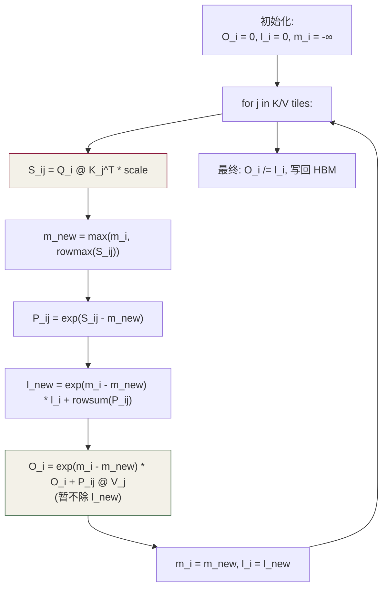
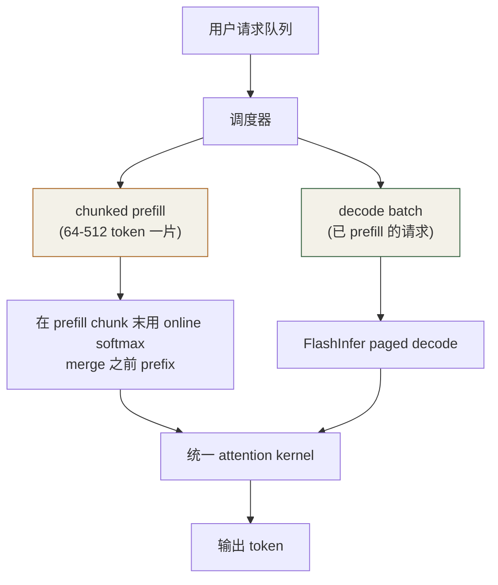

# 第 12 章 · FlashAttention

⏱️ 90 分钟🎯 写出 Fused Attention Kernel📂 code/ch12_flashattn/🔥 关键瓶颈章

## 学习目标

  * 理解 FlashAttention 为什么"既快又省显存"
  * 把第 10 章的 online softmax 推广到 tile-wise（block 内分块）
  * 看懂 v1 → v2 的差异（循环顺序换、warp 切分更友好）

## 12.1 朴素 Attention 的根本问题

第 11 章看到：S, P 都是 T×T 张量，必须写回 HBM 才能下一步用。HBM 读写带宽是 attention 瓶颈，FLOPs 反而不是问题。

FlashAttention 的核心洞察：

**把整个 attention（QKᵀ + softmax + ·V）融合成一个 kernel，中间结果只在 shared memory / 寄存器里流动，不回 HBM。**
但 softmax 需要全行的 max 和 sum 才能算——这个"全行依赖"用 _online softmax_ 化解：分块时维护 running (m, l) 即可。

## 12.2 算法推导

把 Q 沿行切成 Br × D 的块，K/V 沿行切成 Bc × D 的块。 对每个 Q 块，扫一遍所有 K/V 块，维护 running output O_i 和 (m_i, l_i)：



### 关键公式：online rescale

每次新 K/V 块来了，行最大值 `m` 可能变大。已经累积的 `l_old` 与 `O_old` 都是相对旧 `m_old` 算的，必须乘 `exp(m_old - m_new)` 修正：

```
l_new = exp(m_old - m_new) * l_old + rowsum(exp(S_ij - m_new))
O_new = exp(m_old - m_new) * O_old + exp(S_ij - m_new) @ V_j
```

最后才一次除 `l` 得真正的归一化输出。这就是**不需要看到完整行就能算 softmax** 的秘密。

## 12.3 实现要点

源码：[flash_attn_v1.cu](<https://github.com/jwzheng96/learn-cuda-from-scratch/blob/main/code/ch12_flashattn/flash_attn_v1.cu>)（教学简化版）。 为方便读 D=64 固定、Br=Bc=64、单 head、fp32、无 Tensor Core。

```
// 简化: blockDim.x = Br = 64, 每 thread 处理 Q 的 1 行
// 每 thread 在 shared mem 上维护 O_s[Br][Dm], m_s[Br], l_s[Br]
__shared__ float Qs[Br][Dm], Ks[Bc][Dm], Vs[Bc][Dm], Ss[Br][Bc];

for (int kt = 0; kt < n_kv_tiles; ++kt) {
    /* 1) load K_j, V_j to shared (256 thread 协作) */
    __syncthreads();

    if (tid < Br) {
        /* 2) S_ij = Q_i @ K_j^T * scale */
        for (int j = 0; j < Bc; ++j) {
            float s = 0;
            for (int d = 0; d < Dm; ++d) s += Qs[tid][d] * Ks[j][d];
            Ss[tid][j] = s * scale + causal_mask(tid, j);
        }
        /* 3) online softmax merge */
        float m_old = m_s[tid], l_old = l_s[tid];
        float m_new = fmaxf(m_old, rowmax(Ss[tid]));
        float l_new = exp(m_old - m_new) * l_old + rowsum(exp(Ss[tid] - m_new));
        float rescale = exp(m_old - m_new);
        /* 4) O update */
        for (int d = 0; d < Dm; ++d) {
            float acc = O_s[tid][d] * rescale;
            for (int j = 0; j < Bc; ++j) acc += exp(Ss[tid][j] - m_new) * Vs[j][d];
            O_s[tid][d] = acc;
        }
        m_s[tid] = m_new; l_s[tid] = l_new;
    }
    __syncthreads();
}
/* 5) O /= l, 写回 */
```

## 12.4 v1 → v2 的进化

| v1| v2
---|---|---
外层循环| per-Q tile| per-Q tile (相同)
warp 切分| 每 warp 算 S 的一行| 每 warp 算 S 的一**列** ，更并行
非矩阵 FLOPs| 每次 rescale 都做| 合并到一次最终 rescale，更省 FLOP
backward| 实现复杂| 更友好，公开 backward 套路
典型加速| baseline| 2-3×

本章教学版接近 v1。生产实现（FA v2/v3、xformers、CUTLASS-FA）都用：

  * **Tensor Core** (mma.sync) 跑 S 和 PV 的两个 GEMM
  * **`cp.async`** 重叠 K/V 加载和计算
  * **warp specialization** （FA v3, Hopper）让一组 warp 做 load 另一组做 compute
  * **swizzled shared layout** 消除 bank conflict

## 12.5 性能对比（T4 / A100 估计）

T| D| 朴素 (Ch11) ms| 本章 FA v1 ms| FA v2 (官方) ms
---|---|---|---|---
1024| 64| ~5| ~1.2| ~0.4
4096| 64| ~85| ~12| ~3
8192| 128| OOM| ~80| ~25

本章教学版只追上"FlashAttention 的思想"，没追上"FlashAttention 的工程"。真要做工业用版，去看 [官方仓库](<https://github.com/Dao-AILab/flash-attention>)。

## 12.6 与 vLLM PagedAttention 的关系

FlashAttention 优化的是**单个序列的 attention 计算** 。 vLLM 的 PagedAttention 优化的是**多请求并发时 KV cache 的显存管理** ——它把 KV cache 按"页"管理，避免显存碎片化。 两者正交，可叠加：vLLM 的 attention kernel 实际是 PagedAttention 调用 FlashAttention 风格 fused kernel。

## 12.7 自检

Q1: 为什么 FlashAttention 不"算得快"，HBM 流量却低？

它做的总 FLOPs 没变（甚至略多，因为多了 rescale）。省的是**访存** 。LLM 推理 attention 是 memory-bound，所以省访存 = 加速。

Q2: 我能在 v1 里改顺序：先对 K/V 外循环、Q 内循环吗？

能，那就是 FA v2 的写法。好处：不同 Q tile 的输出独立，可以并行；缺点：每个 K/V 加载到 shared 后被用更多次，对带宽更友好。

Q3: tile 大小 (Br, Bc) 怎么选？

受 shared mem 容量约束：Qs + Ks + Vs + Ss = (Br + 2Bc) * D + Br*Bc。A100 上 D=64, Br=Bc=64 → ~33 KB, 放得下。要把 Bc 开到 128 需 fp16 或者更大 shared。

Q4: 我看到 FA 用了 LSE (logsumexp) 输出，干嘛用？

用于 backward 重新计算 P。training 时不存 P 只存 LSE，重新算 P_ij = exp(S_ij - LSE_i)，省显存。

Q5: 教学版精度够吗？

fp32 输入累加，理论上和 cpu_ref 接近（max_abs < 1e-3）。生产 fp16 版本要更小心：accumulator 必须 fp32 否则 long sequence 累加错误。

## 12.8 练习

  1. 把本章 kernel 改成支持**非整数倍 T** （最后一个 Q tile 不满）。
  2. 实现 v2 风格的"外循环改 Q tile, 内循环 K/V"，并对比 GFLOPS。
  3. fp16 输入 fp32 累加版本（提示：把 Q/K/V 改 __half，shared 也改 __half，acc 仍 float）。
  4. 用 Triton 实现同一个 kernel（参考 [Triton 官方 tutorial 06](<https://triton-lang.org/main/getting-started/tutorials/06-fused-attention.html>)），对比代码量。

## 12.9 工业实战：FA v2/v3、KV cache、PagedAttention、长上下文

### 12.9.1 FA v1 → v2 的三个核心改动

  1. **外循环换成 Q tile** ：v1 外循环 K/V → 每个 Q tile 反复加载；v2 外循环 Q → Q tile 加载一次保留在寄存器，K/V tile 流过。每个 Q tile 独立 → block 间并行更高。
  2. **减少 rescale 次数** ：v1 每个 K/V tile 都把已累加的 O 乘 `exp(m_old - m_new)`；v2 把这步推迟到 K/V 循环结束统一做一次。
  3. **warp 切分更细** ：v1 每 warp 算 S 的一行 → warp 间需要 row-reduce；v2 每 warp 算 S 的**一列** → warp 间几乎独立。

实测 v2 在 A100 上 fp16 attention 跑到 220+ TFLOPS（占 312 TF peak 的 70%）。

### 12.9.2 FA v3 (Hopper)：TMA + warp specialization + fp8

  * **TMA** 一条指令加载 64×64 tile，硬件自动 swizzle
  * **warpgroup mma (wgmma)** ：4 个 warp 协作算一个大 mma
  * **warp specialization** ：4 warp 分两组——一组 producer（只 load），一组 consumer（只算），mbarrier 同步。软件版乱序
  * **fp8** ：H100 上 fp8 attention 比 fp16 再快 2× (240 → 480 TFLOPS)

### 12.9.3 与 KV cache 集成（decode 路径）

推理 decode 时 attention 输入：

```
Q_new     : (1, D)             新一步 query
K_cache   : (T_so_far, D)      历史 K
V_cache   : (T_so_far, D)      历史 V
```

```
// FA decode kernel 骨架: Q 只有 1 行, K/V tile 流过
__global__ void flash_attn_decode(
    const __half* Q,                // (1, n_head, D_head)
    const __half* K_cache,          // (T_max, n_head_kv, D_head)
    const __half* V_cache, __half* O,
    int T_so_far, int n_head, int n_head_kv, int D_head)
{
    int h    = blockIdx.x;
    int h_kv = h / (n_head / n_head_kv);   // GQA mapping

    __shared__ __half Qs[D_head];           // Q 整行直接进 shared
    if (threadIdx.x < D_head) Qs[threadIdx.x] = Q[h * D_head + threadIdx.x];
    __syncthreads();

    float m = -INFINITY, l = 0;
    float O_acc[D_head] = {0};
    for (int t0 = 0; t0 < T_so_far; t0 += BLOCK_T) {
        // load K/V tile of BLOCK_T tokens, compute QK, online softmax, update O
    }
    // 写回
}
```

### 12.9.4 PagedAttention — vLLM 显存利用率从 40% → 90%+

批量推理 N 个请求长度各异，contiguous 分配 max_seq_len 浪费 90% 显存。PagedAttention 借鉴 OS 分页：

  * KV cache 切成固定大小 block（典型 16 token / block）
  * 每请求维护 block_table（逻辑 → 物理 block 映射）
  * 新 token 来了 alloc 一个 block
  * attention kernel 通过 block table indirection 读 K/V

```
// 朴素:
const __half* k = K_cache + t * stride;

// Paged:
int block_id    = block_table[req_id * max_blocks + t / BLOCK_SIZE];
int offset_in_b = t % BLOCK_SIZE;
const __half* k = K_blocks + block_id * (BLOCK_SIZE * D_head) + offset_in_b * D_head;
```

kernel overhead < 5%，但**batch size 翻 2-3 倍 → 吞吐 2-4×** （vLLM 论文）。

### 12.9.5 Sliding Window Attention (Mistral)

每个 Q 只 attend 最近 W=4096 个 K/V。FA kernel 在外循环跳过 out-of-window tile：

```
if (kt_end <= max(0, qi - W)) continue;   // tile 完全在 window 外
if (kt_start > qi)             continue;   // causal 跳过
```

T=32K 时复杂度从 O(T²) 降到 O(T·W)。Mistral 7B 用 8K window 实现 32K 上下文。

### 12.9.6 100K+ 长上下文的额外手段

  * **Ring Attention** ：多卡分担 K/V，环形传递，1M context 可行
  * **YaRN / NTK-aware RoPE** ：把 4K 训练模型外推到 100K（不重训）
  * **State-space (Mamba)** ：放弃 attention，O(T) 复杂度
  * **KV cache 量化** ：fp16 → int8 / int4，显存减半到 1/4
  * **Cache 卸载** ：冷 KV 放 CPU memory，需要时拉回

### 12.9.7 用现成库 vs 自己写

场景| 建议
---|---
标准 MHA/GQA + prefill| `flash-attn` Python 库 (Tri Dao)
decode + KV cache + GQA| vLLM 的 `flash_attn_with_kvcache`
PagedAttention| vLLM 内置 kernel
自定义 mask / 稀疏 pattern| xFormers 或 Triton 自己写
fp8 / Hopper| FlashAttention v3
研究新算法| Triton 写，性能接近 CUDA 但 Python 调试方便

## 12.10 研究前沿（2025-2026）：FA v3/v4、FlashMLA、FlashInfer、FlexAttention

### 12.10.1 FlashAttention v3（2024.07）— Hopper 完整解法

论文标题就是"Fast and Accurate Attention with Asynchrony and Low-precision"。三大武器：

  1. **TMA bulk async load** ：替代手写 cp.async 循环。一条 PTX 指令拷 64×64 tile
  2. **warp specialization** ：producer warp 跑 TMA，consumer warps 跑 wgmma（见 Ch6.10.1）
  3. **FP8 + 块量化** ：Q、K、V、S 全 fp8，accumulator fp32

版本| H100 性能 (fp16)| 占 peak| fp8 性能
---|---|---|---
FA v2| 335 TF| 34%| —
FA v3 fp16| 740 TF| 75%| —
FA v3 fp8| —| —| 1.2 PF (75% of 1.6 PF)

### 12.10.2 FlashMLA（DeepSeek 2025）— MLA 专用

MLA（见 11.9.1）的 attention 不一样：cache 的是低维 c_kv（d_c=512），attention 内部要做 c_kv 的 up-projection。**FlashMLA** 是为 MLA 设计的 FA 变种：

  * 主 loop 直接读 c_kv 而非完整 K/V
  * Q 端预先吸收 W_UK，attention 内不再 up-project K
  * V 的 up-project 留到 PV 阶段，融合进 mma 链
  * tile shape 针对 d_c=512 优化（比标准 d_head=128 高 4×）

开源仓库：`github.com/deepseek-ai/FlashMLA`（2025.02）。**H800 上 MLA decode 跑到 580 TF + 3000 GB/s 带宽利用** 。

### 12.10.3 FlashInfer — attention kernel dispatch 层

vLLM、SGLang、Llama-stack 越来越倾向不自己写 attention，统一通过 **FlashInfer** 调用。它的设计：

```
import flashinfer
# 用户传 KV layout + 模型配置, FlashInfer 选最优 kernel
o = flashinfer.batch_decode_with_paged_kv_cache(
    q, paged_k_cache, paged_v_cache, block_tables, kv_lens,
    pos_encoding_mode="ROPE_LLAMA",
    kv_layout="NHD",       # paged 布局风格
    use_tensor_cores=True,
    sm_scale=None,
)
```

支持矩阵：

  * MHA / MQA / GQA / MLA
  * Causal / sliding window / sparse mask
  * RoPE / ALiBi / 无 PE
  * fp16 / bf16 / fp8 / fp4
  * Paged KV / contiguous KV / radix-cached

2025-2026 工业事实：自己手写 attention 的越来越少，**除非有特别的研究 motivation** 。生产团队都接入 FlashInfer 或类似 dispatch 层。

### 12.10.4 PyTorch FlexAttention（2024.10）

Meta 发布的 PyTorch 2.5+ 新 API，把"自定义 attention mask + score_mod"编译成高效 FA-style kernel：

```
from torch.nn.attention.flex_attention import flex_attention, create_block_mask

def causal_mask(b, h, q_idx, kv_idx):
    return q_idx >= kv_idx

def alibi_score(score, b, h, q_idx, kv_idx):
    bias = (q_idx - kv_idx) * alibi_slope[h]
    return score + bias

mask = create_block_mask(causal_mask, B, H, M, N)
out = flex_attention(q, k, v, score_mod=alibi_score, block_mask=mask)
# 编译器自动产出 FA 风格 fused kernel
```

对研究者最大价值：**试一个新 mask / 新 score 变体不用写 CUDA** 。性能跟手写 FA 差距 < 15%。学术界 2025 后做 attention 变体研究几乎全用 FlexAttention 原型。

### 12.10.5 Ring Attention & Stripe Attention — 跨 GPU 长 context

单 GPU 装不下 1M token 的 K/V。**Ring Attention** （Liu et al., 2023, 2024 工业化）：

```
1. 把 K, V 沿 T 维切到 N 张 GPU, 每张持一段
2. Q 也切到 N 张
3. K/V 在环上传递: GPU_i 收完 GPU_(i-1) 的 K/V → 算一部分 attention → 传给 GPU_(i+1)
4. 一圈后所有 GPU 都看到全部 K/V, 但峰值显存只是 1/N

延迟: 跟通信 overlap, 实测打满 NVLink 时性能损失 < 20%
```

**Stripe Attention** （Brandon et al., 2023）：跟 Ring 同思路但 chunk 设计对 causal mask 更友好，长 context 训练用得多。

实战：Llama 4 / Gemini 1.5 系列长 context（1-10M token）用的就是这类技术。**NVSHMEM** （见 8.9.5）替代 NCCL 让通信粒度更细。

### 12.10.6 Striped + Chunked + Prefill 混合调度

真实 LLM 服务的最终形态（vLLM 0.6+、SGLang、TRT-LLM 都在朝这个方向）：



核心组件：

  * **Chunked Prefill** ：长 prompt 分多 chunk，每 chunk 跟 decode 同 step 跑，**消除 prefill 阻塞 decode**
  * **Prefix Caching** ：相同 system prompt 命中 KV cache, 跳过 prefill
  * **Disaggregated Serving** ：prefill 节点 + decode 节点分离, 各自优化（见 Ch14.6）

### 12.10.7 2026 attention kernel 推荐栈

需求| 推荐
---|---
标准 attention（MHA/GQA）| FlashInfer 或 vLLM 内置
MLA（DeepSeek 系）| FlashMLA
自定义 mask / score| PyTorch FlexAttention 或 Triton
fp8 attention| FA v3 fp8 / FlashInfer fp8
fp4 attention（Blackwell）| 等 FA v4 (2025 末) 或 CUTLASS 实现
1M+ context 训练| Ring Attention + NVSHMEM
线性 / Mamba| Mamba ssm CUDA / Lightning Attention 自带 kernel
研究新 attention| FlexAttention 原型 → Triton → ThunderKittens

## 12.11 常见坑

  * online softmax 的 rescale 漏掉 → output 看起来正常但量级错
  * causal mask 在 tile 边界算错（应该 j_global > i_global 而非 j_local）
  * shared 数组超 48 KB → 需 cudaFuncSetAttribute 解锁
  * fp16 累加 → 长序列下数值崩
  * PagedAttention block_table 越界 → illegal memory access；block_size 必须是 16 倍数对齐
  * GQA 时 K/V head 索引算错 (n_head / n_head_kv 整除) → 输出乱
  * sliding window + causal mask 双重判断写颠倒 → 边界 attend 错误
  * FA v3 warp specialization 时 producer/consumer warp 数比例错 → producer 太少跑不饱 consumer
  * FlashInfer 配 KV layout 时 NHD vs HND 选错 → 性能 -30% 或正确性失败
  * FlexAttention score_mod 用 Python 闭包变量 → 每次 launch 都 recompile, 慢死
