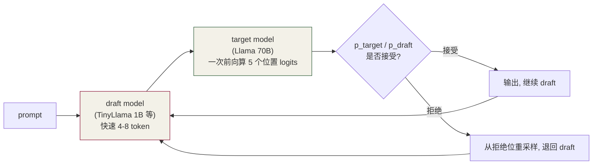

# 第 13 章 · LLM 必备零件

⏱️ 70 分钟🎯 凑齐 Capstone 所需算子📂 code/ch13_llm_parts/

本章拼齐**第 14 章 Capstone** 还差的算子。每个独立、简单，但少一个就跑不起来一个完整 LLM。

## 13.1 RoPE — Rotary Position Embedding

Llama / Mistral / Qwen 都用 RoPE 替代了 GPT-2 的绝对位置编码。 它把 Q、K 向量看成 D/2 个复数，第 i 对复数乘以 `exp(j · θ_{t,i})`，其中 `θ_{t,i} = t / base^{2i/D}`。

### 实现（in-place）

```
__global__ void rope_inplace(float* x, int T, int D, float base) {
    int t = blockIdx.x;
    int i = threadIdx.x;
    int half = D / 2;
    float theta = float(t) / powf(base, float(2*i) / float(D));
    float c = cosf(theta), s = sinf(theta);
    float x0 = x[t*D + i];
    float x1 = x[t*D + i + half];
    x[t*D + i       ] = x0 * c - x1 * s;
    x[t*D + i + half] = x0 * s + x1 * c;
}
```

性质：

  * 不需要新增可学习参数
  * "相对位置"可以通过 `q^T_t · k_s` 的内积自动浮现
  * 可通过加大 base 或 NTK-aware 缩放**外推** 到更长 context（Llama 2 → Llama 3 = 8K → 128K 就靠这个）

## 13.2 SwiGLU / SiLU — Llama FFN

GPT-2 用 `FFN(x) = GELU(x @ W_1) @ W_2`。 Llama 用**双投影 + 门控** 的 SwiGLU：

```
FFN(x) = ( SiLU(x @ W_gate) ⊙ (x @ W_up) ) @ W_down
```

SiLU 定义：`silu(x) = x · sigmoid(x) = x / (1 + e^{-x})`

```
__device__ float silu(float x) {
    return x * (1.f / (1.f + __expf(-x)));
}

__global__ void swiglu(const float* G, const float* U, float* O, int n) {
    int i = blockIdx.x * blockDim.x + threadIdx.x;
    if (i < n) O[i] = silu(G[i]) * U[i];
}
```

"门控"让网络学会"对某些位置让信息通过、对另一些抑制"。代价：FFN 多一个 W_gate，参数量 ~1.5×；但 hidden = 2.66·D（GPT-2 是 4·D），总参数差不多。

## 13.3 KV Cache

自回归生成有个关键观察：第 t 步生成的 token i 时，第 t-1 步算出来的 K、V 仍然有效，**不必重算** 。 于是推理代码维护一个 cache：

```
K_cache shape: (n_layers, n_heads, T_max, D_head)
V_cache shape: same
```

每步只算新 token 的 (K_new, V_new) 形状 (1, D_head)，append 到 t_pos 位置：

```
__global__ void append_kv(const float* K_new, const float* V_new,
                          float* K_cache, float* V_cache, int t_pos, int D) {
    int d = blockIdx.x * blockDim.x + threadIdx.x;
    if (d < D) {
        K_cache[t_pos * D + d] = K_new[d];
        V_cache[t_pos * D + d] = V_new[d];
    }
}
```

### KV cache 的显存开销

Llama-7B (n_layers=32, n_heads=32, D_head=128, fp16) 一个 token 的 KV 占 **32 × 32 × 128 × 2 × 2 B = 0.5 MB** 。 T=2048 时 1 GB；batch=8、T=2048 → 8 GB。这就是为什么 KV cache 管理（PagedAttention 等）这么重要。

## 13.4 Sampling 策略

### greedy (argmax)

```
// 简化: V <= 65536 用单 block reduce 即可
template <int BLOCK>
__global__ void greedy_argmax(const float* logits, int* out, int V) {
    __shared__ float vals[BLOCK]; __shared__ int idxs[BLOCK];
    float bv = -INF; int bi = -1;
    for (int i = tid; i < V; i += BLOCK)
        if (logits[i] > bv) { bv = logits[i]; bi = i; }
    /* block-wide reduce on (vals, idxs) keeping max */
    if (tid == 0) *out = idxs[0];
}
```

### top-k (truncated sampling)

从 logits 取最大的 k 个，softmax，按概率抽样。常见 k = 40~50。GPU 实现：用 block-wide top-k（heap 或 partial sort）。

### top-p (nucleus sampling)

排序 logits → 累计概率 → 截断到累积 ≥ p 的前缀（典型 p = 0.9~0.95）→ 重新归一 → 抽样。需要 sort + prefix scan，第 7 章的 scan 模板在这里能复用。

### temperature

`logits /= T`，T > 1 让分布更平（更随机），T < 1 让分布更尖（更确定）。在 softmax 前应用。

策略| 速度| 多样性| 用途
---|---|---|---
greedy| 最快| 最低| 评测、确定性回放
top-k| 中等| 中等| chat, 一般生成
top-p| 稍慢| 较高| chat, 创意写作
temperature only| 快| 可调| 组合用

## 13.5 自检

Q1: RoPE 为什么 in-place 还能正确？

因为旋转是 pair-wise (x0, x_{D/2}) ↔ (x0', x_{D/2}')，写入新位置时旧的两个值都还在寄存器里（在 kernel 内已加载），所以 in-place 安全。

Q2: KV cache 为什么放 GPU 显存而不是 CPU？

attention 算 (Q_new @ K_cache^T) 要把 K_cache 全部读进 SM。放 CPU 每步都得 H2D，PCIe 慢 10×。所以 KV cache 是 LLM 显存大户。

Q3: SwiGLU 比 GELU 强多少？

不算"强很多"。Llama 团队论文报告 +0.3 PPL 左右改善。但因为**没坏处+实现简单** ，新模型都默认用它。

Q4: top-p 排序很贵吗？

V=50K 完整排序确实贵。优化套路：先 top-k (k=200) 截断再排序；或者 radix-select。vLLM 实现 ~50 us / token，可接受。

Q5: prefill 和 decode 在 KV cache 上有什么区别？

prefill（处理 prompt）：一次性算 T_prompt 个 KV 写 cache，是大 batch GEMM；decode：每步只算 1 个 KV，是 GEMV（memory-bound）。所以 LLM 服务把两者分开调度。

## 13.6 练习

  1. 实现 **top-k sampling** ：先 block-wide top-k（用堆），再 softmax 抽样。
  2. 实现 **top-p (nucleus)** ：sort + scan + 截断。
  3. 给 `rope.cu` 加 `theta_base = 500000`（Llama 3 用），看长 T 时角度变化。
  4. 把 `swiglu` 改成 fused：把 silu(G) * U 合并到 W_down 的 GEMM 里（pre-multiplier trick）。

## 13.7 工业实战：量化、投机解码、采样工程

### 13.7.1 W4A16 量化 — LLM 推理头号加速武器

LLM decode 阶段瓶颈是**权重的 HBM 读带宽** （M=1 时 FLOPs 极少）。 Llama-7B fp16 权重 14 GB / A100 HBM 1.5 TB/s = 单步至少 9 ms。 把权重压成 INT4，HBM 读量降 4× → 单步 2-3 ms。这就是 W4A16（W=int4，A=fp16）。

算法| 思路| 精度损失| 实现
---|---|---|---
GPTQ| 逐层 OBS 找量化误差最小的舍入| < 0.5 PPL| AutoGPTQ
AWQ| activation-aware: 保护"重要"通道| < 0.3 PPL| llm-awq, vLLM
GGUF| blockwise scale, k-means| 0.2-0.8 PPL| llama.cpp
SmoothQuant| 同时量化 W+A (W8A8)| ~0.2 PPL| TensorRT-LLM

### W4A16 kernel 的关键：dequant + GEMM 融合

朴素做法：先把 INT4 dequant 成 fp16 写回 HBM 再调常规 GEMM —— **这样消除不了带宽瓶颈** 。
正确做法：**kernel 内即时 dequant** ，权重始终以 INT4 从 HBM 读：

```
for (int kt = 0; kt < K; kt += BK) {
    // 1) HBM 只读 INT4 weight tile (BM*BK/2 字节, 2 个 INT4 / byte)
    load_int4_to_shared(W_int4_tile, gmem_ptr);
    // 2) shared 内 dequant: int4 -> fp16, 乘 per-group scale
    dequant_inplace(W_int4_tile, W_fp16_tile, scales[group_id]);
    // 3) WMMA / mma.sync 用 fp16
    wmma::mma_sync(acc, A_frag, B_frag, acc);
}
```

典型实现：TensorRT-LLM `weight_only_gemm`，vLLM 的 Marlin kernel。Marlin 在 4090 上 7B decode 跑到 200+ tok/s，几乎打满 HBM 带宽。

### 13.7.2 投机解码 (Speculative Decoding)

**用小模型快速生成 N 个候选 token，大模型一次性验证** 。接受多少多少出，拒绝就退回。



关键洞察：

  * target model 一次 forward **同时** 算 N 个位置 logits（沿 batch 维并行），**跟单 token decode 相比只慢 1.2-1.5×** （带宽差不多）
  * 接受率 60-80% → 端到端 2-3× 加速

draft model 候选：

  * TinyLlama 1B（同架构小模型）
  * EAGLE（专门训的 draft head）
  * Medusa（多 head 并行预测）
  * n-gram cache（重复 token 直接命中）

vLLM、TensorRT-LLM 都内置。EAGLE / Medusa 需要额外训练，n-gram 0 训练成本。

### 13.7.3 生产 sampler — 不只是 argmax

```
// 完整 pipeline: logits -> /temp -> top-k -> top-p -> softmax -> cuRAND 抽样
__global__ void sample_kernel(float* logits, int V, float temp, int top_k, float top_p,
                              unsigned int seed, int* out_token) {
    // 1) 除 temperature
    for (int i = tid; i < V; i += BLOCK) logits[i] /= temp;
    // 2) top-k: 保留最大 k 个, 其他 -inf  (block-wide heap 或 partial sort)
    block_topk(logits, V, top_k);
    // 3) softmax + inclusive scan + 找 top-p 截断点 + 重新归一
    block_softmax(logits, V);
    block_inclusive_scan(logits, V);
    int cutoff = block_find_first_ge(logits, top_p);
    // 4) 用 cuRAND 抽样
    curandState s; curand_init(seed, tid, 0, &s);
    *out_token = sample_from_dist(logits, cutoff, curand_uniform(&s));
}
```

性能：完整 sampling ~50 μs (V=50K)，decode 总耗时占 1-2%。

### 13.7.4 KV cache 量化（int8 / fp8）

权重量化外，KV cache 也可以量化。Llama-7B (B=32, T=2K) KV 占 32 GB → fp8 后 16 GB，**batch 翻倍** 。

实现：**per-group scale** ，attention kernel 内 load 时 dequant：

```
// attn 读 K 时:
int8_t k_i8 = K_cache_int8[t * D + d];
half scale  = K_scales[t / GROUP_SIZE];          // 每 64 token 一个 scale
half k      = __int2half_rn(k_i8) * scale;
```

TensorRT-LLM 默认支持 fp8 KV，vLLM 0.3+ 也支持。**陷阱** ：per-tensor scale 精度差，per-channel scale 调度复杂——生产用 per-group (group_size=64) 平衡。

### 13.7.5 RoPE 工程注意点

  * **fuse 到 QKV proj** ：QKV GEMM 出来立即 RoPE，不要单起 kernel
  * **预计算 cos/sin 表** ：每步 forward 重算 `sin(t/base^(2i/D))` 浪费；服务启动时预计算 (T_max, D/2) 表存显存
  * **NTK-aware / YaRN scaling** ：base 从 10000 改 500000+，让模型外推到更长 context
  * **正确性测试** ：用 PyTorch `rotary_emb` 对拍，pair (偶位置, 奇位置) 必须严格对齐

### 13.7.6 推理优化优先级

优化| prefill 收益| decode 收益| 实施难度
---|---|---|---
fp16 → fp8 weight| ★★| ★★★★| 易
W4A16 量化| ★| ★★★★★| 中
FlashAttention v2| ★★★★★| ★★★| 易（用现成库）
PagedAttention| —| ★★★★（吞吐）| 中（vLLM）
Speculative decoding| —| ★★★★| 难
CUDA Graph| ★| ★★| 易
Continuous batching| —| ★★★★（吞吐）| 难
fused norm + QKV| ★| ★★| 中

顺序建议：先用 vLLM/TRT-LLM 自动拿 80% 优化，再针对自己模型做 fp8 量化 / spec decoding 增量调优。

## 13.8 研究前沿（2025-2026）：EAGLE-3、Lookahead、KV 压缩、W4A4 / FP4

### 13.8.1 投机解码 2024-2026 演进

方法| 原理| 典型加速| 实现成本
---|---|---|---
Vanilla SpecDec (2023)| 独立小 draft model| 2-3×| 需训练 draft
Medusa（2024）| 大模型加多个并行 head 直接预测后 N token| 2-3×| 微调 + head 训练
**EAGLE** （ICML 2024）| 用大模型 hidden state 作为 draft head 输入| 3×| 训练 draft head
**EAGLE-2** （2024）| 动态接受树, 不是固定 chain| ~4×| 同 EAGLE
**EAGLE-3** （2025）| 更深 draft head, 多层 hidden 输入| ~5-6×| 同 EAGLE
**Lookahead Decoding** （Hao Zhang 团队 2024）| 用 Jacobi 迭代 + n-gram cache, **无需训练**|  2-4×| 0 训练
**Hydra** （2024）| 多 head 串行依赖, 比 Medusa 接受率高| ~3-4×| 训练
**ReDrafter** （Apple 2024）| RNN draft + Top-K beam, 上线 LLM Engine| ~3×| 训练

**2026 工业现实** ：

  * vLLM / TRT-LLM 默认开 **EAGLE-2 / Medusa-2**
  * 不愿意训 draft 的接 **Lookahead** （n-gram 命中率随 prompt 类型变化大）
  * Reasoning 模型（o1/R1）由于 thinking 重复模式多，**Lookahead 收益尤其大** （n-gram 命中 50%+）

### 13.8.2 KV cache 压缩前沿（2024-2026）

除了 13.7.4 的量化路线，2024-2026 出现了大量"丢 token"型压缩：

方法| 核心想法| 压缩比| 精度损失
---|---|---|---
**StreamingLLM** （ICLR 2024）| 保留 sink token + 最近 W token| 10-50×| 无损（短 attention）
**H2O (Heavy-Hitter Oracle)**|  累计 attention score 高的 token 留| 5-10×| < 1 PPL
**SnapKV** （NeurIPS 2024）| 每层独立选 K/V 保留| 5-10×| < 0.5 PPL
**KIVI** （ICML 2024）| K per-channel 量化, V per-token| 4×（int2）| ~0.3 PPL
**KV-Quant**|  非均匀量化 + outlier 单独保留| 4-8×| ~0.5 PPL
**Quest** （ICLR 2025）| 查询时 page-level 选 top-k 块| 取决于 sparsity| 近无损
**L2Compress / MiniCache**|  跨层 KV 合并| 2-4×| ~0.5 PPL

组合：**MLA + fp8 KV + SnapKV / Quest** 是 DeepSeek-V3 / Kimi 等的工业实践，长 context 时 KV 显存从 GB 级降到几十 MB。

### 13.8.3 W4A4 / NVFP4 — 极致量化（2024-2026）

9.10.4 给了对比表，这里详述算法：

#### QuaRot（ICML 2024）— Hadamard 旋转解 outlier

激活的 outlier 是 W4A4 最大障碍（少数 channel 数值范围比平均大 100×）。QuaRot 用 Hadamard 矩阵 H 旋转：`x' = xH, w' = wH^T`，**数学等价 + 旋转后分布更均匀，outlier 被打散** 。

#### SpinQuant（Meta 2024）— 可学习旋转

不用固定 Hadamard，训练学习旋转矩阵。精度比 QuaRot 再好 0.2-0.5 PPL。

#### Atom（MLSys 2024）— 混合 W4A4 + Heuristic outlier

正常 channel 用 INT4，outlier channel 单独留 INT8。fp16 baseline 之上无损。

#### NVFP4（Blackwell 2025）— 硬件原生

fp4 (E2M1) + per-16-block fp8 scale，**Tensor Core 直接吞** 。无需 dequant 到 fp16/fp8 中转，吞吐拉满。是 2025+ B200 推理的**事实标准** 。

### 13.8.4 BitDelta / 1-bit weight diff

BitDelta（Anthropic 2024）：**把 fine-tuned 模型相对 base 的 diff 量化到 1 bit** 。

  * base model (full fp16) 一份
  * 每个 fine-tune 的 delta 只占 1 bit/param + scale
  * Llama-70B fine-tune 模型从 140 GB 缩到 ~9 GB + 1 GB
  * 精度损失极小（< 0.5 LR-bench）

意义：**多租户服务能存几百个 fine-tune 版本** 同时运行，每个只多花一点显存。Anthropic / Together AI / Fireworks 都在用。

### 13.8.5 RoPE 长 context 外推：YaRN、PI、NTK

原始 RoPE base=10000 训练长度内表现好，超出训练长度急剧退化。2023-2025 主要技术：

技术| 核心| 典型外推
---|---|---
Position Interpolation (PI)| position 缩放| 4×
NTK-aware| 高频维度少缩、低频维度多缩| 8×
**YaRN** （ICLR 2024）| NTK-aware + 温度调整 + 部分维度不缩| 16-32×
**Dynamic NTK**|  推理时根据当前 T 动态调 base| 10×+
LongRoPE（Microsoft 2024）| 进化算法搜索 per-dim 缩放因子| 32× (2M token)

Llama 3 直接训练到 8K，推理用 YaRN 外推到 128K。Llama 4 据传训练到 32K，外推到 10M。**不重训能让模型多用 10×+ context** ，性价比极高。

### 13.8.6 Reasoning 模型的采样新需求

o1 / R1 类 reasoning 模型，**采样策略** 影响最终能力：

  * **多次采样 + 投票 (best-of-N, BoN)** ：同一 prompt 跑 N 次, 选 reward 最高的。N=64 是常见 ceiling
  * **Self-Consistency** ：跑多次, 答案投票
  * **Process Reward Model (PRM)** ：用专门的 reward model 给中间 thinking 打分, 引导更好的路径
  * **Beam Search 复兴** ：reasoning 模型的 thinking 路径有"枝", beam 重新有意义
  * **MCTS** （Monte Carlo Tree Search）：DeepSeek-R1 等用类似思路在 thinking 期间探索

对 sampler kernel 的影响：**不再是单 next-token argmax** ，而是 N 个并行候选 + reward model 评估 + 选择，**采样跟 attention 计算量同阶** 。

### 13.8.7 2026 LLM 算子优化总览

技术| 对 7B fp16 baseline 提升
---|---
FA v3 + Hopper| 2-3×
NVFP4 + Blackwell| 再 4-6×
MLA（如果模型用）| KV 显存 7×, batch 也大 7×
EAGLE-3| 5-6×（decode）
Lookahead decoding| 2-4×（无训练）
PagedAttention + RadixAttention| 1.5-3× 吞吐
Chunked prefill| ~1.5× latency
Disaggregated serving| ~1.5× tokens/$

**所有技术叠加** ：相比 2023 baseline，2026 LLM 推理性价比提升 ~50-100×。这就是为什么 LLM 服务价格在两年内能降 100×（GPT-3.5 → DeepSeek-V3 同等性能 API 价格差 100 倍）。

## 13.9 常见坑

  * RoPE pair 索引写错（`i + half` 和 `i` 颠倒）→ Q/K 一致地坏，模型仍能跑但精度差
  * KV cache 越界写（t_pos > T_max）→ illegal memory access
  * greedy argmax 在 V 不是 BLOCK 倍数时漏元素 → 偶发概率错
  * temperature = 0 → 除零，应改为 greedy 分支
  * W4A16 用错 scale layout（per-tensor vs per-group）→ 数值崩，模型胡言乱语
  * 投机解码 draft 模型没用同 tokenizer → 投机 token id 跟 target 对不上
  * top-p 排序对 V=128K 词表过慢 → 用 radix-select 或先 top-k 截断到 1000 再 top-p
  * fp8 KV cache 用 per-tensor scale → 长 T 时精度损失明显，必须 per-group
  * EAGLE / Medusa 跟原模型不同 tokenizer 或 vocab → 投机一直被拒, 反而拖慢
  * Lookahead n-gram cache 不清理 → 跨请求污染，输出错乱
  * YaRN 配置忘了应用到 model 加载时, 只在 inference 阶段调 base → RoPE 实际没变
  * BitDelta 用错 base model 版本（如 Llama-2 vs Llama-2-chat） → 解出来全是噪声
