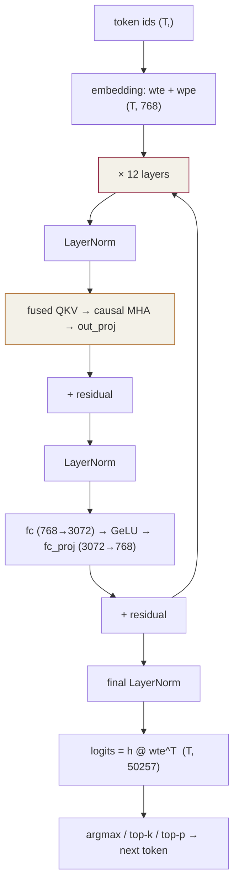
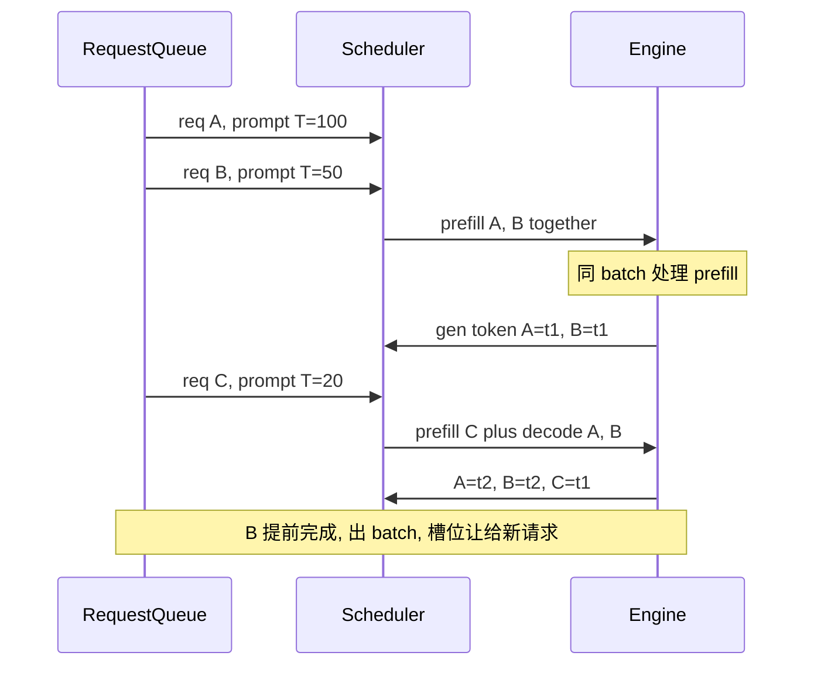
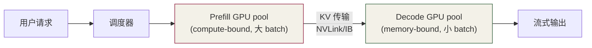

# 第 14 章 · Capstone: 用自己写的 kernel 跑 GPT-2 small

⏱️ 120 分钟🎯 端到端生成文本📂 code/ch14_mini_llm/🏁 终点

## 恭喜你坚持到这里

到第 13 章，你已经手写过：

  * kernel 启动模板（Ch2-3）
  * shared memory tile（Ch6）
  * warp shuffle reduce（Ch7）
  * tiled GEMM（Ch9）
  * 数值稳定 / online softmax（Ch10）
  * attention 三阶段 + FlashAttention（Ch11-12）
  * RoPE / SwiGLU / KV cache / sampling（Ch13）

本章把它们**串成一个能跑的 GPT-2 small (124M)** 。

## 14.1 GPT-2 small 架构速览



参数| GPT-2 small
---|---
层数 n_layer| 12
头数 n_head| 12
隐层 d_model| 768
FFN 中间 d_ff| 3072
head_dim| 64
词表 vocab_size| 50257
最大上下文| 1024
参数量| 124M (fp16 ~250 MB)

## 14.2 三步上手

### Step 1 — 下载权重

```
pip install transformers torch
python data/download_gpt2.py --out data/gpt2-small.bin
# 输出: data/gpt2-small.bin (~250 MB, fp16)
```

脚本会把 HuggingFace 的 `gpt2` 权重按固定二进制 layout 序列化，方便 C++ 一次 fread。 文件头是 16 个 int32（含 n_layer / n_head / d_model 等），后接 fp16 张量流。

### Step 2 — 编译与运行

```
cd code/ch14_mini_llm
make ARCH=sm_80
./mini_llm --weights=../../data/gpt2-small.bin \
           --tokens=15496,11,612,318 \
           --max_new=10
```

### Step 3 — token ↔ 文本

本仓库为简化没在 C++ 里写 BPE tokenizer。 用 Python 编码 / 解码：

```
from transformers import GPT2Tokenizer
tok = GPT2Tokenizer.from_pretrained("gpt2")
ids = tok.encode("Hello, there is")
print(ids)                  # → [15496, 11, 612, 318]
# 把上面 ids 传给 mini_llm --tokens=...
# 然后把它打印出的 final tokens 复制回 Python:
print(tok.decode([15496, 11, 612, 318, 1043, 257, 1810, 2950, 287]))
```

## 14.3 forward() 的结构

源码：[mini_llm.cu](<https://github.com/jwzheng96/learn-cuda-from-scratch/blob/main/code/ch14_mini_llm/mini_llm.cu>)。 核心 forward 函数把所有 kernel 按顺序串起来，每步：

```
void forward(const Weights& W, std::vector<int>& tokens, int* next) {
    embed_kernel(wte, wpe, tokens, x);            // (T, D)

    for (int l = 0; l < n_layer; ++l) {
        layernorm_row(x, ln1_w, ln1_b, normed);
        matmul_kernel(normed, qkv_w, qkv);        // Ch6 tile
        bias_add(qkv, qkv_b);
        split_qkv(qkv, Q, K, V);
        mha_naive(Q, K, V, attn_out);             // Ch11 naive
        matmul_kernel(attn_out, proj_w, proj_out);
        bias_add(proj_out, proj_b);
        residual_add(x, proj_out);                // x += proj_out

        layernorm_row(x, ln2_w, ln2_b, normed);
        matmul_kernel(normed, fc_w, ff_mid);      // (T, d_ff)
        bias_add(ff_mid, fc_b);
        gelu_kernel(ff_mid);                       // Ch13 风格激活
        matmul_kernel(ff_mid, fcp_w, ff_out);      // (T, D)
        bias_add(ff_out, fcp_b);
        residual_add(x, ff_out);
    }

    layernorm_row(x, lnf_w, lnf_b, normed);
    gemv_logits(normed[T-1], wte, logits);         // (V,)
    greedy_argmax(logits, next);
}
```

## 14.4 简化与代价

简化| 代价| 怎么补救
---|---|---
fp32 全程| 显存 2×，算力慢 8×| fp16 + WMMA（Ch9）
朴素 attention| O(T²) 显存| 用 Ch12 FlashAttention 替换
每步全前向（无 KV cache）| O(T³) 总成本| 加 KV cache（练习 #1）
batch=1| GPU 空跑| 支持 batch + padding mask
greedy only| 无创意| 实现 top-k/top-p (Ch13 练习)

即便如此，本章 GPT-2 small 在 T4 上能跑出 ~2-5 tok/s（无优化），足以验证流程。 把上面 5 项优化全做完，可以追到 ~50-100 tok/s（接近 llama.cpp 在同样硬件的水平）。

## 14.5 扩展任务（按难度）

### ★ 入门

  1. 支持 prompt 长度 > 16：测试 `--max_new=64`
  2. 把 greedy 换成 temperature=0.8 + top-k=40
  3. 用 nsys 看一次 forward 的 timeline，找最大 kernel

### ★★ 进阶

  1. **加 KV cache** ：维护 K_cache / V_cache (n_layer, n_head, T_max, D_head)，每步只 forward 1 token。预期：单步从 50 ms 降到 5 ms。
  2. fp16 路径：fc/proj/qkv 用 WMMA。Ch9 模板可移植。
  3. 用 Ch12 FlashAttention 替换 mha_naive。

### ★★★ 挑战

  1. **continuous batching** ：多请求并发，按 token 调度而非按请求。这是 vLLM 的核心创新。
  2. **W4A16 量化** ：把权重压成 INT4，runtime 解 → fp16 GEMM。看 llama.cpp / AWQ 实现。
  3. **speculative decoding** ：用 distilgpt2 当 draft，gpt2 当 verifier，3-5× 加速。
  4. **移植到 Llama 架构** ：把 LayerNorm 换 RMSNorm、GeLU 换 SwiGLU、加 RoPE、加 GQA。

## 14.6 工业实战：从能跑到能上线

capstone 能在单卡跑通 GPT-2 small。距离**给真实用户服务** 还差 6 个工程组件，本节给概念地图。

### 14.6.1 连续批处理 (Continuous Batching)

朴素 batch：N 个请求攒齐再 forward，慢的拖快的（"head-of-line blocking"）。**Continuous batching** 是 iteration-level scheduling——每个 token 步骤独立组 batch，新请求随时插入，完成的随时移出。



核心数据结构：**request slot 数组** ，每个 slot 持有 (state=prefill/decode, KV pages, current token, sampling params)。每步根据 slot 状态组 batch。

vLLM、TGI、TensorRT-LLM 都内置。**实测吞吐 5-10×** （vs 静态 batch）。

### 14.6.2 PagedAttention KV 管理（集成版）

12.9.4 给了算法，在 mini_llm 里集成步骤：

  1. K_cache / V_cache 改成 **page pool** ：`K_blocks (n_blocks, block_size, n_head, D_head)`
  2. 每请求一个 **block_table** ：`logical_block_id → physical_block_id`
  3. attention kernel 通过 block_table 间接寻址
  4. Scheduler 维护 free block pool；新请求 alloc，结束归还

陷阱：block 大小要平衡。太大（256+）→ 内部碎片；太小（4-）→ block_table 大、kernel indirection 开销大。生产典型 **16 token / block** 。

### 14.6.3 多 GPU：TP / PP / EP / SP

单卡装不下（70B fp16 = 140 GB）时分卡跑：

策略| 切分方式| 通信| 适合
---|---|---|---
Tensor Parallel (TP)| 每层权重按列/行切多卡| 每层 1-2 次 all-reduce| 同节点（NVLink）
Pipeline Parallel (PP)| 层切到不同卡| 层之间 send/recv| 跨节点（IB）
Expert Parallel (EP)| MoE expert 分卡| token all-to-all| Mixtral / GPT-OSS
Sequence Parallel (SP)| 序列维度切| 跟 TP 配合| 长 context 训练

典型 70B 推理：**TP=8, PP=1** （单节点 8×A100/H100）。kernel 改动：QKV proj 输出维度 ÷TP，attention head ÷TP，FFN 中间维 ÷TP，每层最后 1 次 all-reduce (NCCL)。

### 14.6.4 CUDA Graph capture — 杀掉 launch overhead

单 token decode 触发 30-50 个 kernel × 每个 ~5 μs launch = 150-250 μs 纯开销，跟计算同量级。capture 成一个 Graph 后重放只 1 次 launch：

```
// warmup 时同时 capture
cudaStreamBeginCapture(stream, cudaStreamCaptureModeGlobal);
decode_one_step(...);
cudaStreamEndCapture(stream, &graph);
cudaGraphInstantiate(&exec, graph, ...);

// 之后每步只 1 次 launch
cudaGraphLaunch(exec, stream);
```

坑：

  * kernel 参数（KV 位置等）必须编译期常量。生产用 `cudaGraphExecKernelNodeSetParams` 动态更新
  * batch size 变化要重新 capture；预 capture 几组 (1, 2, 4, 8, 16, 32) 的 graph
  * 动态 KV 长度需要 padding 到固定 bucket，浪费一些算力换 graph 复用

### 14.6.5 服务化工程要点

  * **异步 IO** ：HTTP queue → 内部 scheduler；asyncio / tokio。不能阻塞 GPU stream
  * **流式输出** ：每生成一个 token 立即 SSE / gRPC streaming 推回 client
  * **请求超时与取消** ：client 关连接，对应 slot 立即释放 KV blocks
  * **动态 max_tokens** ：根据队列长度调整，繁忙时拒绝过长生成
  * **warmup** ：服务起后跑虚拟请求预热 cuBLAS / CUDA Graph，否则前几个真请求慢 3-10×
  * **OOM 防护** ：admission control 估算每请求需要多少 KV blocks，不够就排队
  * **多副本 + 自动扩缩容** ：K8s + HPA
  * **监控** ：p50/p95/p99 latency、tokens/s、queue length、KV 占用率、GPU util

### 14.6.6 生产 LLM 推理栈对比（2025）

方案| 典型场景| 优势| 劣势
---|---|---|---
**vLLM**|  开源 / Python 友好| PagedAttention 原作、CB、Triton kernel 易改| fp8/int4 集成稍落后
**TensorRT-LLM**|  NVIDIA 平台极致| fp8/int4/SmoothQuant 全面，Builder 自动 fuse| build time 长，新模型需 plugin
**llama.cpp**|  CPU / Mac / 边缘| GGUF 量化精细、跨平台| 多 GPU 推理弱
**SGLang**|  复杂控制流 / agent / JSON 输出| RadixAttention 前缀共享、结构化生成| 生态较小
**TGI (HF)**|  跟 HuggingFace 生态对接| 开箱即用、Rust 服务层| 性能略落后 vLLM
**自研 (Meta/Anthropic)**|  顶级公司| 极致性能、隐藏权重| 人年级投入

### 14.6.7 推荐工程化路径

  1. **原型** ：vLLM docker 一行命令
  2. **生产** ：vLLM 或 TRT-LLM；按 NVIDIA 平台粘度选
  3. **极致优化** ：基于 CUTLASS / Triton 自写关键 kernel（attention、量化 GEMM），其他算子复用
  4. **跨平台** ：llama.cpp (Mac / CPU)、MLX (Apple Silicon)、ROCm (AMD)

### 14.6.8 学完本教程能做什么

  * 读懂 vLLM / TRT-LLM / llama.cpp 任一个的 CUDA kernel
  * 给自己模型在 vLLM 里加自定义 fused 算子
  * 实现 attention 变体（local / ALiBi / custom mask）
  * 调优 LLM 服务把 p99 latency 降一半
  * 面试 GPU/CUDA 岗位，能答 FlashAttention 推导和 PagedAttention 原理

这是**起点** 不是终点。顶级 CUDA 工程师还需 3-5 年实际项目经验，但你已经过了"看不懂代码"的门槛。

## 14.7 研究前沿（2025-2026）：Disaggregated Serving、MoE、Reasoning

### 14.7.1 Disaggregated Prefill / Decode（Mooncake、DistServe）

14.6 讲了 prefill 和 decode 是两个不同世界（compute-bound vs memory-bound）。**共享 GPU 跑两者** 意味着两边都不能最优——prefill 抢占 SM 会拖慢 decode 的尾延迟。

2024-2025 的革命：**把 prefill 和 decode 分到不同 GPU pool** ，KV cache 通过高速网络传递。



主要工程实现：

  * **Mooncake** （Moonshot AI / Kimi 2024）：业内首个生产 disaggregated 系统，KV 通过 RDMA 传输，全局 KV pool 跨节点共享
  * **DistServe** （OSDI 2024 论文）：理论分析 + 早期开源实现
  * **vLLM v0.7+** ：内置 disaggregated 路径
  * **SGLang** ：同样支持
  * **llm-d** （Red Hat / IBM 2025）：Kubernetes 原生 disaggregated 框架

典型收益：吞吐 +30-50%，p99 latency 减半，**tokens/$ 提升 2-3×** 。但工程复杂度高，小规模团队（< 10 GPU）不划算。

### 14.7.2 MoE 推理 — Expert Parallel 是新刚需

2024-2025 大模型几乎全转 MoE：DeepSeek-V3 671B（37B 激活）、Llama 4 Maverick 400B、Qwen 3 235B、Mixtral 8×22B 等。共同点：

  * 总参数 100B+，但每 token 只激活 ~10-15% expert
  * 显存 / HBM 流量瓶颈极重
  * 路由不均衡（hot expert 卡死）

#### Expert Parallel (EP)

```
每张 GPU 装一部分 expert (例如 64 expert / 8 GPU = 8 expert/GPU)
每 token 路由到 top-k expert (典型 k=2 或 8)
跨 GPU 通信: all-to-all (一次发, 一次收)
```

挑战：

  * all-to-all 时网络带宽是瓶颈 — 必须 NVLink 或 IB
  * 路由不均衡 — 用 DeepSeek-V3 的 **aux-loss-free balancing** 或 expert capacity factor
  * Expert 跨 GPU 调度 — vLLM **fused MoE kernel** 、SGLang 都有自己实现

#### 实战：DeepSeek-V3 推理架构

  * 单实例 = 32 GPU H800 (4 节点 × 8 卡)
  * TP=8（每节点）+ EP=32 + PP=1
  * 每节点 NVLink 内 all-to-all，节点间 IB
  * FlashMLA + paged KV + fp8 GEMM
  * 实测 ~3000 tokens/s per实例（B=128 并发）

### 14.7.3 Reasoning 模型的 serving

o1 / R1 / Gemini Thinking 等 reasoning 模型对推理服务的**颠覆性影响** ：

维度| 普通 LLM（如 GPT-4）| Reasoning LLM
---|---|---
典型 output length| 200-2000 token| 5K-100K token
用户等待| 3-30 秒| 30 秒 - 10 分钟
prefill / decode 比| 2:1| 1:50 - 1:200
每请求 KV peak| ~MB| ~GB
关键 metric| p50 latency| tokens/sec/user, 总成本

服务系统的调整：

  * **BIG KV pool** ：单请求几 GB，PagedAttention 必须
  * **Speculative decoding 收益巨大** （n-gram lookahead 命中率 50%+，因为 thinking 多有重复模式）
  * **Streaming 必须** ：用户看 thinking 流
  * **取消机制** ：用户可能中途打断 thinking，要立即释放 KV

### 14.7.4 Prefix Caching 的演进

2024-2025 prefix caching 从 "memory cache" 升级到 "**持久化共享池** "：

  * **SGLang RadixAttention** ：进程内 trie 缓存
  * **LMCache / vLLM Cache** （2024）：跨进程 KV 共享，RDMA 传输
  * **Mooncake Conductor** ：全集群 KV pool, 用 CRUSH 算法分布
  * **磁盘 / SSD KV cache** ：冷 prefix 卸载，需要时拉回

对 chat 工作负载（系统 prompt + 多轮对话）效果惊人：**命中率 80%+，吞吐翻 3-5×** 。是 2025 推理服务 must-have。

### 14.7.5 多模态推理：vision + audio + text

Gemini 2.0 / GPT-4o / Llama 4 都是原生多模态。推理服务变化：

  * **vision encoder** ：ViT 或 SigLIP，前置阶段 GPU 跑（compute-bound）
  * **token 化** ：image / audio 转 visual tokens 喂给 LLM
  * **异构 batch** ：text-only 请求和 multimodal 请求形状不同, scheduler 复杂
  * **encoder 缓存** ：相同图片不重复 encode

典型部署：vision encoder 作为**独立微服务** （甚至独立 GPU），LLM serving 拉它的输出 token。跟 disaggregated prefill 思路相通。

### 14.7.6 Agentic / Computer Use serving

2024-2025 Claude Computer Use、OpenAI Operator、AutoGPT 等"**agent** "：模型自动循环调用工具。serving 挑战：

  * **长 turn-by-turn 对话** ：每 turn 都附上完整历史 + 工具调用结果
  * **高度 prefix cache 命中** ：tool call 模式重复
  * **不确定的 token 预算** ：可能 1 个 turn 也可能 50 个 turn
  * **需要 KV cache 持久化** ：一个 session 可能跑数分钟，断开重连也要恢复

### 14.7.7 2026 LLM 推理栈对比（更新版）

方案| 典型场景| 2026 优势
---|---|---
vLLM v0.7+| 开源主流| chunked prefill / disagg / EP / Multi-LoRA
SGLang| 复杂控制流, agent| RadixAttention + 结构化生成 + 程序化 LM
TensorRT-LLM| NVIDIA 平台极致| fp4/fp8 全栈 + Builder fuse + B200/H200
DeepSpeed-MII| 训练栈 + 推理| 跟 DeepSpeed 训练绑定深
Mooncake| 大规模 disagg| 跨节点 KV pool, 国内大厂
llm-d| K8s 原生| Red Hat / IBM 集成方便
Fireworks / Together / Anyscale| API 服务商| 多 LoRA 共享 + 商业 SLA
llama.cpp| 边缘 / Mac / CPU| GGUF 量化精细, 2025 加 Apple Silicon GPU
MLX| Apple Silicon| Mac 上 LLM 推理事实标准

### 14.7.8 推理硬件软件全栈 (2026 全景)

```
用户                ┌────────────────────────────────────┐
请求 ──────────────►│   API 网关 (FastAPI, gRPC, OpenAI 兼容)  │
                    └──────────────┬─────────────────────┘
                                   │
                    ┌──────────────▼─────────────────────┐
                    │   调度器 (continuous batching,      │
                    │   prefix caching, 投机, multi-LoRA) │
                    └──────────┬───┬─────────────────────┘
                               │   │
                    ┌──────────▼─┐ ▼──────────────────────┐
                    │ Prefill    │ │ Decode pool          │
                    │ pool       │ │ (B200 fp4)           │
                    │ (B200 fp8) │ │                      │
                    └─────┬──────┘ └──────┬───────────────┘
                          │  KV 传输      │
                          ▼  (NVLink-C2C  ▼
                          │   或 IB)
                  ┌───────┴──────────────┴────────────┐
                  │  全局 KV cache pool                │
                  │  (LMCache / Mooncake Conductor)    │
                  └────────────────────────────────────┘

```

### 14.7.9 学完本教程在 2026 LLM 行业能做什么

恭喜！你已经具备：

  * 读懂 vLLM / SGLang / TRT-LLM / FlashAttention / FlashMLA / Marlin 任何一个 CUDA kernel
  * 给生产推理引擎贡献自定义 fused 算子（norm + GEMM + activation）
  * 实现新 attention 变体（local / sliding / linear / MLA）
  * 调优 LLM 服务把 p99 减半
  * 面试 GPU/CUDA、LLM Inference Engineer 岗位
  * 评估新硬件（B200 / MI325X / TPU v7）适合不适合自己工作负载
  * 跟上 2025-2026 论文（FA v3/v4、MLA、QuaRot、QServe、Mooncake、EAGLE-3）

下一步建议：

  1. 挑一个真实 OSS 项目（vLLM / SGLang）做一个 PR：加 fused 算子 / 修 bug / 加 model 支持
  2. 读 DeepSeek-V3 / FlashAttention v3 / Mooncake 三篇论文 + 对应源码
  3. 关注 `github.com/NVIDIA/cutlass`、`HazyResearch/ThunderKittens`、`triton-lang/triton` 的 release 动态
  4. 关注 Lecture 系列：[GPU MODE](<https://github.com/gpu-mode/lectures>) 是 2024-2026 最活跃的 GPU 编程社区

## 14.8 后续学习路径

  * 📖 [FlashAttention 官方](<https://github.com/Dao-AILab/flash-attention>) — 看 v2/v3 的 CUTLASS 实现
  * 📖 [vLLM](<https://github.com/vllm-project/vllm>) — 学 PagedAttention、continuous batching
  * 📖 [TensorRT-LLM](<https://github.com/NVIDIA/TensorRT-LLM>) — 看工业级 builder + plugin
  * 📖 [llama.cpp](<https://github.com/ggerganov/llama.cpp>) — 看极致 CPU + GGUF 量化
  * 📖 [CUTLASS](<https://github.com/NVIDIA/cutlass>) \+ CuTe — 看 GEMM 工厂
  * 📖 [Triton](<https://github.com/triton-lang/triton>) — Python-like GPU DSL
  * 📖 [SGLang](<https://github.com/sgl-project/sglang>) — RadixAttention、结构化生成
  * 📖 [Megatron-LM](<https://github.com/NVIDIA/Megatron-LM>) — 多卡训练 TP/PP/SP 经典实现

## 14.9 总结

你从 `__global__ void hello_kernel()` 走到了**用自己写的 kernel 跑出语言模型生成** 。 中间所有让你停下来调试的 bug，对将来读 vLLM 源码、写自定义算子都是直接经验。GPU 编程的"硬功夫"就这样炼出来的。

下一步：选一个真实仓库（推荐 llama.cpp 或 vLLM）读一个 kernel 实现，对照本教程章节复盘。 恭喜！🎉
