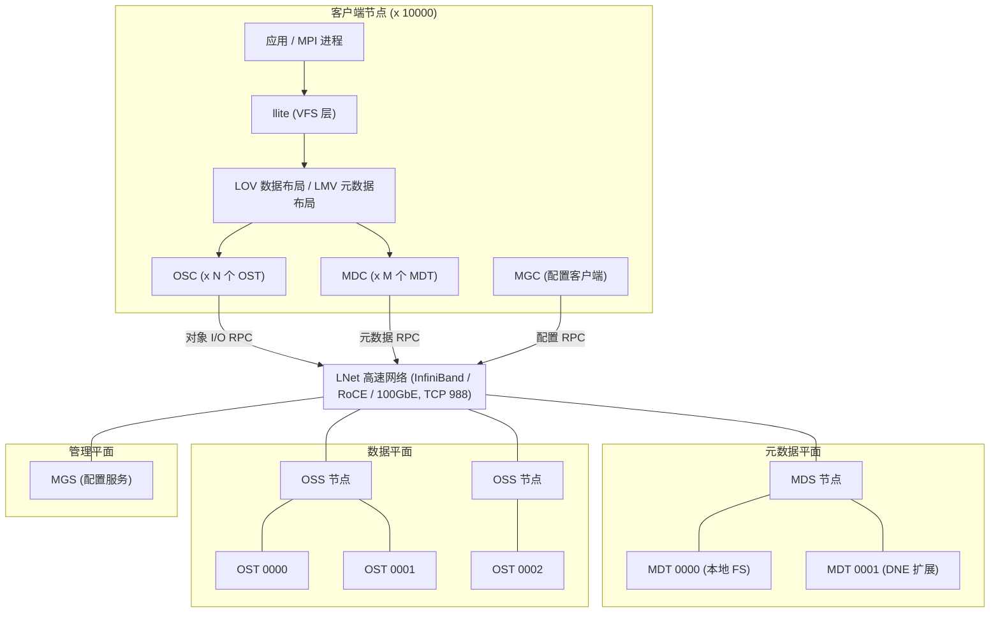
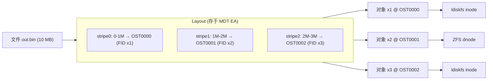
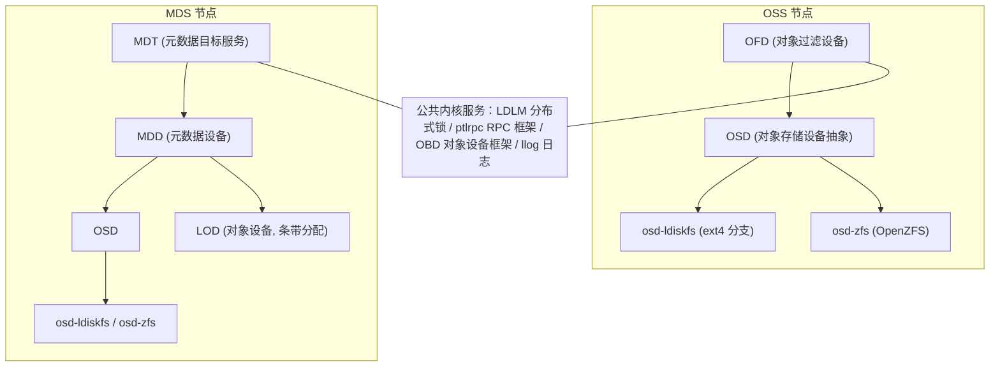

# Lustre 高性能分布式文件系统

> 如果说单机文件系统（ext4 / XFS / ZFS）是"一辆跑得快的车"，那么 **Lustre** 就是"把一万辆车并成一列开上高速"。它是当今全球高性能计算（HPC）领域事实标准的并行文件系统：全球最快的超级计算机 Frontier、Fugaku 们的数据底座，绝大部分就是它。
>
> 本文从 **0 级基础** 讲起，一路走到 **精通**：先认识 Lustre 是什么、源码在哪；再拆解它的整体架构；然后**重点深入存储引擎**（对象模型、条带化、ldiskfs/ZFS 后端、分布式锁）；接着落地到 **HPC 场景**（为什么超算离不开它、如何调优）；最后上升到源码研读与社区参与。

---

## L0 · 认识 Lustre：它是谁，从哪来

### 1.1 一句话定义

**Lustre 是一个开源的、POSIX 兼容的、面向大规模集群的并行分布式文件系统**（GPL v2 协议）。名字是 **Linux + Cluster** 的合成词。它把成百上千台存储服务器组织成一个**单一的全局命名空间**，让数万客户端像访问本地目录一样并发读写 PB~EB 级数据。

```
/mnt/lustre            ← 所有客户端看到的是同一个"虚拟盘"
├── home/
├── projectA/          ← 同一目录可以被 1 万个进程同时读写
└── checkpoint/
```

### 1.2 核心特性速览

| 维度 | 能力 |
|------|------|
| 接口 | 完整 POSIX（open/read/write/mmap/fsync…），应用零改造 |
| 规模 | 数万客户端、PB~EB 级容量（生产 700 PB，理论 16 EB） |
| 性能 | 数百 GB/s ~ 十几 TB/s 聚合带宽（Frontier 的 Orion 达 13 TB/s） |
| 数据布局 | 文件条带化（striping）跨多个存储目标并行读写 |
| 元数据 | 与数据分离，独立横向扩展（DNE，最多 128 个 MDT） |
| 一致性 | 全局分布式锁（LDLM），多客户端并发读写强一致 |
| 高可用 | 服务器主备故障转移 + 客户端自动恢复 |
| 单文件上限 | ldiskfs 后端 32 PB / ZFS 后端 16 EB |
| 每 MDT 文件数 | ldiskfs 40 亿 / ZFS 256 万亿（理论） |

### 1.3 25 年历史：从 CMU 论文到超算标配

Lustre 的历史本身就是一部"科研项目 → 商业公司 → 巨头收购 → 社区自治"的活教材：

| 时间 | 事件 |
|------|------|
| 1999 | Peter J. Braam 在 **卡内基梅隆大学（CMU）** 启动 Lustre 研究项目（源于 Coda/InterMezzo 项目） |
| 2001 | Braam 创立 **Cluster File Systems (CFS)**，受美国能源部 ASCI Path Forward 项目资助（与 HP、Intel 合作） |
| 2003.03 | 首次生产部署：**LLNL MCR 集群**（当时 TOP500 第 3 名） |
| 2003.12 | 发布 **Lustre 1.0.0** |
| 2007.09 | **Sun Microsystems 收购 CFS**，计划将 Lustre 引入 ZFS/Solaris |
| 2008.11 | Braam 离开 Sun，Andreas Dilger / Eric Barton 接管项目 |
| 2010.01 | **Oracle 收购 Sun**；2010.12 Oracle 宣布停止 Lustre 2.x 开发（只维护 1.8） |
| 2010~2011 | 大批开发者离开 Oracle 成立 **Whamcloud**；用户社区成立 **OpenSFS / EOFS**，接管 2.x 开发合同 |
| 2011~2013 | OpenSFS 资助 Whamcloud 完成 SSMD（单服务器元数据性能）、**LFSCK**、**DNE** 等特性；2.3/2.4 引入 **ZFS 后端** |
| 2012.07 | **Intel 收购 Whamcloud**，推进 exascale 时代的 FastForward 项目 |
| 2013.02 | Xyratex 从 Oracle 买下 Lustre 商标与官网 |
| 2014~2015 | Xyratex/Seagate 将 lustre.org 域名归还社区 |
| 2018.06 | **DDN 收购 Intel 的 Lustre 团队与资产**，重启 Whamcloud 品牌（至今仍是主力维护方） |
| 2019.11 | OpenSFS 与 EOFS 联合获得 Lustre 商标 |
| 2022~2025 | 2.15（LTS）/ 2.16 / 2.17 陆续发布，持续服务 exascale 时代 |

> 💡 这段历史的关键启示：**Lustre 的命运证明了"开源 + 用户社区自治"的韧性**——当商业公司（Oracle）决定弃养一个关键技术时，用户（超算中心们）自己出钱养活了它。今天 Lustre 的治理模式是：Whamcloud/DDN 维护主线代码，OpenSFS/EOFS 组织社区与资金，HPE、AWS、CEA、ORNL 等共同贡献。

### 1.4 源码在哪里（GitHub）

Lustre 源码完全开源，官方仓库与 GitHub 镜像如下：

| 仓库 | 地址 | 说明 |
|------|------|------|
| **官方上游仓库** | `https://git.whamcloud.com/fs/lustre-release.git` | Whamcloud 维护的开发主线（Gerrit 评审） |
| **GitHub 镜像（官方）** | **https://github.com/lustre/lustre-release** | README 中声明的官方镜像，跟随上游 |
| Issue 追踪 | https://jira.whamcloud.com/ | 所有 bug/特性以 LU-XXXX 编号管理 |

顶层目录一览（后面 L5 会细讲）：

```
lustre-release/
├── lustre/            # 文件系统主体（llite/lov/osc/ofd/osd-*/ldlm/ptlrpc...）
├── lnet/              # Lustre 网络层（LNet 核心 + 各种 LND 驱动）
├── ldiskfs/           # 修改版 ext4（ldiskfs 后端内核补丁/模块）
├── include/           # 公共内核头文件
├── lib/               # 用户态公共库
├── lustre-iokit/      # 性能测试工具集（IOR、sgpdd-survey 等）
├── lustre_compat/     # 内核兼容层（RHEL/SLES/Ubuntu 多发行版适配）
├── rustreapi/         # Rust 语言绑定（新并入主线）
├── config/ contrib/ rpm/ debian/   # 构建与打包
└── Documentation/     # 文档
```

---

## L1 · 架构全景：一台"可以无限并联的巨型文件服务器"

### 2.1 三大功能单元 + 一个管理中枢

Lustre 的架构可以用一句话概括：**把"文件系统"拆成"目录树（元数据）"和"数据块（对象）"两条完全独立的轴，各自横向扩展**。

- **MDS / MDT（元数据服务器 / 元数据目标）**：管理命名空间——文件名、目录、权限、文件布局（layout）。MDT 是挂载在本地文件系统（ldiskfs/ZFS）上的一个设备。**MDS 不参与任何数据 I/O**，这是它区别于 GPFS/PanFS 等块级分布式文件系统的关键设计（后者元数据服务器参与块分配）。
- **OSS / OST（对象存储服务器 / 对象存储目标）**：真正存放文件数据。一台 OSS 通常服务 2~8 个 OST，每个 OST 是本地文件系统（ldiskfs/ZFS）上的一个设备。**文件系统的容量 = 所有 OST 容量之和**。
- **Client（客户端）**：运行在计算节点内核里（llite 模块），挂载后获得统一的全局命名空间，标准 POSIX 语义。
- **MGS（管理服务器）**：不存数据，只存**配置信息**（`/proc/fs/lustre` 之外，配置记录在 MGS 的 llog 里）。客户端和服务器启动时向 MGS 拉取配置，实现"即插即用"的动态扩容。

### 2.2 架构图



### 2.3 角色职责速查表

| 角色 | 全称 | 数量级 | 职责 | 存储内容 |
|------|------|--------|------|----------|
| **MGS** | Management Server | 1~2（可共置） | 集群配置中心 | 配置 llog |
| **MDS/MDT** | Metadata Server/Target | 1~128 | 目录树、权限、layout | inode、目录项、layout、EA、DoM 小文件 |
| **OSS/OST** | Object Storage Server/Target | 数十~数百 | 文件数据对象 | 数据对象（inode + block） |
| **Client** | Lustre Client | 数千~数万 | 聚合访问 | 无（page cache / PCC） |
| **LNet** | Lustre Networking | 全局 | 消息与 RDMA 传输 | — |

### 2.4 元数据面与数据面的分离：设计精髓

传统架构（如 NFS、GPFS）里，元数据服务器往往是瓶颈：每次数据读写都要先问元数据服务器"块在哪"。Lustre 用 **layout 授权** 打破了这个瓶颈：

1. 客户端 **open** 文件时，MDS 只做路径解析 + 权限校验，然后把 **layout（文件分布在哪些 OST、每个 stripe 多大、FID 是什么）** 发给客户端；
2. 之后客户端**直接与 OSS 通信**读写数据对象，**MDS 完全退出数据路径**；
3. 因此元数据带宽和数据带宽**独立扩展**：数据不够 → 加 OST；元数据不够 → 加 MDT（DNE）。

```
open("/proj/data.bin")
   │
   ▼
 MDS ── 校验权限，返回 layout(FID, OST 列表, stripe 参数)
   │
   ▼
客户端拿到 layout 后 ──► OSS/OST 直连读写（不再经过 MDS）
```

### 2.5 客户端软件栈

Lustre 客户端以内核模块形态工作（也有 FUSE 实现的用户态客户端，但生产环境以内核态为主）：

```
应用 (POSIX API)
   │
   ▼
VFS ───────────► llite        # 接入内核 VFS，实现 file_operations
                     │
        ┌────────────┴────────────┐
        ▼                         ▼
       LMV                      LOV        # 元数据布局 / 数据布局
        │                         │
        ▼                         ▼
       MDC                      OSC       # 每个 MDT/OST 一个客户端实例
        │                         │
        └────────────┬────────────┘
                     ▼
              ptlrpc / LNet          # RPC 框架 + 网络传输（RDMA/TCP）
```

- **llite**：把 Lustre 抽象成 VFS 之上的"超级块"，应用层无感；
- **LMV（Lustre Metadata Volume）**：决定"这个目录在哪个 MDT 上"（DNE 的钥匙）；
- **LOV（Logical Object Volume）**：按 layout 把文件逻辑偏移**切分/聚合**到各个 OST；
- **OSC / MDC**：每个 OST/MDT 对应一个客户端通道，承载锁与 RPC；
- **ptlrpc**：Lustre 自研 RPC 框架（类似微内核 IPC），带恢复（recovery）语义。

### 2.6 一次文件写入的完整旅程

以 64 个进程并发写同一个条带化文件为例：

```
1. open("/proj/out.bin", O_WRONLY)
   └─► MDC ─► MDS：路径解析、权限检查、加锁
       MDS 返回：FID + layout { stripe_count=8, stripe_size=1M, OST 列表 }
       （此时 MDS 使命完成，退出数据路径）

2. write(fd, buf, 1GB)
   └─► llite ─► LOV 把 1GB 按 1M×8 切成条带
       └─► 每个 OSC 持有对应 OST 的 LDLM 写锁（extent lock）
       └─► 数据写入客户端 page cache（writeback 模式）
       └─► 脏页打包成 bulk RPC（最大 16MB 粒度）发给对应 OSS

3. OSS 侧：OFD 收到 RPC ─► OSD 落盘（ldiskfs/ZFS）─► 返回 grant（额度）
4. fsync/写完成：客户端收到确认，保证数据在 OST 上持久化
```

> 关键点：**64 个进程 × 8 条带 = 256 路并行**写向 8 个 OST，任何单块盘都只是这个并发矩阵里的一小格——这就是"聚合带宽"的来源。

### 2.7 LNet：连接一切的"神经"

LNet（Lustre Networking）是 Lustre 自带的网络栈：

- 支持 **InfiniBand（OFED Verbs）、RoCE、iWARP、Omni-Path、TCP/Ethernet（默认端口 988）、Cray Aries/Gemini、BXI、AWS EFA** 等；
- 数据面用 **RDMA** 实现零拷贝大块传输（单链路 EDR InfiniBand 实测 ~11 GB/s，100GbE 也超过 11 GB/s）；
- **Multi-Rail（2.10+）**：把客户端与服务器之间的多条链路（甚至不同网络类型）绑成一个逻辑通道，带宽叠加 + 故障切换；
- 支持路由（router）跨网络分段，长距离部署（如跨机房 WAN）也不在话下。

---

## L2 · 存储引擎架构（重点）

> 这是本文的**核心章节**。Lustre 的"存储引擎"并不是一个单一模块，而是一条完整的**对象存储栈**：`客户端布局切分 → 分布式锁 → RPC → 服务端 OFD → OSD 抽象 → 本地文件系统（ldiskfs/ZFS）`。理解这条栈，才算真正理解 Lustre。

### 3.1 对象模型：文件 = 布局（Layout）+ 一组对象（Objects）

Lustre 的核心抽象是 **object（对象）**：

- 一个文件的**每个条带（stripe）对应 OST 上的一个对象**；
- 一个对象在 OST 本地文件系统里就是一个 **inode**，用 **FID**（全局唯一标识）寻址；
- 文件与对象的映射关系叫 **layout**，永久记录在 MDT 的扩展属性（EA）里；
- 客户端通过 LOV 维护 layout 的"影子副本"，避免每次 I/O 都查 MDT。



### 3.2 条带化（Striping）：并行度的灵魂

条带化是 Lustre 性能的**第一杠杆**。两个核心参数：

- **stripe_count（条带数）**：一个文件横跨多少个 OST；
- **stripe_size（条带大小）**：每个 OST 上连续写多少字节再切到下一个（默认 1 MB，2.16 起新文件默认提升到 4 MB）；
- 可选 **OST pool**：把一批 OST 分组（如 SSD 池 / HDD 池），layout 指定池名。

```
stripe_count = 4, stripe_size = 1M 的文件磁盘分布：

 逻辑偏移   0 ─1M─ 2M─ 3M─ 4M─ 5M─ 6M─ 7M─ 8M─ ...
            │    │    │    │    │    │    │    │
 OST0000:  [0-1M]          [4-5M]          [8-9M]
 OST0001:        [1-2M]          [5-6M]
 OST0002:              [2-3M]          [6-7M]
 OST0003:                    [3-4M]          [7-8M]
```

用 `lfs` 命令查看/设置条带：

```bash
# 查看文件布局
lfs getstripe /mnt/lustre/proj/out.bin

# 为目录设置默认布局：4 条带 × 4MB
lfs setstripe -c 4 -S 4M /mnt/lustre/proj

# 用指定 OST 池（例如 ssd_pool）
lfs setstripe -p ssd_pool -c 8 /mnt/lustre/proj/hot

# 查看文件系统里所有 OST 与容量
lfs df -h /mnt/lustre

# 查看池
lfs pool_list /mnt/lustre
```

**调优直觉**：

| 场景 | 推荐策略 |
|------|----------|
| 单个大文件、多进程并发写（checkpoint） | stripe_count 尽量大（甚至 `-1` 自动选满 OST），stripe_size 1~4 MB |
| 海量小文件（元数据密集） | 不条带（stripe_count=1），或干脆用 DoM 存 MDT |
| 小文件 + 大文件混合 | 按目录分设不同默认布局（PFL 的典型用武之地） |
| 冷数据 | 放 HDD 池，条带少；热数据放 SSD 池（OST pool + HSM 迁移） |

### 3.3 OSD 抽象：两大本地后端 —— ldiskfs 与 ZFS

OSD（Object Storage Device）是 Lustre 服务端对"本地文件系统"的抽象层，屏蔽底层差异，向上提供统一的**对象接口**（按 FID 创建/读/写对象、事务、配额钩子等）。官方有两个生产后端：

#### osd-ldiskfs（基于 ext4 的深度定制）

- 代码在仓库顶层 `ldiskfs/` 目录，是 **ext4 的一个长期维护分支**（保留 extents、mballoc 等，砍掉/改造了不适用的部分）；
- 单 OST/MDT 上限：容量 **1 PiB（2.14 起）**，单文件 **32 PB**，每 MDT 约 40 亿文件（4B inodes）；
- 优点：与内核主线同步成本低、久经超算验证、性能稳定；缺点：无内置压缩/快照，容量上限受 ext4 限制。

#### osd-zfs（ZFS 作为对象存储）

- 从 2.3 预览、**2.4 起正式支持** MDT 与 OST 后端（LLNL 主导推动）；
- 单 OST/MDT 上限：**16 EB**、单文件 16 EB、每 MDT **256 万亿文件**，天然支持**压缩、去重、快照、校验和、加密（ZFS 0.8+）**；
- 代价：内存占用高、调优复杂，且历史上出现过若干稳定性问题，需要谨慎评估。

| 对比项 | ldiskfs | ZFS |
|--------|---------|-----|
| 来源 | ext4 深度定制分支 | OpenZFS on Linux |
| 单 OST 上限 | 1 PiB（生产建议更小） | 16 EB |
| 单文件上限 | 32 PB | 16 EB |
| 每 MDT 文件数 | ~40 亿 | 256 万亿 |
| 压缩 / 去重 / 快照 | ❌ | ✅（透明压缩、可去重、快照工具集成） |
| 加密 | 需 fscrypt（客户端侧） | 原生（ZFS 0.8+） |
| 内存占用 | 低 | 高（ARC 建议至少 8~16 GB/节点） |
| 生态成熟度 | 超算生产首选 | 增长中（不少新部署选择） |

> 💡 选择建议：传统超算（追求极致稳定）多为 ldiskfs；新建系统若需要大容量单 OST、压缩/快照能力，选 ZFS。**同一文件系统可以混合两种后端**（例如 MDT 用 ldiskfs、部分 OST 用 ZFS），但它们对管理员的要求不同，建议单一后端为主。

### 3.4 FID、OI 索引与 LFSCK：Lustre 的"主键"体系

- **FID（File IDentifier）**：128 位三元组 `seq : oid : ver`，全局唯一，是 Lustre 里所有对象的"主键"。FID 由 MDT 按序列批量分配（`seq` 分段），保证无需全局协调即可并发生成。
- **OI（Object Index）**：本地文件系统的 inode 是随意的（ext4/ZFS 各自分配），因此每个 MDT/OST 内部维护一个 **FID → 本地 inode** 的索引（ldiskfs 用 OI 文件，ZFS 用对象目录）。
- **LFSCK（Lustre File System ChecK）**：分布式一致性巡检/修复工具，分阶段检查并修复 OI、FID-in-dirent、MDT↔OST、MDT↔MDT 的一致性。**支持在线执行**（挂载状态下跑），是运维的"体检医生"：

```bash
lctl lfsck_start -M fsname-MDT0000 -t namespace   # 检查命名空间一致性
lctl lfsck_start -M fsname-MDT0000 -t layout      # 检查 MDT-OST 布局一致性
lctl lfsck_stop  -M fsname-MDT0000                # 停止
```

### 3.5 OFD 层：对象过滤设备

OFD（Object Filter Device）位于 OSS 侧、OSD 之上，是**数据路径的"业务逻辑层"**：

- 处理来自客户端的对象读写 RPC（Punch、Write、Read、Sync）；
- 维护 **grant**（下节细讲）与服务器端缓存；
- 对接 LDLM 锁（extent lock 的服务端实现）；
- 执行配额、校验和（含 T10-PI 端到端数据完整性）、统计等。

对应的 MDS 侧还有 **MDD（MetaData Device）** 与 **LOD（Lustre Object Device）**：MDD 负责目录操作语义，LOD 负责在创建文件时**选择 OST 并生成条带布局**（按条带参数、池、空间均衡算法分配）。

### 3.6 服务端完整软件栈



> 所有服务端模块都挂在 **OBD（Object Device）框架**上——这是 Lustre 的"设备驱动模型"：每个服务（MDT/OFD/MGS…）是一个 obd_device，可以动态插入、互相调用，这也是它能同时支持 ldiskfs 与 ZFS 双后端的原因。

### 3.7 LDLM：分布式锁管理器（一致性的地基）

多客户端并发写同一个文件，谁来保证一致性？答案是 **LDLM（Lustre Distributed Lock Manager）**。

- **锁粒度**：以 **extent（字节区间）** 为单位，粒度远小于整文件，允许不同客户端并发读写同一文件的不同区间；
- **锁模式**：EX（排他）、PW（保护写）、PR（保护读）、CW/CR（并发读写，不保证一致）、NL（空锁）——一个完整的锁兼容矩阵，越往下并发度越高；
- **锁缓存**：客户端把锁缓存在本地，后续 I/O 免 RPC；服务器要收回锁时发送 **lock callback**，客户端回放（revoke）后继续；
- **一致性案例**：两个客户端同时写文件不同区段 → 各持各的 extent 写锁，互不干扰；两个客户端写同一区段 → 第二个必须等第一个的锁被回收，保证"后写覆盖"语义。

```
客户端 A: 持有 [0, 4M) PW 锁 ──► 写 OST0000
客户端 B: 请求 [2M, 6M) PW 锁
          └─► LDLM 发现与 A 冲突 ──► 向 A 发 callback
              A 落盘并释放 ──► B 拿到锁继续写
```

> 锁是理解 Lustre 性能瓶颈的关键：**跨客户端同一区间的高频写**会引发锁 ping-pong。2.11 的 **Lock Ahead** 允许应用预取锁（配合 MPI-IO 的聚合写模式），2.16 的 Hybrid IO 则减少不必要的锁交互。

### 3.8 写路径深挖：grant 与 writeback

客户端"写完就返回"的前提是服务器允许多少脏数据缓存在客户端——这就是 **grant（授予额度）** 机制：

1. 客户端挂载后，OST 按内存/参数授予客户端一个写额度（grant）；
2. 客户端在额度内自由 writeback（攒到 bulk RPC 批量发送，减少 RPC 数）；
3. OSS 收到数据落盘后，按比例**回补 grant**（类似 TCP 的滑动窗口）；
4. 服务器内存吃紧时收回 grant，客户端被迫同步刷盘——这是系统自我保护的节流阀。

`/proc/fs/lustre/obdfilter/<ost>/grant_*` 可观测额度状态。写 RPC 大小可达 **16 MB（2.9+）**，2.13 起支持最大 64 MB bulk RPC，进一步摊薄网络开销。

### 3.9 读路径：readahead 与 statahead

- **readahead（读预取）**：客户端按顺序访问模式提前向 OSS 拉取后续数据，掩盖延迟；服务器侧也有 OSS read cache（1.8+）。
- **statahead（属性预取）**：遍历大目录时，客户端批量预取下一个目录项 stat 结果（单线程 ls 一个百万文件目录不再每次卡一个 RTT）；2.16 的 **Optimized Directory Traversal（批量 statahead / Xfast）** 把它升级为对 MDS 的 bulk RPC 并行预取，目录遍历吞吐大幅提升。

---

## L3 · HPC：为什么超算离不开 Lustre（重点）

### 4.1 HPC 的 I/O 痛点

超算（TOP500 级别的系统）的 I/O 需求，普通文件系统完全接不住：

- **万级进程并发**：一个作业 100,000+ MPI 进程同时读写，需要海量并发通道；
- **checkpoint 洪峰**：科学计算每隔几小时全量保存状态，几分钟内灌入几十~几百 TB；
- **共享文件语义**：所有进程要看到同一个文件（例如模拟输出），且要一致；
- **大文件为主**：单个文件动辄 TB 级，普通元数据设计（先查一次目录表）就是灾难；
- **延迟与带宽并重**：既要求低延迟的元数据操作，又要求接近硬件极限的聚合带宽。

### 4.2 各类存储方案对比

| 方案 | 并发能力 | 一致性 | 典型带宽 | 适用 |
|------|----------|--------|----------|------|
| 本地盘（NVMe RAID） | ❌ 单节点 | 天然 | 单机 ~10-30 GB/s | 计算节点临时数据 |
| NFS | 中（单服务器瓶颈） | 弱（cache 一致性差） | 单机 ~10-50 GB/s | 中小集群、管理面 |
| 对象存储（S3/Ceph RGW） | 高，但无 POSIX | 最终一致 | 高，但单对象带宽有限 | 归档、大数据、AI 数据集 |
| **并行文件系统（Lustre）** | ✅ 数万客户端 × 数百 OST | 强（分布式锁） | **数百 GB/s ~ 13 TB/s** | **HPC 主存储** |

> 一句话：**Lustre 把"带宽"和"并发"变成了可以线性叠加的资源**——加 OST 就加带宽，加 MDT 就加元数据吞吐，客户端只是"多少台计算节点"的问题。这是它在 HPC 领域 20 年不可替代的根本原因。

### 4.3 数字说话：TOP500 与明星部署

自 2005 年起，**TOP10 中至少一半、TOP100 中超过 60 台**超级计算机使用 Lustre；多个时期的全球第一都是它的用户：

| 系统 | 机构 | 地位 | 存储规模（Lustre 相关） |
|------|------|------|--------------------------|
| **Frontier** | 美国 ORNL | 2022 起全球第一（exascale） | **Orion：700 PB 容量 / 13 TB/s 带宽**，业界最大 Lustre 之一 |
| **Fugaku** | 日本 RIKEN | 2020-2022 全球第一 | 大规模 Lustre 部署（富士通 FEFS 亦基于 Lustre） |
| **Titan / Jaguar** | 美国 ORNL | 曾居 TOP10 | 十数 PB 级 Lustre |
| **Sequoia / Blue Gene/L** | 美国 LLNL | 曾居 TOP10 | Lustre + DDN 存储 |
| **Blue Waters** | 美国 UIUC | 曾居 TOP10 | 超大 Lustre 命名空间 |
| **Tianhe-1A** | 中国天津超算中心 | 曾居全球第一 | Lustre |
| **LUMI** | 欧洲 CSC | 欧洲第一 | 多 PB Lustre（HPE 方案） |
| **Pleiades** | 美国 NASA | 大型集群 | Lustre |

其他重量级用户：美国能源部四大国家实验室（LLNL / SNL / ORNL / LANL）、NERSC、TACC、法国 CEA、日本东工大等。生产系统规模常态：**几十~上百 OSS 节点、数百~数千 OST、PB~百 PB 容量**。

### 4.4 性能指标与测试

HPC 存储验收与调优通常用两类指标：

- **带宽（Bandwidth）**：`IOR` 测试（POSIX 顺序读写，常配合 MPI 进程数扩展），看 GB/s ~ TB/s；
- **元数据吞吐（Metadata OPS）**：`mdtest`（创建/删除/stat 百万级文件），看 IOPS。

仓库自带 `lustre-iokit/`（IOR 的封装脚本 `iorstat`、`sgpdd-survey` 等），超算社区常用 **IOR + mdtest** 组合：

```bash
# 8 节点 × 32 进程，写 256 GiB 文件（聚合测试）
mpirun -np 256 ior -a POSIX -t 1m -b 1g -s 1 -i 1 \
       -o /mnt/lustre/ior.bin -w -F

# 元数据压测：创建/删除 100 万文件
mpirun -np 256 mdtest -d /mnt/lustre/mdt -n 1000000 -C -T
```

### 4.5 HPC 调优实战清单

| 层面 | 手段 | 说明 |
|------|------|------|
| **布局** | 大文件高条带（`-c 16~64`，甚至 `-1`） | 让写带宽跟上 OST 数量 |
| **布局** | checkpoint/数据目录单独 `setstripe` | 避免继承全局默认布局 |
| **池** | SSD 池放元数据/热数据，HDD 池放冷数据 | 存储分层，PFL 可在同一文件内混合 |
| **网络** | LNet Multi-Rail 多网卡绑定、启用 RDMA | 消除单链路瓶颈（EDR 单链路 ~11 GB/s） |
| **客户端** | `max_rpcs_in_flight`、bulk RPC 调大 | 提高单客户端在途请求 |
| **服务器** | 每 OSS 挂 2~8 个 OST、NVMe 做 MDT 后端 | 平衡 CPU/内存/磁盘 |
| **应用** | MPI-IO + 聚合写（collective I/O） | 把随机小写聚合成大顺序写 |
| **GPU** | 启用 **GDS（GPUDirect Storage，2.15+）** | 存储 ↔ GPU 内存零拷贝 RDMA，跳过 CPU/内存拷贝 |
| **作业调度** | JobStats 集成 SLURM | 按作业 ID 统计 I/O，定位"谁在打满存储" |

### 4.6 从 HPC 走向 AI 与云

Lustre 正在"破圈"：

- **AI 训练**：NVIDIA Selene（DGX SuperPOD）等 GPU 集群使用 Lustre 做数据集与 checkpoint 存储；GDS 让训练吞吐直通 GPU；
- **云托管**：**AWS FSx for Lustre**（完全托管，按需起停、可对接 S3 做数据湖）与 **Azure Managed Lustre**（HPC/AI 的托管并行文件系统）——云上也能一键获得超算级文件系统；
- **金融/生命科学/媒体**：量化回测、基因组学、影视渲染等需要"大文件 + 高并发"的场景都在引入 Lustre。

---

## L4 · 进阶特性：从会用走向精通

### 5.1 元数据扩展：DNE（Distributed Namespace Environment）

单 MDT 的元数据 OPS 有上限（约数万~十几万 ops/s），DNE 让命名空间**水平切分**：

| 能力 | 版本 | 说明 |
|------|------|------|
| Remote directory（远程目录） | 2.4 | 把目录子树放到不同 MDT |
| Striped directory（条带目录） | 2.7/2.8 | 单个大目录跨多个 MDT 分片，突破单 MDT 容量 |
| 目录迁移（`lfs migrate -m`） | 2.8+ | 在线把目录搬到其他 MDT |
| 新目录自动均衡 | 2.13+ | 按空间/数量轮询分配 MDT |
| 目录自动 restripe | 2.14 | 目录增长超阈值自动增加 MDT 分片 |
| MDT 空间均衡 | 2.15 | 自动平衡各 MDT 的 inode 与空间占用 |

```
lfs mkdir -i 1 /mnt/lustre/remote_dir     # 指定建在 MDT1 上
lfs mkdir -i 2 -c 4 /mnt/lustre/bigdir    # 条带目录：4 个 MDT 分片
lfs migrate -m 3 /mnt/lustre/remote_dir   # 在线迁移目录到 MDT3
```

### 5.2 布局进阶：PFL / FLR / DoM / Overstriping

- **PFL（Progressive File Layout，2.10）**：一个文件的 layout 由多个 **component（按偏移分段）** 组成，各段可用不同条带/池。经典用法：文件前 10 MB 放 SSD 池（元数据+热区），之后自动落到 HDD 池大条带——"渐进式布局"；
- **SEL（Self-Extending Layout，2.13）**：组件自动扩展大小，适合容量未知的流式写入；
- **FLR（File Level Redundancy，2.11）**：文件级镜像（同步写多副本），跨 OST/池冗余，读时可并行多副本；
- **DoM（Data on MDT，2.11）**：几 MB 以内的小文件**直接存在 MDT**（通常 NVMe/RAID10），免去 OST RTT，小文件创建/读性能提升一个数量级，且天然避免小文件"条带浪费"；
- **Overstriping（2.13）**：一个文件在一个 OST 上放多个条带，让小文件也能吃满单 OSS 的闪存带宽。

```
# DoM 示例：设置 "最大 2MB 存 MDT" 的目录布局
lfs setstripe -E 2M -L mdt /mnt/lustre/smallfiles

# PFL 示例：0-16MB 用 2 条带 SSD 池，16MB 之后用 8 条带 HDD 池
lfs setstripe -E 16M -p ssd_pool -c 2 \
              -E -1 -p hdd_pool -c 8 /mnt/lustre/proj
```

### 5.3 HSM：分层存储管理

HSM 把"冷数据"按策略搬去磁带/对象存储，主文件系统只留"占位 stub"，命名空间保持不变：

```
Lustre 主 FS ──协调器(Coordinator)──► 代理(Agent) ──Copytool──► 归档层 (HPSS/TSM/S3/磁带)
   ▲                                      │
   └────────── 策略引擎 (RobinHood) 监听 Changelog，按年龄/容量触发 ──┘
```

文件 HSM 状态机：`Exist → Archive（已归档）→ Released（已释放，只剩 stub）`；进程打开 Released 文件时，协调器自动触发 restore，对应用透明。策略引擎 RobinHood 监听 **Changelog**（Lustre 的"binlog"，所有元数据变更事件流）驱动自动化。

### 5.4 可靠性：恢复、故障转移、快照

- **恢复（Recovery）**：服务器崩溃重启后，客户端把未完成 RPC 重放（llog + 回复重建），对应用透明——这是 Lustre 最强大的能力之一；
- **故障转移（Failover）**：MDS 通常配 active/passive 对（共享 MDT），OSS 多为 active/active（各管各的 OST）；2.17 起支持**动态 NID 配置**，服务器换网络接口不中断服务；
- **LFSCK**：在线巡检修复分布式一致性（见 3.4）；
- **快照**：ZFS 后端原生快照 + `lfs snapshot` 工具链，配合 HSM 可实现近乎无感的备份窗口。

### 5.5 安全与多租户

| 能力 | 版本 | 说明 |
|------|------|------|
| **nodemap** | 2.9 | 按客户端 NID 分组，映射 UID/GID，隔离管理域 |
| Kerberos / GSS / SSK | 2.8/2.9 | RPC 认证与加密 |
| **客户端 fscrypt** | 2.14/2.15 | 文件数据加密（2.14）、目录名加密（2.15） |
| OST 池配额 | 2.14 | 按存储池限额 |
| **多租户虚拟化（nodemap 增强）** | 2.17 | 一个 nodemap 导出多个 fileset、root 权限隔离，面向云/共享环境 |

### 5.6 近期版本路线图（截至 2025 年底）

| 版本 | 类型 | 发布时间 | 代表性特性 |
|------|------|----------|-----------|
| **2.15.x** | LTS 长期支持 | 2022-06 起，2.15.8 于 2025-12 | GPU Direct Storage（GDS 零拷贝）、客户端目录加密、MDT 空间均衡、UDSP 网络策略 |
| **2.16.0** | 特性版 | 2024-11 | **大 NID（IPv6/大地址）**、**Unaligned/Hybrid Direct IO**、**批量 statahead（Xfast）**、默认条带 4 MB |
| **2.17.0** | 特性版 | 2025-12 | **动态 NID 配置（VLAN 热插拔）**、**nodemap 多租户/fileset**、Hybrid IO 增强 |
| **2.18.0** | 开发中 | 2026 | 路线图见 lustre.org/roadmap |

> 观察：Lustre 正从"纯 HPC"转向 **HPC + AI + 云多租户** 三线并进——2.16/2.17 的 Hybrid IO、多租户、动态网络配置，都是为 AI 训练集群和云化部署准备的。

---

## L5 · 源码研读与社区参与（精通之路）

### 6.1 代码目录导航（`lustre/` 内部）

```
lustre/
├── llite/         # 客户端 VFS 接入层（超级块、file_operations、mmap）
├── lov/           # 数据布局：条带切分/聚合（LOV）
├── lmv/           # 元数据布局：DNE 目录路由（LMV）
├── osc/ mdc/      # 客户端通道：OST/MDT 客户端（锁 + RPC + grant）
├── mdt/ mdd/ lod/ osp/   # 服务端：MDT 服务、元数据设备、对象设备、OSP 对端
├── ofd/           # 服务端：对象过滤设备（数据面核心）
├── osd-ldiskfs/   # 后端 A：ext4 定制
├── osd-zfs/       # 后端 B：ZFS
├── ldlm/          # 分布式锁管理器（服务端锁服务）
├── mgs/ mgc/      # 管理服务/客户端
├── ptlrpc/        # RPC 框架、恢复协议
├── obdclass/      # OBD 设备框架、llog、事件
├── lfsck/         # 在线一致性巡检
├── quota/ hsm/ changelog/ # 配额、分层、变更日志
├── utils/         # lfs、lctl、mkfs.lustre、tunefs.lustre、mount.lustre
└── tests/         # 官方测试套件（sanity、sanityn、recovery-*...，100+ 套件）
```

阅读顺序建议：`obdclass → ptlrpc → llite → lov → osc → ofd → osd-ldiskfs → ldlm → mdt/mdd → lmv`。

### 6.2 编译与部署入门

```bash
# 从 GitHub 拉源码
git clone https://github.com/lustre/lustre-release.git
cd lustre-release
bash autogen.sh && ./configure --disable-server && make      # 仅客户端
# 或完整构建（服务端需要对应发行版内核头文件，见 wiki: Compiling_Lustre）

# 测试环境（两节点）：官方脚本一键起一个迷你文件系统
./lustre/tests/llmount.sh        # 起 MGS+MDS+OSS+client
./lustre/tests/auster -v sanity --only 1
./lustre/tests/llmountcleanup.sh # 清理
```

生产部署的最小命令集（三节点示例）：

```bash
# ① 管理节点：MGS + MDS（共置），格式化 MDT
mkfs.lustre --fsname=fs1 --mgs --mdt --index=0 /dev/sdb1
mkdir -p /mnt/mdt && mount -t lustre /dev/sdb1 /mnt/mdt

# ② 存储节点：格式化并挂载 OST
mkfs.lustre --fsname=fs1 --ost --index=0 --mgsnode=mds@tcp0 /dev/sdc1
mkdir -p /mnt/ost0 && mount -t lustre /dev/sdc1 /mnt/ost0
# ... 重复挂载更多 OST

# ③ 客户端：一条命令挂载
mount -t lustre mds@tcp0:/fs1 /mnt/lustre
lfs df /mnt/lustre   # 看到所有 OST 即成功
```

### 6.3 运维命令速查

| 场景 | 命令 |
|------|------|
| 查看布局 | `lfs getstripe [-v] <path>` |
| 设置布局 | `lfs setstripe -c <n> -S <size> [-p <pool>] <path>` |
| 查看容量/OST | `lfs df -h /mnt/lustre` |
| 健康检查 | `lctl get_param health_check; lfs check servers` |
| 观察锁/恢复 | `lctl get_param ldlm.namespaces.*.lock_count` |
| 在线巡检 | `lctl lfsck_start -M <fs>-MDT0000 -t namespace\|layout` |
| 性能测试 | `lustre-iokit/iorstat`、`IOR`、`mdtest` |
| 跟踪 RPC | `lctl set_param debug=-1; lctl clear`（读 `/proc/fs/lustre/...`） |

### 6.4 如何参与社区

- **邮件列表**：`lustre-announce`（发布公告）、`lustre-discuss`（讨论）、`lustre-devel`（开发）；
- **Bug/特性**：https://jira.whamcloud.com （LU-XXXX 编号，有 "easy" 标签的入门任务）；
- **代码评审**：上游用 Gerrit（`git.whamcloud.com`），贡献流程见 wiki 的 *Submitting Changes / Using Gerrit*；
- **会议**：LAD（Lustre Administrators and Developers Workshop，每年 SC 前后）、LUG（Lustre User Group，4 月，面向中文社区的 lustrefs.cn 也常办交流）。

---

## 7. 参考资料

- Lustre 官网：https://www.lustre.org/（About / Roadmap / Download）
- GitHub 官方镜像：https://github.com/lustre/lustre-release
- 上游仓库：https://git.whamcloud.com/fs/lustre-release
- Lustre 社区 Wiki：https://wiki.lustre.org/（Architecture / Changelog / Compiling）
- Lustre 2.x 操作手册（中文可用）：https://docs.lustre.org/lustre_manual.xhtml
- Wikipedia：https://en.wikipedia.org/wiki/Lustre_(file_system)
- 知乎《深入理解 Lustre 系列一：Lustre 架构》：https://zhuanlan.zhihu.com/p/632518511
- 腾讯云开发者社区《深入理解 Lustre 分布式文件系统之 Lustre 架构》：https://cloud.tencent.com/developer/article/2074593
- Lustre 中国社区：http://lustrefs.cn/
- openEuler 文档《Lustre 用户指南》：https://docs.openeuler.org/zh/docs/22.03_LTS_SP4/server/development/lustre/user_guide.html

---

> 本文基于公开资料（lustre.org、Lustre Wiki、GitHub、Wikipedia 等）整理，版本信息截至 2025 年底（Lustre 2.17.0 / 2.15.8）。如有出入，以官方发布为准。
