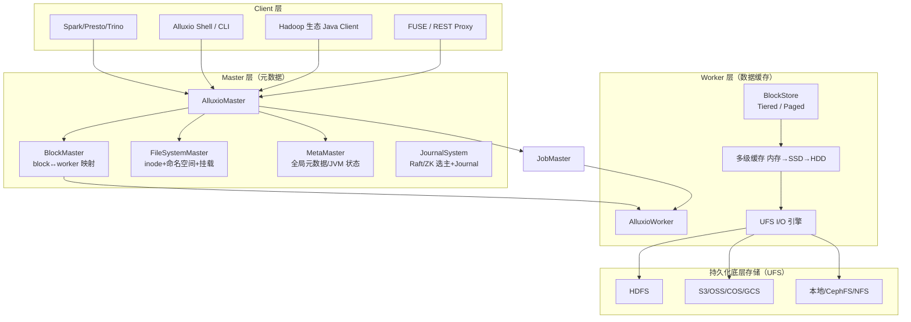
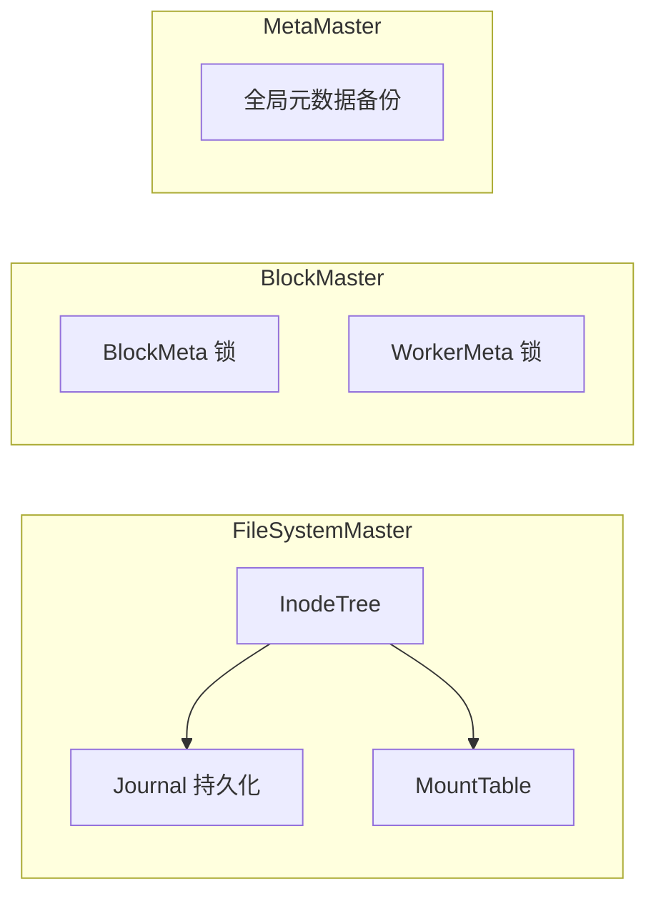
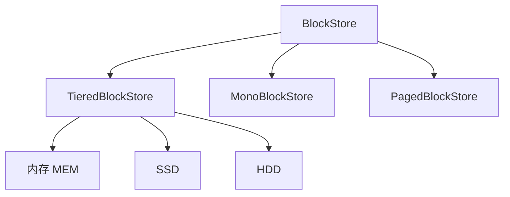
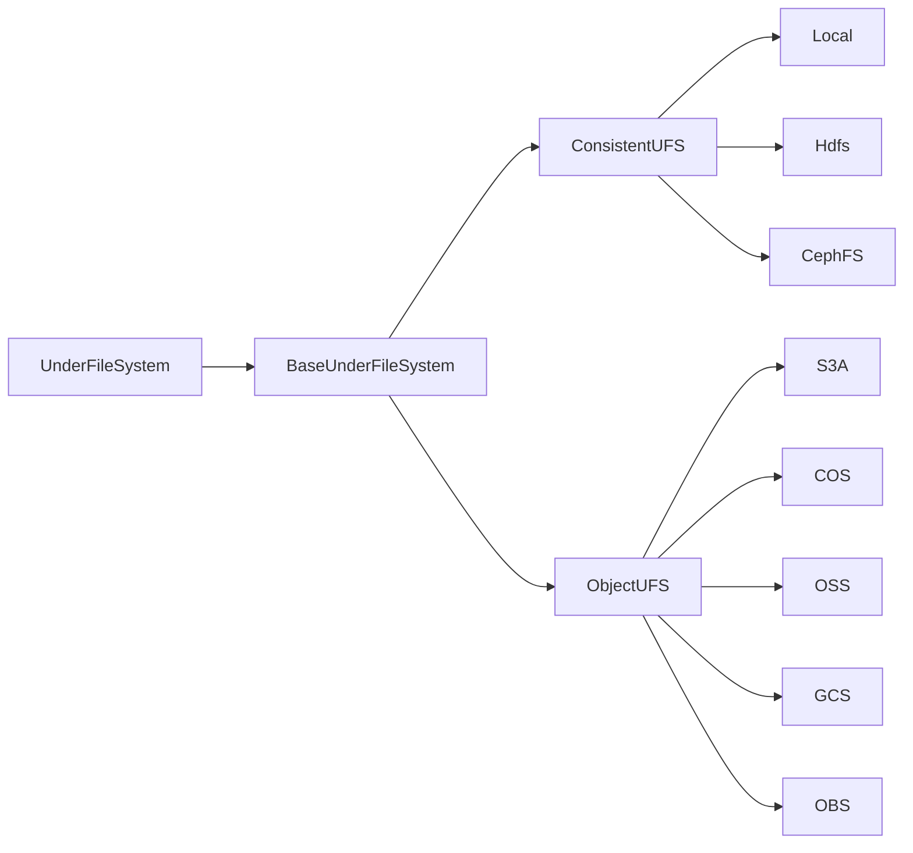
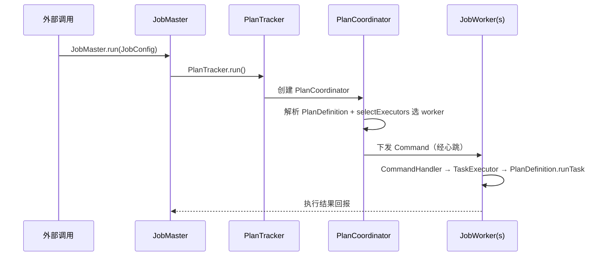

# Alluxio 架构深度解读

> Alluxio（原名 **Tachyon**）是一个**开源的数据编排层（Data Orchestration Layer）**，它横跨在**计算框架**（Spark / Presto / Trino / Flink / TensorFlow / PyTorch 等）与**底层存储**（HDFS / S3 / OSS / COS / GCS / 本地盘 等）之间，扮演"内存级**虚拟分布式文件系统**"的角色。它既不是存储，也不是计算，而是两者之间的**加速缓存 + 统一命名空间**。
>
> 本文按"**社区认知 → 顶层定位 → 进程与模块 → 元数据与存储 → Block 读写 → Job 调度 → 源码目录 → 演进与对比**"的脉络展开，所有结构均对照 GitHub `Alluxio/alluxio` 的 **2.10.0-SNAPSHOT** 主线源码。
>
> 源码仓库：https://github.com/Alluxio/alluxio

---

## 0 · 先回答三个问题（知乎/掘金社区最常问的）

在正式进入架构之前，先用社区里被反复问到的三个问题打底——它们基本勾勒出了 Alluxio 的全部意义：

**Q1：Alluxio 到底是存储、缓存，还是文件系统？**

它三者都像、又都不是。最准确的定位是 **"数据编排层"**：对外把各种异构底层存储统一成一个**虚拟文件系统命名空间**，对计算引擎"声称自己是一块高性能存储"，对内则是一套**分布式块缓存**。它自己**不持久化数据**——数据最终都存在底层存储（Under File System, UFS）里。

**Q2：为什么要缓存一层，绕这一圈不值得吗？**

因为在大数据/云原生时代，**计算与存储分离**是大势所趋（对象存储便宜但慢、吞吐低、无本地性；计算集群内存/SSD 快但贵、容量小）。Alluxio 把这层矛盾用"加速缓存"消化掉：**热数据留在本地或多级高速介质，冷数据放对象存储**，二者无缝衔接。

**Q3：它和 JuiceFS / Fluid / HDFS 的区别是什么？**

- 与 **HDFS**：HDFS 是**真正持久化存储**；Alluxio 是**缓存/编排层**，不持久化。
- 与 **JuiceFS / Fluid**：JuiceFS 把元数据放进 K-V/Redis、把数据块放对象存储，做的是"POSIX 文件系统"；Fluid 是 Kubernetes 上的数据集编排框架（元数据+缓存引擎，后端的分布式缓存引擎可以是 Alluxio）。三者都瞄准"数据加速"赛道，是竞品也是互补品——这也是知乎上"Alluxio 还有没有未来"争论的焦点。

---

## 1 · 顶层定位：为什么要在计算和存储之间"插一层"

### 1.1 数据湖时代的三大痛点

数据湖（Data Lake）兴起后，技术体系裂化为三个子领域：**数据湖存储、数据湖计算、数据湖统一元数据**（这一框架来自 Alluxio 官方源码解析系列，也是社区共识）。

```
┌─────────────────────────────────────────────────────┐
│  数据湖计算  Spark / Presto / Trino / Flink / ML    │
└───────────────────────┬─────────────────────────────┘
                        │  访问协议多样：HDFS / S3 / POSIX / FUSE
              ┌─────────▼─────────┐
              │   ALLUXIO 编排层   │  ← 统一命名空间 + 内存级缓存 + 数据本地性
              └─────────┬─────────┘
                        │  多种 UFS 适配器
┌───────────────────────▼─────────────────────────────┐
│  数据湖存储  HDFS / S3 / OSS / COS / GCS / 本地盘    │
└─────────────────────────────────────────────────────┘
```

存储与计算分离带来三个必然痛点，Alluxio 正是为此而生：

| 痛点 | 表现 | Alluxio 的解法 |
|------|------|----------------|
| **数据本地性消失** | 计算节点访问远程对象存储，网络 I/O 成为瓶颈 | 把热数据缓存到计算集群本地，实现"数据靠近计算" |
| **吞吐/延迟不匹配** | 对象存储带宽低、时延高，无法喂饱 GPU/SSD 计算节点 | 多级缓存（内存→SSD→HDD）充当高速"前置仓" |
| **接口碎片化** | 每种存储一种 API，计算引擎要写一堆适配 | 统一命名空间 + 统一的 HDFS/S3/gRPC API |

### 1.2 Alluxio 的官方定位

> "Alluxio Open Source (formerly known as Tachyon) is a **Distributed Caching Platform** for large-scale data. It **bridges the gap** between computation frameworks and storage systems."

这是 README 的原话——**"桥"** 与 **"分布式缓存平台"** 是它的两个最核心 keyword。它本身源自 UC Berkeley AMPLab 的 **BDAS（Berkeley Data Analytics Stack）** 研究项目，前身 Tachyon，创始人是 Haoyuan Li（李浩源），其博士论文即题为 *Alluxio: A Virtual Distributed File System*。

### 1.3 开源版 vs 企业版（重要边界）

随着 Alluxio 商业化，开源版（本文讨论对象）与企业版出现了明显的架构分岔，必须说清楚，否则对照企业版宣传会困惑：

| 维度 | 开源版（OOS） | 企业版 |
|------|---------------|--------|
| 定位 | 分析型负载加速（Presto/Spark/Trino） | AI/ML 训练、推理、分布式 |
| 元数据架构 | **中心化** Master + Journal | **去中心化**分布式元数据服务 |
| 扩展规模 | 约 1 亿文件 | 数百亿文件级横向扩展 |
| 接口 | HDFS/S3/gRPC API | 额外提供 **FUSE/POSIX**（PyTorch/TensorFlow/Ray 原生适配） |
| 费用 | 免费、社区支持 | 商业收费 |

> ⚠️ 结论：**开源 Alluxio 主打"中心化元数据 + 块缓存加速分析负载"**；企业版才强调"去中心化元数据 + POSIX 全兼容"。本文章重讲解开源版的架构。

---

## 2 · 总体架构：三大进程簇 + 统一命名空间

### 2.1 一次启动出来的五个进程

Alluxio 启动（`bin/alluxio-start.sh all`）后会拉起 **5 个核心 Java 进程**，对应 `JPS` 可见的：

```
AlluxioMaster    — 元数据大脑（RPC 19998 / Web 19999）
AlluxioWorker    — 数据缓存节点（RPC 29999 / Web 30000)
AlluxioProxy     — 无状态代理，把 REST API 转成 gRPC
AlluxioJobMaster — 内置轻量作业调度的 Master
AlluxioJobWorker — 内置轻量作业调度的 Worker
```

### 2.2 逻辑分层总览



核心思想一句话：**Master 管"位置与元数据"，Worker 管"数据缓存块"，UFS 管"最终持久化"**。

### 2.3 统一命名空间与挂载（Mount）

Alluxio 最关键的用户心智是：**所有异构存储被挂到同一个 `/` 根命名空间下**。

```
alluxio://host:19998/
├── /data/hdfs        ← 挂载 hdfs://ns1/（HDFS）
├── /ml/models        ← 挂载 s3://bucket/models（S3）
└── /logs             ← 挂载 oss://bucket/logs（阿里云 OSS）
```

`MountTable` + `UfsManager` 负责维护这些挂载点，`FileSystemMaster` 的 `mount / unmount / updateMount` 是其核心操作（源码 `DefaultFileSystemMaster`）。

---

## 3 · Master 进程：Alluxio 的"大脑"

### 3.1 启动流程（对照源码）

源码路径：`core/server/master/src/main/java/alluxio/master/AlluxioMasterProcess.java`

1. 基于 **JournalSystem** 维护元数据持久化，宕机后从最新 journal 恢复；
2. **Master 选举**：支持 **ZooKeeper**（`ALLUXIO_MASTER_HA_MODE=zookeeper`）与 **Raft Journal**（`RaftJournalSystem`）；
3. `startMasters()`：启动所有 Master 服务（BlockMaster、FileSystemMaster、MetaMaster 等）——若是 leader 则 `BackupManager#initFromBackup` 恢复所有注册 server，非 leader 只启动 RPC/UI 服务；
4. `startServing()`：启动 Web / JVM / RPC 指标服务。

### 3.2 三大核心 Master Service

每个 Master Service 都是一个 `Server` 接口实现，注册进 gRPC server。

| Service | 源码类 | 职责 |
|---------|--------|------|
| **FileSystemMaster** | `DefaultFileSystemMaster` | 维护文件系统**元数据**：inode 树、命名空间、挂载表、TTL、审计、复制校验 |
| **BlockMaster** | `DefaultBlockMaster` | 维护 **block↔worker** 映射、worker 注册与心跳、丢失 block 探测 |
| **MetaMaster** | `DefaultMetaMaster` | 维护全局元数据、JVM 状态、每日备份、配置检查 |



**加锁顺序约定**（避免死锁，源码注释明确）：需要同时加锁 block 与 worker 元数据时，**worker 先于 block 加锁，释放时 block 先于 worker**。

### 3.3 心跳检查器（HeartbeatThread）

Master 会周期性提交一组**心跳检查器**（都实现 `HeartbeatExecutor`）：

| 检查器 | 作用 |
|--------|------|
| `BlockIntegrityChecker` | Block 完整性校验 |
| `InodeTtlChecker` | inode 的 TTL 生命周期清理 |
| `LostFileDetector` | 丢失文件探测 |
| `ReplicationChecker` | 副本数校验（file/replication 包下） |
| `PersistenceSchedule/Checker` | 持久化调度与校验 |
| `UfsCleaner` | UFS 清理 |
| `LostWorkerDetectionHeartbeatExecutor` | 心跳丢失的 worker 探测 |

### 3.4 元数据存储：Heap 与 RocksDB

源码 `core/server/master/.../metastore/` 提供两种 inode/block 元数据落地：

- `heap` — 纯内存实现，快、重启需从 journal 恢复；
- `rocks` — 基于 **RocksDB** 持久化元数据，支撑超大元数据规模。

对应配置 `alluxio.master.metastore=HEAP|ROCKS`。这里也是开源版"约 1 亿文件"扩展上限的主要来源（heap 模式元数据开销大）。

---

## 4 · Journal 与高可用（HA）

### 4.1 Journal 是什么

Journal 是 **Master 元数据变更的操作日志**，类似数据库的 WAL。`Journaled` 接口定义了 `processJournalEntry` / `applyAndJournal` / `getJournalEntryIterator` 等方法，核心思想：**每次元数据变更先写 journal，再应用**，宕机后从 journal 重放恢复。

### 4.2 两种选主方式

| 模式 | 配置 | 特点 |
|------|------|------|
| **ZooKeeper** | `alluxio.master.ha.mode=zookeeper` | 依赖外部 ZK，多个 master 竞争 leader |
| **Raft** | `RaftJournalSystem`（内置） | 内嵌 Raft 共识，多副本 journal，天然高可用 |

生产上**推荐 Raft**——不依赖外部一致性服务，且 2.9 新版针对大规模多租户重构了架构（MergeJournal / 状态机并行加载）。

### 4.3 分布式备份与一致性

`MetaMaster` 支持**每日自动备份（DailyMetadataBackup）**；`BackupManager` 负责 leader 从备份初始化。开源版的一致性模型是"**最终一致 + 文件级 RPC 强一致**"——Alluxio 元数据与时序通过 journal 保证，数据块则允许缓存过期/主动失效（`free`/`unmount` 触发）。

---

## 5 · Worker 进程：缓存的核心载体

### 5.1 启动流程

源码：`core/server/worker/src/main/java/alluxio/worker/AlluxioWorkerProcess.java`

1. 通过 `MasterInquireClient.Factory` 获取 Master 地址；
2. 创建 `AlluxioWorkerProcess`，通过 `WorkerRegistry` 启动所有 Worker Server；
3. 注册 Web Server（REST + Prometheus 指标）与 `JvmPauseMonitor`；
4. 若内嵌 FUSE，则启动 `FuseManager`。

### 5.2 DefaultBlockWorker 的三条心跳

`DefaultBlockWorker` 管理 Worker 节点 Block 的最高层抽象，周期性提交：

| 心跳 | 作用 |
|------|------|
| `BlockMasterSync` | 将本 Worker 的 Block 信息定时上报给 BlockMaster |
| `PinListSync` | 维护 Alluxio 与底层 UFS 的联通地址 |
| `StorageChecker` | 校验各存储目录地址 |

### 5.3 分层存储：BlockStore



Worker 的 `BlockStore` 接口有多个实现：

- **TieredBlockStore**：经典**分层存储**，block 可在 内存→SSD→HDD 多级流动，通过 `BlockMetadataManager` + `BlockLockManager`（读写锁）保证线程安全；
- **MonoBlockStore**：单层简化实现；
- **PagedBlockStore**：2.x 新增的**页式缓存**（page 级粒度），配套 `PagedBlockReader/Writer`，更适合细粒度缓存与大数据量。

#### 分配算法（Allocator）

`allocator/` 包下三种策略（决定新 block 放哪层/哪目录）：

| 算法 | 源码类 | 策略 |
|------|--------|------|
| 轮询 | `RoundRobinAllocator` | 从最高层开始轮询，高层不足降层 |
| 最大剩余 | `MaxFreeAllocator` | 分配到剩余空间最大的存储 |
| 贪心 | `GreedyAllocator` | 返回第一层满足大小的存储（示例） |

#### 淘汰算法（Evictor）

`evictor/` 包：`LRUEvictor`（最久未使用淘汰）为主力实现，配合 `BlockStoreEventListener` 事件（onAccessBlock / onCommitBlock / onMoveBlock / onEvictBlock 等）同步状态变化。

### 5.4 读路径（源码：DataReader / BlockReader）

Block 读分**本地短路读**与 **UFS 直读（边读边缓存）**：

```
BlockReadHandler.onReady
  └─ DataReader（异步 I/O 线程）
       ├─ promote=true → Worker.moveBlock 提到更高层
       ├─ createBlockReader
       │    ├─ 本地可直接访问 → LocalFileBlockReader（FileChannel.map）
       │    └─ 在 UFS 中 → UnderFileSystemBlockReader（边读边写入缓存 Block）
       └─ transferTo → NettyDataBuffer 返回客户端
```

**ShortCircuit（短路读）**：`ShortCircuitBlockReadHandler` 让同机客户端绕过网络直接读本地 block，是性能关键。

### 5.5 写路径（三种 Handler）

`DelegationWriteHandler` 根据命令类型分派：

| 命令 | 处理类 | 行为 |
|------|--------|------|
| `ALLUXIO_BLOCK` | `BlockWriteHandler` | 只写 Alluxio Block 缓存 |
| `UFS_FILE` | `UfsFileWriteHandler` | 只写底层 UFS |
| `UFS_FALLBACK_BLOCK` | `UfsFallbackBlockWriteHandler` | 先写 Alluxio Block，再落到 UFS（**推荐，兼顾速度与持久化**） |

---

## 6 · UnderFS：底层存储适配层

### 6.1 两大类 UFS 实现

源码目录 `underfs/` 下是一长串适配器。上篇源码解析把实现归纳为两类：



| 类别 | 特征 | 代表 |
|------|------|------|
| **一致性文件系统**（Consistent） | 强一致、支持 rename/append | `local`、`hdfs`、`cephfs`、`nfs` |
| **对象存储**（Object） | 最终一致、REST 接口 | `s3a`、`cos`（腾讯）、`oss`（阿里）、`obs`（华为）、`gcs`（谷歌）、`abfs`/`wasb`（Azure）、`swift`、`kodo`、`web` |

### 6.2 关键接口方法

`UnderFileSystem` 接口两大块 API：

- **通用存储操作**：`create / open / deleteFile / rename / mkdirs / getStatus / listStatus / setAcl / setOwner ...`
- **最终一致性操作**（对象存储特有）：`createNonexistingFile / openExistingFile / renameRenamableDirectory / getExistingStatus ...` —— 解决"Master 元数据已改，但 UFS 操作失败"的幂等问题。

`UfsManager` / `AbstractUfsManager` 统一管理挂载；`UfsClient` 维护每个 UFS 的连接与描述。`connectFromMaster` / `connectFromWorker` 分别建立 Master 侧、Worker 侧的连通。

---

## 7 · Client 与访问协议

### 7.1 Client 家族（gRPC 客户端）

`core/client/` 封装了对各 Master 的 RPC 客户端：

| Client | 对接 | 职责 |
|--------|------|------|
| `FileSystemMasterClient` | FileSystemMaster RPC | 元数据管理 |
| `BlockMasterClient` | BlockMaster RPC | Block 管理 |
| `MetaMasterClient` | MetaMaster RPC | 全局元数据 |
| `JobMasterClient` | JobMaster RPC | 作业调度 |
| `TableMasterClient` | TableMaster RPC | Catalog 表管理 |

### 7.2 文件系统视图

`FileSystem` / `BaseFileSystem` 定义客户端文件操作（createFile / openFile / delete / rename / mount / free / persist ...）。关键实现：

- **`FileSystemContext`**：维护文件系统操作的连接上下文（Client JVM 内共享，一个 Context 连接一个 Alluxio）；
- **`MetadataCachingFileSystem`**：客户端**元数据缓存**，减少 RPC 往返；
- **`AlluxioFileInStream / AlluxioFileOutStream`**：文件输入/输出流，底层封装 Block 的 `BlockInStream / BlockOutStream`。

### 7.3 四种对外访问方式

| 方式 | 适用 | 说明 |
|------|------|------|
| **Java FileSystem API** | Spark/Presto/Hadoop | 依赖 `alluxio-shaded-client` / `alluxio-core-client-hdfs` |
| **gRPC** | 自研框架 | 高性能原生协议 |
| **REST / Proxy** | 通用语言 | `AlluxioProxy` 把 REST 转为 gRPC |
| **FUSE** | 本地 POSIX | `integration/fuse`（jnifuse），挂载成目录 |

---

## 8 · 内置轻量作业调度（Job Master/Worker）

Alluxio 内部自带一套轻量级**分布式作业调度**，用于 `load / persist / migrate / replicate / move / evict / compact` 等后台操作，**不必依赖外部调度器**。



- **PlanDefinition**：作业定义，`selectExecutors` 在 Master 选 worker、`runTask` 在 worker 执行；
- **内置作业**：`LoadDefinition / PersistDefinition / MigrateDefinition / ReplicateDefinition / EvictDefinition / MoveDefinition / CompactDefinition`；
- **TaskExecutorManager**：管理 worker 端任务执行池、限流与生命周期。

> **Persist 示例**（把缓存持久化到 UFS）：读 Alluxio 数据流 → `UfsClient` 判断目标路径 → `UnderFileSystem.create` 建输出流 → 数据流拷贝到 UFS。

---

## 9 · 源码目录导览

以 2.10.0-SNAPSHOT 主线为基准，逐条对应我们讲过的概念：

```
alluxio/
├── core/
│   ├── client/          # 客户端（传递 gRPC 调用）
│   │   └── fs/src/.../client/file/   FileSystem / AlluxioFileIn&OutStream / Context
│   ├── common/          # 公共基础（配置 conf/、进程、Utils）
│   ├── server/          # 服务端
│   │   ├── master/      #   Master（block/ file/ meta/ journal/ metastore/ scheduler/ throttle）
│   │   ├── worker/      #   Worker（block/ page/ grpc/ data）
│   │   └── proxy/       #   无状态 REST 代理
│   └── transport/       # gRPC proto（grpc/ proto/{client,dataserver,journal,meta,shared}）
├── job/                 # 轻量作业调度（client / common / server → plan+workflow）
├── underfs/             # UFS 适配器（hdfs s3a cos oss obs gcs abfs wasb cephfs local...）
├── table/               # Catalog 能力（对接 Hive Metastore / AWS Glue）
├── shell/               # Alluxio Shell / CLI（fs, fsadmin, job, table）
├── integration/         # 生态整合（fuse, kubernetes, docker, emr, dataproc）
├── webui/               # Master/Worker 的 Web UI（TypeScript）
├── minicluster/         # 最小测试集群
└── tests/ · microbench/ # 测试与基准
```

**一句话记忆**：`core` 是躯干，`job` 是手脚，`underfs` 是接口适配器，`table` 是读元数据的挂件，`shell` 是入口，`integration` 是生态。

---

## 10 · 演进与社区争议

### 10.1 版本演进的关键节点

| 版本 | 里程碑 |
|------|--------|
| 0.x（Tachyon） | UC Berkeley AMPLab 研究原型 |
| 1.x | 正式改名为 Alluxio，走向生产 |
| 2.x | 重构元数据（Rocks 选项）、页式缓存、内置调度、Raft Journal |
| 2.9+ | 大规模多租户架构重构、元数据状态机并行加载 |
| 企业版 | 去中心化元数据 + FUSE/POSIX，服务 AI/ML |

### 10.2 为什么不温不火又"死不了"

社区（尤其知乎）常有声音质疑：Alluxio 热度似乎不如当年，万物上 K8s、JuiceFS 等新玩家不断出现。但客观看：

- **开源版"慢"** 是因为主力研发投入转向企业版（去中心化元数据），开源版更多用于中小规模加速；
- **生态绑定深**：Presto/Trino/Spark 社区大量集成、Meta 等公司用其降 Presto 延迟、小红书/腾讯/快手等有规模化落地；
- **赛道成立**：云原生数据编排仍是刚需，竞品（JuiceFS/Fluid）也从侧面验证了"计算存储之间需要加速缓存层"这一命题的成立。

> 我的判断：Alluxio 开源版的核心价值在于**干净地把"缓存编排"抽象并工程化**，其 Master/Worker、分层缓存、UFS 适配、内置调度的架构，即使不作为生产首要选型，也是理解"分布式文件系统 + 缓存加速"的一等一教材。

---

## 11 · 结语

Alluxio 的架构用一个词概括就是 **"分层与解耦"**：

- **元数据（Master）与数据（Worker）解耦** → 各自横向扩展；
- **缓存介质分层**（内存→SSD→HDD）→ 兼顾速度与成本；
- **存储接口解耦**（UFS 适配器）→ 一套命名空间接天下存储；
- **调度与应用解耦**（内置 Job 框架）→ 后台数据操作自治。

它站在大数据与 AI 的交汇点上，尽管开源路线沿中心化元数据的"经典"路径演进，但其"**为数据湖/云原生而生、以缓存编排为纲**"的设计，依然是理解现代数据基础设施的重要拼图。

---

## 参考资料

- [Alluxio GitHub 源码（main 分支，2.10.0-SNAPSHOT）](https://github.com/Alluxio/alluxio)
- 稀土掘金 · Alluxio 官方《Alluxio 源码完整解析 | 你不知道的开源数据编排系统》（上篇 / 下篇）
- 稀土掘金《分布式内存文件系统 Alluxio》《华为云 MRS：认识中间人 Alluxio》
- Alluxio 官方文档与 README（editions / Open Source vs Enterprise）
- 知乎 Alluxio 相关话题与"数据结构编排 / JuiceFS 对比"讨论（注：知乎反爬较强，主要以社区共识口径采信概念性结论）
