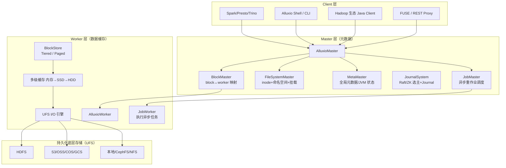
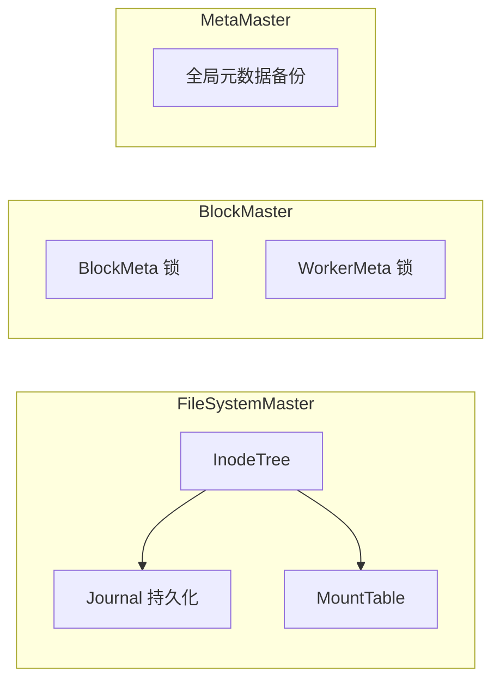
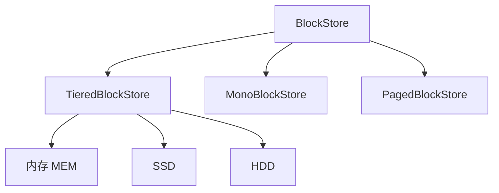
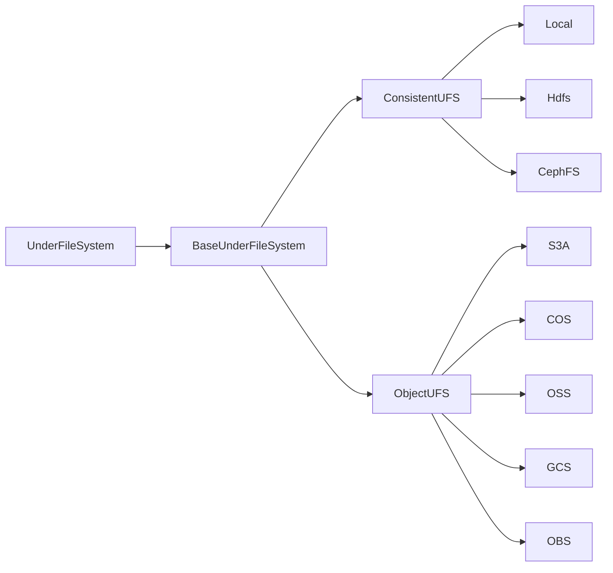
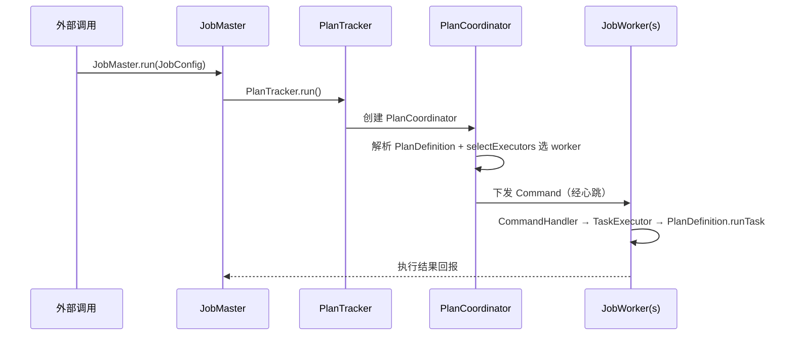

# Alluxio 架构深度解读

> Alluxio（原名 **Tachyon**）是一个**开源的数据编排层（Data Orchestration Layer）**，它横跨在**计算框架**（Spark / Presto / Trino / Flink / TensorFlow / PyTorch 等）与**底层存储**（HDFS / S3 / OSS / COS / GCS / 本地盘 等）之间，扮演"内存级**虚拟分布式文件系统**"的角色。它既不是存储，也不是计算，而是两者之间的**加速缓存 + 统一命名空间**。
>
> 本文按"**社区认知 → 顶层定位 → 进程与模块 → 元数据与存储 → Block 读写 → 写入模型与一致性 → 源码目录 → 演进与对比**"的脉络展开，所有结构均对照 GitHub `Alluxio/alluxio` 的 **2.10.0-SNAPSHOT** 主线源码。
>
> 源码仓库：https://github.com/Alluxio/alluxio

---

## 0 · 先回答三个问题（知乎/掘金社区最常问的）

在正式进入架构之前，先用社区里被反复问到的三个问题打底——它们基本勾勒出了 Alluxio 的全部意义：

**Q1：Alluxio 到底是存储、缓存，还是文件系统？**

它三者都像、又都不是。最准确的定位是 **"数据编排层"**：对外把各种异构底层存储统一成一个**虚拟文件系统命名空间**，对计算引擎"声称自己是一块高性能存储"，对内则是一套**分布式块缓存**。它自己**不持久化数据**——数据最终都存在底层存储（Under File System, UFS）里。

**Q2：为什么要缓存一层，绕这一圈不值得吗？**

因为在大数据/云原生时代，**计算与存储分离**是大势所趋（对象存储便宜但慢、吞吐低、无本地性；计算集群内存/SSD 快但贵、容量小）。Alluxio 把这层矛盾用"加速缓存"消化掉：**热数据留在本地或多级高速介质，冷数据放对象存储**，二者无缝衔接。

**Q3：它和 JuiceFS / Fluid / HDFS 的区别是什么？**

- 与 **HDFS**：HDFS 是**真正持久化存储**；Alluxio 是**缓存/编排层**，不持久化。
- 与 **Fluid**：Fluid 是 Kubernetes 上的数据集编排框架（元数据+缓存引擎，后端的分布式缓存引擎可以是 Alluxio）。
- 与 **JuiceFS**：这是最重要的对比——**Alluxio 把自己定位成"中间层/桥梁"**，协调其上下的存储与计算；**JuiceFS 则是一个完整的 POSIX 文件系统**，把底层对象存储作为自己内部组件，对用户屏蔽。这个本质差异决定了二者在追加写、随机写、一致性模型上的走向完全不同（详见第 11 章的深度对比）。

> 三者都瞄准"数据加速"赛道，是竞品也是互补品——这也是社区"Alluxio 还有没有未来"争论的焦点。

---

## 1 · 顶层定位：为什么要在计算和存储之间"插一层"

### 1.1 存算分离时代的三类真实痛点

数据湖（Data Lake）兴起后，技术体系裂化为三个子领域：**数据湖存储、数据湖计算、数据湖统一元数据**。在 HDFS 和对象存储都无法独立解决的场景里，问题具体表现为三类：

```
┌─────────────────────────────────────────────────────┐
│  数据湖计算  Spark / Presto / Trino / Flink / ML    │
└───────────────────────┬─────────────────────────────┘
                        │  访问协议多样：HDFS / S3 / POSIX / FUSE
              ┌─────────▼─────────┐
              │   ALLUXIO 编排层   │  ← 统一命名空间 + 内存级缓存 + 数据本地性
              └─────────┬─────────┘
                        │  多种 UFS 适配器
┌───────────────────────▼─────────────────────────────┐
│  数据湖存储  HDFS / S3 / OSS / COS / GCS / 本地盘    │
└─────────────────────────────────────────────────────┘
```

| 痛点 | 表现 | Alluxio 的解法 |
|------|------|----------------|
| **数据本地性消失** | 计算节点访问远程对象存储，每次计算都需网络拉数据，速度慢且带宽消耗大 | 把热数据缓存到计算集群本地，重建"**逻辑上的数据本地性**" |
| **吞吐/延迟不匹配** | 对象存储带宽低、时延高，无法喂饱 GPU/SSD 计算节点 | 多级缓存（内存→SSD→HDD）充当高速"前置仓" |
| **接口语义碎片化** | PyTorch/TensorFlow 默认 POSIX `open()/read()`，对象存储的 HTTP/S3 API 无法直接满足；Spark on HDFS 迁到 Spark on S3 要改大量代码；企业数据分散在多套存储、应用需适配不同 API | 多协议统一接入（FUSE / HDFS 兼容接口）+ 统一命名空间 |

**AI/ML 训练是痛点 1 的极端放大版**：训练要**反复读取同一数据集（多个 epoch）**，每次 epoch 都从远程对象存储加载，高延迟会导致**昂贵的 GPU 因等待 I/O 而空转**——实践中没人这么干，所以数据编排层在 AI 场景几乎是必选项。把 S3 上的数据集缓存到 Alluxio Worker 内存、GPU 直接本地读取，吞吐可提升 10 倍以上。

### 1.2 计算机软件世界的解法：加一层

> 计算机软件的世界里，大多数场景都是通过**加一层**来解决问题。

数据编排层正是这一哲学的产物。它通过三点解决上述问题：

1. **计算侧分层缓存**：自动把热点数据（如训练集）缓存在靠近计算节点的内存/SSD 中，重建"逻辑数据本地性"，避免计算资源闲置；
2. **多协议统一接入**：通过 FUSE、HDFS 兼容接口、gRPC，把对象存储语义**透明转换**为 POSIX / HDFS 语义，现有 AI/大数据应用**零改造**运行；
3. **统一命名空间**：无论数据物理上分散在 S3、HDFS 还是其他系统，都挂载到一个全局一致的目录树，应用只访问这一层。

### 1.3 "数据编排层"这名字不是白叫的

有人会问：这不就是个**数据缓存层**吗，怎么起了个"数据编排层"这么高大上的名字，要跟 K8s 叫板？

某种程度上它确实撑得起这个名字——**缓存只是它的一项能力**，除此之外还包括：

| 能力 | 说明 |
|------|------|
| **数据生命周期管理** | 数据的 load（预加载）、persist（持久化）、evict（淘汰）、free（释放）由系统统一调度 |
| **位置调度** | 决定块放在哪台 Worker、哪一层介质，跨 Worker 复制/迁移 |
| **跨存储统一视图** | 多套异构存储挂载成一个命名空间，应用无感知 |
| **访问协议抽象** | POSIX / HDFS / S3 / gRPC 多协议收敛到同一套内部语义 |

### 1.4 Alluxio 的官方定位与出身

> "Alluxio Open Source (formerly known as Tachyon) is a **Distributed Caching Platform** for large-scale data. It **bridges the gap** between computation frameworks and storage systems."

这是 README 的原话——**"桥"** 与 **"分布式缓存平台"** 是它的两个最核心 keyword。它本身源自 UC Berkeley AMPLab 的 **BDAS（Berkeley Data Analytics Stack）** 研究项目，前身 Tachyon，创始人是 Haoyuan Li（李浩源），其博士论文即题为 *Alluxio: A Virtual Distributed File System*。

### 1.5 开源版 vs 企业版（重要边界）

随着 Alluxio 商业化，开源版（本文讨论对象）与企业版出现了明显的架构分岔，必须说清楚，否则对照企业版宣传会困惑：

| 维度 | 开源版（OOS） | 企业版 |
|------|---------------|--------|
| 定位 | 分析型负载加速（Presto/Spark/Trino） | AI/ML 训练、推理、分布式 |
| 元数据架构 | **中心化** Master + Journal | **去中心化**分布式元数据服务（**DORA 架构**） |
| 扩展规模 | 约 1 亿文件 | 数百亿文件级横向扩展 |
| 接口 | HDFS/S3/gRPC API | 额外提供 **FUSE/POSIX**（PyTorch/TensorFlow/Ray 原生适配） |
| 费用 | 免费、社区支持 | 商业收费 |

> ⚠️ 结论：**开源 Alluxio 主打"中心化元数据 + 块缓存加速分析负载"**；企业版才强调"去中心化元数据 + POSIX 全兼容"。本文章重讲解开源版的架构。

---

## 2 · 总体架构：三大进程簇 + 统一命名空间

### 2.1 一次启动出来的五个进程

Alluxio 启动（`bin/alluxio-start.sh all`）后会拉起 **5 个核心 Java 进程**，对应 `JPS` 可见的：

```
AlluxioMaster    — 元数据大脑（RPC 19998 / Web 19999）
AlluxioWorker    — 数据缓存节点（RPC 29999 / Web 30000)
AlluxioProxy     — 无状态代理，把 REST API 转成 gRPC
AlluxioJobMaster — 内置轻量作业调度的 Master
AlluxioJobWorker — 内置轻量作业调度的 Worker
```

> 💬 吐槽一下：Alluxio 的组件命名确实随意——Master / Job Master / Worker / Job Worker 四个名字容易让人"傻傻分不清楚"。记住口诀：**管元数据的叫 Master，管数据的叫 Worker，前面加 Job 的都是干"后台异步重活"的**。

### 2.2 逻辑分层总览



核心思想一句话：**Master 管"位置与元数据"，Worker 管"数据缓存块"，UFS 管"最终持久化"**。Alluxio 一般与计算/训练节点部署在同一集群，作为**伴生服务**（sidecar 而非独立存储集群）。

### 2.3 统一命名空间与挂载（Mount）

Alluxio 最关键的用户心智是：**所有异构存储被挂到同一个 `/` 根命名空间下**。

```
alluxio://host:19998/
├── /data/hdfs        ← 挂载 hdfs://ns1/（HDFS）
├── /ml/models        ← 挂载 s3://bucket/models（S3）
└── /logs             ← 挂载 oss://bucket/logs（阿里云 OSS）
```

`MountTable` + `UfsManager` 负责维护这些挂载点，`FileSystemMaster` 的 `mount / unmount / updateMount` 是其核心操作（源码 `DefaultFileSystemMaster`）。

---

## 3 · Master 进程：Alluxio 的"大脑"

### 3.1 启动流程（对照源码）

源码路径：`core/server/master/src/main/java/alluxio/master/AlluxioMasterProcess.java`

1. 基于 **JournalSystem** 维护元数据持久化，宕机后从最新 journal 恢复；
2. **Master 选举**：支持 **ZooKeeper**（`ALLUXIO_MASTER_HA_MODE=zookeeper`）与 **Raft Journal**（`RaftJournalSystem`）；
3. `startMasters()`：启动所有 Master 服务（BlockMaster、FileSystemMaster、MetaMaster 等）——若是 leader 则 `BackupManager#initFromBackup` 恢复所有注册 server，非 leader 只启动 RPC/UI 服务；
4. `startServing()`：启动 Web / JVM / RPC 指标服务。

### 3.2 两种元数据，三大核心 Service

从功能上看，Master 维护**两类元数据**：

| 元数据类型 | 内容 | 对应 Service |
|-----------|------|-------------|
| **文件元数据** | 文件路径、权限、块信息、副本位置等 | **FileSystemMaster** |
| **集群状态数据** | Worker 注册信息、心跳、负载、block↔worker 映射 | **BlockMaster**（+ MetaMaster 兜底全局状态） |

每个 Master Service 都是一个 `Server` 接口实现，注册进 gRPC server：

| Service | 源码类 | 职责 |
|---------|--------|------|
| **FileSystemMaster** | `DefaultFileSystemMaster` | 维护文件系统**元数据**：inode 树、命名空间、挂载表、TTL、审计、复制校验 |
| **BlockMaster** | `DefaultBlockMaster` | 维护 **block↔worker** 映射、worker 注册与心跳、丢失 block 探测 |
| **MetaMaster** | `DefaultMetaMaster` | 维护全局元数据、JVM 状态、每日备份、配置检查 |



**加锁顺序约定**（避免死锁，源码注释明确）：需要同时加锁 block 与 worker 元数据时，**worker 先于 block 加锁，释放时 block 先于 worker**。

### 3.3 心跳检查器（HeartbeatThread）

Master 会周期性提交一组**心跳检查器**（都实现 `HeartbeatExecutor`）：

| 检查器 | 作用 |
|--------|------|
| `BlockIntegrityChecker` | Block 完整性校验 |
| `InodeTtlChecker` | inode 的 TTL 生命周期清理 |
| `LostFileDetector` | 丢失文件探测 |
| `ReplicationChecker` | 副本数校验（file/replication 包下） |
| `PersistenceSchedule/Checker` | 持久化调度与校验 |
| `UfsCleaner` | UFS 清理 |
| `LostWorkerDetectionHeartbeatExecutor` | 心跳丢失的 worker 探测 |

### 3.4 元数据存储：Heap 与 RocksDB

源码 `core/server/master/.../metastore/` 提供两种 inode/block 元数据落地：

- `heap` — 纯内存实现，快、重启需从 journal 恢复；
- `rocks` — 基于 **RocksDB** 持久化元数据，支撑超大元数据规模。

对应配置 `alluxio.master.metastore=HEAP|ROCKS`。这里也是开源版"约 1 亿文件"扩展上限的主要来源（heap 模式元数据开销大）。

---

## 4 · Journal 与高可用（HA）

### 4.1 Journal 是什么

Journal 是 **Master 元数据变更的操作日志**，类似数据库的 WAL。`Journaled` 接口定义了 `processJournalEntry` / `applyAndJournal` / `getJournalEntryIterator` 等方法，核心思想：**每次元数据变更先写 journal，再应用**，宕机后从 journal 重放恢复。

### 4.2 两种选主方式

| 模式 | 配置 | 特点 |
|------|------|------|
| **ZooKeeper** | `alluxio.master.ha.mode=zookeeper` | 依赖外部 ZK，多个 master 竞争 leader |
| **Raft** | `RaftJournalSystem`（内置） | 内嵌 Raft 共识，多副本 journal，天然高可用 |

Master 的单点问题解决思路与 HDFS NameNode、Ceph Monitor 一致：**设置热备节点**，通过 Zookeeper 或 Raft 协议选举 Leader 并维护一致性。生产上**推荐 Raft**——不依赖外部一致性服务，且 2.9 新版针对大规模多租户重构了架构（MergeJournal / 状态机并行加载）。

### 4.3 分布式备份与一致性

`MetaMaster` 支持**每日自动备份（DailyMetadataBackup）**；`BackupManager` 负责 leader 从备份初始化。开源版的一致性模型是"**最终一致 + 文件级 RPC 强一致**"——Alluxio 元数据与时序通过 journal 保证，数据块则允许缓存过期/主动失效（`free`/`unmount` 触发）。

---

## 5 · Worker 进程：缓存的核心载体

### 5.1 启动流程

源码：`core/server/worker/src/main/java/alluxio/worker/AlluxioWorkerProcess.java`

1. 通过 `MasterInquireClient.Factory` 获取 Master 地址；
2. 创建 `AlluxioWorkerProcess`，通过 `WorkerRegistry` 启动所有 Worker Server；
3. 注册 Web Server（REST + Prometheus 指标）与 `JvmPauseMonitor`；
4. 若内嵌 FUSE，则启动 `FuseManager`。

### 5.2 DefaultBlockWorker 的三条心跳

`DefaultBlockWorker` 管理 Worker 节点 Block 的最高层抽象，周期性提交：

| 心跳 | 作用 |
|------|------|
| `BlockMasterSync` | 将本 Worker 的 Block 信息定时上报给 BlockMaster |
| `PinListSync` | 维护 Alluxio 与底层 UFS 的联通地址 |
| `StorageChecker` | 校验各存储目录地址 |

### 5.3 分层存储：BlockStore



Worker 的 `BlockStore` 接口有多个实现：

- **TieredBlockStore**：经典**分层存储**，block 可在 内存→SSD→HDD 多级流动，通过 `BlockMetadataManager` + `BlockLockManager`（读写锁）保证线程安全；
- **MonoBlockStore**：单层简化实现；
- **PagedBlockStore**：2.x 新增的**页式缓存**（page 级粒度），配套 `PagedBlockReader/Writer`，更适合细粒度缓存与大数据量。

#### 分配算法（Allocator）

`allocator/` 包下三种策略（决定新 block 放哪层/哪目录）：

| 算法 | 源码类 | 策略 |
|------|--------|------|
| 轮询 | `RoundRobinAllocator` | 从最高层开始轮询，高层不足降层 |
| 最大剩余 | `MaxFreeAllocator` | 分配到剩余空间最大的存储 |
| 贪心 | `GreedyAllocator` | 返回第一层满足大小的存储（示例） |

#### 淘汰算法（Evictor）

`evictor/` 包：`LRUEvictor`（最久未使用淘汰）为主力实现，配合 `BlockStoreEventListener` 事件（onAccessBlock / onCommitBlock / onMoveBlock / onEvictBlock 等）同步状态变化。

### 5.4 读路径（源码：DataReader / BlockReader）

Block 读分**本地短路读**与 **UFS 直读（边读边缓存）**：

```
BlockReadHandler.onReady
  └─ DataReader（异步 I/O 线程）
       ├─ promote=true → Worker.moveBlock 提到更高层
       ├─ createBlockReader
       │    ├─ 本地可直接访问 → LocalFileBlockReader（FileChannel.map）
       │    └─ 在 UFS 中 → UnderFileSystemBlockReader（边读边写入缓存 Block）
       └─ transferTo → NettyDataBuffer 返回客户端
```

**ShortCircuit（短路读）**：`ShortCircuitBlockReadHandler` 让同机客户端绕过网络直接读本地 block，是性能关键。

### 5.5 写路径（三种 Handler）

`DelegationWriteHandler` 根据命令类型分派：

| 命令 | 处理类 | 行为 |
|------|--------|------|
| `ALLUXIO_BLOCK` | `BlockWriteHandler` | 只写 Alluxio Block 缓存 |
| `UFS_FILE` | `UfsFileWriteHandler` | 只写底层 UFS |
| `UFS_FALLBACK_BLOCK` | `UfsFallbackBlockWriteHandler` | 先写 Alluxio Block，再落到 UFS（**推荐，兼顾速度与持久化**） |

---

## 6 · 写入模型与数据一致性（关键设计）

这一章回答社区最尖锐的问题：**Alluxio 到底能不能写？写的一致性能保证到什么程度？**

### 6.1 初衷：WORM（Write Once, Read Many）

Alluxio 的诞生定位是"底层存储的 proxy"，而 HDFS / S3 等底层存储**部分支持追加写、部分不支持，且几乎都不支持随机写**。所以 Alluxio 最初的写入模型沿用了 HDFS 早期的设想——**一次写入，多次读取（Write Once, Read Many, WORM），不支持追加写与随机写**。

这个大数（据）模型下没问题（如 Spark on Alluxio），但到了**云原生/AI 场景就捉襟见肘**：例如模型训练按 batch 预估文本 Embedding，每个 batch 做完要**追加写**结果——不支持追加写就会产生大量小文件。

### 6.2 2.6+ 的追加写与随机写（折衷方案）

从 **Alluxio 2.6+** 开始，**实验性**支持追加写（append）和随机写，但需要**显式开启**，且是有性能代价的折衷：

| 能力 | 实现方式 | 代价 |
|------|----------|------|
| **追加写** | ① Master 加**内部锁**（同一时间只允许一个 append，避免写冲突）；② **攒多次写为一次写**（batch）；③ 对不支持追加的对象存储，用**写时复制（Copy On Write）** 模拟追加 | 锁 + 攒批 + COW，吞吐打折 |
| **随机写** | 直接对底层存储文件做 **Copy On Write** | 写放大明显，低效操作 |

> 一句话：Alluxio 的追加/随机写是"**在锁与写时复制上模拟出来的**"，能用但不便宜——这正是它与原生支持这两种写法的 JuiceFS 的分水岭（第 11 章详述）。

### 6.3 缓存一致性：四种写入模式

引入缓存必然引入"**缓存数据 vs 底层存储数据**"的一致性问题。Alluxio 提供四种写入一致性选择（`WriteType`），在性能与一致性之间取平衡：

| 模式 | 语义 | 一致性 | 适用场景 |
|------|------|--------|----------|
| **MUST_CACHE** | 仅写入 Alluxio 缓存，**不写底层** | 弱（缓存即真相） | Spark 等计算的**中间结果/临时文件**，用完即弃 |
| **CACHE_THROUGH** | **同时写 Alluxio 和底层存储** | **强一致** | 需要立即持久化且允许双写开销 |
| **THROUGH** | **仅写底层存储**，不缓存 | 弱（无缓存逻辑） | 数据不热、不值得缓存 |
| **ASYNC_THROUGH** | 先写 Alluxio，**异步**写底层 | 弱（短暂不一致窗口） | 默认推荐：高性能 + 后台持久化 |

> 🔧 READ_TYPE 也有类似三档：`CACHE`（读并缓存）/ `CACHE_PROMOTE`（读并提升到更高层）/ `NO_CACHE`（读不缓存）。

### 6.4 缓存失效：Master 如何收拾不一致

即使选了 `CACHE_THROUGH`，多个节点缓存了同一份文件时仍会出问题：

> 场景：文件 F 被 Worker A、B 同时缓存。客户端在 A 上修改了 F，B 上的缓存 F' 就过期了。

Alluxio 的解法是**通过 Master ↔ Worker 心跳信息交互保证最终一致性**：Worker 周期性向 Master 上报心跳，Master 在心跳响应里**下发命令**（删除哪些 block、移动哪些 block），让 Worker 清除过期缓存。

这个设计带来**两个固有局限**（社区常以此质疑）：

1. **只是最终一致，不是强一致**。要做到强一致需要 **Push 模型**——Master 在文件被修改时**主动向所有 Worker 广播失效**；而 Alluxio 用的是心跳这类的 Poll 模型，失效存在延迟窗口。也不保证**跨客户端的 close-to-open 语义**（Client A 写完关闭文件后，Client B 立刻 open 可能读到旧数据）。
2. **Worker 规模大时 Master 成为瓶颈**：所有 Worker 的心跳都汇聚到 Master，节点多了心跳本身就成为 Master 的负载负担（这也是企业版 DORA 去中心化的动机之一）。

> 另外注意：Alluxio 与底层存储**各维护一套元数据**，二者需要额外同步机制保持认知一致（这也是和 JuiceFS"只维护一份自己的元数据"的本质差异之一）。

---

## 7 · UnderFS：底层存储适配层

### 7.1 两大类 UFS 实现

源码目录 `underfs/` 下是一长串适配器。源码解析把实现归纳为两类：



| 类别 | 特征 | 代表 |
|------|------|------|
| **一致性文件系统**（Consistent） | 强一致、支持 rename/append | `local`、`hdfs`、`cephfs`、`nfs` |
| **对象存储**（Object） | 最终一致、REST 接口 | `s3a`、`cos`（腾讯）、`oss`（阿里）、`obs`（华为）、`gcs`（谷歌）、`abfs`/`wasb`（Azure）、`swift`、`kodo`、`web` |

### 7.2 关键接口方法

`UnderFileSystem` 接口两大块 API：

- **通用存储操作**：`create / open / deleteFile / rename / mkdirs / getStatus / listStatus / setAcl / setOwner ...`
- **最终一致性操作**（对象存储特有）：`createNonexistingFile / openExistingFile / renameRenamableDirectory / getExistingStatus ...` —— 解决"Master 元数据已改，但 UFS 操作失败"的幂等问题。

`UfsManager` / `AbstractUfsManager` 统一管理挂载；`UfsClient` 维护每个 UFS 的连接与描述。`connectFromMaster` / `connectFromWorker` 分别建立 Master 侧、Worker 侧的连通。

---

## 8 · Client 与访问协议

### 8.1 Client 家族（gRPC 客户端）

`core/client/` 封装了对各 Master 的 RPC 客户端：

| Client | 对接 | 职责 |
|--------|------|------|
| `FileSystemMasterClient` | FileSystemMaster RPC | 元数据管理 |
| `BlockMasterClient` | BlockMaster RPC | Block 管理 |
| `MetaMasterClient` | MetaMaster RPC | 全局元数据 |
| `JobMasterClient` | JobMaster RPC | 作业调度 |
| `TableMasterClient` | TableMaster RPC | Catalog 表管理 |

### 8.2 文件系统视图

`FileSystem` / `BaseFileSystem` 定义客户端文件操作（createFile / openFile / delete / rename / mount / free / persist ...）。关键实现：

- **`FileSystemContext`**：维护文件系统操作的连接上下文（Client JVM 内共享，一个 Context 连接一个 Alluxio）；
- **`MetadataCachingFileSystem`**：客户端**元数据缓存**，减少 RPC 往返；
- **`AlluxioFileInStream / AlluxioFileOutStream`**：文件输入/输出流，底层封装 Block 的 `BlockInStream / BlockOutStream`。

### 8.3 四种对外访问方式

| 方式 | 适用 | 说明 |
|------|------|------|
| **Java FileSystem API** | Spark/Presto/Hadoop | 依赖 `alluxio-shaded-client` / `alluxio-core-client-hdfs` |
| **gRPC** | 自研框架 | 高性能原生协议 |
| **REST / Proxy** | 通用语言 | `AlluxioProxy` 把 REST 转为 gRPC |
| **FUSE** | 本地 POSIX | `integration/fuse`（jnifuse），挂载成目录 |

---

## 9 · 内置轻量作业调度（Job Master/Worker）

### 9.1 设计动机：把"重活"从 Master 剥离

Alluxio 内部自带一套轻量级**分布式作业调度**，用于 `load / persist / migrate / replicate / move / evict / compact` 等后台操作，**不必依赖外部调度器**。更重要的架构意义在于：

> **Job Master 承担"耗时、资源密集型"的异步数据操作**（如把临时数据异步持久化到 UFS、在多个 Worker 间复制数据块以提升容错/局部性），把这些重的操作从核心元数据路径中**剥离**，让 Master 更轻量、更稳定——这是"主从架构里再拆一个专职调度者"的典型解耦手法。

### 9.2 调度时序



- **PlanDefinition**：作业定义，`selectExecutors` 在 Master 选 worker、`runTask` 在 worker 执行；
- **内置作业**：`LoadDefinition / PersistDefinition / MigrateDefinition / ReplicateDefinition / EvictDefinition / MoveDefinition / CompactDefinition`；
- **TaskExecutorManager**：管理 worker 端任务执行池、限流与生命周期。

> **Persist 示例**（把缓存持久化到 UFS）：读 Alluxio 数据流 → `UfsClient` 判断目标路径 → `UnderFileSystem.create` 建输出流 → 数据流拷贝到 UFS。

---

## 10 · 源码目录导览

以 2.10.0-SNAPSHOT 主线为基准，逐条对应我们讲过的概念：

```
alluxio/
├── core/
│   ├── client/          # 客户端（传递 gRPC 调用）
│   │   └── fs/src/.../client/file/   FileSystem / AlluxioFileIn&OutStream / Context
│   ├── common/          # 公共基础（配置 conf/、进程、Utils）
│   ├── server/          # 服务端
│   │   ├── master/      #   Master（block/ file/ meta/ journal/ metastore/ scheduler/ throttle）
│   │   ├── worker/      #   Worker（block/ page/ grpc/ data）
│   │   └── proxy/       #   无状态 REST 代理
│   └── transport/       # gRPC proto（grpc/ proto/{client,dataserver,journal,meta,shared}）
├── job/                 # 轻量作业调度（client / common / server → plan+workflow）
├── underfs/             # UFS 适配器（hdfs s3a cos oss obs gcs abfs wasb cephfs local...）
├── table/               # Catalog 能力（对接 Hive Metastore / AWS Glue）
├── shell/               # Alluxio Shell / CLI（fs, fsadmin, job, table）
├── integration/         # 生态整合（fuse, kubernetes, docker, emr, dataproc）
├── webui/               # Master/Worker 的 Web UI（TypeScript）
├── minicluster/         # 最小测试集群
└── tests/ · microbench/ # 测试与基准
```

**一句话记忆**：`core` 是躯干，`job` 是手脚，`underfs` 是接口适配器，`table` 是读元数据的挂件，`shell` 是入口，`integration` 是生态。

---

## 11 · 演进、社区批评与 JuiceFS 对比

### 11.1 版本演进的关键节点

| 版本 | 里程碑 |
|------|--------|
| 0.x（Tachyon） | UC Berkeley AMPLab 研究原型 |
| 1.x | 正式改名为 Alluxio，走向生产 |
| 2.x | 重构元数据（Rocks 选项）、页式缓存、内置调度、Raft Journal |
| 2.6+ | 实验性支持追加写 / 随机写 |
| 2.9+ | 大规模多租户架构重构、元数据状态机并行加载 |
| 企业版 | **DORA 去中心化架构** + FUSE/POSIX，服务 AI/ML |

### 11.2 社区真实批评（开源版的硬伤）

知乎/技术社区对 Alluxio 开源版的批评非常具体，归纳如下：

| 批评点 | 具体表现 |
|--------|----------|
| **Master 单点瓶颈** | 主从架构不可水平扩展，无法支撑模型训练下的**海量小文件**场景——最大痛点 |
| **写性能差** | 强一致语义下写性能约为 JuiceFS 的 **1/10**，根源是严重依赖底层存储的写性能（对象存储写慢，Cache-Through 就慢） |
| **POSIX 支持不足** | 追加写/随机写是折衷模拟；**mmap、hard link** 等 POSIX 语义不支持 |
| **一致性模型有限** | 不保证跨客户端 **close-to-open** 语义（A 写完关闭后 B 立即打开可能读到旧数据）；Alluxio 与 UFS **维护两套元数据**，需额外同步 |
| **缓存失效非强一致** | 靠心跳 poll 模型做最终一致，存在失效延迟窗口（见 6.4） |

企业版的 **DORA**（Decentralized Object Repository Architecture）正是针对痛点 1（单点）的去中心化回应。

### 11.3 为什么不温不火又"死不了"

社区常有声音质疑：Alluxio 热度似乎不如当年，万物上 K8s、JuiceFS 等新玩家不断出现。但客观看：

- **开源版"慢"** 是因为主力研发投入转向企业版（去中心化元数据 DORA），开源版更多用于中小规模加速；
- **生态绑定深**：Presto/Trino/Spark 社区大量集成、Meta 等公司用其降 Presto 延迟、小红书/腾讯/快手等有规模化落地；
- **赛道成立**：云原生数据编排仍是刚需，竞品（JuiceFS/Fluid）也从侧面验证了"计算存储之间需要加速缓存层"这一命题的成立。

### 11.4 深度对比：Alluxio vs JuiceFS

既然绕不开，就把两者摆在一起。**两者初衷就不同**：Alluxio 把自己看作**中间层/桥梁**（协调计算与存储），JuiceFS 则是**一个完整的 POSIX 文件系统**（对用户屏蔽底层存储，存储底座是内部组件）。这导致一系列设计分岔：

**JuiceFS 的架构速览**（设计哲学类似 Hive 的"外包"模式）：

| 组件 | 依赖 | 职责 |
|------|------|------|
| **Metadata Engine** | MySQL / Redis / TiKV 等 | 维护文件元数据 + 数据索引（分配、引用计数），目录列表/查找极快 |
| **Data Storage** | S3 / MinIO / Ceph RGW 等对象存储 | 数据按块切片存放（**Chunk 64MB 逻辑、Block 4MB 物理、Slice 连续写版本**） |
| **JuiceFS 客户端** | 部署在计算集群（Yarn/K8s） | 所有文件读写、碎片合并（Compaction）、回收站清理都在客户端；**所有客户端节点平等**（无中心） |

**核心差异对比表**：

| 维度 | Alluxio | JuiceFS |
|------|---------|---------|
| 定位 | 计算与存储之间的**桥梁/中间层** | 完整的 **POSIX 文件系统**（屏蔽存储底座） |
| 追加写/随机写 | 2.6+ 实验性支持，靠**锁 + 写时复制**模拟，有性能代价 | **原生支持**——追加写 = 在文件末端写新 Slice；随机写 = 在旧 Slice 上叠一层 Slice，再靠 **Compaction** 合并版本整理 |
| POSIX 兼容性 | 受底层存储能力约束（mmap/hard link 不行，pjd-fstest 通过率低） | 自己掌控切片与元数据，pjd-fstest **通过率 99%+** |
| 一致性 | 四种 WriteType 可选；跨客户端 close-to-open 不保证；**两套元数据**（Alluxio + UFS）需同步 | 默认 **close-to-open** 一致性（open 时强制读最新元数据与数据）；元数据一致性由**数据库事务**保证 |
| 并发写 | Master 锁 | 无锁 last-write-win；可选 **flock/fcntl 锁**（基于元数据引擎事务，会话心跳保活、异常退出自动释放） |
| 架构 | 中心化主从（Master/Worker + Job 变体） | 客户端对等无中心 |
| 适用场景 | **Spark on Object Storage** 等大数据计算：文件数量不多、`MUST_CACHE` 正好存中间结果 | **云原生 / 海量小文件 / 部分模型训练** |

**各自的短板**：

- **Alluxio 短板**：见 11.2 批评清单——中心化瓶颈、写性能、POSIX 不足。
- **JuiceFS 短板**：**写入带宽受对象存储限制**——AI 训练保存大体积 Checkpoint 时需要大带宽写入，对象存储的带宽短板会直接卡住写入；虽可"写本地后异步上云"，但**客户端写缓存无容错机制**，节点掉线后未上云的数据就丢了。

> 结论：**没有银弹**。Alluxio 强在"为大数据计算场景设计的一致性语义与生态"，JuiceFS 强在"POSIX 全兼容 + 海量小文件 + 无中心"。百模大战的当下，两者的写入吞吐都还达不到部分大模型 checkpoint 场景的严苛要求——这也是两个项目都还在演进的原因。

> 我的判断：Alluxio 开源版的核心价值在于**干净地把"缓存编排"抽象并工程化**，其 Master/Worker、分层缓存、UFS 适配、内置调度的架构，即使不作为生产首要选型，也是理解"分布式文件系统 + 缓存加速"的一等一教材。

---

## 12 · 结语

Alluxio 的架构用一个词概括就是 **"分层与解耦"**：

- **元数据（Master）与数据（Worker）解耦** → 各自横向扩展；
- **缓存介质分层**（内存→SSD→HDD）→ 兼顾速度与成本；
- **存储接口解耦**（UFS 适配器）→ 一套命名空间接天下存储；
- **调度与应用解耦**（内置 Job 框架）→ 后台数据操作自治；
- **写入模型分层**（WORM → 追加/随机写折衷 + 四种 WriteType）→ 在一致性谱系中选择性地换取性能。

它站在大数据与 AI 的交汇点上，尽管开源路线沿中心化元数据的"经典"路径演进，但其"**为数据湖/云原生而生、以缓存编排为纲**"的设计，依然是理解现代数据基础设施的重要拼图。

---

## 参考资料

- [Alluxio GitHub 源码（main 分支，2.10.0-SNAPSHOT）](https://github.com/Alluxio/alluxio)
- 稀土掘金 · Alluxio 官方《Alluxio 源码完整解析 | 你不知道的开源数据编排系统》（上篇 / 下篇）
- 稀土掘金《分布式内存文件系统 Alluxio》《华为云 MRS：认识中间人 Alluxio》
- 知乎 · 张二森《分布式存储的战争（三）：存算分离的必然性 —— Alluxio/JuiceFS 数据编排层》（剖析写入模型、一致性模式与 Alluxio/JuiceFS 对比）
- Alluxio 官方文档与 README（editions / Open Source vs Enterprise）
- 知乎 Alluxio 相关话题与"数据结构编排 / JuiceFS 对比"讨论（注：知乎反爬较强，主要以社区共识口径采信概念性结论）