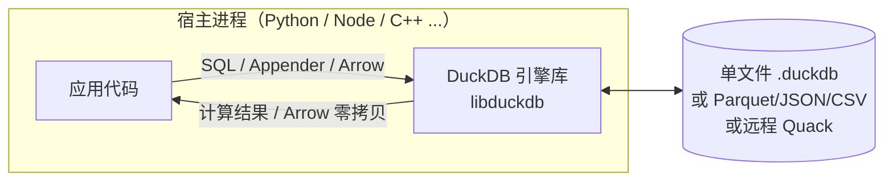
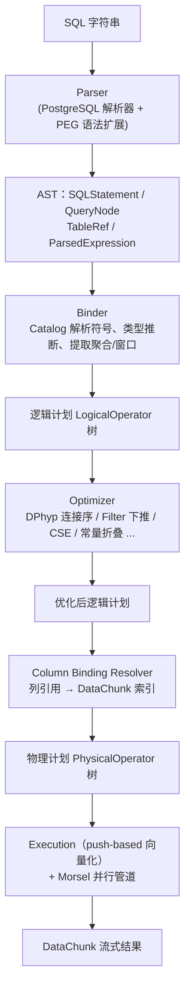
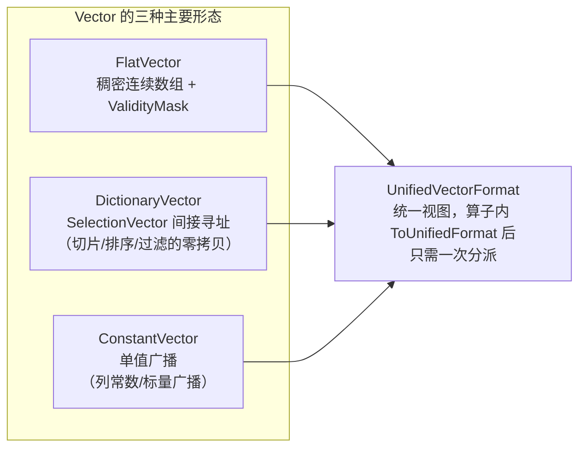
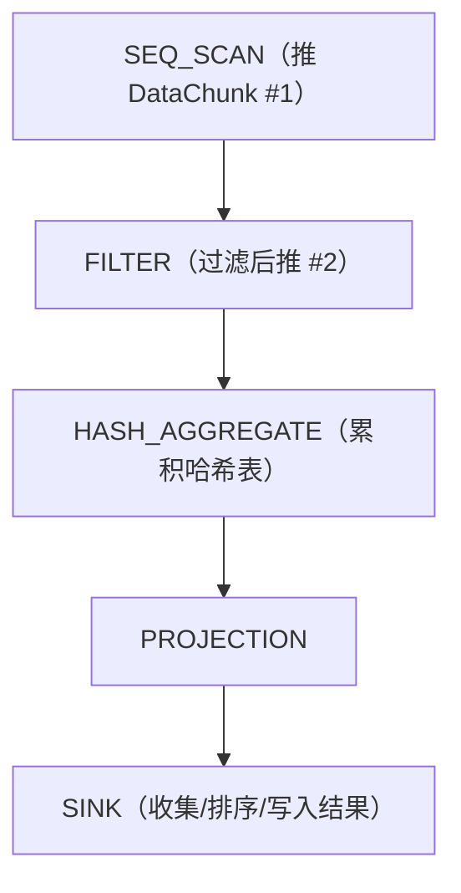
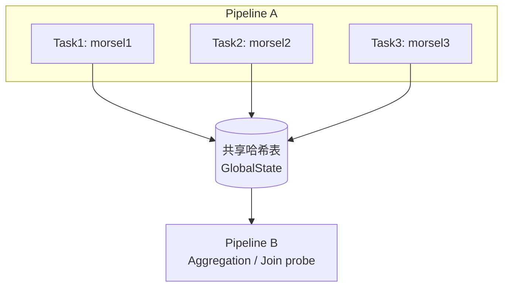
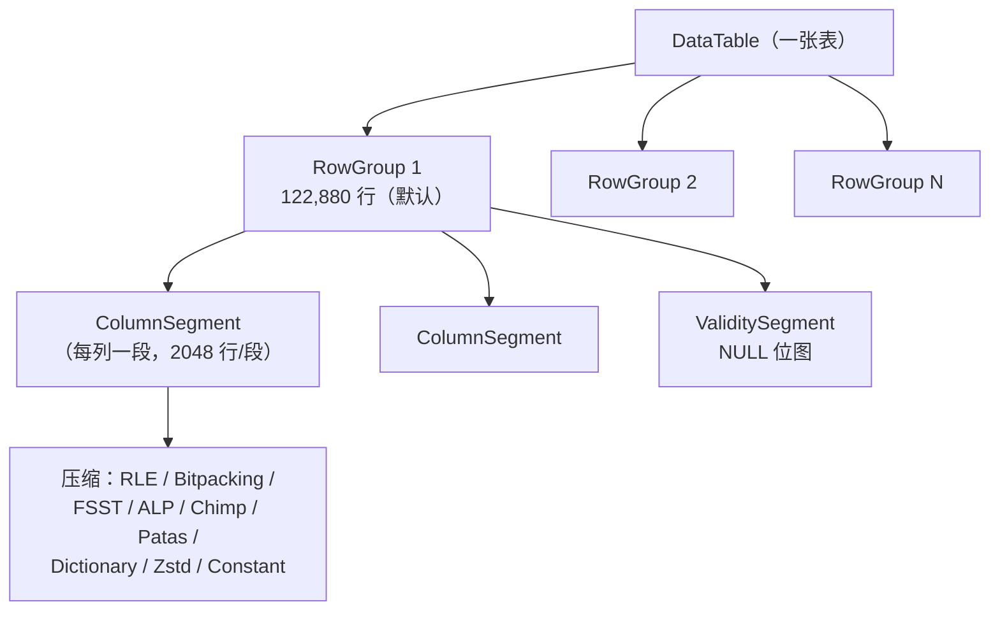

# DuckDB 架构深度解析：查询引擎、存储引擎与 AI 时代的硬件适配

> 本文写作于 2026 年中，资料结合三部分来源：
> 1. **官方文档**：[Internals Overview](https://duckdb.org/docs/current/internals/overview)、[Why DuckDB](https://duckdb.org/why_duckdb.html)、[Storage Versions and Format](https://duckdb.org/docs/current/internals/storage)、[Quack Remote Protocol](https://duckdb.org/docs/current/quack/overview)；
> 2. **官方设计课程 DiDi**（Design and Implementation of DuckDB Internals，Tübingen 大学 Torsten Grust，[GitHub](https://github.com/TorstenGrust/duckdb-internals)）；
> 3. **源码**：[duckdb/duckdb](https://github.com/duckdb/duckdb) 主分支（commit `044a04a`，对应 v1.5.x 时代），本地浅克隆研读。
>
> 文中所有 `src/...` 路径均可直接在仓库中对照。

---

## 1. 概述：一个"简简单单"的分析型数据库

DuckDB 是 **in-process（进程内）OLAP 数据库**，与 SQLite 在嵌入式 OLTP 领域的地位类似，但它面向的是**分析型（OLAP）负载**：列式存储、向量化执行、并行处理、复杂 SQL。它由荷兰的 Mark Raasveldt 与 Hannes Mühleisen 发起（两人都出身于 CWI 的 MonetDB 一脉），2019 年以论文 *DuckDB: An Embeddable Analytical Database*（SIGMOD demo）公开，MIT 许可证开源，知识产权由 DuckDB Foundation 持有。

几个引人注目的数字（截至本文写作）：

| 指标 | 数值 |
|---|---|
| GitHub Stars | ~40.5k |
| Python 包 PyPI 月下载量 | >2500 万 |
| 财富 100 强用户 | >20 家（官方博客口径） |
| 运行形态 | 单进程嵌入式，无服务端；也可通过 Quack 协议对外服务 |

DuckDB 与普通数据库的关键差异，一句话概括：**没有服务器进程，数据库引擎作为库被链接进宿主程序，在同一个进程内、同一块地址空间里执行 SQL**。这带来一个巨大的性能红利：**数据零拷贝**——Python 下查询 Pandas DataFrame 时可以完全不复制数据；以及部署上的极度简化——无守护进程、无端口、无运维。



---

## 2. 全景架构与模块地图

DuckDB 源码采用单仓库、单目录 `src/` 组织核心引擎，层次非常清晰。英语里有一句著名的类比：*"DuckDB 的代码是一个巨大的 C++ 单体，但内部模块边界干净得像教科书"*。下面是源码模块与职责的映射：

| 源码目录 | 职责 | 关键入口/类 |
|---|---|---|
| `src/parser/` | SQL 文本 → 语法树（AST） | `Parser`、`SQLStatement`、`ParsedExpression`、`TableRef`、`QueryNode` |
| `src/planner/` | AST → 绑定（resolve 表/列/类型）→ 逻辑计划 | `Binder`、`LogicalOperator`、bound `Expression` |
| `src/optimizer/` | 逻辑计划等价变换（规则 + 代价） | `Optimizer`、`FilterPushdown`、`JoinOrderOptimizer`（DPhyp） |
| `src/execution/` | 逻辑 → 物理计划 + 向量化执行 | `PhysicalPlanGenerator`、`PhysicalOperator`、`ExpressionExecutor` |
| `src/parallel/` | 流水线并行调度 | `Pipeline`、`PipelineExecutor`、`TaskScheduler`、`Event` |
| `src/storage/` | 缓冲管理、表/行组/列段、压缩、WAL、检查点 | `BufferManager`、`RowGroup`、`ColumnSegment`、`WriteAheadLog` |
| `src/transaction/` | MVCC 事务 | `Transaction`、`UndoBuffer`、`CommitState`、`RollbackState` |
| `src/catalog/` | 元数据（schema/表/函数/类型） | `Catalog`、`CatalogEntry` |
| `src/function/` | 内置函数 | `ScalarFunction`、`AggregateFunction`、`TableFunction` |
| `src/common/` | 基础设施：`Vector`/`DataChunk`/类型系统/工具 | `DataChunk`、`Vector`、`SelectionVector`、`ValidityMask` |
| `src/main/` | 对外 API：连接、查询、结果 | `DatabaseInstance`、`Connection`、`ClientContext` |
| `src/logging/` | 日志框架 | — |

一条 SQL 语句从进入到出结果的完整生命周期：



### 一个核心约定：LogicalOperator / PhysicalOperator 双树

DuckDB 沿用经典的"逻辑计划树 + 物理计划树"两层结构：

- **逻辑算子**（`src/include/duckdb/planner/operator/`）：描述"做什么"，如 `LogicalGet`、`LogicalFilter`、`LogicalJoin`、`LogicalAggregate`、`LogicalOrder`，只携带逻辑信息（谓词、连接条件、分组键）。
- **物理算子**（`src/execution/operator/` 与 `src/include/duckdb/execution/operator/`）：描述"怎么做"，每个逻辑算子对应一到多个物理算子，例如 `LogicalJoin` 可按代价选择 `PhysicalHashJoin`、`PhysicalNestedLoopJoin`、`PhysicalPiecewiseMergeJoin`、`PhysicalIEJoin`（不等值连接）、`PhysicalAsOfJoin`（时间模糊连接）等。

`src/execution/physical_plan/` 里的 `plan_*.cpp` 文件就是两者之间的翻译器（`plan_join.cpp`、`plan_aggregate.cpp`、`plan_order.cpp` …）。

---

## 3. 查询处理链路逐层拆解

### 3.1 Parser：站在 PostgreSQL 肩膀上，再用 PEG 自我进化

两个关键事实（源码 `src/parser/`）：

1. **基础语法解析复用 PostgreSQL**：DuckDB 使用被剥离为独立库的 PostgreSQL 解析器（`libpg_query`），把 SQL 字符串转成 PG 风格的原始 AST，然后**翻译成 DuckDB 自己的轻量表示**：`SQLStatement`（语句）、`QueryNode`（SELECT/集合操作）、`TableRef`（表源：基表/连接/表函数/子查询）、`ParsedExpression`（表达式，比较/算术/CAST/列引用……）。`src/parser/transform/` 就是这套翻译器。
2. **Parser 层无感知**：它不查 Catalog、不校验表是否存在、不做类型推断——纯粹做"文本 → 令牌树"。所以类型（除显式 CAST）在 Binder 阶段才被解析。

**Parser 的自我进化（v2.0 预告）**：官方 2026-08 发布了两篇重磅博客：《DuckDB v2.0: Your Database Deserves a Better Parser》《Runtime-Extensible SQL Parsers Using PEG》(CIDR 2025)。DuckDB 正在放弃"PG 解析器 + 翻译"路线，改为**自研 PEG 语法解析器**（`src/parser/peg/`，语法文件为 `*.gram`，用 `scripts/build_grammar.sh` 生成）。收益是：运行时/编译期可扩展语法（社区扩展可以给 SQL 加新语法）、更快的解析、对 PG 方言的逐步解耦。

### 3.2 Binder：把符号世界接到现实世界

`src/planner/binder/` 是规划阶段的心脏（`query_planner.cpp` 为核心入口）。Binder 干四件事：

1. **符号解析**：通过 `Catalog` 把 `tablename`、`columnname` 解析为真实的表/列对象（`ColumnBinding = (table_index, column_index)`）。
2. **类型解析**：为每个"裸"表达式推断 `LogicalType`，并插入隐式 CAST（转换规则见 `src/function/cast_rules.cpp`）。
3. **聚合/窗口提取**：把 `SELECT` 里的聚合函数、窗口函数从普通表达式中提取出来，为上层建 `LogicalAggregate` / `LogicalWindow` 做准备。
4. **子查询改写**：`src/planner/subquery/` 负责把相关子查询（correlated subquery）转为 MARK/UNNEST/IN/EXISTS 等可执行形式（源自 Neumann 的 *Unnesting Arbitrary Queries* 论文）。

Binder 产出的是 **bound 版本**的对象树：`SQLStatement → BoundStatement`，`Expression → BoundExpression`，`TableRef → BoundTableRef`。

### 3.3 Logical Planner：搭出逻辑查询树

`src/planner/` 将 bound 语句转成真正的逻辑算子树（`LogicalOperator` 层级，位于 `src/include/duckdb/planner/operator/`）。读者可以把这棵树理解为"语义上等价于 SQL 的关系代数树"，此时还没有任何执行细节。

### 3.4 Optimizer：规则 + 代价的十八般武艺

`src/optimizer/optimizer.cpp` 是所有优化 pass 的编排者。官方 Internals 文档列出了五个基础 pass，而源码里实际有**三十多个**优化器（每个一个文件）。要理解 DuckDB 的优化能力，推荐官方博客 *[Optimizers: The Low-Key MVP](https://duckdb.org/2024/11/14/optimizers.html)*（2024-11，Tom Ebergen）。核心优化器清单：

| 优化器（源码文件） | 作用 |
|---|---|
| `expression_rewriter.cpp` | 表达式化简、**常量折叠** |
| `filter_pushdown.cpp` + `filter_combiner.cpp` | 谓词下推、等价类合并、静态可判 false 的子树剪枝 |
| `join_order/join_order_optimizer.cpp` | **代价驱动连接序**：DPhyp 动态规划（《Dynamic Programming Strikes Back》），含 `cardinality_estimator.cpp`（基于统计的基数估计）与 `cost_model.cpp` |
| `cse_optimizer.cpp` | **公共子表达式消除**（CSE），避免重复计算 |
| `in_clause_rewriter.cpp` | 大 IN 列表 → MARK JOIN / INNER JOIN |
| `statistics_propagator.cpp` | 统计信息传播（zonemap 等），供其它优化器与存储剪枝使用 |
| `late_materialization.cpp` | 延迟物化：JOIN/过滤阶段只搬运 row id，最后才取列 |
| `compressed_materialization.cpp` | 压缩物化：中间结果用压缩表示（省内存省带宽） |
| `column_lifetime_analyzer.cpp` | 列生命周期分析，尽早丢弃不再需要的列 |
| `unnest_rewriter.cpp` | UNNEST（unnesting arbitrary queries / improving unnesting） |
| `topn_optimizer.cpp` / `limit_pushdown.cpp` | ORDER BY + LIMIT → Top-N 算子、LIMIT 下推 |
| `regex_range_filter.cpp` | 正则 → zone map 范围过滤 |
| `join_filter_pushdown_optimizer.cpp` | 哈希连接后把探测端过滤再推回（HJ filter） |
| `multi_stage_aggregate_rewriter.cpp` | 分组键基数低时的多阶段聚合优化 |
| `remove_unused_columns.cpp` | 列剪枝 |
| `partitioned_execution.cpp` | 分区执行（层级聚合 + 分区投影） |

一个体现"教科书感"的设计：优化器 pass 也都是**模块化的逻辑算子树重写器**（`LogicalOperatorVisitor` + `ExpressionIterator` 访问者模式），新增优化器 = 新增一个类 + 注册。

### 3.5 Column Binding Resolver 与 Physical Plan Generator

- `src/execution/column_binding_resolver.cpp`：把逻辑树中引用 `(table_index, column_index)` 的 `BoundColumnRefExpression` 全部改写成 `BoundReferenceExpression`（直接指向执行期 DataChunk 的列索引）。这一步把"符号列车引用"变成"内存位置"，之后执行引擎不再关心任何逻辑命名。
- `src/execution/physical_plan/physical_plan_generator.cpp` + `plan_*.cpp`：逻辑树 → 物理树，按算子的行数估计挑选物理实现（例如是否用 perfect hash join / 是否需要 spill）。

### 3.6 执行引擎：push-based 向量化

DuckDB 执行引擎的两大关键词：**向量化（vectorized）**与 **push-based（数据从叶子算子向上推）**。

#### 3.6.1 数据的原子单位：DataChunk 与 Vector

- 执行的基本批量是 **`DataChunk`**（`src/include/duckdb/common/types/data_chunk.hpp`）：一批**列式**数据，内部就是一组 `Vector`（`data[col_idx]`）+ 行数（cardinality）。
- 每个 Vector 默认容量 **`STANDARD_VECTOR_SIZE = 2048`** 行（`src/include/duckdb/common/vector_size.hpp`）。这是平衡"摊销向量化开销"与"寄存器/缓存利用"后的经验值，也是 DuckDB 区别于 MonetDB 的 1024、X100 等的自选参数。
- `Vector`（`src/include/duckdb/common/types/vector.hpp`）绝不意味着朴素的一维数组——它有非常丰富的表示：



关键点：**SelectionVector（`idx_t` 数组）让"过滤、排序列、字典操作"以 O(1) 引用完成，不需要移动数据**；`ValidityMask`（位图）表达 NULL。向量之间的 `Slice`（切片）、`Dictionary()`（字典视图）都是建立引用而非拷贝。

#### 3.6.2 push-based：数据流由下往上"推"

传统火山模型（Volcano）是 **pull-based**：顶层算子不断向下 `GetNext()`，每个操作一次处理一行/一小批。DuckDB 是 **push-based**：叶子算子（表扫描）主动把 DataChunk **推**给自己的父算子，父算子处理完再推给祖父，直到根算子吐结果。官方有专门的演讲 *[Push-Based Execution in DuckDB](https://www.youtube.com/watch?v=5iFGkerT9VI)*。



push + 批处理（2048 行）的组合带来三个好处：**分支预测友好**（batch 内无虚函数调用，模板展开成内存循环）、**向量化友好**（编译器可自动向量化超长循环）、**流水线友好**（同一 pipeline 内算子间无物化，数据在缓冲区直接流转）。

#### 3.6.3 表达式执行：模板化的 Executor

表达式（`ExpressionExecutor`，`src/execution/expression_executor/`）被编译成**两段式**：先对 Vector 做 `ToUnifiedFormat()` 统一形态，再用 `UnaryExecutor`/`BinaryExecutor`/`TernaryExecutor`/`VariadicExecutor`（`src/common/vector_operations/`）之类模板化执行器在**内层循环**里批量计算。模板在编译期按类型实例化（如 `int32 + int32` 与 `double + double` 是不同循环），运行时只做一次类型分派。

### 3.7 并行执行：Morsel-driven 流水线

`src/parallel/` 是并行子系统，模型源自论文 *Morsel-Driven Parallelism*（Leis 等）：

- **Pipeline（流水线）**：物理计划被切分成若干 pipeline——每个 pipeline 内算子可"无界"衔接（如 scan → filter → project），pipeline 之间由 **屏障**（barrier，如聚合哈希表、排序、JOIN build）隔开。
- **Morsel 切分**：每个 pipeline 的输入（如一张表）被切成若干固定大小的 morsel（分片），`PipelineExecutor` 把每个 morsel 交个一个 `Task`。
- **TaskScheduler**（`task_scheduler.cpp`）：线程池调度器，核心是 **work-sharing 窃取队列**（任务完成快的线程可以"偷"别的线程队列里的任务），由 `concurrentqueue`（third_party）支撑。默认线程数 = 硬件核数（可通过 `threads` 设置调整）。
- **状态分离**：算子分 `GlobalState`（跨任务共享，如哈希表、原子计数器）与 `LocalState`（每任务私有，如分组最终聚合时的局部哈希表），屏障处做合并，如分组聚合的"局部聚合 → 全局聚合"两阶段。
- **中断机制**（`interrupt.cpp`）：`ClientContext` 通过 `InterruptCheck()` 定期检查超时（`max_execution_time`）与取消信号。



官方博客 *[Parallel Grouped Aggregation in DuckDB](https://duckdb.org/2022/03/07/aggregation.html)*（2022-03）详细讲了分阶段聚合：每个线程先做局部哈希聚合（HT 每线程一个缓存友好的 chunk），屏障后把局部 HT 按哈希桶 radix 分区合并到全局。这是 DuckDB 在 TPC-H 类负载上并行度的重要组成部分。

### 3.8 关键算子的实现要点

| 算子 | 源码 | 要点 |
|---|---|---|
| Hash Join | `src/execution/operator/join/physical_hash_join.cpp` + `join_hashtable.cpp` | 两阶段：build 哈希表（含 **radix-partitioned**，`radix_partitioned_hashtable.cpp`，按 hash 高位分桶以提升缓存/NUMA 友好性 + 支持外排 spill）→ probe；支持 MARK join、right/outer 变体 |
| 不等值/范围连接 | `physical_iejoin.cpp`、`physical_piecewise_merge_join.cpp`、`physical_asof_join.cpp`、`physical_range_join.cpp` | IEJoin（《Lightning Fast and Space Efficient Inequality Joins》）、Piecewise Merge、AsOf（时间模糊）、Range（谓词范围） |
| 聚合 | `physical_hash_aggregate.cpp` + `base_aggregate_hashtable.cpp`、`perfect_aggregate_hashtable.cpp`、`aggregate_state_spilling.cpp` | 分组聚合：局部→全局；键基数已知且小 → **perfect hash table**（零冲突）；内存不足 → **外排聚合 spill**（官方博客 *[No Memory? No Problem](https://duckdb.org/2024/03/29/external-aggregation.html)*） |
| 排序 | `physical_order.cpp`、`physical_top_n.cpp`（`src/execution/operator/order/`） | 重写后的排序基于 **radix sort + 归并**，支持外排、多列排序的多键（radix 按字节）；官方博客 *[Fastest Table Sort in the West](https://duckdb.org/2021/08/27/external-sort.html)* 与 *[Redesigning DuckDB's Sort, Again](https://duckdb.org/2025/09/24/sort-again.html)* |
| 窗口函数 | `physical_window.cpp`、`physical_streaming_window.cpp` | **Segment Tree Aggregation**（区间聚合 O(log n) 更新），见 *[Windowing in DuckDB](https://duckdb.org/2021/10/13/windowing.html)* |
| 扫描 | `src/execution/operator/scan/` | `physical_table_scan.cpp`（基表，配合 zonemap/过滤）、`physical_column_data_scan.cpp`（内存数据集）、`physical_dummy_scan.cpp`（生成器 `range()` 等） |
| 表函数 | `src/function/table/` | `range`、`read_csv`、`read_parquet`、`arrow`、`query` 等都是 TableFunction |

---

## 4. 存储引擎

### 4.1 总体设计：单文件 + Buffer Manager

DuckDB 的持久化数据库是**一个 .duckdb 文件**（也可附加多个文件/内存库，v0.10 起支持多数据库 `ATTACH`）。文件头部：checksum（uint64）+ 魔数 `DUCK`（4 字节）+ 存储版本号（uint64）——见官方 [Storage Versions and Format](https://duckdb.org/docs/current/internals/storage)。

存储层的中心是 **`BufferManager`**（`src/storage/buffer_manager.cpp` + `standard_buffer_manager.cpp`）：

- 统一管理内存池中的 blocks（默认 80% 内存上限，`memory_limit` 可调），是**所有列数据、元数据、WAL 页面、待写数据的唯一内存提供者**；
- 内存不足时把冷 block 写回临时文件（`temporary_file_manager.cpp`），并按需换入——支持超出物理内存的"外排"；
- 从 v1.4 起支持 **异步 I/O**（官方博客 *[Asynchronous I/O in DuckDB: Work, Thread, Work](https://duckdb.org/2026/07/31/async-io.html)*）。

内存分配器使用 **jemalloc**（`third_party/jemalloc`，默认启用），官方 Internals 有专门一页讲 jemalloc 的选择：相比系统 malloc，jemalloc 在大量小分配（向量、哈希表、字符串堆）下减少碎片与锁竞争。

### 4.2 表组织：DataTable → RowGroup → ColumnSegment → 压缩

列式存储的三层结构（源码 `src/storage/table/`）：



- **RowGroup**（`row_group.cpp`）：表的**水平分片**，默认 **`DEFAULT_ROW_GROUP_SIZE = 122880`**（= 60 × 2048）。行组是并行扫描、压缩、统计（zonemap 与每列 min/max）的基本单位。
- **ColumnSegment**（`column_segment.cpp`）：每列在行组内进一步切成 2048 行一段（与向量大小对齐，方便执行期无缝衔接）。
- **压缩（lightweight compression）**：`src/storage/compression/`，对持久化库默认开启（内存库默认关闭，`ATTACH ... (COMPRESS)` 可开）。官方支持的算法（[官方文档 Compress Algos](https://duckdb.org/docs/current/internals/storage)）：常量编码、RLE、Bit Packing、Frame-of-Reference（FOR）、字典编码、**FSST**（VLDB 2020）、**ALP**（SIGMOD 2024，自适应无损浮点压缩）、**Chimp**（VLDB 2022，时序浮点）、**Patas**（自研）、Zstd。压缩以 segment 为单位做，查询时按需解压到 buffer。
- **统计（Statistics）**：每个 column segment 维护 min/max 等统计（`src/storage/statistics/`），配合 `row_group_pruner.cpp` 做**行组剪枝**——`WHERE` 条件可直接跳过整个行组。这是 DuckDB 对存储中数据"早过滤"的秘密武器。

磁盘占用参考（官方文档实测口径）：100GB 原始 CSV → 约 25GB 的 .duckdb 文件；而 100GB Parquet 导入 DuckDB 反而约 120GB（Parquet 已高度压缩，DuckDB 的轻量压缩打不过它——这说明 DuckDB 的压缩是"轻量"路线，追求**解压速度**而非极限压缩率）。

### 4.3 索引：ART 为主

- 二级索引：**ART（Adaptive Radix Tree）**（`src/execution/index/art/`），源自《The Adaptive Radix Tree: ARTful Indexing》。它按 key 前缀组织 trie，主内存友好、支持范围查询；官方博客 *[Persistent Storage of ART in DuckDB](https://duckdb.org/2022/07/27/art.html)* 讲其持久化。
- ART 与"行组扫描"互补：**OLAP 下很多时候全扫 + 剪枝比走索引快**，所以 DuckDB 只在有明确选择性收益时（如单点/主键查询）用索引。
- **Storage Indexes**（`src/storage/storage_index.cpp`）：v1.5 起引入的存储层索引概念，扫描时基于列索引 + 过滤条件直接定位数据（`StorageIndex`/`StorageIndexType::FULL_READ` 等枚举），是传统 zonal statistics 的更通用版本。

### 4.4 事务：面向分析负载定制的 MVCC

DuckDB 的事务模型基于论文 *Fast Serializable Multi-Version Concurrency Control for Main-Memory Database Systems*（Neumann 等）做**批量优化**：

- **MVCC 版本链**：`src/transaction/` 的 `UndoBuffer`（撤销日志）记录每个事务对版本的影响；`RowVersionManager`、`UpdateSegment` 维护行级版本。
- 面向 OLAP 的特点：**提交按批量（bulk）优化**，一条 INSERT 追加 122880 行整行组，提交几乎零开销；官方博客 *[Analytics-Optimized Concurrent Transactions](https://duckdb.org/2024/10/30/concurrency.html)* 与 *[Changing Data with Confidence and ACID](https://duckdb.org/2024/09/25/acid.html)* 有详细讲解。
- **WAL**（`src/storage/write_ahead_log.cpp`）：写路径先记 WAL 再落数据页；**Checkpoint**（`src/storage/checkpoint_manager.cpp`）定期把 WAL 内容合并回主文件并清空 WAL；异常恢复时重放 WAL（`wal_replay.cpp`）。
- 并发模型：**单写多读**（MVCC 允许多读，写者串行化），这是分析型负载（读多写少）的合理取舍；官方文档 [Concurrency](https://duckdb.org/docs/current/connect/concurrency) 明确说明了这一点。

### 4.5 存储格式版本化

存储格式带版本号（当前 main 为 68，对应 v1.5.x），官方承诺**向后兼容**（新版本能读旧文件），`STORAGE_VERSION` 设置可显式固定/提升版本；跨大版本不兼容时用 `EXPORT DATABASE` / `IMPORT DATABASE` 迁移。

---

## 5. 设计哲学："站在巨人的肩膀上"

DuckDB 官方 [Why DuckDB](https://duckdb.org/why_duckdb.html) 页面和源码 `AGENTS.md` 都直白地列出了灵感来源——这是理解其架构决策的捷径：

| 组件 | 灵感来源 |
|---|---|
| 向量化执行引擎 | MonetDB/X100（《Hyper-Pipelining Query Execution》，即后来的 Vectorwise） |
| 优化器 | 《Dynamic Programming Strikes Back》（DPhyp 连接序）、《Unnesting Arbitrary Queries》 |
| 并行模型 | Morsel-Driven Parallelism（Leis/Boncz/Kemper/Neumann） |
| MVCC | 《Fast Serializable MVCC for Main-Memory Database Systems》 |
| 二级索引 | Adaptive Radix Tree（ART） |
| 窗口函数 | Segment Tree Aggregation |
| 不等值连接 | IEJoin |
| SQL 解析器 | PostgreSQL parser（libpg_query 剥离库；v2.0 起自研 PEG） |
| 浮点压缩 | Chimp、Patas、ALP |
| 排序 | pdqsort、radix sort + 自研多键归并 |
| Shell/测试 | SQLite shell、SQLite sqllogictest、Catch2、SQLancer、SQLsmith |

两条贯穿始终的取舍：

1. **CPU 优先于 GPU / 专用硬件**：DuckDB 把几乎所有优化押在"把每个值的 CPU 周期压到最低"上（向量化 + 缓存友好 + 编译器自动向量化 + jemalloc），而不是追求魔法硬件。这直接关系到下一章 AI 时代的讨论。
2. **一切皆扩展**：Parquet、JSON、HTTP(S)/S3、ICU、时间、TPC-H 甚至 `httpfs` 都是 extension（`src/extension/` 与 `extension/`），核心引擎保持精简，功能可插拔、可签名分发、支持社区扩展（`docs/community_extensions`）。

---

## 6. AI 时代的适配：GPU 与向量化生态

这一章是本文的重点扩展：DuckDB 在 AI/LLM 时代为什么愈发重要？它做了哪些硬件/I/O 适配？需要区分三类事实：**官方核心能力**、**官方扩展**、**社区生态**，避免夸大。

### 6.1 向量化执行 = 天然的硬件友好设计（CPU 路径）

DuckDB 的向量化执行（每批 2048 行、类型化内层循环）本身就是"适配现代硬件"的答案：

- **SIMD 友好**：内层循环是连续内存上的同构操作，编译器（GCC/Clang）自动向量化（AVX-2/AVX-512/NEON）；`src/common/vector_operations/`、哈希、bitpacking（third_party/fastpforlib）等热点有手写 SIMD 与查表加速。
- **缓存友好**：列式布局 + 分批处理保证 cache line 全部被利用；radix 分区哈希表降低随机访问。
- **无 PCIe 瓶颈**：数据在内存里（或内存映射的文件），不经过 I/O 总线搬运——这恰恰是 GPU 方案的痛处（见 6.5）。

**官方态度**：DuckDB 团队（尤其 Hannes Mühleisen）在多处表达过"对绝大多数分析负载，把 CPU 向量化路径做到极致，比 GPU 加速更划算"的观点——GPU 的优势在超大吞吐的密集计算，而 OLAP 查询往往受限于数据移动、随机访问和较小的中间体；官方主线因此**没有内置 GPU 执行后端**。真正吃掉 GPU 的地方通过社区扩展与向量检索补齐（下详）。

### 6.2 Arrow/ADBC：与 AI 数据栈的"零拷贝"接口

AI 数据工程的"通用货币"是 **Apache Arrow**（列式内存格式），而 DuckDB 是 Arrow 生态的核心成员（Hannes 是 Arrow PMC 成员）。这一层是 DuckDB 融入 AI 数据管道最重要的机制：

- **Arrow 零拷贝**：官方博客 *[DuckDB Quacks Arrow](https://duckdb.org/2021/12/03/duck-arrow.html)*（2021）与 *[Arrow IPC Support in DuckDB](https://duckdb.org/2025/05/23/arrow-ipc.html)*（2025）：`Arrow`/`arrow_scan` 表函数直接读 PyArrow Table / Pandas / NumPy，**不复制数据**；Python 集成下 `duckdb.sql("SELECT ... FROM df")` 直接在原 DataFrame 的 buffer 上执行。
- **ADBC**（Arrow Database Connectivity）：官方博客 *[DuckDB ADBC – Zero-Copy](https://duckdb.org/2023/08/04/adbc.html)*（2023）：跨语言的数据库 API 标准，DuckDB 是首个完整实现之一，让客户端应用（R/Python/C++/Java）以批量列存流式拿结果，无逐行序列化开销。
- 影响：**RAG/ML 管道里"向量库 ↔ 表"的边界被抹平**——你可以对 embedding 表直接跑 SQL、直接 JOIN 业务表、直接写回 parquet/arrow，全链路零拷贝。

### 6.3 固定长度 ARRAY 类型与距离函数：SQL 里的向量原生公民

v0.10.0 引入**定长 `ARRAY` 类型 **（`FLOAT[3]`、`DOUBLE[768]` 等，源码 `src/include/duckdb/common/types/` 下 `array_*` + 函数目录的 array 实现），配套一批向量函数：`array_distance`（L2）、`array_cosine_distance`、`array_negative_inner_product`、`array_cross_product`、`array_dot_product` 等。这意味着**embedding 向量成为 SQL 一等公民**，训练/微调/评估流水线里"算相似度、找最近邻"可以直接用纯 SQL 表达。

```sql
-- 对 embedding 表做 kNN 暴力扫描（小数据集上"够用"）
SELECT doc_id,
       array_distance(embedding, query_emb::FLOAT[768]) AS d
FROM docs
ORDER BY d
LIMIT 10;
```

### 6.4 向量检索：vss（官方实验扩展，HNSW）与 faiss（社区，可上 GPU）

DuckDB 官方博客 *[Vector Similarity Search in DuckDB](https://duckdb.org/2024/05/03/vector-similarity-search.html)* 与 *[What's New in the Vector Similarity Search Extension?](https://duckdb.org/2024/10/23/vss.html)*（2024）介绍了 **`vss` 扩展**（[duckdb/duckdb-vss](https://github.com/duckdb/duckdb-vss)，GitHub 263⭐）：

- 基于 **usearch** 索引库，提供 **HNSW** 索引（`CREATE INDEX ... USING HNSW (vec)`），支持 `l2sq`（欧氏²）/ `cosine` / `ip`（内积）三种度量，与 `array_*` 函数一一对应；
- 查询时计划器把 `ORDER BY array_distance(...) LIMIT k` 改写为 `HNSW_INDEX_SCAN`，跳过全表扫描；
- 支持增删改（删除是 soft-mark，可 `PRAGMA hnsw_compact_index` 压缩重建）；当前限制：FLOAT 向量、索引需驻留内存（但可随库持久化）。

社区扩展 **`faiss`**（[duckdb-community-faiss](https://duckdb.org/community_extensions/extensions/faiss.html)）更进一步：

- 直接以 DuckDB 表驱动 FAISS 索引（`FAISS_CREATE` / `FAISS_ADD` / `FAISS_SEARCH` / 带过滤的 `FAISS_SEARCH_FILTER`）；
- **支持把索引搬到 GPU（CUDA）**：`CALL FAISS_TO_GPU('name', 0)` —— 这是 DuckDB 生态里最直接的"GPU 加速 AI 检索"路径：构建/检索在 GPU 完成，数据管理仍在 DuckDB。

AI 场景的典型位置：DuckDB 作为 **RAG 管线的数据层**——用 SQL 清洗/JOIN 文档表与 embedding 列，用 `vss`/`faiss` 做近邻检索，结果直接喂给 LLM 的上下文窗口或继续 AGG。

### 6.5 GPU 执行：社区扩展 `gpudb` 与现实的权衡

社区扩展 **`gpudb`**（[duckdbgpumetaldbram](https://github.com/singhpratech/duckdbgpumetaldbram)，下载量 ~321/周）是目前最激进的 GPU 尝试：

- 支持 **NVIDIA CUDA 与 Apple Silicon Metal**（自称首个支持 Apple Silicon GPU 的 SQL 执行引擎）；
- 两条 SQL 面：
  - **流式聚合**：`gpu_sum` / `gpu_min` / `gpu_max`（BIGINT/DOUBLE），可在普通聚合、GROUP BY、窗口中使用，语义与原生一致（NaN 感知的总序、空输入返回 NULL）；作者明确说明**逐查询 GPU 往返会亏**，这类接口以"平替原生"为目标；
  - **常驻列（resident columns，v0.4.0）**：`gpu_upload('name', col)` 一次把列传到显存，之后 `gpu_sum_resident('name')` 等**零传输**执行聚合。
- 实测数据（作者 BENCHMARK.md，DuckDB v1.5.5）：TPC-H SF50 的 SUM，RTX 4090 Laptop 上原生 99ms → resident 4ms（**25×**，kernel 带宽 563GB/s≈VRAM 带宽）；M4 Max 上 SF100（6 亿行）99ms → 10ms（**9.9×**，503GB/s）。
- 作者也如实列出**反向情形**：全列 MIN/MAX 原生更快（zonemap 统计直接命中）、一次性冷查询原生更快、上传成本约 100 次查询后才摊平。

这组数据完美说明了 **GPU 加速在 DuckDB 场景的边界**：GPU 只在整个数据已驻留显存、且反复做密集归约时才赢；单次、冷启动、选择性查询依然输给 CPU 向量化 + 统计剪枝。这也是官方主线不内置 GPU 后端的理性理由，而**通过扩展机制，社区可以在需要的地方把 GPU 能力插进来**——扩展架构本身就是对 AI 时代硬件多样性的适配。

### 6.6 数据/AI 生态：Hugging Face、ML 工作流与 Agent 扩展

- **Hugging Face 数据集直查**：官方博客 *[Access 150k+ Datasets from Hugging Face with DuckDB](https://duckdb.org/2024/05/29/huggingface.html)*（2024-05，与 HF 团队联名）：DuckDB 可直接查询 HF Hub 上的数据集（`hf://datasets/...`），进行过滤/聚合/导出——训练数据探索的 SQL 入口。社区扩展 `huggingface` 持续维护。
- **ML 工作流**：官方博客 *[Machine Learning Prototyping with DuckDB and scikit-learn](https://duckdb.org/2024/05/16/ml.html)*（2024）、*[Basic Feature Engineering with DuckDB](https://duckdb.org/2025/08/15/feature-engineering.html)*（2025）：特征工程、数据切片、scikit-learn 原型里 DuckDB 作为"比 pandas 快的 SQL 数据准备层"。
- **Agent/LLM 生态**（社区扩展列表可见）：`llm`、`open_prompt`、`whisper`（音频转写）、`pic2vec`（图像向量化）、`web_search`、`agent_data`、`duckdb_mcp`（MCP server，把 DuckDB 暴露给 AI agent 当 SQL 工具）……DuckDB 正成为 **AI Agent 的"本地数据大脑"**：小、快、零依赖、SQL 即接口。
- 通用形态：**DuckDB + Parquet（或 DuckLake/Delta/Iceberg）** 成为"小数据"时代的数据湖局域标配（官方博客 *[The Lost Decade of Small Data?](https://duckdb.org/2025/05/19/lost-decade.html)*），对 AI 数据管道的意义是：不需要为"分析"起重型集群。

### 6.7 Quack：进程内引擎的"出圈"——远程协议与分布式

官方 2026-05-12 发布 **Quack Remote Protocol**（[官方文档](https://duckdb.org/docs/current/quack/overview)、[官方博客](https://duckdb.org/2026/05/12/quack.html)），把 DuckDB 从"纯嵌入式"推向 server/client：

- 一条 `CALL quack_serve('quack:0.0.0.0:9494')` 把当前 DuckDB 会话变为 HTTP 服务；客户端 `ATTACH 'quack:host' AS db` 即可把远端当普通 catalog 用（DDL/DML/事务转发）；
- 协议编码复用引擎内部的**序列化原语（与 WAL 同一代码路径）**，复杂类型（嵌套、decimal、interval）无损跨线传输，避免中间格式往返；查询发一次请求，结果分块流式**多线程并行 FETCH**；
- 设计上走纯 HTTP（可过反向代理、负载均衡、防火墙），工具链零定制。

对 AI 时代的含义：**GPU 节点/大内存节点可以被 Quack 服务化**——数据留在资源富集机器上，瘦客户端（笔记本、浏览器、Agent）远程执行；也是 DuckDB 走向多节点分布式的前奏（业界已围绕它出现 `capi_quack`、`netquack`、`quackstore` 等社区扩展）。加上 DuckDB-Wasm（浏览器里跑 OLAP，同官方博客 2021），DuckDB 形成了"端 → 云"的完整运行形态谱系。

### 6.8 AI 时代适配总结

| 优化方向 | 官方能力 | 说明 |
|---|---|---|
| CPU 向量化 / SIMD | 核心引擎 | 2048 行向量批、模板化算子、自动向量化、缓存友好 |
| Arrow/ADBC 零拷贝 | 核心 + 官方扩展 | 与 Pandas/NumPy/PyArrow/R 免拷贝互操作 |
| 定长向量类型 + 距离函数 | v0.10+ 核心 | `FLOAT[n]`、`array_distance`/`cosine`/`ip` |
| 向量相似度索引（HNSW） | 官方实验扩展 `vss` | usearch 内核；l2sq/cosine/ip |
| 向量索引上 GPU | 社区扩展 `faiss` | CUDA，`FAISS_TO_GPU` |
| GPU 执行算子 | 社区扩展 `gpudb` | CUDA + Apple Metal；resident 列 25× |
| 数据集直查（HF） | 官方扩展 | `hf://` 直连 Hugging Face Hub |
| AI Agent 接入 | 社区扩展 | `duckdb_mcp`/`llm`/`web_search`/`whisper` 等 |
| 远程/分布式执行 | 官方 Quack（v1.5.3+） | HTTP 协议、库内序列化、流式并行取数 |
| 浏览器端 OLAP | DuckDB-Wasm | WebAssembly 全引擎 |

---

## 7. 局限与未来方向

诚实地列出 DuckDB 的边界（引用均出自官方材料）：

- **写扩展性**：单写者 MVCC 面向"大批量追加"优化；高并发点写/多写集群不是它的主战场（官方 Concurrency 文档明示）。
- **单机规模上限**：内存分析型（压缩后可达数百 GB 甚至 TB 级外排），真正的分布式靠 Quack/MotherDuck 商业服务与外部编排。
- **GPU 非一等公民**：官方主线无 GPU 后端（理由见 6.5），需要者走社区扩展。
- **索引能力有限**：主要 ART/存储索引；`vss` HNSW 为实验级（驻内存、删除 soft-mark）。
- 未来看点（官方公开路线）：**v2.0 的 PEG 解析器**（2026-08 博客）、**DuckLake**（SQL 即数据湖格式，官方 v1.0，2026-04）、存储格式持续版本化、Quack 生态扩张。

一句话总结：**DuckDB 的成功不是靠某一个魔法，而是把"教科书级"的数据库架构决策（向量化、DPhyp、Morsel、MVCC、轻量压缩、扩展机制）在单进程内做到极致，再用最低的摩擦接入 AI 数据栈（Arrow、向量检索、HF、Agent、远程协议）**。

---

## 8. 参考资料

**官方文档**
- Internals Overview：https://duckdb.org/docs/current/internals/overview
- Why DuckDB：https://duckdb.org/why_duckdb.html
- Storage Versions and Format：https://duckdb.org/docs/current/internals/storage
- Concurrency：https://duckdb.org/docs/current/connect/concurrency
- Quack Remote Protocol：https://duckdb.org/docs/current/quack/overview
- DiDi（Design and Implementation of DuckDB Internals，Tübingen）：https://duckdb.org/library/design-and-implementation-of-duckdb-internals/

**源码与扩展**
- duckdb/duckdb：https://github.com/duckdb/duckdb （本文参考 main 分支 commit `044a04a`）
- duckdb/duckdb-vss：https://github.com/duckdb/duckdb-vss
- faiss 社区扩展：https://duckdb.org/community_extensions/extensions/faiss.html
- gpudb 社区扩展：https://duckdb.org/community_extensions/extensions/gpudb.html
- 社区扩展列表：https://duckdb.org/community_extensions/list_of_extensions

**官方博客（按内容相关性）**
- Quack: The DuckDB Client-Server Protocol（2026-05-12）：https://duckdb.org/2026/05/12/quack.html
- DuckDB v2.0: Your Database Deserves a Better Parser（2026-08-20）：https://duckdb.org/2026/08/20/parser.html
- Runtime-Extensible SQL Parsers Using PEG（2024-11-22）：https://duckdb.org/2024/11/22/parser.html
- Optimizers: The Low-Key MVP（2024-11-14）：https://duckdb.org/2024/11/14/optimizers.html
- Parallel Grouped Aggregation in DuckDB（2022-03-07）：https://duckdb.org/2022/03/07/aggregation.html
- Fastest Table Sort in the West（2021-08-27）/ Redesigning DuckDB's Sort, Again（2025-09-24）：https://duckdb.org/2021/08/27/external-sort.html
- Memory Management in DuckDB（2024-07-09）：https://duckdb.org/2024/07/09/memory.html
- Lightweight Compression in DuckDB（2022-10-28）：https://duckdb.org/2022/10/28/compression.html
- Persistent Storage of Adaptive Radix Trees (ART)（2022-07-27）：https://duckdb.org/2022/07/27/art.html
- Changing Data with Confidence and ACID（2024-09-25）/ Analytics-Optimized Concurrent Transactions（2024-10-30）：https://duckdb.org/2024/09/25/acid.html
- DuckDB Quacks Arrow: Zero-Copy Data Integration（2021-12-03）：https://duckdb.org/2021/12/03/duck-arrow.html
- Arrow IPC Support in DuckDB（2025-05-23）：https://duckdb.org/2025/05/23/arrow-ipc.html
- DuckDB ADBC – Zero-Copy Data Transfer（2023-08-04）：https://duckdb.org/2023/08/04/adbc.html
- Vector Similarity Search in DuckDB（2024-05-03）：https://duckdb.org/2024/05/03/vector-similarity-search.html
- What's New in the Vector Similarity Search Extension?（2024-10-23）：https://duckdb.org/2024/10/23/vss.html
- Access 150k+ Datasets from Hugging Face with DuckDB（2024-05-29）：https://duckdb.org/2024/05/29/huggingface.html
- Machine Learning Prototyping with DuckDB and scikit-learn（2024-05-16）：https://duckdb.org/2024/05/16/ml.html
- Basic Feature Engineering with DuckDB（2025-08-15）：https://duckdb.org/2025/08/15/feature-engineering.html
- The Lost Decade of Small Data?（2025-05-19）：https://duckdb.org/2025/05/19/lost-decade.html
- Asynchronous I/O in DuckDB（2026-07-31）：https://duckdb.org/2026/07/31/async-io.html

**论文（DuckDB 优化器/引擎理论基础）**
- Dynamic Programming Strikes Back（DPhyp）
- Morsel-Driven Parallelism
- Fast Serializable MVCC for Main-Memory Database Systems
- The Adaptive Radix Tree: ARTful Indexing
- Efficient Processing of Window Functions in Analytical SQL Queries（Segment Tree Aggregation）
- Lightning Fast and Space Efficient Inequality Joins（IEJoin）
- ALP: Adaptive Lossless Floating-Point Compression（SIGMOD 2024）

**中文社区资料（入门/概览，供横向对照）**
- 知乎《"鸭子数据库"DuckDB 是什么及适用场景》：https://zhuanlan.zhihu.com/p/  （检索"DuckDB 什么是解析"可得多篇）
- 博客园《DuckDB：轻量级 OLAP 数据库的新星》：https://www.cnblogs.com/max/
- DuckDB 中文站：https://duckdb.org.cn