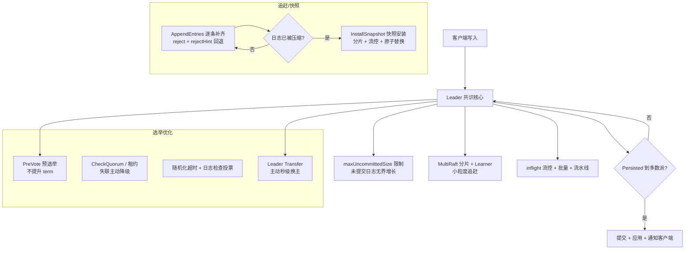

# Raft 一致性引擎的工程优化深度调研

---

## 1. 为什么 AI 时代反而更需要 Raft

在 AI/大模型时代，以往"强一致分布式存储很重、很慢"的经验正在被重写。原因很直接：

- **模型权重、向量、embedding、训练 checkpoint** 这类对象**不可重建或重建成本极高**，一旦丢失就前功尽弃 → 必须强一致、多副本、可恢复。
- 向量数据库（Milvus、Qdrant 等）、对象存储（如 Ozone）需要**选主做元数据/索引分区**，需要一个稳定、可理解、可运维的一致性协议。（反例：MinIO 走完全无主路线，见 [§2.1](#21-minio-leaderless-architecture)）
- Raft 相比 Paxos 的最大优势是**"可理解性"**：状态机、日志、任期、投票，概念清晰，工程实现和排障成本远低于 Multi-Paxos。这让它成为存储引擎"默认共识引擎"。

Raft 不是一个数据库，它是存储引擎**底座的一部分**：负责决定"谁是权威、按什么顺序执行命令、多数派确认后持久化"。下面我们把它拆开看各家的工程取舍。

---

## 2. 主流对象/存储引擎的 Raft 选型全景

| 系统 | 语言 | Raft 实现 | 用途定位 | Raft 用于 |
|------|------|-----------|----------|-----------|
| **etcd** | Go | `etcd-io/raft`（自研官方库） | 分布式 KV 存储，K8s 控制平面 | 全量键值强一致复制 |
| **TiKV / TiDB** | Rust | `tikv/raft-rs` | 分布式事务 KV/NewSQL | **MultiRaft**：按 Region 分片，每个 Region 一个 Raft group |
| **CockroachDB** | Go | fork 自 `etcd-io/raft` | 分布式 SQL | Range 级 Raft，跨节点复制 |
| **Apache Ozone** | Java | **Apache Ratis**（第二代 Raft 实现） | **真正的对象存储**（S3 兼容） | OzoneManager 元数据 + Datanode Container |
| **SeaweedFS** | Go | 自研 raft（filer/master） | 分布式文件/对象存储 | Filer 元数据高可用、Master 选主 |
| **MinIO** | Go | 不用 Raft（纠删码 erasure code） | 对象存储 | ❌ 反例：**完全无主（leaderless）**，无任何选主机制，靠确定性哈希定位 + Gossip 传播拓扑 + EC 抗数据损坏 |
| **MongoDB** | C++ | 不用 Raft（自研 oplog/primary 选举） | 文档对象存储 | ❌ 反例：类 Raft 但自研，方便对照 |

几个关键判断：

- **Apache Ozone 是目前"最纯粹"的对象存储 + Raft 案例**：它用 Ratis（Raft）同时支撑 OzoneManager 的元数据共识，以及 Datanode 上的 Container 复制组（每个 Container 是一个 Raft group，负责对象数据分片的强一致复制）。所以它是"对象存储直接用 Raft 做数据复制"的教科书。
- **TiKV / CockroachDB 是"存储引擎 + Raft"的深度范式**：它们证明了 Raft 可以做到**分片（shard）级 MultiRaft**——把数据切成几万甚至几十万个 Region/Range，每个都是独立的 Raft group，借此把单一 Raft 的热点、瓶颈和恢复粒度都打散。**MultiRaft 本身就是一种超级工程优化**——它让"选主""快照""日志追赶"都发生在很小的粒度上。
- **MinIO / MongoDB 作为反例**很有价值：MinIO **完全无主（leaderless）**——没有任何选主环节，数据完整性靠纠删码（EC）、对象定位靠确定性哈希、集群拓扑靠 Gossip 传播（详见 [§2.1](#21-minio-leaderless-architecture)）；MongoDB 则是"自研的类 Raft primary 选举"而非标准 Raft。这说明"Raft 不是唯一答案"，也帮我们理解 Raft 到底在解决什么、什么时候该用它。

### 2.1 MinIO 完全无主（leaderless）架构：就不需要选主 {#21-minio-leaderless-architecture}

MinIO 是"完全无主"设计的典型代表，**它不是"用更轻量的方式选主"，而是从根本上就不存在主**。理解它的组织与读写流程，就能明白"为什么没有 Raft/没有选主也能成立"。

#### 节点组织：Erasure Set 与 Pool

MinIO 没有用传统环状一致性哈希，而是用**确定性哈希映射**来管理数据位置：

- **Erasure Set（ES）**：一个 ES 包含多个节点，节点下的磁盘个数必须等于纠删码 `K+M`（数据块 + 校验块）之和。例如纠删码配置为 `6+3`，则该 ES 必须有 **9 个节点**。一个文件只存储在一个 ES 内——这样既能将文件分片后均匀地分布在各节点之间，查找时也能快速得到文件物理存储节点的位置信息（若把分片散落到任意节点，文件物理位置的元信息会非常复杂）。
  - 正因为 ES 的节点数与纠删码参数强绑定，**一个 ES 对应的物理节点磁盘大小必须一致**，否则会出现负载不均和空间浪费。
- **Pool**：一个 Pool 包含多个 ES（一对多）。Pool 是 MinIO 的**最小扩容单元**，一个集群通常只包含少量 Pool。Pool 的主要作用是**物理隔离**（如不同硬件类型、不同可用区）；Pool 一旦创建，规模和配置就固定，**不能动态增删节点**。

#### 写入流程：Proxy 节点 + 两级哈希

1. 客户端把对象传给 **Load Balancer**，路由到一个负载较低的 MinIO 节点，该节点成为 **Proxy 节点**。
2. **Pool 选择**：Proxy 节点根据每个 Pool 的负载选择负载较低的 Pool——负载信息由 MinIO 节点间用 **Gossip 协议**交换心跳和状态信息计算得出。
3. **Erasure Set 选择**：一个 Pool 内每个 ES 有对应索引，写入时计算 `index = hash(object) % len(es_list)`，将对象放入索引为 `index` 的 ES。
4. Proxy 节点对对象做**切分与纠删码计算**，然后把计算好的块写入对应 ES 的各节点。

#### 读取流程：同哈希定位 + 半数确认

1. **Pool 探测**：Proxy 节点通过 Gossip 协议持有整个集群的"地图"（Pool → 其下 ES → 每个 ES 的节点 IP）。因为完全无主，Proxy 会向 Pool 发出请求询问；但由于写入时已用 hash 定位 ES，**读取时也用同样的 hash 定位**，因此只需探测与 Pool 个数相等的 ES，不必广播到集群所有节点。
2. **半数确认**：目标 ES 下所有节点收到请求后检查自己存储的数据，若包含目标对象则回复 Proxy。Proxy 收到**半数以上节点确认存在**时，才认定文件确实存在——单个节点不一定权威（可能网络延迟或正在恢复数据中）。
3. **组装返回**：Proxy 请求目标 ES 获取所有 Chunk 下的 Block，在本地组装数据，返回给 Load Balancer 并最终返回客户端。

#### 已知代价

- **ListFile 等全局操作需要广播**：由于完全无主，这类请求依赖**全局广播**来收集全局文件信息，存在潜在的性能瓶颈。
- **哈希分布不均**：写入时按确定性哈希决定文件位置，可能导致文件在 ES 之间分布不均。但 MinIO 官方认为**随机性本身会摊平这种不均**。

> 一句话总结：MinIO 用 **EC 抗数据损坏 + 确定性哈希免去元数据索引 + Gossip 传播拓扑**，把"谁存哪、谁还活着"的所有问题都变成了**无中心的计算**，自然也就不需要 Raft 的选主、日志复制和快照那一整套机制。代价是 List 类全局操作和动态扩缩容能力受限——这正是 Raft 主从架构擅长的场景。

> 结论：本文把"对象存储引擎"宽泛地理解为"承载对象/数据副本一致性"的存储底座，重点剖析 etcd、raft-rs（TiKV）、CockroachDB、Ozone/Ratis 的 Raft 工程实现——这才是题目的实质。

---

## 3. Raft 库 vs Raft 应用：工程化的分层

主流工程里，Raft 被拆成**两层**：

1. **共识核心（Consensus Core）**：只实现纯算法——状态机、任期、投票、日志匹配、选主。**不含网络、不含磁盘、不含状态机应用**。这是 etcd-io/raft、tikv/raft-rs、Ratis 的定位。它们的共同哲学（etcd/raft README 原话）：*"most Raft implementations have a monolithic design... this library instead follows a minimalistic design philosophy by only implementing the core raft algorithm."*
2. **宿主（Host/Storage）**：调用方必须自己实现四件套——
   - **Log**（Raft 日志的持久化，WAL）
   - **State Machine**（应用数据可持久化快照）
   - **Transport**（网络传输层）
   - **租约/高可用**（选主后的租约、流量割接）

这种"算法库 + 宿主"分层的直接收益：

- **确定性（Determinism）**：etcd/raft 把 Raft 建模为纯状态机，输入（消息/本地定时器）→ 输出 `{Messages, LogEntries, NextState}`。同一状态 + 同一输入 = 同一输出，便于 TLA+ 形式化验证和随机化测试。
- **可移植**：同一种算法可被 etcd、Kubernetes、CockroachDB、TiDB、Flannel、Calico 等几十个系统复用；raft-rs 被 TiKV 及各 Rust 生态复用。
- **性能后置**：算法核心不做 I/O 优化，宿主按需做批量、并行写盘等。

理解这层后，再去读"选主优化""快照优化"，本质都是在**核心算法之上加工程糖衣**，而不是发明新共识。

---

## 4. 选主优化：从"一轮投票"到"秒级无感切换"

Raft 基础选主：Follower 超时未收到心跳 → 自增 term → 转 Candidate → 广播 RequestVote → 多数派同意 → 成为 Leader → 周期性心跳维持。生产中要解决三个痛点：**① 选主抖动（频繁无意义换主）② 选举抢占不优（落后的节点当选）③ 换主后流量割接的秒级延迟**。对应的工程优化如下。

### 4.1 随机化选举超时 + 心跳租约

- **随机化选举超时（Randomized Election Timeout）**：Raft 本就要求选举超时随机（如 `[T, 2T)`），保证几乎不会出现"平票/同时竞选"。工程上通过 `ElectionTick`（把时间抽象为 tick）实现，如 etcd/raft 默认 `ElectionTick=10, HeartbeatTick=1`。随机化让选主在多数派可用时能快速收敛到**恰好一个** Leader。
- **心跳租约（Heartbeat-based lease / check quorum）**：Leader 定期发心跳，Follower 收到心跳即**刷新租约**。读操作用于**租约读（lease read）**——只要租约未过期，Follower 就能安全地在本节点读，不用每次都走 ReadIndex 与多数派交互，显著降低读延迟（这是"读优化"，也影响选主语义：租约超时即视为 Leader 失联）。

### 4.2 PreVote 预投票

**问题**：假设网络分区或节点 GC 暂停时间过长，一个 Follower 自增 term 发起选举。若它日志落后，它的 term 会污染整个集群，导致正在工作的 Leader 被"降级"、已经提交的日志面临被覆盖风险——即**不必要的任期提升**。

**PreVote（预投票，raft-rs 中的 `CAMPAIGN_PRE_ELECTION`）**：真正的投票前，Candidate 先发起一轮"预选举"，**不递增 term**，只询问"如果我要竞选，你们会投我吗？"。只有预选举获得多数派支持（且多数派日志不比它落后）后，才进入正式选举（`CAMPAIGN_ELECTION`）递增 term。效果：

- 落后的节点无法通过预选 → **不会无谓地把 term 顶高**，正在运行的 Leader 不受干扰；
- 避免"分裂脑瞬态"；分区恢复后快速回归正常。

### 4.3 CheckQuorum 与 leader lease

Raft 原始设计中，Leader 只要自己认为还有能力就可能一直"当选"，即使它实际上已被隔离、无法联系多数派——它仍会拒绝新任期，导致集群**既无旧 Leader 可用、又无法选出新 Leader**（stale leader 问题）。

**CheckQuorum / 失活降级（raft-rs 中的 `LeaderTransferOutOfQuorum`、etcd 中的自动 step-down）**：Leader 若在 lease（quorum 检查窗口）内无法确认自己仍得到多数派心跳，就**主动退位成 Follower**，把机会让给真正可达多数派的节点。这正是 etcd-io/raft 特色 `automatic stepping down when the leader loses quorum`。它极大缩短了"多数派失联后的故障切换响应时间"。

### 4.4 Leader Transfer 主动转移

运维最常见的需求：**在滚动升级、负载均衡、缩容时要把 Leader 主动搬到指定节点**（如搬到有数据本地拷贝的节点、搬到低负载节点）。Raft 的 `Leadership Transfer` 扩展（etcd/raft、raft-rs 的 `CAMPAIGN_TRANSFER`）实现"主动换主"：

1. 现 Leader 让目标节点先补全日志到最新（`transfer leade to X`）；
2. 向目标发送 `MsgTimeoutNow`，使其立即（不等随机等待）发起选举并大概率当选；
3. 旧 Leader 收到新 Leader 心跳后降级。

这使**换主的停机时间可控到亚秒级**，是 Kubernetes / etcd 平滑迁移的基础。

### 4.5 优先级/加权选举与候选人限制

一些工程实现进一步优化"当选者质量"：

- **日志优先/投票检查**：RequestVote 里带上 `lastLogIndex/lastLogTerm`，Follower **只投给日志不更落后的候选人**（Raft 固有），保证当选者尽可能拥有最新日志，减少日志回退成本。
- **候选人数限制 / 读租约保护**：部分实现限制同一任期内的并串行竞选，配合 CheckQuorum，避免全集群频繁抖动。
- **打散选举热点（分区/分片）**：MultiRaft 在**每个 Region/Range 上独立计时**，随机化在不同 group 间天然错峰，避免所有分片在同一时刻触发选举（这属于工程上"把选主压力分散"）。

---

## 5. Snapshot 优化：状态机灌装的工程艺术

### 5.1 快照驱动的日志截断与追赶

**为什么需要 Snapshot**：Raft 日志无限增长，必须**日志压缩（Log Compaction）**——把已提交且已应用的日志合并成一个**状态机快照**，然后可以丢弃被压缩的日志。etcd/raft 和 raft-rs 都提供日志压缩接口（`Compact` / `apply_snapshot`），并维护 `compactIndex/compactTerm`、`RaftLog.first_index` 等边界。

**快照的双重角色**——既是"节省存储"，也是"恢复手段"：

- 正常路径：提交并应用的日志 → 生成快照 → 截断日志，省磁盘、加快重启恢复。
- **追赶路径：当 Follower 落后太多，其需要的日志已被 Leader 压缩丢弃时，Leader 无法再通过 `AppendEntries` 逐条补齐，只能发 `InstallSnapshot`（安装快照）**。这正是 user 问题 #2 的核心答案之一：**与其在"永不匹配"的日志缝隙里死磕，不如直接用快照把 Follower 的状态机整体覆盖到一致**。

以 **CockroachDB** 为例的极端工程版：它不是把整个状态机序列化成字节流，而是**直接用 RocksDB 的 SST 文件 + RangeDelete 讲日志截断**，把不需要再重放的日志范围用 tombstone 标记，然后用 **addSSTable 批量灌入**。逻辑一致（把 follower 拉到 latest applied + 缺失日志），但**传输的是底层存储引擎的原生格式**，性能和网络带宽都远比逐条日志好。这就是"日志压缩"在真实引擎里的落地形态。

### 5.2 大快照分片与流控

快照可能非常大（GB 级状态机）。直接塞一个 RPC 会：

- **打爆网络缓冲**、阻塞正常的日志复制；
- 让 Leader 在发送快照期间**无法及时处理真实日志追加**；
- 造成长时间的尾延迟。

工程手段：

- **快照分片/流式传输**：Ratis 明确支持把快照按 **Chunk（块）** 流式传输（`RaftClient` 以流式方法发送快照块），目标节点边收边写、边校验。raft-rs/etcd 也在宿主层把快照切成块，配合 `MaxInflightMsgs` 流控下发。
- **快照限流与优先级（snapshot throttle）**：Ozone（Datanode 复制）和许多实现都会限制**同一时刻进行中的快照数**，避免大量落后副本同时灌快照而把网络打满。
- **并行快照/SST 灌入**：CockroachDB 用并发 `addSSTable` 并行导入多个 SST 分片；Ratis 也支持多 chunk 并发落盘。

### 5.3 快照与 I/O 之间的同步问题

一个隐蔽但致命的坑：Raft 要求**在同一个 Ready 批次里，先持久化 Entries，再持久化 HardState 与 Snapshot（顺序写盘）**。etcd/raft README 明确要求：

> *"Write Entries, HardState and Snapshot to persistent storage **in order**... When writing an Entry with Index i, any previously-persisted entries with Index >= i must be discarded."*

这意味着快照安装必须**原子的替换/覆盖本地状态**，同时保证不破坏"已提交但未应用"的日志边界。工程上通过：

- **原子重命名**：快照先写到临时文件，全部就绪后 rename 替换（Ozone/Ratis 同此思路）。
- **内存 RaftLog 指针迁移**：`RaftLog.restore(snapshot)` 会把 `committed/applied/unstable.offset` 重新定位到快照位置，丢弃所有已被快照覆盖的 unstable 日志。

---

## 6. 主从迟迟无法达成一致：日志堆积怎么办

这是 user 最关心的场景：**主节点长时间与某个从节点无法达成一致（Follower 掉线/网络分区/磁盘慢/换主后丢失日志），积攒了非常多 LogEntry，怎么办？**

先明确结论：**当 Leader 无法通过 `AppendEntries` 补齐、且已积压大量日志时，停止"日志层面"的纠缠，直接用 Snapshot 把落后节点整机覆盖。** 下面拆解完整的工程策略谱系。

### 6.1 收敛机制：拒绝 + 回退 + 快照

Raft 的**日志匹配（Log Matching）**天然自带"快速回退（fast rollback）"：

1. Follower 收到 `AppendEntries`，若 `prevLogIndex/prevLogTerm` 不匹配（例如它缺了中间很多条目），就**拒绝（reject）**并附上 `rejectHint = lastIndex`（raft-rs 中 `m.reject_hint = self.raft_log.last_index()`）。
2. Leader 利用 rejectHint **指数退避回退 matchIndex**，找到真正能接上的位置再续传。
3. **若 Leader 的 matchIndex 需要回退到已被压缩并丢弃的日志（`first_index` 之后没有），就无法续传了 —— 此时 Leader 判定"只能走快照"，转而发送 `InstallSnapshot`。**

关键工程点：**日志被压缩（compact）是触发快照追赶的分水岭。** 只要日志还没被截断，即使积压再多，理论上还能逐条补（只要带宽允许、掉线的节点还在）。工程上为了**不让未同步的日志无限膨胀**，会主动让"落后太多"的节点走快照。参考 raft-rs 中当 `reject` 且 `request_snapshot` 置位时直接发快照请求的代码路径。

### 6.2 maxUncommittedSize：限制无界日志增长

真实隐患：如果 Leader 一直有大量提案进来，而一个 Follower 一直收不到，Leader 的**未提交（uncommitted）日志会无限增长**，最终 OOM。raft-rs 用 **`UncommittedState.max_uncommitted_size`** 做软上限：

- Leader 跟踪当前未提交条目的累积字节数（`uncommitted_size`）；
- 当新增提案会让 `uncommitted_size` 超过上限时，**直接丢弃该提案（dropped）**，返回给调用方失败；
- 这实现了 etcd/raft 与 raft-rs 都宣传的 *"protection against unbounded log growth when quorum is lost"* —— 在不至于饿死正常提案的前提下遏制内存失控。

同时 raft-rs 用 `max_apply_unpersisted_log_limit` 控制 **applied 与 persisted 之间的最大缝隙**，避免"应用了大量还没持久化的日志"带来的恢复风险。

### 6.3 inflight 流控与批量推进

为了让"正常追日志"高效，工程上有两件套（etcd-io/raft 明确列出的特性）：

- **Optimistic Pipelining**：Leader 不必等上一批日志被 Follower 确认就继续发送下一批（乐观流水线），显著降低复制延迟。
- **Flow control via `maxInflightMsgs` + `Match/Next` Progress 状态机**：每个 Peer 维护 `progress`（`matchIndex/nextIndex/inflight`），防止给落后节点塞爆。raft-rs 还提供 `maybe_free_inflight_buffers` 释放空闲 group 的内存、`adjust_max_inflight_msgs` 动态调速。
- **Batching**：批量合并多条 Raft 消息（减少网络 syscall）、批量合并 log entries（减少磁盘 fsync 次数）、**Leader 并行写自己磁盘的同时发给从节点**（I/O 与网络并行），都是吞吐关键。

这套机制让"落后的从节点"在恢复后能以接近线性的速度追上，而不是永远在慢速重放。

### 6.4 多副本（Learner）与解耦：TiKV MultiRaft 的答案

TiKV / CockroachDB 从**架构层面**化解"单点日志堆积"：

- **MultiRaft（分区/Region 级共识）**：把数据切成几十万个小 Raft group。某个 Region 的副本落后，只影响该 Region，其他 Region 照常；追赶也发生在**小粒度**上，快照更小、更快。
- **Learner（只读/追赶副本）**：新加入副本先以 Learner 身份**只接收、不投票**，日志追上、快照装好后再转为正常 Voter。这样"加副本追赶"完全不影响集群可用性。
- **Placement Driver / Range 调度**：由中心控制面（TiKV 的 PD、CockroachDB 的 Distributor）持续巡检副本健康状况，把落后的副本标记、触发快照追赶、必要时重建副本。

这也解释了为什么 MultiRaft 系统"不怎么怕单个节点掉线很久"——因为追赶被控制在 Region 粒度并有中心调度兜底。

### 6.5 工程兜底：重试、告警与自愈

最后是一整套**运维级**的策略（很多是宿主层而不是算法层的）：

- **快照重试与幂等**：`Node.ReportSnapshot()` 告知库快照发送结果，失败会退回到日志补齐或重试，保证最终收敛。
- **健康巡检与自愈**：Ozone、TiKV 的监控指标（`raft_log_gap`、`snapshot_inflight`、`regions_with_missing_peers` 等）持续暴露落后程度，超过阈值触发告警与自动补副本。
- **日志压缩策略调参**：提高 `MaxInflightMsgs`、减小 `maxMsgSize`、设置合理的快照频率，让"掉线恢复 + 追赶"在可接受的滑窗内完成，避免永远追不上。

---

## 7. 一张图总结

### 核心结论速览

| 问题 | 主流工程答案 |
|------|--------------|
| 选主抖动/无谓换主 | PreVote（预投票不升 term）、CheckQuorum 失活降级 |
| 选举抢占不优 | 日志检查投票（只投给不落后的）、Leader Transfer 主动转移 |
| 读放大/换主延迟 | 心跳租约（lease read）、秒级主动换主 |
| 日志无限膨胀 | `maxUncommittedSize` 丢弃超额提案（etcd/raft、raft-rs） |
| 日志被压缩后从节点落后 | **放弃逐条补，直接 InstallSnapshot 整体覆盖** |
| 大快照传输 | 分片/流式块传输（Ratis chunk）、流控+限流、CockroachDB SST 灌入 |
| 单点拥堵热点 | **MultiRaft 分片** + Learner 追赶 + 中心调度自愈 |

---

## 8. 参考与延伸

- **etcd-io/raft**（Go，最广泛使用的 Raft 库）：https://github.com/etcd-io/raft —— 特性列表含 PreVote、CheckQuorum、Leader Transfer、日志压缩、inflight 流控、批量/流水线、无界日志保护、丢 quorum 自动降级等。
- **tikv/raft-rs**（Rust，TiKV 底座）：https://github.com/tikv/raft-rs —— `raft.rs`（`CAMPAIGN_PRE_ELECTION`、`UncommittedState.max_uncommitted_size`、reject_hint/snapshot 请求）、`raft_log.rs`（`RaftLog.restore`、`max_apply_unpersisted_log_limit`）、`storage.rs`（日志压缩接口）。
- **Apache Ozone**（真正的对象存储 + Ratis Raft）：https://ozone.apache.org/ —— OzoneManager 元数据共识 + Datanode Container 复制组，Ratis 支持快照 chunk 流式传输。
- **Apache Ratis**（Java Raft 库，Ozone 底座）：https://ratis.apache.org/ —— 第二代 Raft 实现，支持 byte-string、blocking/streaming RPC、快照分片。
- **CockroachDB**：Raft 日志截断用 RocksDB tombstone + `addSSTable` 批量灌入快照。
- **etcd-io/raft 使用方**：etcd、Kubernetes、CockroachDB、TiDB、Docker Swarm、Flannel、Calico、Hyperledger。

> 版权说明：Raft 算法与本文涉及的库均为开源（Apache-2.0 / BSD），本文为技术调研整理，非 AI 生成内容原创性声明。
